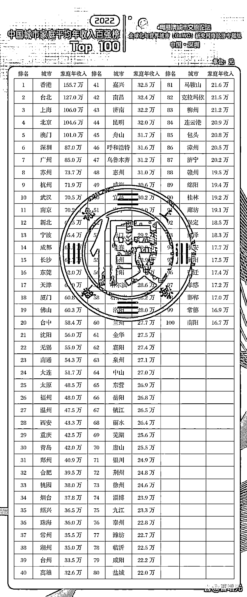
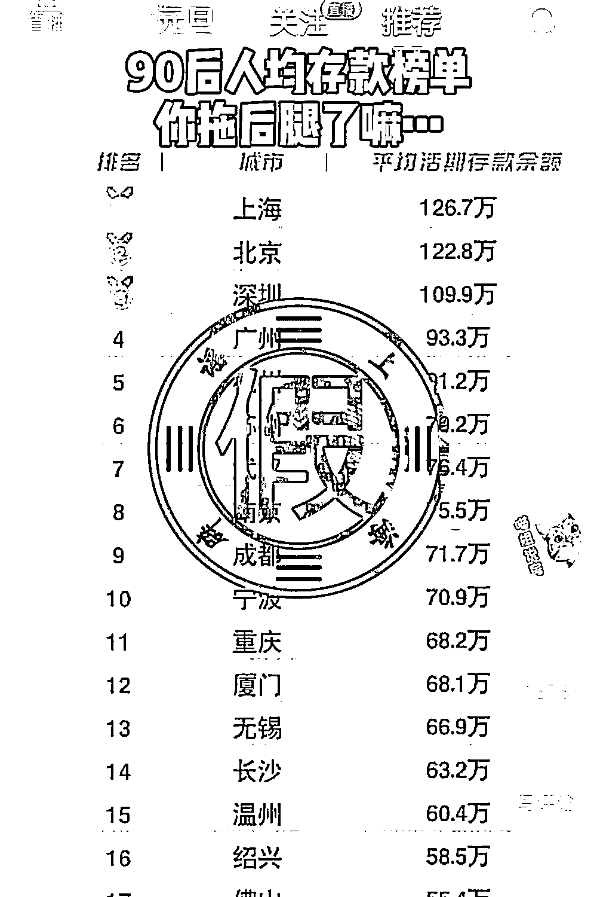
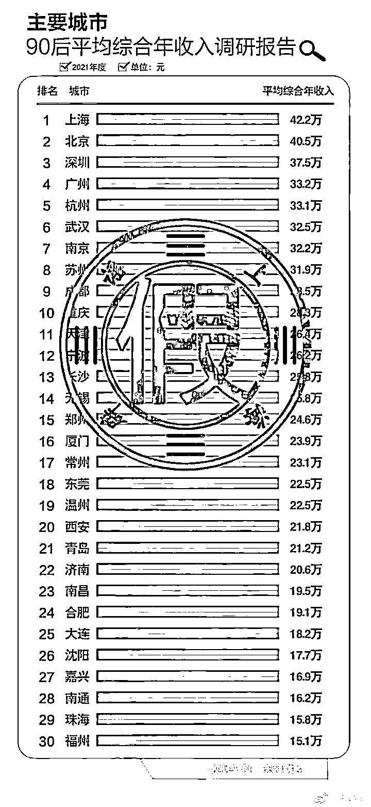
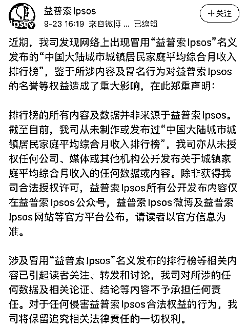

# 90 后平均存款 126 万？这些榜单刷屏，假的！

> 原文：[`mp.weixin.qq.com/s?__biz=MzIyMDYwMTk0Mw==&mid=2247528661&idx=6&sn=78cbf28876f499ff21e83edd9dbb2bfa&chksm=97cbbbeda0bc32fbe2428f9aea2cdbc601b1b04e0b8142c3fba458b049b28fbffe661dc83887&scene=27#wechat_redirect`](http://mp.weixin.qq.com/s?__biz=MzIyMDYwMTk0Mw==&mid=2247528661&idx=6&sn=78cbf28876f499ff21e83edd9dbb2bfa&chksm=97cbbbeda0bc32fbe2428f9aea2cdbc601b1b04e0b8142c3fba458b049b28fbffe661dc83887&scene=27#wechat_redirect)

据上海网络辟谣消息，临近年关，一些以“家庭年收入”“个人存款”为主题的榜单又在网络上流传起来，给出的数据让人意外—— 

有短视频账号发布的《90 后人均存款榜单》显示，上海、北京、深圳的 90 后平均活期存款余额分别为 126.7 万元、122.8 万元和 109.9 万元。而上海的数据，比前一份榜单里发布的上海家庭平均年收入还高。

记者查证发现，2022 年 1 月 1 日至今，深圳并没有举办过“粤港澳城市交流论坛”；而“沃顿财经”这个机构也不存在。包括福布斯中国、财富中文网、益普索 lpsos 第三方数据机构也都曾对网上打着这些机构名义发布的假榜单辟过谣。

业内人士分析，假榜单大多是为了吸引眼球：发布者以人们关心的“收入”“存款”等引发话题，先炮制假数据，再打出似是而非的“权威机构”，制造关注和讨论，以赚取一波流量。

来源：中国青年报，上海网络辟谣，红网

← 向右滑动与灰产圈互动交流 →

