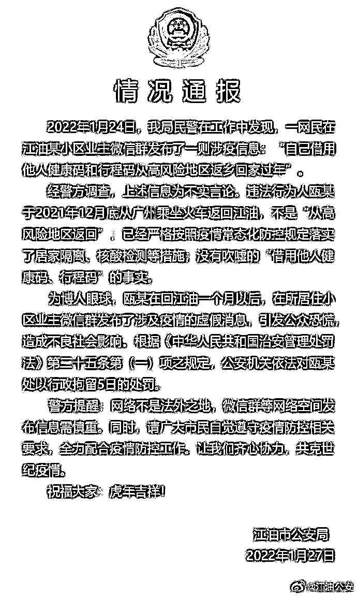
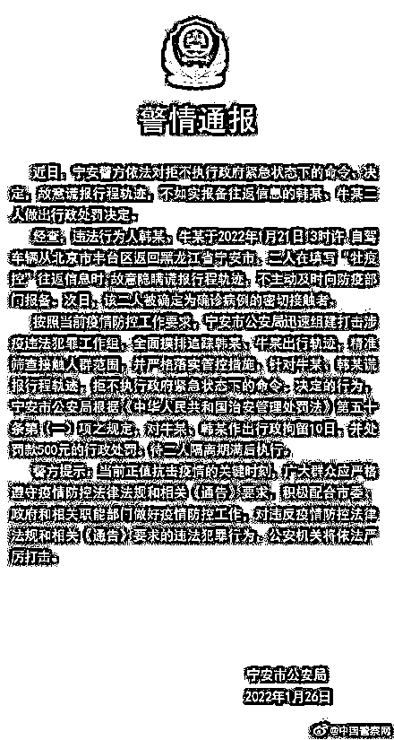

# 有人“借绿码”从高风险地区返乡？玩笑开大了……

> 原文：[`mp.weixin.qq.com/s?__biz=MzIyMDYwMTk0Mw==&mid=2247528693&idx=2&sn=035346112b25bc3ae777a7317775ecff&chksm=97cbbbcda0bc32db8572c0584c57877435100176840a48def381678e618aef33a14f052658fc&scene=27#wechat_redirect`](http://mp.weixin.qq.com/s?__biz=MzIyMDYwMTk0Mw==&mid=2247528693&idx=2&sn=035346112b25bc3ae777a7317775ecff&chksm=97cbbbcda0bc32db8572c0584c57877435100176840a48def381678e618aef33a14f052658fc&scene=27#wechat_redirect)

据四川江油公安消息，1 月 24 日民警在工作中发现，有人在微信群发布了一则涉疫信息：**“自己借用他人健康码和行程码从高风险地区返乡回家过年”。** 

经警方调查，上述信息为不实言论。**为博人眼球，瓯某在回江油一个月以后，在所居住小区业主微信群发布了涉及疫情的虚假消息，引发公众恐慌，造成不良社会影响。** 

****

根据《中华人民共和国治安管理处罚法》第二十五条第（一）项之规定，公安机关已依法作出裁定，对瓯某处以行政拘留 5 日处罚。

**黑龙江两密接从北京返回隐瞒行程被拘**

据黑龙江宁安市公安局 1 月 26 日通报，违法行为人韩某、牛某于 2022 年 1 月 21 日 13 时许，自驾车辆从北京市丰台区返回黑龙江省宁安市，**二人在填写“牡疫控”往返信息时，故意隐瞒谎报行程轨迹，不主动及时向防疫部门报备。**次日，该二人被确定为确诊病例的密切接触者。对牛某、韩某作出行政拘留 10 日，并处罚款 500 元的行政处罚。待二人隔离期满后执行。 

**北京 3 人居家隔离期间擅自外出被拘**

1 月 27 日，在北京市新型冠状病毒肺炎疫情防控工作第 277 场新闻发布会上，北京市公安局副局长、新闻发言人潘绪宏通报了 3 起妨害疫情防控的典型案例，**三人居家隔离期间擅自外出，被依法行政拘留。**

**案例一：余某某，男，49 岁，近日曾前往西南郊冷库进货，后分别接到北京健康宝弹窗提示和社区工作人员通知，要求其在海淀区居家隔离。余某某在居家隔离期间擅自外出，于 1 月 22 日、23 日前往丰台、海淀等地商市场进行采购。目前，该人已被海淀公安分局依法行政拘留。**

**案例二：菅某，男，32 岁，近日曾到西南郊冷库送货，1 月 22 日，卫生防疫部门和村委会分别通知其在房山区居家隔离，菅某拒不配合，仍外出前往门头沟、昌平等地送货，并于 25 日再次外出理发。目前，该人已被房山公安分局依法行政拘留。**

**案例三：刘某某，男，36 岁，近日曾前往丰台万柳园小区附近活动，社区工作人员电话通知其在东城区居家隔离。1 月 23 日，刘某某擅自外出前往石景山地区办事，被防疫工作人员发现。目前，该人已被东城公安分局依法行政拘留。**

**来源：中国青年报、江油公安、@北京日报、中国警察在线、红网**

**【↑↑↑关注后回复：封面 免费领取虎年限量红包封面】******

**← 向右滑动与灰产圈互动交流 →**

****