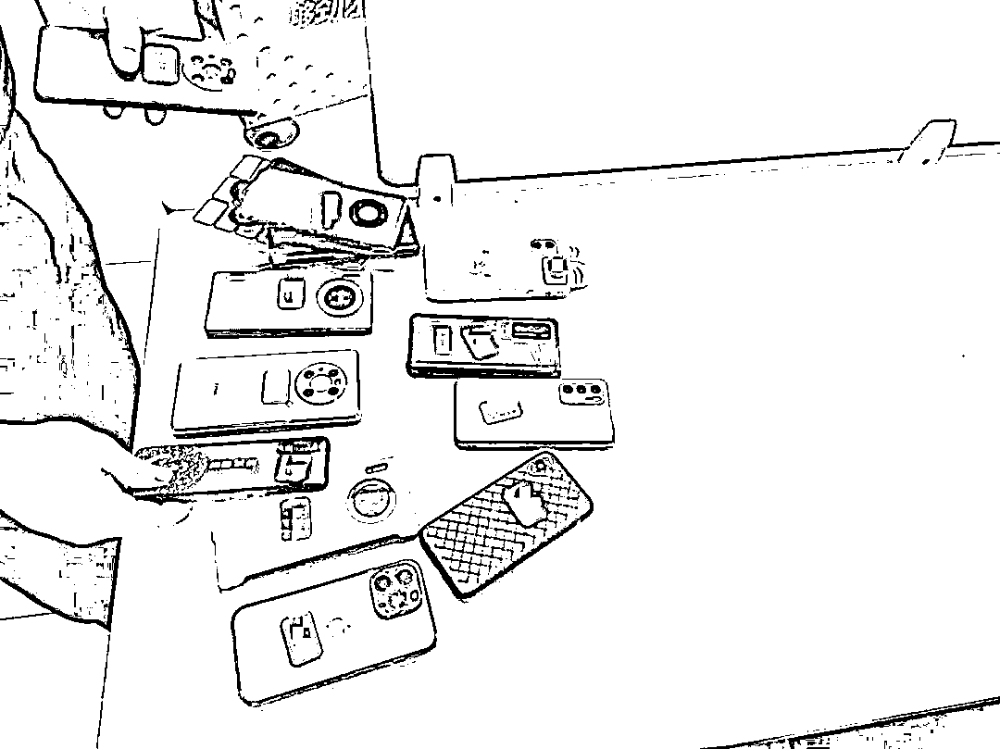
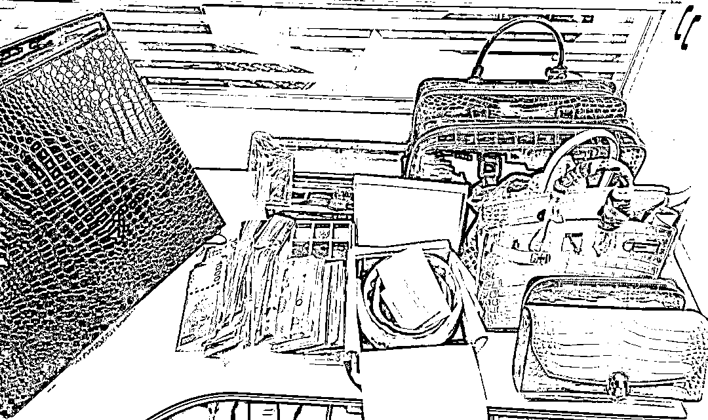
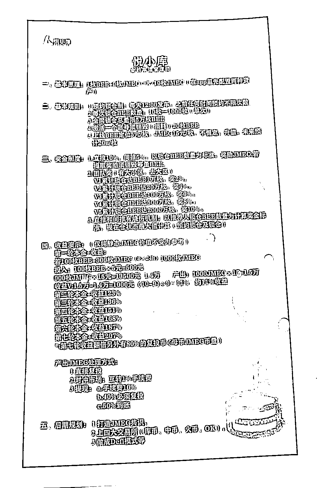

# 涉案金额达 1348 万！虚拟币诈骗团伙被“一锅端”！

> 原文：[`mp.weixin.qq.com/s?__biz=MzIyMDYwMTk0Mw==&mid=2247528693&idx=4&sn=2c42c3612fcc607fda05ed4fbb403956&chksm=97cbbbcda0bc32db9e163eb5acbe59f0537155da97ae0c78da2cc64c76ec85f221155fd9c1b4&scene=27#wechat_redirect`](http://mp.weixin.qq.com/s?__biz=MzIyMDYwMTk0Mw==&mid=2247528693&idx=4&sn=2c42c3612fcc607fda05ed4fbb403956&chksm=97cbbbcda0bc32db9e163eb5acbe59f0537155da97ae0c78da2cc64c76ec85f221155fd9c1b4&scene=27#wechat_redirect)

买入虚拟货币只涨不跌，拉亲朋好友参与投资还能额外获得奖励，看似“稳赚不赔”的投资，最后让投资人血本无归。近日，武汉洪山警方在开展“雷火 2022”行动中，通过缜密侦查，于 1 月 17 日将开完“年会”的 14 名主要诈骗团伙成员“一锅端”，据初步调查，这个实施电信网络诈骗的公司，涉案金额达 1348 万余元。 

稳赚不赔的“虚拟币”

来自广西的周女士是“币圈”资深投资者，2019 年 8 月，她被拉入一个名为“7+1”的群聊，群主在里面介绍了一款关于虚拟货币“Forest Plus”的投资项目，并告知大家 8 月底在武汉会有一个关于此项目的说明会召开。根据内部资料显示，这款虚拟币“只涨不跌”，周女士立即从广西赶到武汉参会。 

▲警方查获该团伙使用的作案手机

在说明会上，公司老总张某向大家推介该虚拟币目前单价为 9.7 元，由于前景看好，公司保证今后以不低于每币 12 元的价格回收。会后，周女士等人还被邀请到公司参观，期间张某反复吹嘘市场形势良好，周女士当即就决定了投资。在公司业务员的帮助下，周女士下载了一款名为“Forest Plus 生态”的 APP，并在上面花费 13.7 万购买虚拟币。

回到广西后，周女士开始等着虚拟币涨价，并时刻关注群内消息。张某在群里介绍，如果能够介绍其他人前来投资，就能额外获得够得 6%的提成。想到有钱大家一起赚，周女士将自己的亲朋好友都拉了进来。周女士认为该币无论涨跌都会由公司兜底，于是趁币价回调，又追加了近 88 万元的投资。

平台“暴雷”引来警方调查

然而没过多久，该币价格突然大跌，平台也随之关闭。周女士在群里要公司按照承诺以 12 元的价格回收，得到的回应竟然是被踢出群聊。此刻周女士才意识到自己真的遇到了骗子，然而更让她愧疚的是亲朋好友们的投资跟着一起也打了水漂。

▲民警对相关涉案财物依法扣押

在“7+1”微信群里，像周女士这样的受害人有十几名，因为层级高，他们投资金额巨大，同时也都将自己的亲朋好友们拉进来作为下线。在多次向公司讨要说法未果后，周女士和其他报警人陆续到洪山区公安分局狮子山派出所报案。

接到报案后，洪山警方高度重视，派出所刑侦副所长黄磊立即带领刑侦骨干力量成立专案组展开侦查。

警方初步调查发现，该案件不同于以往的诈骗传统，嫌疑人还试图拉拢受害人的身边人入伙，背后极有可能是一个加入了传销手法的电信网络诈骗犯罪团伙。为了不打草惊蛇，专案组民警决定暗中调查取证。

群英汇被“一锅端”

办案民警杜汉林、郭铮经过数月缜密侦查，发现该团伙内部组织严密，分工明确，层级分明，受害人遍布全国各地。在对受害人资金流向分析后，发现该公司确实涉嫌诈骗，然而其核心成员分散于全国各地，贸然行动极易打草惊蛇。 

今年一月，民警在调查中获得一条重要线索，该公司将在春节前夕举行“年会”，届时各部门主要负责人将齐聚一堂共商大计。1 月 17 日，洪山警方集中刑侦大队、狮子山派出所精干警力，对该诈骗团伙开展集中收网行动，一举将 14 名主要成员抓获，并在公司负责人张某的别墅内发现现金 12 万、金条 500 克，以及总价值数百万元的名贵手表、皮包。

▲警方在张某别墅查获的现金、物品

经查，公司负责人张某，42 岁，曾因组织赌博被判处有期徒刑 1 年半。据张某交代，2019 年自己了解到区块链货币很火后就成立了这个公司，为了让更多的人参与进来，他们针对玩虚拟货币的目标群体进行网络推广、发送广告，并以 12 元每币保底的回收价格打消投资者的后顾之忧。

同时，他们特地借鉴了传销的方式，给推广人予以提成，让他们将亲朋好友的资产也拉进来，然而这些提成仅仅是通过虚拟货币的形式，并非现金。

“割韭菜”其实很简单

一套虚拟的代码，为什么会让投资者如此青睐呢？原来在项目早期，为了打消投资者疑虑，该诈骗团伙允许客户提现，并设置了 40%左右的复投率，最终将客户牢牢套在里面，等吸引的人足够多之后，再操控后台，让虚拟货币迅速大跌，并关闭平台，实现“割韭菜”。 

在该团队里，有专门负责软件开发的技术人员，也有进行业务指导、推广的业务员。同时，向投资者介绍的“矿机”也从来没有运转过。

▲民警调查发现该团伙正在推广的另一种“理财产品”

办案民警郭铮向介绍，在虚拟货币项目暴雷后，该公司曾经改头换面，做起了茶叶生意，实际上是在为外地其他虚拟币诈骗提供引流服务。近期，该公司再次改变地址，重新做起了一项名为“悦小库”的虚拟币项目，其诈骗手法与 Forest Plus 项目非常类似，警方联系多位投资者，对方均不知道已经上当。

目前，该犯罪团伙中 10 名嫌疑人因涉嫌诈骗，已被洪山警方刑事拘留，案件正在进一步办理之中。

来源：武汉市公安局洪山区分局、平安湖北 ，利箭在行动

【↑↑↑关注后回复：封面 免费领取虎年限量红包封面】

← 向右滑动与灰产圈互动交流 →

# 

> 原文：[`mp.weixin.qq.com/s?__biz=MzIyMDYwMTk0Mw==&mid=2247528693&idx=5&sn=833fe172af56ae435a029ca1c89bd3fb&chksm=97cbbbcda0bc32db4f383c3fd80080b498bda71f866b712cd1d40523f1c53e03b7c42e54f49e&scene=27#wechat_redirect`](http://mp.weixin.qq.com/s?__biz=MzIyMDYwMTk0Mw==&mid=2247528693&idx=5&sn=833fe172af56ae435a029ca1c89bd3fb&chksm=97cbbbcda0bc32db4f383c3fd80080b498bda71f866b712cd1d40523f1c53e03b7c42e54f49e&scene=27#wechat_redirect)