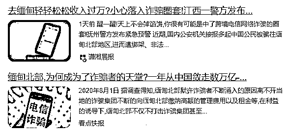
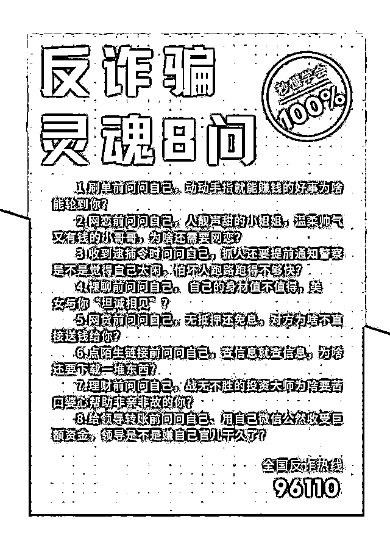

# 警方出手！“杀猪盘”诈骗过程全揭秘！

> 原文：[`mp.weixin.qq.com/s?__biz=MzIyMDYwMTk0Mw==&mid=2247528761&idx=4&sn=8d3156b681480866180aa4c767a84e93&chksm=97cbba01a0bc3317781133bf7278bfeb184d1abb6586bcaf63d29343934ce6e16600188ac366&scene=27#wechat_redirect`](http://mp.weixin.qq.com/s?__biz=MzIyMDYwMTk0Mw==&mid=2247528761&idx=4&sn=8d3156b681480866180aa4c767a84e93&chksm=97cbba01a0bc3317781133bf7278bfeb184d1abb6586bcaf63d29343934ce6e16600188ac366&scene=27#wechat_redirect)

**这里是缅甸北部** 

**我生长的地方**

**欢迎来到我的世界**

**娇贵的小公主**

“曾经我也是屌丝一枚， 

来到缅北后，

混得风生水起”

“看，工资都是发现金，

一只手都拿不完”

“白天工作清闲，

晚上花天酒地。”

在互联网的那些角落里，

流传着去缅北务工致富的“传说”，

不知道你信不信？

反正很多信了的人，

都后悔不已。

近日，沈阳市公安局反诈支队组织辽中公安分局，成功打掉一个电信网络诈骗犯罪团伙，抓获犯罪嫌疑人 11 名，涉案金额 220 余万元。其中一名犯罪嫌疑人供述了在缅北三个多月的日子里，依靠电话、微信和 QQ，诈骗国内多人钱财的犯罪事实。

**线索——**

**抓捕偷越国境犯罪嫌疑人**

[`v.qq.com/iframe/preview.html?width=500&height=375&auto=0&vid=wxv_2200354662581616644`](https://v.qq.com/iframe/preview.html?width=500&height=375&auto=0&vid=wxv_2200354662581616644)

11 月 23 日，沈阳市公安局辽中分局民警在侦办一起组织偷越国境案件的过程中，发现一名原籍辽中的犯罪嫌疑人韩某某有再次偷越国境的嫌疑。

警方立即奔赴云南，在当地警方的配合下将此人抓获。在进行审讯时，该嫌疑人供诉“自己准备去境外从事电信网络诈骗活动”，当警方深入挖掘此线索时，竟然挖到了一个比较完整的电信网络诈骗犯罪团伙。

警方查明，该犯罪团伙在缅北从事电信网络诈骗犯罪活动，采取集中管理、分工协作的方式，以网络类赌博“杀猪盘”的方式实施诈骗。

该团伙成员利用某同性交友软件，主要针对男性实施诈骗，通过拟定话术对添加的男性网友进行话务引流、培养感情，获得被害人感情信任后，以恋爱、挣钱等为由，诱骗被害人进入该团伙提供的博彩平台进行投注。

与中国一线之隔的缅甸国门。

该团伙能够掌控博彩结果，先让被害人获取一定的经济利益，让被害人产生稳赚不赔的错觉，进而引诱被害人向平台加大投注。当被害人提现时，该团伙以升级会员赠送“彩金”、充值刷流水等理由诱骗被害人持续向平台充值，阻止被害人提现。同时，通过掌控博彩结果，致使被害人输掉之前投入和盈利的全部资金。 

查明案情后，警方分成 9 个抓捕小组，分别在大连、沈阳以及内蒙古、吉林和河南等地，抓获 11 名犯罪嫌疑人。这些犯罪嫌疑人因涉嫌电信诈骗犯罪，已被沈阳警方依法采取刑事强制措施，案件正在进一步办理中。

**讲述——**

**保安荷枪实弹保护诈骗窝点**

[`v.qq.com/iframe/preview.html?width=500&height=375&auto=0&vid=wxv_2200355818414358528`](https://v.qq.com/iframe/preview.html?width=500&height=375&auto=0&vid=wxv_2200355818414358528)

在办案区的羁押室内，27 岁的犯罪嫌疑人韩某某，如实供述了违法犯罪事实，“我原来是干一个类似金融中介的工作，说白了就是帮人跑贷款。”韩某某说，后来一个老相识联系上了他，“他明确告诉我和他一起偷渡到缅北干电信网络诈骗，来钱快！”韩某某就同意了。

就这样，在 2020 年 10 月份，他和其他 5 人来到云南边境，翻山越岭走了 70 多个小时，来到缅北，而这里就是世人皆知的诈骗分子的聚集地。 

“这个地方到处都是写字楼，几乎所有的写字楼格局都一样，门口有**持枪的保安**，一楼是食堂，二楼是住宿的地方，三楼以上全是大大小小的诈骗公司，规模大一些的诈骗公司会包下一层，甚至包下一栋楼。”韩某某说，而诈骗方式也是五花八门，有色情直播、杀猪盘等等，其中比较“低端”的才会冒充公检法诈骗。 

**揭露——**

**先谈感情后亮“屠刀”**

[`v.qq.com/iframe/preview.html?width=500&height=375&auto=0&vid=wxv_2200358986456055815`](https://v.qq.com/iframe/preview.html?width=500&height=375&auto=0&vid=wxv_2200358986456055815)

韩某某这个公司是个小诈骗公司，老板就是他的原来那个老相识，他们公司的主营业务比较“偏”，是专门骗男性特殊人群。

“简单点说就是在某知名网站聊天室里加好友，然后引流至 QQ 聊天，随后加微信。”韩某某说，他的老板向别的公司要来了**话术合集**，同时花了几千块钱建了一个假的**博彩平台**。这样，网络诈骗的基本硬件就全了。“我刚去的时候是 20 个业务员，也就是主管聊天的，还有就是一个主管和一个老板。”

“业务工作是每天必须加 10 个人，每天得聊两个小时的语音。然后按照话术和实用案例，开始和对方进行感情切入、爱好切入等等。每月固定工资五千元、同时诈骗成功按金额有提成，骗够 50 万元奖励一部手机。”韩某某说，刚刚联系上的被害人，用行话叫做“小白”。聊天过程中，虽然有很多次可以双方见面的机会，但骗子总会找理由让约会泡汤。

此时对方就从“小白”升级为“优质客户”，“业务员”要进一步聊兴趣爱好并找到对方弱点，等聊到三四天的时候，就会将被害人带入“赚外快”的陷阱——先让对方拿二三百元进入假的博彩平台，在平台上选“大小单双”，然后故意让对方领彩金，并进入领彩金再投资的循环。“人都是有贪念的，这个时候很多人就把全部身家投进去，甚至有人贷款投进去，此时我的主管看火候差不多了，会发出‘杀他’的指令，然后我就会带他在博彩平台上一步一步地输掉本金，最后拉黑。”韩某某说。

**剖析——**

**特殊人群感情更加脆弱**

[`v.qq.com/iframe/preview.html?width=500&height=375&auto=0&vid=wxv_2200362242913681415`](https://v.qq.com/iframe/preview.html?width=500&height=375&auto=0&vid=wxv_2200362242913681415)

韩某某交代，他在这个诈骗窝点一共干了三个多月，不允许走出大楼，门口持枪的保安会看着他们。“这段时间我骗成功了 3 个人，第一个人骗了 10 万元多一点；还有个 4 万多元的，还有个 8 千多元的，这个成绩是所有业务里最差的。10 万多元这个人是北京海淀区的一个白领，他以前被他的对象骗过钱，本以为会有警惕性，没想到他一直在充值，最后一笔还是贷款加上向他母亲要了两万元钱投进来的。”**韩某某说，被他们窝点里骗的啥人都有，包括大学教授和医生等。**

**“其实他们的心理十分脆弱，只要给他们几句好话、陪着他们聊天，他们就会无限地信任你。甚至有好几次对方的手机里面已经出现了反诈 App 的提示框，他们还是相信我说的，也就是相信我这个一直见不到面的人。**”韩某某说，其实他们公司选择做交友类型的诈骗，也就是看中了这点。在他们这个大楼里还有几个诈骗团伙专门实施男骗女的杀猪盘，“成功率”也不低。韩某某因为业绩较差，同时也想念母亲，另外准备在明年 2 月份结婚，所以他主动提出辞职。

“团伙本来不同意，最后因为我没干满 6 个月，让我交了两万六千元的食宿费用，我才回来的。我知道我犯了法，回来东躲西藏的，结果还是被抓了。”对于这段经历，韩某某十分后悔。

**“杀猪盘”套路揭秘**

**1、寻找素材，包装身份**

    首先这种诈骗的犯罪团伙里每个人都会建立自己的虚拟身份，也就是“人设”。一般来说，男性嘛，一般都是高富帅，阳光帅气，有豪车爱健身那种；女性呢，一般则是经营商铺失败的个体户，年轻貌美、命途多舛，等等各种薄情的手段获得同情心

    人设的建立需要大量的视频和照片素材，为此犯罪团伙也做了搜集、积累，通常来源是各种网站上的个人生活照，因此**大家不要随随便便把大量露脸的生活照放在网络上**哦。

**2、广泛撒网，猛加好友**

    包装完自己的“人设”后，犯罪团伙成员就开始大规模地在各种主流媒体平台上添加好友。通过日常点赞、温馨问候、询问问题、挑逗搭讪等各种手段，让这些“客户”添加自己的微信。

    一般来说，女“员工”就添加男“客户”，男“员工”就添加女“客户”，分工明确。

**3、培养感情，拉进关系**

    加完好友，最重要的事情就是先建立感情。按照诈骗“剧本”的流程，刚添加好友，不能操之过急，只能进行日常问候、朋友圈互动等，等一段时间之后才开始拉进关系培养感情。

    通过一来二去的嘘寒问暖，以及生活问题上的“吐露心扉”，有些“客户”慢慢就中了这样的感情“糖衣炮弹”。

**4、投资诈骗，拉入深渊**

    感情建立起来之后，诈骗分子就开始有意无意地将话题向所谓“赚钱”道路上引。先是跟“客户”说自己平时在做资金投资，并且通过各种手段（网站漏洞等）可以稳赚，然后引导“客户”小试牛刀，第一次或者第二次会真的返现给“客户”，让“客户”尝到一些甜头，随后怂恿对方不断的追加投资。

    到了这个时候，不管理财网站上的账户是否有盈利，网站客服都会以账户异常、平台异常等各种借口不让提现，等骗够了钱，甚至会直接关停网站。

就是通过这样的手段

诈骗分子将“杀猪盘”里的“猪”

杀得血本无归

甚至让人背负巨债

大家在任何时候

都要牢记“灵魂 8 问”的内容

这“灵魂 8 问”都是反诈骗的精髓

真的能避免大家掉进很多诈骗的坑

来源：沈阳网，阻击诈骗

**【↑↑↑关注后回复：封面 免费领取虎年限量红包封面】**

← 向右滑动与灰产圈互动交流 →

