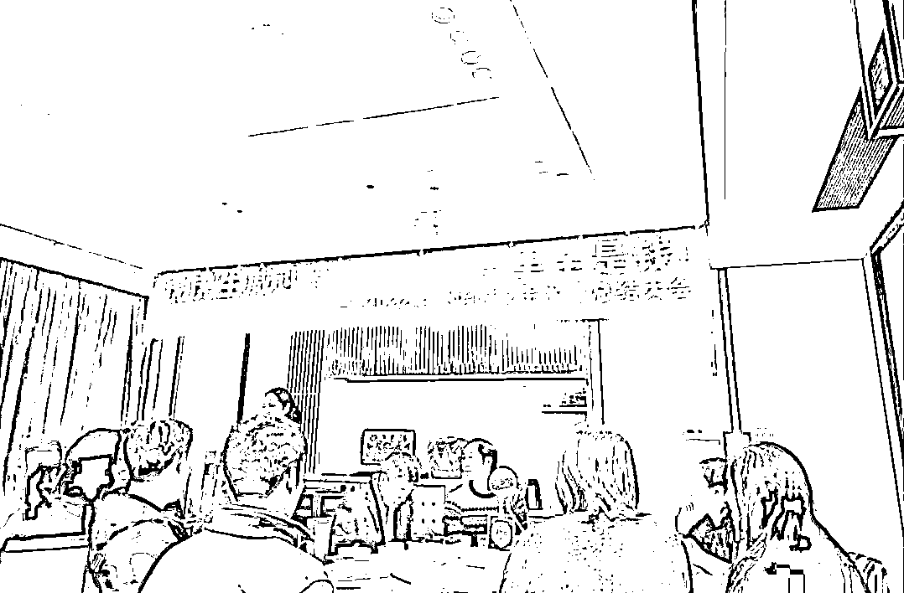
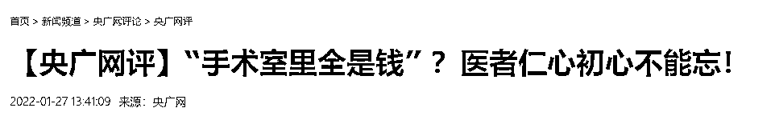
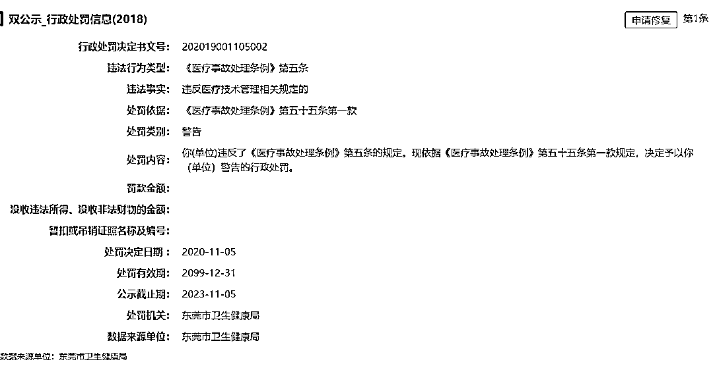
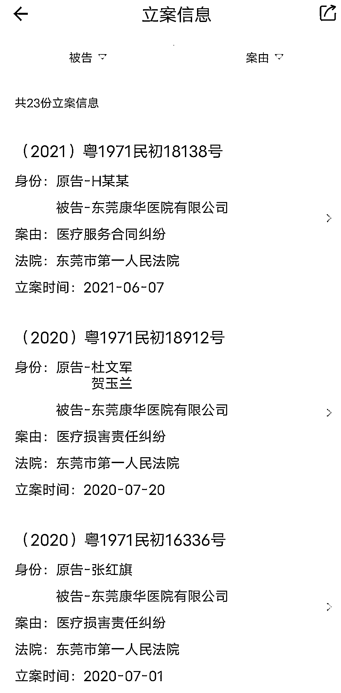
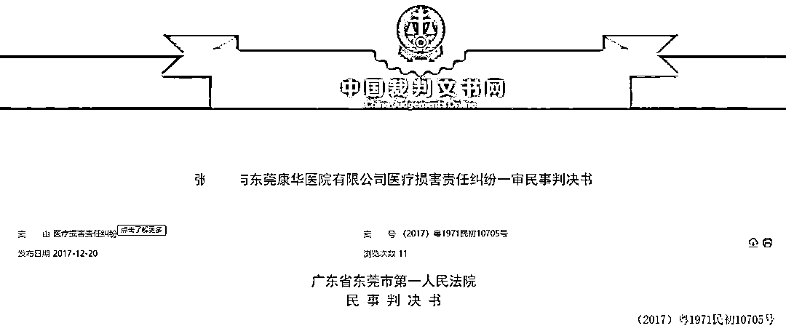
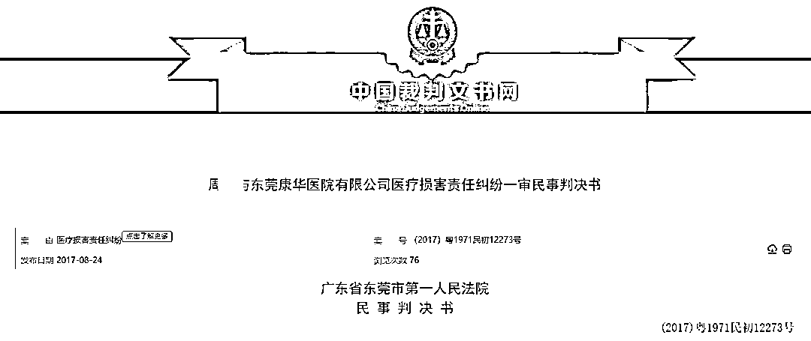
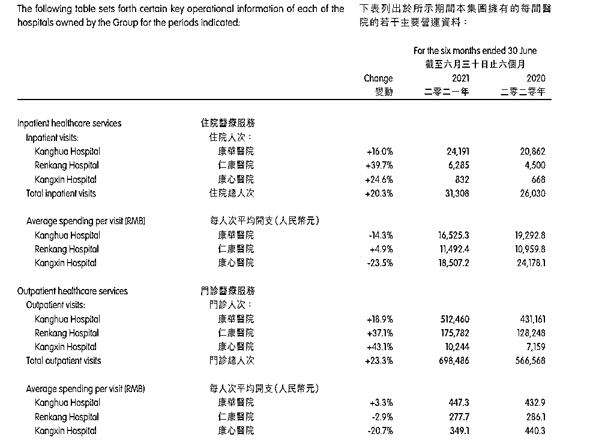
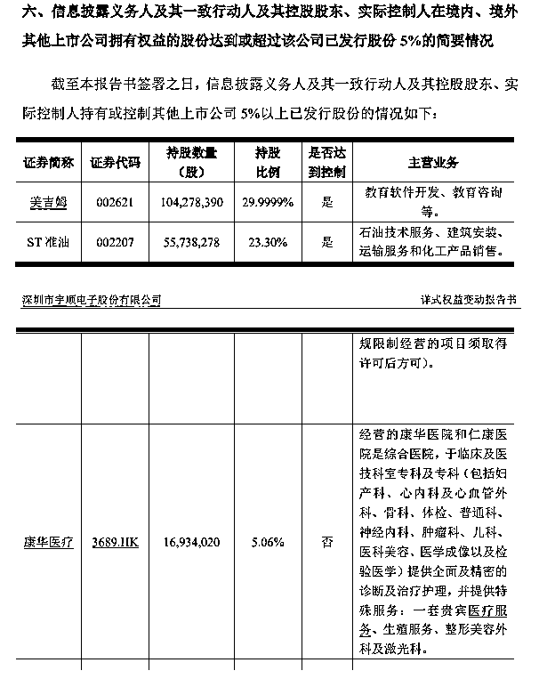
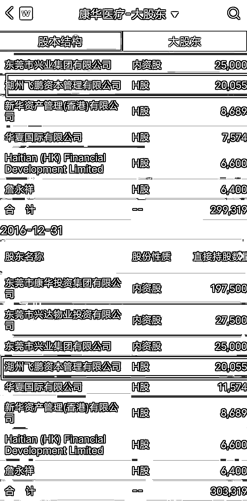

# 挂"手术室里全是钱"的医院，什么来头

> 原文：[`mp.weixin.qq.com/s?__biz=MzIyMDYwMTk0Mw==&mid=2247528761&idx=5&sn=1caec90de23252716c73352b65134b5a&chksm=97cbba01a0bc3317876ab86ad53ff3e47772cd813558dbeed97e88867c52d96d53155545f3e4&scene=27#wechat_redirect`](http://mp.weixin.qq.com/s?__biz=MzIyMDYwMTk0Mw==&mid=2247528761&idx=5&sn=1caec90de23252716c73352b65134b5a&chksm=97cbba01a0bc3317876ab86ad53ff3e47772cd813558dbeed97e88867c52d96d53155545f3e4&scene=27#wechat_redirect)

1 月 26 日，一张“康华医院”举办年终总结大会的图片在网上流传。大会现场悬挂的条幅上写着“[虎虎生威迎新年，手术室里全是钱](http://mp.weixin.qq.com/s?__biz=MzIyMDYwMTk0Mw==&mid=2247528661&idx=3&sn=ded4bcc78a5adbe9b21de3da23ef7c0c&chksm=97cbbbeda0bc32fb746076f68cd3aa00768543725b10a55dab08a6cb78fb0c83a6b9c8f9eafb&scene=21#wechat_redirect)！”引起网友争议，央广网随后也发文批评。

这家民营医院是港股上市公司康华医疗的主要收入来源。但它涉及多起医疗司法纠纷，还曾因医疗事故被监管部门警告。在该医院就诊的孕妇，不仅一次出现过胎死腹中的情况。多份判决书显示，法院经审理认为，该医院对胎儿的死亡负有部分责任。

网传图片，社交媒体截图

**央广网发文批评：不见“医者仁心”，只见疯狂逐利** 

对于网络热议，康华医院 27 日回应称，条幅是院内护士自行制作，用在该院手术室部分人员自发组织的聚餐中。对此该院郑重道歉，并第一时间对相关责任人进行严肃批评教育。

27 日，央广网就此事刊发评论文章：悬挂如此刺眼的横幅，实在不是医院该有的样子。即便横幅内容只是戏谑调侃，这样的玩笑也并不好笑，甚至会让人觉得，横幅上所写就是医院真实想法的流露。试问哪个患者敢走进“手术室里全是钱”的医院？不见“医者仁心”，只见疯狂逐利，这样将医院描绘成赤裸裸追求利益的场所，完全背离了初心和本质，更损害了社会对医院的认同。

“医院是有公益属性的，社会也对医院寄予了救死扶伤的道德期待。仁心仁术应是医务工作者的共识，应该成为其价值底色，而不是动辄就用‘钱’去衡量生命的价值。”

媒体报道截图

**因医疗事故被监管部门警告，过失行为曾导致多位患者胎死腹中** 

公开资料显示，东莞康华医院是民营医院，2018 年 6 月通过三甲复审。康华医院的关联公司为东莞康华医院有限公司，它是港股上市公司康华医疗的（03689.HK）全资子公司。

据“信用中国”披露的公开信息，2020 年 11 月，东莞康华医院有限公司因违反《医疗事故处理条例》第五条规定，被东莞市卫生健康局处以行政警告处罚；此前的 2019 年 12 月，东莞康华医院因未按照规定书写病历案，违反了《医疗纠纷预防和处理条例》第十五条第一款规定，被依法给予警告、并处罚款人民币 1 万元的行政处罚。

信用中国网站部分截图

此外，据启信宝网站初步统计，近年来东莞康华医疗有限公司卷入多起医疗纠纷，为被告身份的就至少有 23 件。其中大多数案由为医疗损害责任纠纷，不乏一些备受关注的案件。

启信宝截图

其中较为典型的案件是：康华医院因其过失行为，导致胎儿在母亲腹中死亡。

判决书显示，患者张某控诉称，在发现自己再次怀孕后，她 2012 年 11 月在康华医院建档，被该医院产科门诊标注为“高危妊娠门诊专案病例”。2013 年 5 月 5 日凌晨 6 时左右，她下腹持续疼痛，并于 10 时许入住并告知住院部。康华医院方面当时表示胎儿存活。

张某称，她多次要求尽快进行剖宫产手术，但被告知“星期天不安排手术，加强监测即可”。此后直至下午 14 时 20 分，病房及医生办公室都没有值班医生，她无法得到医生的治疗。值班医生出现后，于 14 时 30 分经 B 超确定胎心停止。

下午 16 时许，张某被安排手术，将胎儿取出，确认为死胎，原因是重度胎盘早剥。

张某称，在自己手术后，医生并未对她安排特殊护理，只是按照一般产妇护理。当月 8 日早上，张某出现心、胸、腹、喉咙等多处不适，经其母亲多次反映，康华医院均未给予妥善处理。张某向康华医院院长提出请求后，才被安排了专家会诊，并转入 CCU 病房。当月 11 日中午，张某被转入妇科抢救室。张某称，当晚 22 时许，因为康华医院的操作失当，将氯化钾针的浓度提高了一倍，致使她的身体再次受到伤害。

张某认为，康华医院在整个就诊过程中，疏忽懈怠，没有责任心，存在严重的医疗事故，导致原本存活的胎儿死于腹中，且在手术后未对她进行适当护理，侵犯了其生命健康权。因此，张某提起诉讼。

裁判文书网截图

一审法院认为，东莞康华医院未对下腹痛进行鉴别诊断、未持续胎心监测的过失行为与原告胎儿死亡存在因果关系，是导致胎儿死亡的另一因素，被告的过失行为在原告胎儿死亡后果中的原因力大小属于同等因素，建议参与度为 41%-60%。结合本案实际情况，一审法院认定康华医院应对张某的损失承担 50%的赔偿责任为宜。至于损害后果的范围，结合《医疗损害鉴定意见书》以及《答复函》，损害后果为原告胎儿的死亡，一审法院对此予以确认。

这样的行为，之后再次上演。

裁判文书网截图

南方医科大学司法鉴定中心 2017 年 4 月 5 日作出的《鉴定意见书》显示，康华医院在产妇周某待产过程中，对胎监异常的结果未予重视，未善尽高度注意和关注义务，未采取措施充分评估和判断胎儿宫内情况及严密监测胎心，存在过失。

该过失行为使得胎儿宫内缺氧不能得到及时发现、诊断，及采取正确的分娩方式终止妊娠，最终胎儿缺氧不得到缓解而失去存活机会。因此，被告的过失行为与产妇胎死宫内亦存在因果关系。

一审法院认定：康华医院存在医疗过错，应对原告的损害后果承担 60%的赔偿责任。

**摇钱树？涉事医院是身后港股上市公司的核心资产** 

港股上市公司康华医疗 2021 年中报显示，2021 年上半年，该集团实现综合收入 8.71 亿元，同比增长 14.52%；实现归母净利润 3088 万元，同比增长 129.04%。其业绩增长主要由于医院服务部门的收入增加，以及自有医院运营的患者整体就诊次数增加。

康华医疗集团下辖康华医院、仁康医院和康心医院。

数据显示，备受争议的康华医院是康华医疗的主要收入来源。去年上半年，康华医院门诊人次为 512460 次，较去年同期增加 18.9%，占该集团同期患者人数的 73.37%；住院人次为 24191 次，较去年同期增加 16%，占该集团同期的 77.27%。

康华医疗中报截图

**康华医疗，早年曾浮现“中植系”身影** 

值得一提的是，身为港股上市公司的康华医疗，曾与赫赫有名的“中植系”有关。

官网资料显示，1995 年，黑龙江中植企业集团公司成立，注册资本总额为 5000 万人民币。1997 年，该公司主导产业为造纸材料和房地产。2001 年，该公司进入金融产业，于次年开始大力发展信托业务。2013 年，中植企业集团实施业务转型，形成金融、并购、财富管理和新金融四大业务板块。到 2019 年，该集团控股共 9 家上市公司。

“中植系”商业帝国的实控人为解直锟。

2019 年 5 月 28 日，彼时的*ST 宇顺公布《详式权益变动报告书》。文件曝光了当时“中植系”的部分持股情况，含*ST 宇顺在内共涉及 24 家上市公司。其中港股上市公司有 3 家，其中就包括康华医疗。

公告文件截图

在康华医疗早年（例如 2016 年）的大股东名单中，湖州飞鹏资本管理有限公司在列。

湖州飞鹏是湖州中泽泰富投资有限公司的全资子公司，而湖州中泽泰富由中植投资管理有限公司 100%持股，其最后控制人是解直锟。据康华医疗 2019 年年中报披露，湖州飞鹏资本持有 1671.97 万股，占比为 5%，但此后便再也寻不见湖州飞鹏的身影。

Wind 截图

来源：观网财经，观察者网

**【↑↑↑关注后回复：封面 免费领取虎年限量红包封面】**

← 向右滑动与灰产圈互动交流 →

