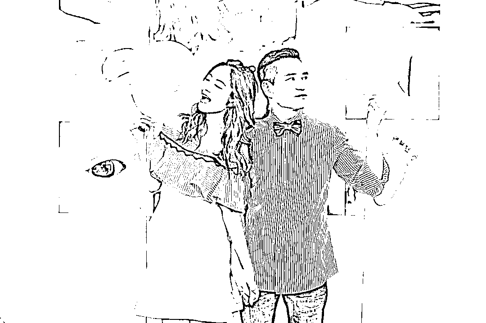
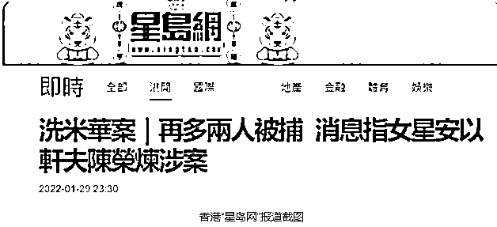
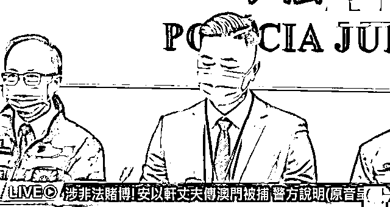
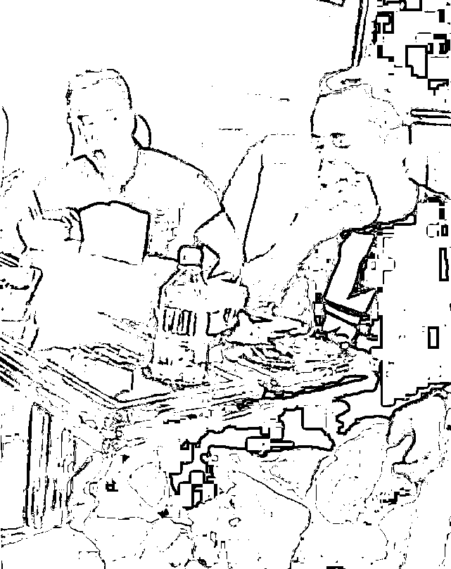
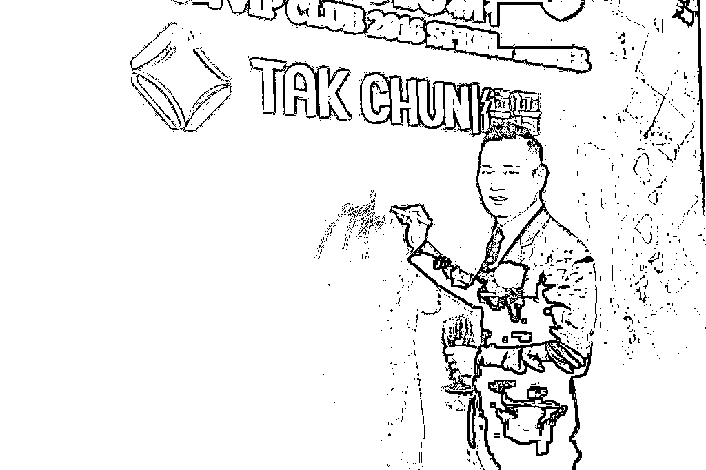
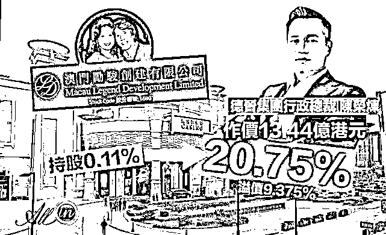
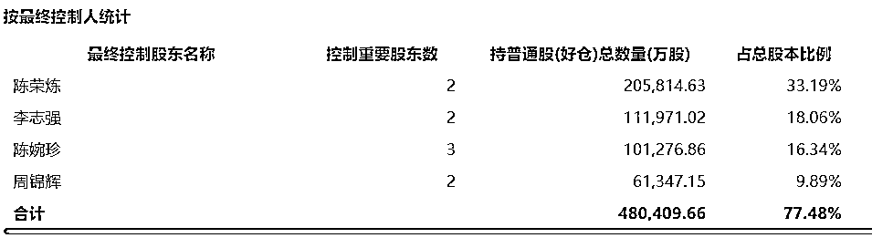

# 安以轩丈夫陈荣炼被捕，涉洗米华案，揭秘起家史！

> 原文：[`mp.weixin.qq.com/s?__biz=MzIyMDYwMTk0Mw==&mid=2247528820&idx=1&sn=d6c8b29580205b912819d4f1972cc67f&chksm=97cbba4ca0bc335a73ecf2d71f8a2339a5ec0dda804d1f3a33bf87a7f9b2713e1bc7661b3c14&scene=27#wechat_redirect`](http://mp.weixin.qq.com/s?__biz=MzIyMDYwMTk0Mw==&mid=2247528820&idx=1&sn=d6c8b29580205b912819d4f1972cc67f&chksm=97cbba4ca0bc335a73ecf2d71f8a2339a5ec0dda804d1f3a33bf87a7f9b2713e1bc7661b3c14&scene=27#wechat_redirect)

公开信息显示，安以轩老公陈荣炼是 1972 年出生，年龄和警方公布的嫌犯相符。目前，陈荣炼戴头套、手铐被澳门警方移送至检察院的画面也曝光。

1 月 30 日上午，澳门司警局发言人召开记者会表示：“本月 28 日在新口岸区拘捕 1 名 49 岁陈姓疑犯及 34 岁蔡姓疑犯，涉嫌非法经营赌博、洗黑钱，但 2 人在查问期间拒绝合作。澳门司警相信，此次案件和去年 11 月案件、即洗米华案为同一案件。”

另外发言人指出，陈姓疑犯主要操控集团非法经营网上赌博，蔡姓疑犯则协助陈进行相关行为，行动中检方找到约 410 万元（约人民币 340 万），稍后将 2 人移送检察院。

1 月 29 日，港媒报道称，台湾女星安以轩丈夫、德晋集团主席陈荣炼牵涉进洗米华案。

公开信息显示，安以轩老公陈荣炼是 1972 年出生，年龄和警方公布的嫌犯相符。目前，陈荣炼戴头套、手铐被澳门警方移送至检察院的画面也曝光。

资料显示，陈荣炼目前身兼多家公司的董事长，控股港股上市公司澳门励骏。据悉其年少时是“叠码仔”出身，后来开始接触博彩业，慢慢成为行业大佬。

**与洗米华互有交集**

综合港媒“星岛日报”“东网”的报道，澳门警方自 2019 年 8 月收到情报，有不法集团利用澳门经营贵宾厅业务，于海外架设赌博平台，招揽内地居民进行不法网络赌博，由此获得的财产，又透过娱乐场贵宾帐户等不法途径转移及掩饰。

警方主动根据情报开展调查，去年 11 月的案件后续跟进，发现案中两名疑犯涉嫌不法经营赌博及经营“赌底面”（指赌客在台面上赌博的时候，在台面下以杠杆方式加大赌博金额），其中陈姓男子负责经营及操控相关犯罪集团，而蔡某则从旁协助。

经分析及调查，警方前日采取拘捕行动，于新口岸区某酒店拘捕两名疑犯，调查期间 2 人拒绝合作，未有回应警方提问。

随后警方在疑犯办公地点搜出大量手机、计算机和硬盘等设备，还有折合 410 万港币现金。澳门警方以不法经营赌博、清洗黑钱及犯罪集团对 2 人落案起诉，实时移交检察侦办。当局相信，此次案件和去年 11 月案件、即洗米华案为同一案件。 

2021 年 11 月 26 日，@平安温州 发布通报称，浙江省温州市公安局以犯罪嫌疑人周焯华涉嫌开设赌场罪提请检察机关批准逮捕，温州市人民检察院经依法审查，于 2021 年 11 月 26 日对周焯华作出批准逮捕决定。

澳门特区政府司法警察局于 2021 年 11 月 28 日下午举行特别新闻发布会，公布侦破一宗涉及犯罪集团、不法经营赌博及清洗黑钱罪的案件。该案拘留了包括 47 岁周姓商人在内的 11 名犯罪嫌疑人。

据了解，被捕的除周焯华外，还有 8 男 2 女（30 至 56 岁），均报称为高级行政人员，其中 1 名 40 岁姓周男子为香港居民。

同陈荣炼一样，周焯华也是“叠码仔”起家。因瞅准了互联网的新机会，他拿下菲律宾和柬埔寨的网上赌博牌照，于 2007 年上线了太阳城网络平台。

为了能让顾客在网络上也有身临其境的感觉，太阳城用高清摄像机将赌桌画面实时传送过来，现场发牌情况一览无余，顾客能够看着网络直播同步下注。

官方通报显示，为牟取非法利益，周焯华发展境内人员为股东级代理和赌博代理，通过高额授信、推广赌博业务、提供车辆接送服务和技术支持等方式、手段，组织中国公民赴其承包的境外赌厅赌博、参与跨境网络赌博活动。

截至 2020 年 7 月，周焯华为首的犯罪集团共发展股东级代理 199 人，发展赌博代理 1.2 万余人，发展中国境内赌客会员 8 万余人，涉案金额特别巨大，严重妨害了我国社会管理秩序。

据悉，除了博彩，周焯华还涉足旅游、餐饮、金融、地产等多个行业，业务遍及澳大利亚、俄罗斯和东南亚数个国家，据传他的身家超过百亿港元。

周焯华和陈荣炼的交集，除了两人在私人飞机上的一张同框照片，太阳城和德晋集团还同时出现在内地多宗案件起诉书中。

2020 年底，江苏省无锡市一宗案件的起诉书指出，澳门德晋集团涉嫌与内地人员合谋，于内地开设赌场。

起诉书列明，德晋与入股的被告约定分红，又合谋于内地开设非法赌博网站，德晋提供网址和电投账号，将菲律宾马尼拉德晋厅赌博画面，实时传输至内地。案件还涉及太阳城的赌厅账户，所涉的总金额高达 2.1 亿元人民币。

不过，在洗米华案发后不久的 2021 年 12 月，德晋集团曾发通告，收到个别娱乐场通知将会与集团暂时停止合作关系，故将会遣散受影响场馆的员工，最后受雇日将为该场馆停运当天。

**从叠码仔逆袭发家** 

陈荣炼是谁？除了安以轩老公的身份，其背后还隐藏着一个小人物逆袭的故事。

资料显示，陈荣炼，英文名为 levo Chan，原籍福建省晋江永和镇茂亭村人，小学毕业后，跟随哥哥来到澳门，寄住在叔叔家。

陈荣炼曾对媒体回忆，小时候，他居住在黑沙环区(澳门东北部)。那时大部分的福建人都聚集于那里，所以黑沙环就俨如一个小福建；而当时的陈荣炼连粤语都不会说，苦学了一段时间之后，才考入一所学校。

从澳门学校毕业后，他便进入赌场工作，开始接触相关博彩业，并逐渐熟悉这个行业。陈荣炼入行时，澳门尚未回归。

彼时，博彩业创造了澳门过半的 GDP。上世纪 80 年代贵宾厅业务起飞，又创造出了一个职业，叠码仔。

在博彩业这门生意中，叠码仔位居中心，是赌场和赌客之间的中介，不仅承包赌场贵宾厅对外招揽客户，从中抽佣，还负责向赌客发放贷款，吃利息差。

涉足贵宾厅运营的陈荣炼，生意越做越大，至 2000 年澳门通过博彩法之前，就已在澳门赌场闯出名号。

2002 年，澳门赌场牌照一分为三，随后港澳自由行开放，澳门博彩业也迎来黄金时代。在澳门回归 7 年后，澳门博彩业规模超过拉斯维加斯，成为世界第一大赌城。

2007 年，陈荣炼组织成立德晋集团，该集团开业的首间贵宾厅设在“新赌王”吕志和的银河娱乐旗下赌场。

10 年后，德晋集团成为亚洲最卓越的博彩中介人之一，德晋集团旗下的德晋贵宾会在澳门共有 11 家贵宾厅会所，逾 160 张赌台，它还是经受住澳门衰退打击、为数不多的中介人运营商之一。

而除了博彩业之外，陈荣炼还涉足地产业，2017 年之前为利互（福建）房地产开发有限公司的法人代表，不过股东信息中并未出现陈荣炼。但是，股东之一荣俊投资发展的注册地在澳门，亦属陈荣炼旗下产业。

德晋集团在内地也拥有多家子公司，包括珠海德晋、德力、德贤投资管理有限公司，珠海市德晋电子科技有限公司等。

媒体曾报道，陈荣炼到处捐钱挂头衔，名头包括：澳门福建体育会理事长、德晋慈善会会长、德晋贵宾会董事长、如意国际集团董事长、上海佰迦乐影院投资有限公司董事长等。

陈荣炼性格颇为低调，2017 年与台湾女艺人安以轩的婚事，让其逐渐走入公众视野。当年 6 月，两人在夏威夷举行了豪华婚礼。

2019 年，妻子安以轩产子，陈荣炼出手阔绰，送给妻子 4 栋价值 6 亿元的别墅。

**控制一家港股上市公司**

发家之后，凭借手中的资本，陈荣炼实现了从“叠码仔”到“赌业大亨”的阶级跃升。

这个途径就是和“赌王”何家搭上关系。2020 年 9 月，港交所披露，陈荣炼以 13.44 亿港元，收购了周锦辉等持有的澳门励骏 12.8 亿股股份，并提出要约。

文件显示，周锦辉夫妇由原先持有澳门励骏 29.89%股权，减持至 9.89%，陈荣炼夫妇则持有 20.75%。

值得一提的是，陈荣炼妻子安以轩的真名 Wu Jo Hsuan(吴玟静)亦同样出现在大股东名单中，以配偶身份共同拥有 12.8 亿励骏股份。

当年 10 月 5 日，澳门励骏披露称，要约收购后，要约人一致行动集团拥有 41.82 亿股股份，占于联合公告日期公司的已发行股本约 67.44%。其中，陈荣炼作为要约人的实益拥有人。

澳门励骏成立于 2006 年，在澳门拥有并经营渔人码头区域，包括澳门半岛的励宫娱乐场、巴比伦娱乐场、之地娱乐场，并在老挝经营 Savan Legend 娱乐场。

该公司创始人周锦辉和李志强为“赌王”何鸿燊昔日旧部，何鸿燊三太陈婉珍则是澳门励骏的第三大股东。

经过此次股权更变，陈荣炼摇身一变、晋升为第一大股东，第二到四位分别是李志强、陈婉珍和周锦辉。

当时坊间有传闻，陈荣炼向“赌王”三太陈婉珍提出要收购她手头所有股权的要求，但被陈婉珍拒绝。陈荣炼跟身边人表示，势必要全资收购“澳门励骏”股权，踢三太陈婉珍出局。

同花顺 ifind 数据显示，截至 2021 年 6 月底，陈荣炼持有澳门励骏 33.19%股份，为单一大股东；陈婉珍仍持有 16.34%的股份，为第三大股东。

澳门励骏最新市值 35 亿港元，管理层成员名单显示，陈荣炼任联席主席兼行政总裁，不过公司经营情况并不理想。

2020 年年报显示，公司由于博彩收入按年下降 72.2％至 5.27 亿港元（6780 万美元），2020 年共亏损 19.55 亿港元（2.52 亿美元）。公司称，由于新冠疫情所致，与 2019 年相比，其博彩收入共减少了约 13.7 亿港元（1.76 亿美元）。

2021 年上半年，澳门励骏续亏约 6.89 亿港元，同比扩大约 25.17%。

业绩亏损之下，去年底澳门励骏披露称，公司完成出售由全资子公司澳门渔人码头投资持有的一架飞机，以改善集团现金流。

对于陈荣炼被调查的后续进展，雷达财经将继续关注。

**此前报道：**

**[周焯华被指投资爱国电影洗钱，博纳影业回应](http://mp.weixin.qq.com/s?__biz=MzIyMDYwMTk0Mw==&mid=2247525055&idx=4&sn=d766750e16c84b67ac75ec4dd25fa449&chksm=97cba987a0bc20910984bcc2190b5ecc26f4b2f8d613838c0d4e7c549baa830c3440b31b2a66&scene=21#wechat_redirect)**

**[澳门“赌厅之王”洗米华的瓜](http://mp.weixin.qq.com/s?__biz=MzIyMDYwMTk0Mw==&mid=2247524892&idx=2&sn=f752e9fc27f306fbf59da9ddebd4bb0e&chksm=97cba924a0bc2032cd4971b15ccb83777fff22cfd29b964841ebc235f366748974a9e90ea6c3&scene=21#wechat_redirect)**

**【↑↑↑关注后回复：封面 免费领取虎年限量红包封面】**

← 向右滑动与灰产圈互动交流 →

