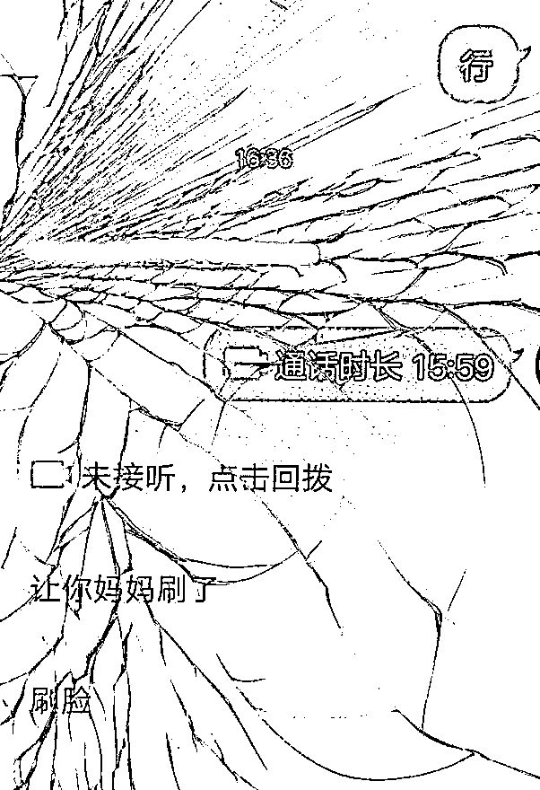

# 女孩瞒着妈妈转账 2.9 万元给骗子！结局神转折！

> 原文：[`mp.weixin.qq.com/s?__biz=MzIyMDYwMTk0Mw==&mid=2247528820&idx=2&sn=e8796c4d8cdd053b33a9ebb891bbd2a1&chksm=97cbba4ca0bc335aa29ef34a2a7d226296c270a8366f04090528f1c8cda8b05dc9d95372a9d3&scene=27#wechat_redirect`](http://mp.weixin.qq.com/s?__biz=MzIyMDYwMTk0Mw==&mid=2247528820&idx=2&sn=e8796c4d8cdd053b33a9ebb891bbd2a1&chksm=97cbba4ca0bc335aa29ef34a2a7d226296c270a8366f04090528f1c8cda8b05dc9d95372a9d3&scene=27#wechat_redirect)

家里有娃

还经常用你手机上网的家长们

一定要警惕了！

▼

近日，朱女士（化名）来到苏州常熟市公安局滨江派出所报警，称她 11 岁的女儿被骗了 29098 元。

朱女士告诉民警，当天上午，有一名自称是“郑州警务队长”的人，添加女儿琪琪（化名）的 QQ，说在游戏中检查到她爸爸违规操作领取皮肤，要将她爸爸抓去坐牢，现在需要琪琪跟他视频聊天进行下一步操作，才能解除账号异常，并且此事需要保密。

琪琪由于担心爸爸被抓走

开始慌张起来

不得不说

骗子对青少年的心理

真是拿捏得死死的

▼

随后，琪琪按照对方指示用妈妈的手机进行“解绑”操作，将妈妈银行卡内余额转到对方的指定账户，然而需要刷脸才能进行转账操作。

于是，琪琪找到了妈妈让其刷脸。还没来得及反应过来的朱女士，立马收到了三条银行扣款提醒，询问下才得知女儿可能遭遇了诈骗，于是报警求助。

而当民警查看朱女士手机后

却惊喜地发现 

**由于琪琪操作手机不熟练** 

**把银行卡内的钱**

**转到了妈妈的支付宝内**

**骗子并未得逞**

事后，民警对朱女士及其女儿进行反诈宣传，并提醒朱女士不要把手机支付密码及银行卡密码等信息透露给孩子，以防财产损失。

完整视频 

▼

[`mp.weixin.qq.com/mp/readtemplate?t=pages/video_player_tmpl&action=mpvideo&auto=0&vid=wxv_2244327207672463362`](https://mp.weixin.qq.com/mp/readtemplate?t=pages/video_player_tmpl&action=mpvideo&auto=0&vid=wxv_2244327207672463362)

还好是虚惊一场

寒假来临

针对学生的骗局又开始增多

**八种学生最易上当的骗术**

**01**

**游戏装备交易类诈骗**

当你遇到有人在游戏聊天界面、QQ 群里等平台发布**买卖游戏装备、游戏账号、游戏币**的广告信息时，**不轻信“低价充值”和“高价回收”、不轻易转账**。

**防范提醒：**

**网游不能沉迷，年轻人不妨跳出虚拟世界，多写写寒假作业吧！**

**02**

**领取“福利类”诈骗**

当你遇到有人在短视频等社交平台上发布**“免费送手机话费流量”“免费送游戏皮肤”**等广告，并要求加入**粉丝福利群**，诱导使用父母手机进行大额充值时，**不轻信任何“送福利”聊天群、家长不让孩子登录自己的微信和支付宝账号**。

**防范提醒：**

**此类诈骗主要针对广大中小学生，骗子事先通过热门短视频平台发布“送福利”广告，声称有“送热门游戏皮肤”等机会，吸引中小学生进群，再诱导他们使用父母手机，通过手机验证码更改支付密码，诱骗学生转账，实现网络诈骗。**

**03**

**破解网游“防沉迷系统”类诈骗**

当你遇到有人在短视频等社交平台发布**“解除防沉迷限制”**广告，并要求到相关网站扫码充值时，**不轻信任何“防沉迷解封”服务、更不要充值转账**。

**防范提醒：**

**网游平台“防沉迷系统”没有授权给任何第三方解除绑定的权限，任何可破解“防沉迷系统”的技术都是骗局。**

**04**

**兼职刷单类诈骗**

当你遇到有人在 QQ、贴吧、短视频等渠道发布网络兼职刷单广告信息，并声称**“日赚百元、月入过万”、“回报率高”**时，**不乱扫二维码、不随意点击陌生链接**。

**防范提醒：**

**“小额刷单”给甜头，“大额刷单”真诈骗。“轻松赚大钱”？不存在的。**

**05**

**贷款类诈骗**

当你遇到有人以**“大额度、低利息、对征信无要求”**为由，要求添加 QQ、微信客服办理贷款业务时，**不相信陌生电话及网络贷款信息、不转账**。

**防范提醒：**

**天下没有免费的午餐！凡是放款前要求支付各种会员费、手续费、服务费的，一律按诈骗处理。**

**06**

**冒充疾控人员类诈骗**

当你遇到有人以**“二次核酸检测”“预约新冠疫苗”**为由要求提供个人信息或转账时，**不相信陌生来电，避免个人信息泄露**。

**防范提醒：**

**敲黑板！疾控中心、公检法等部门不会要求汇款或索要银行卡、身份证号等个人信息。**

**07**

**冒充客服类诈骗**

当你遇到有人以**“快递丢失”“快递出现质量问题”**为由要求联系官方客服转账退款时，**不相信不转账，更不要添加微信、QQ**。

**防范提醒：**

**“买买买”一时爽，骗子套路也要留意。网购后要求私下退款转账、退款过程中要求提升流水额度的，都是诈骗!**

**08**

**冒充老师类诈骗**

当你遇到有人自称** “班主任”**，以收取 **“新冠疫苗费”“体检费” **等理由在 QQ、微信群里要求转账时，家长提高警惕，**通过电话、视频方式与学生、老师多方核实**。

来源：江苏新闻、常熟公安微警务、红网

**【↑↑↑关注后回复：封面 免费领取虎年限量红包封面】**

← 向右滑动与灰产圈互动交流 →

