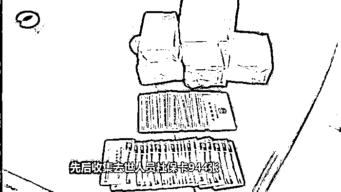

# 社保干部深夜带 612 张卡取钱，取到提款机自动报警……

> 原文：[`mp.weixin.qq.com/s?__biz=MzIyMDYwMTk0Mw==&mid=2247528820&idx=3&sn=e723b88038f276eef65b754df67413af&chksm=97cbba4ca0bc335a941815756a703a49675a6162ba618ece8ca0a712811596d60826c2977ae7&scene=27#wechat_redirect`](http://mp.weixin.qq.com/s?__biz=MzIyMDYwMTk0Mw==&mid=2247528820&idx=3&sn=e723b88038f276eef65b754df67413af&chksm=97cbba4ca0bc335a941815756a703a49675a6162ba618ece8ca0a712811596d60826c2977ae7&scene=27#wechat_redirect)

“对钱已经没有什么数了，生活里面只有赌博和娱乐，就是玩。”

那是一个深夜，湖南衡南县一家自助提款机报警系统骤然响起，有人使用多张银行卡将提款机的现金全部取空。没人能想到，这个**自动报警的提款机竟牵出了一起震惊全国的社保基金贪腐案。**

1 月 29 日晚，湖南省纪委监委制作播出的专题片《反腐倡廉永远在路上》，披露了这起案件的诸多细节。

专题片《反腐倡廉永远在路上》视频截图。

**收集 944 张去世人员社保卡套现**

2021 年 2 月 1 日的那个深夜，提款机报警事发后，公安部门立即介入，调查发现，取款人是衡南县人社局农保中心征缴股股长阳超，**其随身携带 612 张社保卡，并已取出 15 万余元现金。**

一名基层社保干部哪来这么多社保卡？专题片中，阳超说出了藏在社保卡里的漏洞。

“社保卡基本上就处于没人管的状态，很多死亡人员的钱在我们的系统里还在继续发。”阳超说。

发现这个管理漏洞后，阳超勾结一些乡镇劳务站负责人，许诺给其好处，先后收集去世人员社保卡 944 张，取走卡里钱后，除了分一些给别人外，他将大部分装进自己腰包。

**激活暂停社保卡、提高发放标准疯狂取钱**

2018 年，阳超将手头可用的卡全部取光后，又拉拢买通负责社保卡发放的同事廖晨辉，让其帮助激活已经暂停发放的社保卡，从中套取社保资金。

随着套取现金越来越多，为避免被发现，阳超找到新农保中心主任伍军，送上 5 万元好处费，让他提供管理账号，并定期给他送钱，让他在每个月的养老金发放审批中“开绿灯”。

就这样，社保基金在他们之间被明目张胆地大肆套取。

2019 年 7 月，阳超、伍军等人通过系统把发放额度调大，套取更多社保基金。

“最低发放标准是每人每月 103 元，他们把标准提至每人每月 990 元，并且把发放时间提前 3 年，导致每张卡发放的金额比原来提高数十倍。”纪检干部在专题片中介绍。

专题片《反腐倡廉永远在路上》视频截图。

**最多一晚取款高达 200 万元**

专题片透露，本来严格监管的国家社保基金，在衡南县的监管形同虚设。时任衡南县人社局局长的邓河平发现账目存在问题后，因为即将退休竟选择睁一只眼闭一只眼。

“反正我都要走了，所以我就看人家签了没有，他们签了，我才签了，反正也不是领我们的钱，不是用我们县里的钱，用国家的钱，省里的钱。”邓河平说。

因为监管层层失守，从 2016 年 6 月到 2019 年 1 月，**阳超等人套取社保基金高达 1787 万余元。**

专题片还透露，阳超最多一晚取款高达 200 万元。他有钱之后，好赌成性，**最多一晚能输掉近 70 万**，同时他化名“王老板”成为各大酒吧的贵宾，**一次就曾花掉 10 万元**，生活奢靡。

“对钱已经没有什么数了，生活里面只有赌博和娱乐，就是玩。”阳超说。

专题片《反腐倡廉永远在路上》视频截图。

**湖南全面起底排查社保问题**

这起震惊全国的衡南社保案涉案的 20 多名党员干部被问责，12 名涉嫌职务犯罪人员被移送司法机关审查起诉，被套取的社保基金全部被依法追缴到位。

其实，今年 1 月 10 日，中央纪委国家监委网站曾披露了这起案件的查处情况。

湖南省纪委监委相关负责人表示，该案中，衡南县委、县政府和县人社局主体责任层层缺位，行业系统、内控监管、财政审计监督等监管机制层层失守，衡南县纪委监委驻县人社局纪检监察组监督执纪宽松软，教训十分深刻。

报道介绍，湖南省坚持举一反三、查纠并举、以案促改，聚焦社保基金管理的主要风险和关键环节，全面清理问题线索，做到“四个起底”，即巡视发现的社保问题、审计发现的社保问题、纪委监委办案过程中发现的社保案件、群众信访反映的社保问题全面起底。

截至目前，湖南省共排查并整改相关问题 4700 多个，止付金额 3.4 亿元，追回养老保险待遇资金 5.7 亿元；该省各级纪检监察机关严肃查处社保领域案件 431 件，立案 310 人，移送司法机关 38 人，给予党纪政务处分 172 人，追缴或挽回经济损失 5300 多万元。

来源：中国新闻网

**【↑↑↑关注后回复：封面 免费领取虎年限量红包封面】**

← 向右滑动与灰产圈互动交流 →

