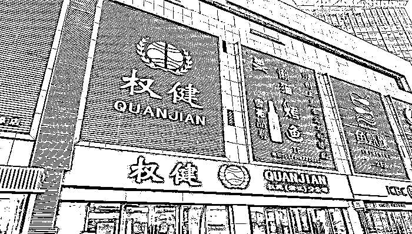
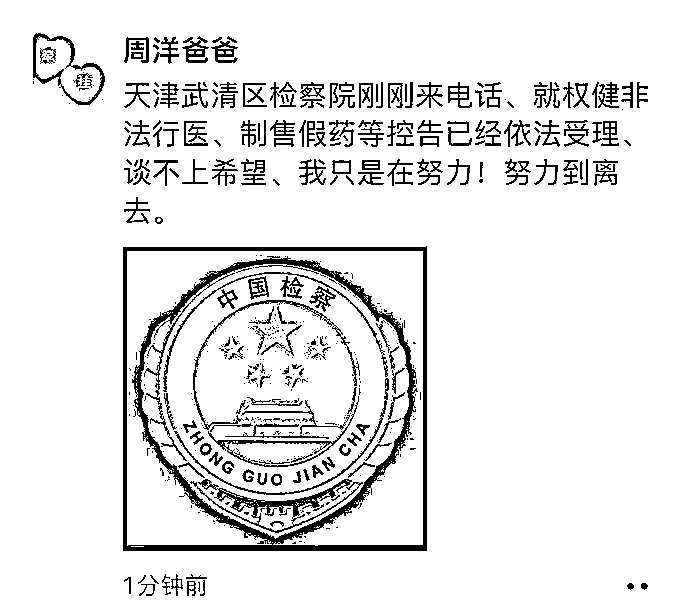

# 周洋父亲再诉权健获受理，要求追究束昱辉刑事责任

> 原文：[`mp.weixin.qq.com/s?__biz=MzIyMDYwMTk0Mw==&mid=2247528820&idx=5&sn=4235eb828bb8be7ee12351b9b9ae7661&chksm=97cbba4ca0bc335a519c7e33c0629b2889b9a8e205c79af171d74c765f1259a54e925fce9857&scene=27#wechat_redirect`](http://mp.weixin.qq.com/s?__biz=MzIyMDYwMTk0Mw==&mid=2247528820&idx=5&sn=4235eb828bb8be7ee12351b9b9ae7661&chksm=97cbba4ca0bc335a519c7e33c0629b2889b9a8e205c79af171d74c765f1259a54e925fce9857&scene=27#wechat_redirect)

图片来源：视觉中国

1 月 30 日下午，“权健事件”当事人之一周洋父亲在微信朋友圈表示：“天津武清区检察院刚刚打来电话，就权健非法行医、制售假药等控告已经依法受理。谈不上希望，我只是在努力！努力到离去。”

图片来源于周洋父亲

周洋父亲在接受界面新闻采访时表示，其本人是在今年 1 月 23 日提出的控告申请，主要内容包括：权健公司在 2012 年是否有制药资质、公司实控人束昱辉是否有行医资格、权健公司利用周洋案例虚假宣传误导公众是否构成虚假宣传。

此前，周洋父亲在 2015 年初就对权健公司做过起诉，要求权健公司删除虚假宣传内容不再误导他人，并对其家庭赔礼道歉，但该诉求最终败诉。当前，这是其第 2 次起诉权健公司和束昱辉。其强调，“这次是控告、申请检察院立案监督，依法追究权健束昱辉刑事责任。”

依据澎湃新闻报道，彼时，法院之所以判定周洋父亲败诉，原因在于，根据权健公司提供的证据，发布周洋服用权健药品后病情好转信息的网站，并非权健登记注册的官方网站；周洋方也不能举证证明在互联网发布侵权信息的网站是由权健注册、经权健授权或权健对发布信息的网站提供了侵权信息。

2018 年 12 月 25 日，自媒体“丁香医生”发布《百亿保健帝国权健，和它阴影下的中国家庭》，直指权健公司（全称“权健自然医学科技发展有限公司”）存在涉嫌虚假宣传、销售模式涉嫌传销等问题，起底权健保健品乱象。

文章提及，一位 4 岁女童家庭花 8000 万元买“抗癌秘方”，在付 5000 元现金之后得到了一款紫草体用精油、一款粉末状固体饮料、一袋没有配方说明的中药制剂；同时，在女童身体每况愈下之际，互联网那头却流传出“4 岁患癌女孩小周洋在权健自然医学重获新生！”的宣传内容。而后，权健公司通过多平台发布声明表示“丁香医生”报道内容失实，事件随即引爆网络舆论，引发持续和关注。

2019 年 1 月 1 日，天津市公安机关对权健公司涉嫌组织、领导传销活动罪和虚假广告罪立案侦查。2020 年 1 月 8 日，天津市武清区人民法院对被告单位权健公司及被告人束昱辉等 12 人组织、领导传销活动一案依法公开宣判，认定被告单位权健公司及被告人束昱辉等 12 人均构成组织、领导传销活动罪，依法判处被告单位权健公司罚金人民币 1 亿元，判处被告人束昱辉有期徒刑 9 年，并处罚金人民币 5000 万元；对其他 11 名被告人分别判处 3 年至 6 年不等的有期徒刑，并处罚金；对违法所得予以追缴，上缴国库。被告人束昱辉当庭表示认罪服法。

来源：界面新闻

**【↑↑↑关注后回复：封面 免费领取虎年限量红包封面】**

← 向右滑动与灰产圈互动交流 →

