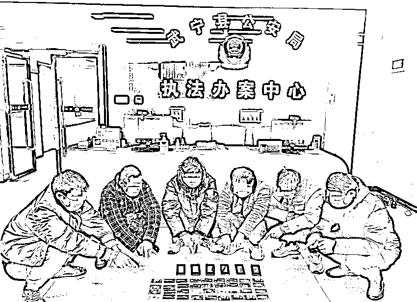
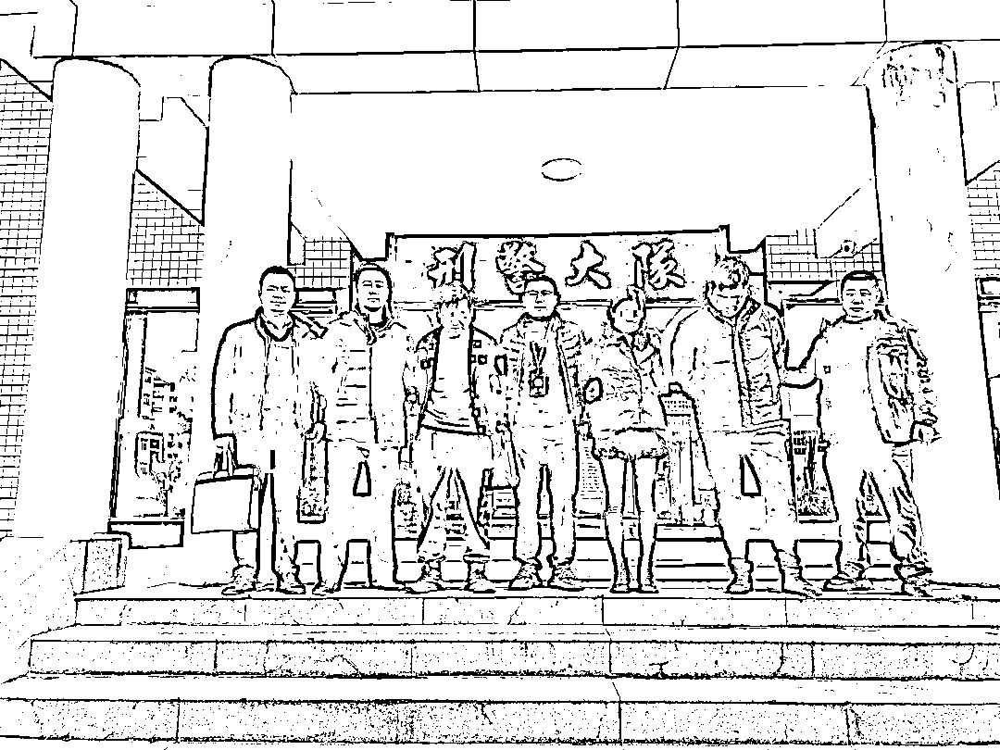
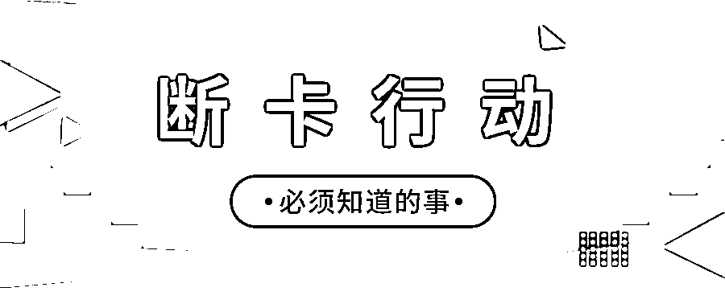
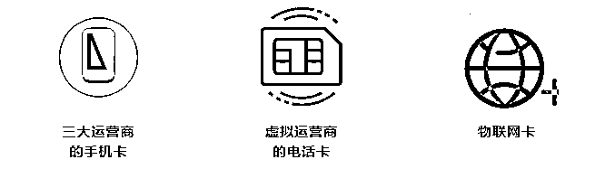
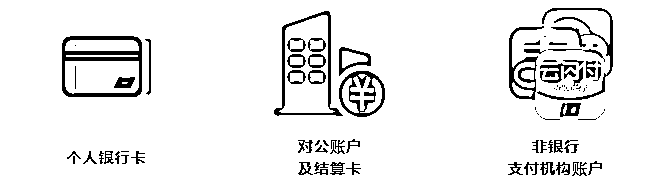

# 刑拘 25 人！出售、出租“两卡”赚钱你还心动吗?

> 原文：[`mp.weixin.qq.com/s?__biz=MzIyMDYwMTk0Mw==&mid=2247528820&idx=6&sn=015bdbedc5ae9f47aed822bed03dba8d&chksm=97cbba4ca0bc335a671070a068351ad9185803ad42d68944f48d3f24bd0228eea183225f09dc&scene=27#wechat_redirect`](http://mp.weixin.qq.com/s?__biz=MzIyMDYwMTk0Mw==&mid=2247528820&idx=6&sn=015bdbedc5ae9f47aed822bed03dba8d&chksm=97cbba4ca0bc335a671070a068351ad9185803ad42d68944f48d3f24bd0228eea183225f09dc&scene=27#wechat_redirect)

“用”一张银行卡或支付宝账号

帮别人转一下钱

一天赚 300 元，10 天就赚 3000 元

这样赚钱真轻松

......

**小心，这是犯罪！**

倘若你借用“两卡”给他人

那么就可能成为诈骗分子的“帮凶”

甚至为自己引来牢狱之灾

[`mp.weixin.qq.com/mp/readtemplate?t=pages/video_player_tmpl&action=mpvideo&auto=0&vid=wxv_2245957669364826112`](https://mp.weixin.qq.com/mp/readtemplate?t=pages/video_player_tmpl&action=mpvideo&auto=0&vid=wxv_2245957669364826112)

近日，武宁警方在“长风 3 号”集中打击行动,先后抓获涉及“两卡”违法犯罪嫌疑人 25 人，其中出售个人银行卡涉嫌帮助信息网络犯罪嫌疑人 21 人，**破获各类涉诈案件 100 余起**，**打掉****“****跑分”团伙 2 个**，**查扣涉案银行卡 75 张**。 

** 深挖彻查 所队联动端掉一个“跑分”团伙**

1 月 21 日，武宁县公安局根据“长风 3 号”下发线索进行排查时，发现辖区叶某水可能涉嫌电诈犯罪。民警根据这一线索，通过侦查于当日将叶某水抓获。

随后，民警通过进一步深挖彻查，先后 24 日、25 日先后将该团伙主要成员葛某、叶某林、王某星、叶某周、叶某平、邹某、叶某等 9 人抓获，缴获银行卡 20 余张。

经审讯，该团伙成员均为武宁本地人，2019 年团伙主要成员从境外从事网络诈骗回国后，在武宁县收购他人银行卡帮助跨境诈骗集团转移涉案资金，团伙其他成员使用自己的身份证办理银行卡及 U 盾出售给他人获利，该团伙涉案金额高达**2000 余万元**。

目前，犯罪嫌疑人叶某水等 9 人已经被刑事拘留。

**  紧盯现案 持续奋战打掉一个洗钱团伙 **

1 月 4 日下午，武宁县公安局接到群众报警称：其在一个鸿图网平台进行投资，后被对方以其账号被冻结需进行解封等理由，先后被骗取 13.5 万元。

此案发生后，武宁县公安局立即开展网上研判，通过多方侦查，锁定犯罪嫌疑人韩某等人。办案民警立即赶赴景德镇市展开工作，在当地警方配合下，于 1 月 12 日、15 日先后将嫌疑人韩某等 3 人抓获。

经查，犯罪嫌疑人韩某从 2021 年 10 月至 2022 年 1 月期间，邀集朋友周某等人使用本人及朋友名下多张银行卡帮助网络犯罪分子进行资金结算（即“跑分”），从中非法获利，资金流水达到**1300 余万元**。

目前，犯罪嫌疑人韩某等 3 人已经被刑事拘留。 

**在此提醒广大民众：**

天上不会掉馅饼，将自己银行卡、电话卡、微信账号等出售给他人，这些看似简单轻松却能获取高收益的行为可能恰巧就为他人实施电信诈骗、洗钱等犯罪行为提供了便利，在使受害人遭受经济损失的同时，更会让自身陷入帮助信息网络犯罪活动的泥潭之中。

希望广大群众能时刻保持警惕，增强法律意识，注意保护好个人隐私，妥善保管好个人的身份证、银行卡、网银 U 盾、手机卡等物品，勿将以上物品出借给他人使用，也勿轻易使用他人的银行卡，同时也不要轻信网络上来历不明的兼职信息，不随便点击互联网上的不明链接，规范好自己的网络言行，不轻易向他人透露个人身份证、银行卡号等信息，更不要为了蝇头小利出卖自己的银行卡，为他人进行信息网络犯罪提供帮助，成为犯罪分子的“工具人”。

**《中华人民共和国刑法》第二百八十七条之二【帮助信息网络犯罪活动罪】**

明知他人利用信息网络实施犯罪，为其犯罪提供互联网接入、服务器托管、网络存储、通讯传输等技术支持，或者提供广告推广、支付结算等帮助，情节严重的，处三年以下有期徒刑或者拘役，并处或者单处罚金。

**《中华人民共和国刑法》第三百一十二条【掩饰、隐瞒犯罪所得、犯罪所得收益罪】**

明知是犯罪所得及其产生的收益而予以窝藏、转移、收购、代为销售或者以其他方法掩饰、隐瞒的，处三年以下有期徒刑、拘役或者管制，并处或者单处罚金；情节严重的，处三年以上七年以下有期徒刑，并处罚金。

**什么是“断卡行动”？**

**    近年来，电话卡、银行卡成为了电信网络诈骗案件持续高发的重要根源。2020 年 10 月 10 日，国务院打击治理电信新型违法犯罪工作部际联席会议全国“断卡”行动部署会召开。“断卡”行动就是要通过控制这两类卡片，铲除电信网络诈骗犯罪的滋生土壤。**

****“断卡”行动断的是哪些卡？****

********

********

******为什么要实施“断卡”行动？******

******危害特别大：**当前电信网络诈骗持续高发的一大根源，是因为电话卡、银行卡的管理失控。每年因遭受电信诈骗而上演的悲剧不胜枚举，对我国社会治安和人民群众财产安全造成了严重威胁。****

******打击工作的迫切需要：**“实名不实人”的电话卡，不但会被犯罪分子用来实施电信诈骗，还会用来进行网络贩毒、网络赌博，而这些钱大部分都是通过买卖的银行卡走账，难以追查和打击。每年因诈骗、网赌造成的悲剧不胜枚举，给我国金融安全、社会治安造成了严重威胁。****

******断卡行动与我有关吗？******

****** “断卡”行动，与我们每个人都息息相关！******

******影响日常生活：**由于个人信息泄露、身份证遗失等情况，我们每个人都有可能被人冒充并办理银行卡、电话卡，而一旦“断卡”行动完全实施，按照规定，涉案的单位和个人将会面临严重惩戒，影响日常生活！****

******惩戒措施：**凡是经公安机关认定的出租、出借、出售、购买个人银行账户、企业对公账户的单位或个人，人民银行将联合公安机关对相关人员实施惩戒。****

******信用惩戒****** 

****人民银行会将相关违法违纪信息录入金融信用基础数据库，并纳入个人征信报告，在一定时间内影响相关人员的贷款和信用卡申请。****

******限制业务******

****根据《中国人民银行关于加强支付结算管理 防范电信网络新型违法犯罪有关事项的通知》（银发〔2016〕261 号）等文件，一经认定的出租、出借、出售、购买银行账户或支付账户的单位和个人，5 年内暂停其银行账户的非柜面业务和支付账户的所有业务，且不得新开立银行账户和支付账户。****

******刑事处罚******

****非法买卖个人银行账户和单位账户，还可能涉嫌《中华人民共和国刑法》规定的帮助信息网络犯罪活动罪、妨害信用卡管理罪、买卖国家机关证件罪和掩饰、隐瞒犯罪所得罪，甚至构成诈骗罪，可能给个人带来牢狱之灾。****

****来源：武宁公安 利箭在行动****

******【↑↑↑关注后回复：封面 免费领取虎年限量红包封面】**************

****← 向右滑动与灰产圈互动交流 →****

********