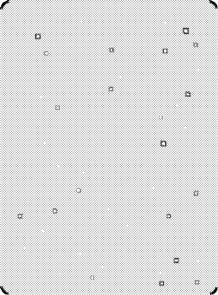
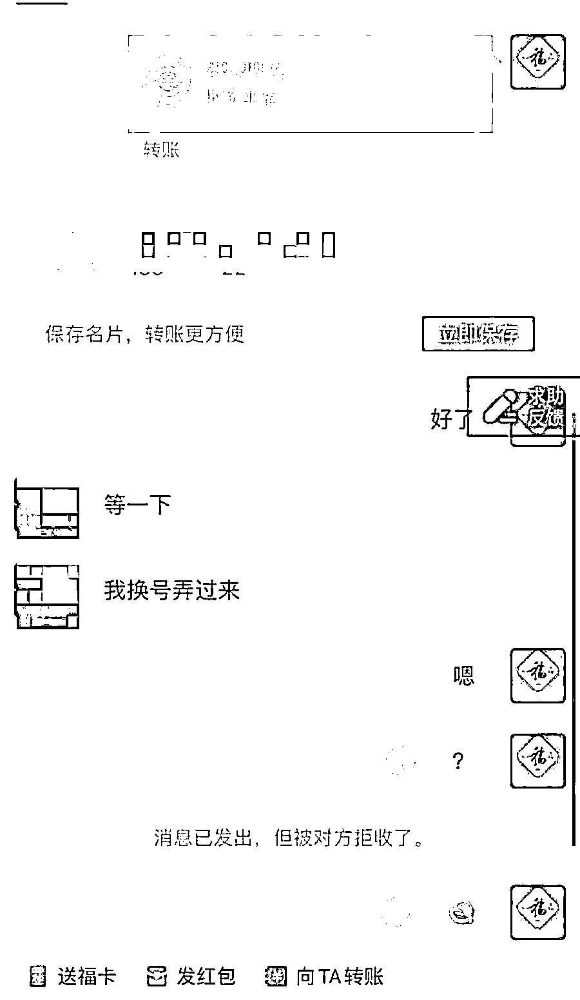

# 说好送我敬业福，却转走我的年终奖……

> 原文：[`mp.weixin.qq.com/s?__biz=MzIyMDYwMTk0Mw==&mid=2247528820&idx=7&sn=34e75ba050f8f56f12f4ccf0561bc0b3&chksm=97cbba4ca0bc335abb7763abbcb7ade125801085f6bd4d4418787d6ad723545980583ee2490b&scene=27#wechat_redirect`](http://mp.weixin.qq.com/s?__biz=MzIyMDYwMTk0Mw==&mid=2247528820&idx=7&sn=34e75ba050f8f56f12f4ccf0561bc0b3&chksm=97cbba4ca0bc335abb7763abbcb7ade125801085f6bd4d4418787d6ad723545980583ee2490b&scene=27#wechat_redirect)

一年一度几个亿的大项目

春节集五福活动

又双叒叕开始了

据说才开始几个小时的时候

就有大约 2 万人集齐了五福

准备冲刺分钱了

集五福活动似乎成为

春节的保留节目

大家在集福和互相赠福的过程中

体会当下越来越缺少的年味

因此虽然“开奖”所得并不多

但大家集福的热情并不减退

**但为了这两块五**

**折进去大把钱的人可不在少数**

壹

去年集五福的时候

小王就差一个“敬业福”

眼瞅着除夕夜要到了

小王求助朋友被朋友拉进“集福群”

很快有个叫“洪世贤”的人加了他

说可以把多余的“敬业福”送给他

加了支付宝好友之后“洪世贤”说

自己今天的赠送次数已经达到上限了

需要小王手机验证才能继续转赠

小王等不及明天

毫不犹豫地答应了对方

不一会儿小王收到提示

银行卡连续消费好几十笔

再一登支付宝

密码改了

刚发的年终奖，飞了！

贰

在朋友圈转了好几天

小美也没换到自己想要的“福”

她突然想到

没人愿意换

总有人愿意卖吧

于是打开贴吧搜索“购买福卡”

小美发现有很多人都在做这样的交易

加了好友一手交钱一手交福

小美刚把 20 块钱转过去

消息就被对方拒收了

中国人不骗中国人

你别走啊！

**套**

集五福

**路**

**套路一：加陌生好友骗取校验码信息**

不法分子通过添加支付宝好友后，以**“达到福卡赠送上限，需要校验码”**为由，骗取对方校验码信息。

然而，此时的校验码，正是**重置支付宝账户登录密码**的验证信息。

在顺利通过验证后，不法分子会**第一时间重置**登录密码，进而将对方支付宝账户的钱转走或消费付款。

**套路二：买“****福卡”被多次加价**

不法分子利用受害人求“福”急切的心理，在福卡交易中随意加价，让购买福卡的人屡屡中招，却不兑现福卡，然后再将其拉黑或删除。

**套路三：****扫码进群互换“五福”**

不法分子通过互换“五福”为由诱导大家扫二维码加入微信群，而此时的**二维码就是一个链接**。

植入木马病毒后即可盗取个人的银行账户、密码等信息，从而实施诈骗。

**套路四：冒充熟人转发链接送“五福”**

**不法分子冒充熟人向手机用户发送短信送“五福”，并附上“恶意链接”。当对方点击该链接后，不法分子就会盗取对方的个人信息，从而实施诈骗。**

****套路五：“****福卡”销售猫腻多****

**“敬业福”往往一“福”难求，被放到网上叫卖，价格从几元到几千元不等。而很多 QQ 群、微信群等渠道销售的“敬业福”多数是 P 图或盗来的图。**

********

******REMIND************【反诈民警提醒】********************年末诈骗高发，警方温馨提示****** ****一、要警惕陌生人以送福卡为由添加好友，尤其是要小心那些头像虽然是熟人，但无法验证真伪的陌生好友申请。********二、不要轻易点击链接或扫描二维码，对于那些来路不明的信息最好第一时间删除，以防误操作导致损失惨重。********三、不要在一些购物网站、二手网站和社交平台上进行“福卡交易”，以防出现付款后却被对方拉黑的情况。****

****来源：洛阳市反诈骗中心，昆明反电信网络诈骗中心****

******【↑↑↑关注后回复：封面 免费领取虎年限量红包封面】**************

****← 向右滑动与灰产圈互动交流 →****

********