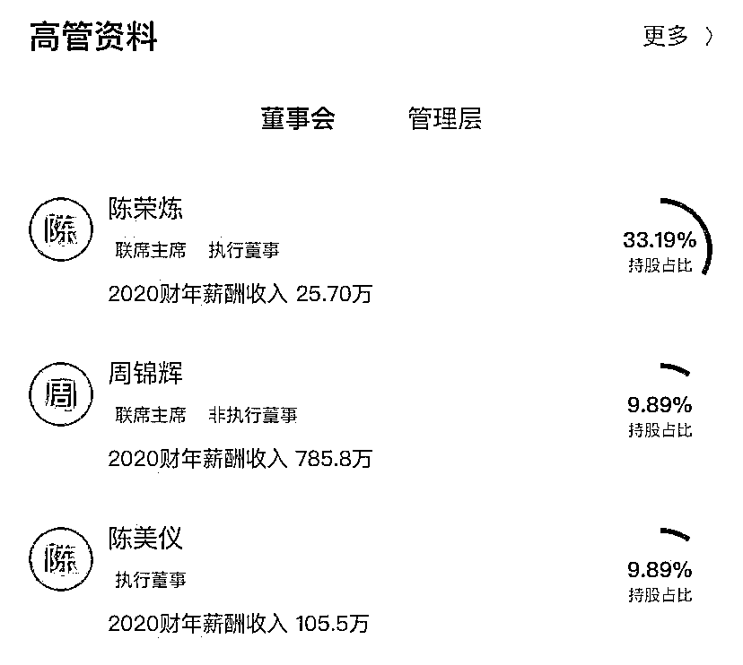

# 安以轩丈夫被捕，这家上市公司紧急回应

> 原文：[`mp.weixin.qq.com/s?__biz=MzIyMDYwMTk0Mw==&mid=2247528872&idx=3&sn=5e6e0baca7f319e81733eb3b07da5408&chksm=97cbba90a0bc3386365bc05b88ec5584235c17f9ad257a4fa936c1578e959216c439a4f489ef&scene=27#wechat_redirect`](http://mp.weixin.qq.com/s?__biz=MzIyMDYwMTk0Mw==&mid=2247528872&idx=3&sn=5e6e0baca7f319e81733eb3b07da5408&chksm=97cbba90a0bc3386365bc05b88ec5584235c17f9ad257a4fa936c1578e959216c439a4f489ef&scene=27#wechat_redirect)

此前报道：

[安以轩丈夫陈荣炼被捕，涉洗米华案，揭秘起家史！](http://mp.weixin.qq.com/s?__biz=MzIyMDYwMTk0Mw==&mid=2247528820&idx=1&sn=d6c8b29580205b912819d4f1972cc67f&chksm=97cbba4ca0bc335a73ecf2d71f8a2339a5ec0dda804d1f3a33bf87a7f9b2713e1bc7661b3c14&scene=21#wechat_redirect)

1 月 30 日，澳门励骏（01680.HK）在港交所公告，董事会知悉本公司执行董事、董事会联席主席兼行政总裁及控股股东陈荣炼遭澳门司法警察局逮捕及拘留。董事会认为，鉴于本集团由管理人员团队经营，而上述事件与陈先生的个人事务有关，与本集团无关，董事会预期上述事件不会对本集团日常经营产生重大不利影响。董事会将密切监视及检讨该情况，并于适当时候刊发进一步公告。

消息面上，据新华社 1 月 30 日报道，澳门特区政府司法警察局 30 日举行新闻发布会，公布 2021 年 11 月侦破一宗涉及犯罪集团、不法经营赌博及清洗黑钱罪的案情后续调查，并已拘捕 2 名疑涉案澳门男子。

在发布会现场，警方公布了搜集到的一些证据。司警局表示，被捕 2 人分别为 49 岁陈姓和 34 岁蔡姓的澳门男子，报称商人，他们分别负责操作犯罪集团和提供协助。警方分析调查认为时机成熟，28 日在新口岸区某酒店拘捕 2 人，经搜查他们的住所和办公地点，发现大量犯罪证据，包括计算机、服务器及折合约 410 万港元现金等，2 人拒绝合作，不回答警方问题。

司警局表示，有证据显示，这次涉案的犯罪集团与 2021 年 11 月案件的犯罪集团，有共同参与有关不法行为，至于具体细节，案件仍在调查不方便公开。发布会结束后，该案移交特区检察院跟进处理。

2021 年 11 月 28 日，司警局举行新闻发布会，公布侦破一宗涉及犯罪集团、不法经营赌博及清洗黑钱罪案件，拘留 11 人，其中包括 47 岁周姓商人。案件随后移交检察院侦办。

需要注意的是，据环球网，香港“星岛网”消息，澳门司警局 29 日表示，涉嫌参与周焯华在内地实施开设赌场等罪，日前再拘捕两名涉案的澳门男子，有消息称，被拘捕两人包括德晋集团主席陈荣炼，他是台湾艺人安以轩的丈夫。

公开资料显示，陈荣炼，原籍福建省晋江永和镇茂亭村人。澳门福建体育会理事长、德晋慈善会会长、德晋贵宾会董事长、德晋财务有限公司董事长、利互集团董事长、珠海德贤投资管理有限公司董事长、如意国际集团董事长、上海佰迦乐影院投资有限公司董事长等。

2007 年，已有一定积累的陈荣炼创立了德晋集团。同一年，洗米华也创立了属于自己的公司——太阳城。

2020 年 9 月，香港联交所披露，陈荣炼夫妇以接近 10%的溢价，收购了澳门励骏创建有限公司超过 20%的股份，一跃成为该公司最大的股东。

Wind 显示，澳门励骏是澳门娱乐及娱乐场博彩设施的领先拥有者之一。公司拥有两项主要物业，一项是澳门置地广场酒店，其为集合酒店、娱乐场及豪华购物中心的得奖综合设施，特设五星级酒店及澳门首个主题娱乐场，位于澳门半岛中心地带，另一项是澳门渔人码头，其为位于澳门半岛外港并集合博彩、酒店、会议及娱乐的海滨综合设施。除经营酒店及非博彩娱乐物业外，公司亦为澳博于公司物业内由其经营的两个主要娱乐场（即澳门置地广场酒店内的法老王宫殿娱乐场及澳门渔人码头内的巴比伦娱乐场）提供博彩服务。

2020 年 11 月 24 日，陈荣炼成为澳门励骏联席主席，当年 12 月 29 日，陈荣炼成为行政总裁。截至 2021 年 6 月，陈荣炼仍是澳门励骏执行董事、联席主席兼行政总裁。据悉，陈荣炼 2020 财年薪酬收入为 25.7 万元。上市公司资料显示，截至目前，陈荣炼在澳门励骏的持股比例达到 33.19%。

据澳门励骏 2020 年 11 月 24 日的公告显示，陈荣炼，48 岁，为德晋集团之创办人兼主席。德晋集团为澳门一间博彩中介公司，雇佣逾 1，000 名员工，主要从事于澳门为相应娱乐场贵宾厅引介贵宾客户，并于澳门自相应娱乐场贵宾厅之博彩中介业务获取盈利来源。

陈先生于博彩行业具有十年以上经验。彼曾于二零一二年担任澳门娱乐博彩业中介人协会副会长，并曾于二零一三年担任澳门负责任博彩协会及澳门东盟国际商会荣誉会长。彼曾于二零一九年担任澳门博彩业管理暨中介人总会副会长。陈先生连续多年荣登澳门杂志《Inside Asian Gaming》的亚洲博奕权势榜 50 大，并于二零一九年排名第 24 位。 

来源：每日经济新闻，观察者网

← 向右滑动与灰产圈互动交流 →

