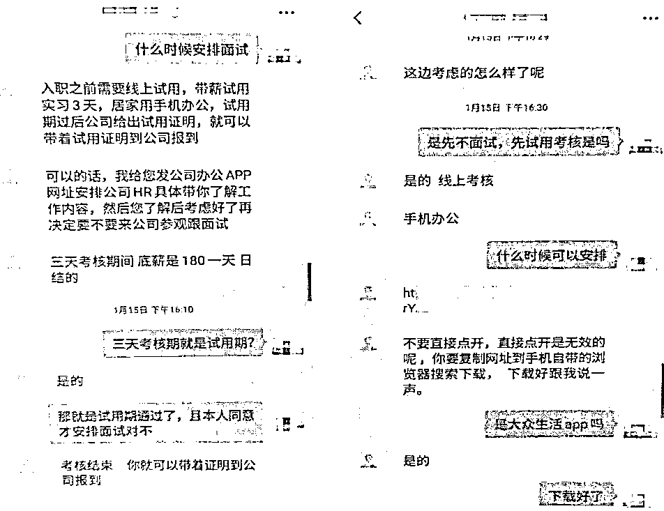
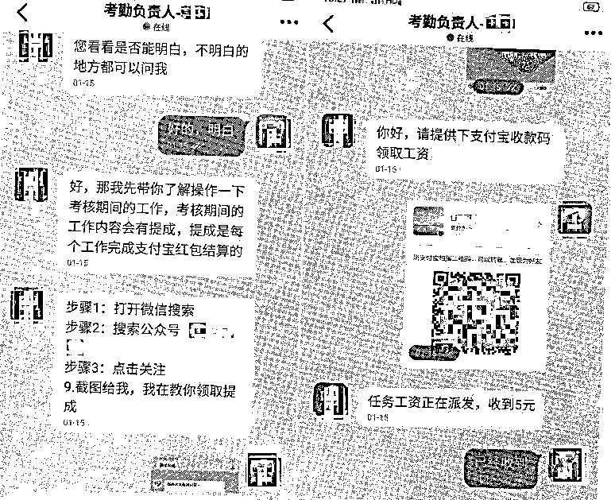
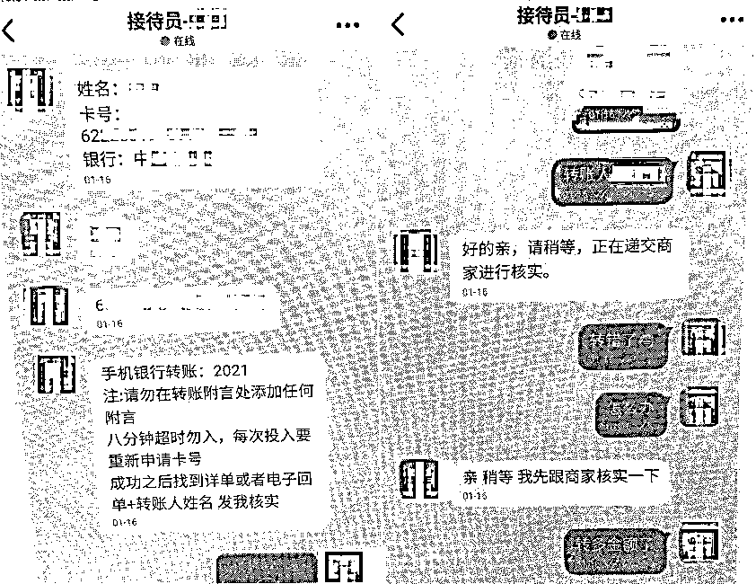

# 一女子找工作，没想到……

> 原文：[`mp.weixin.qq.com/s?__biz=MzIyMDYwMTk0Mw==&mid=2247528872&idx=4&sn=e3b0d7ef3d66961b0623a41a1056991f&chksm=97cbba90a0bc33863d911ef5f2bc02684815f106db0f45635a495d165dc789086692099342f0&scene=27#wechat_redirect`](http://mp.weixin.qq.com/s?__biz=MzIyMDYwMTk0Mw==&mid=2247528872&idx=4&sn=e3b0d7ef3d66961b0623a41a1056991f&chksm=97cbba90a0bc33863d911ef5f2bc02684815f106db0f45635a495d165dc789086692099342f0&scene=27#wechat_redirect)

网络诈骗套路深

各种手段在翻新

兼职刷单诈骗、“杀猪盘”诈骗、

冒充客服诈骗......

一不小心就进“坑”

近日，刚毕业不久

想要找工作的小王（化名）

就因一时大意

掉进了骗子的“圈套”

在浏览招聘 APP 时，小王看到了一条让她颇为心动的招聘信息，便主动联系了该公司的人事。随后，对方爽快地安排了面试，并要求小王**下载一款名为“大 X 生活”的 APP**，称公司需要**用这个 APP 网上办公**。

小王下载注册账号后，添加了“公司考勤负责人”为好友，对方以完成任务为由让小王关注一个微信公众号，并转了 5 元到她的支付宝账户。次日早上，对方又要求其关注三个微信公众号，并给她转了 10 元作为返利。

之后，“负责人”开始**提高任务难度**，要求小王完成数据对冲的任务。**前两次顺利获得奖励**的小王没有多想，在对方指引下选择了 200 元对冲金额的任务，并将钱转到指定账号。 

然而，对方却**声称小王的操作步骤有误**，需要转 600 元到指定的银行账户以弥补协议。小王按照要求操作后，对方又以申请修复任务卡号、转错金额等理由**不断要求其转账**，直至转账**4000**多元后，小王才察觉到自己遭遇了诈骗，于是报警求助。

事后

当被问及是否接受过反诈宣传时

小王直言平时都会关注

但不曾想到骗子套路这么深

找工作还会被诱导

干起兼职刷单的事情

**警方提醒** 

市民在求职过程中

要尽可能了解清楚

相关公司情况后再入职

提及转账要多留心眼

发现被骗后要保存证据

并第一时间报警求助

来源：佛山市公安局，阻击诈骗

← 向右滑动与灰产圈互动交流 →

