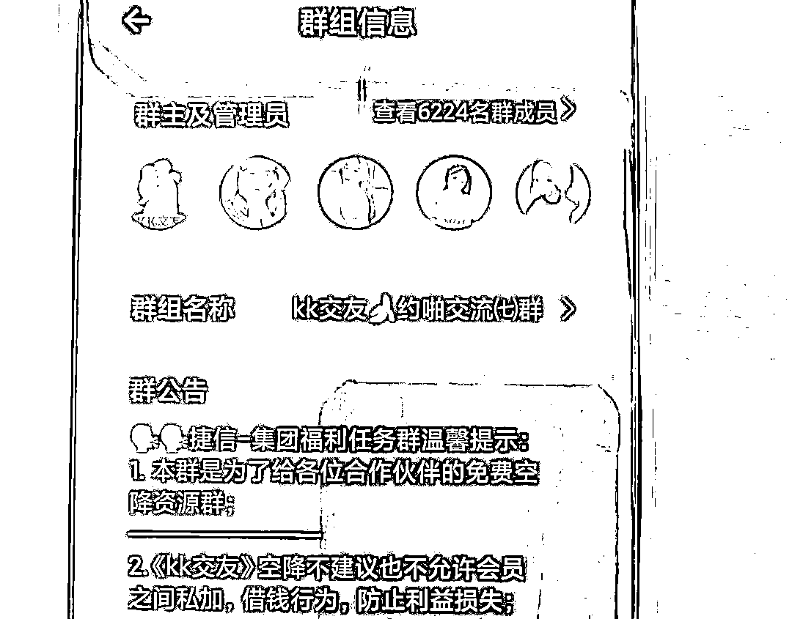
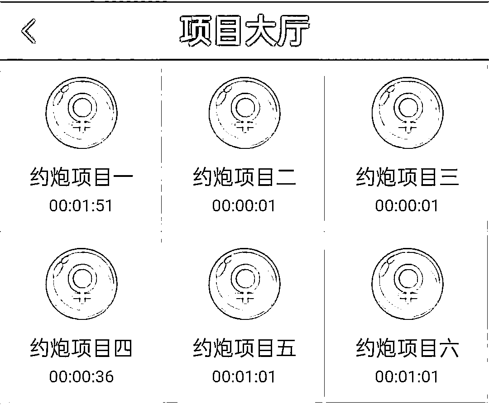
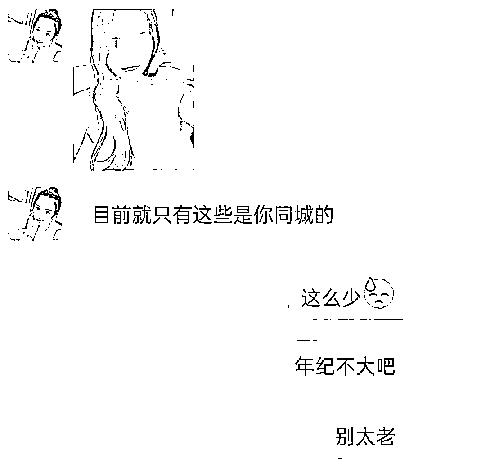

# 一周时间 13 人被骗 132 万！过年期间这种色情骗局一定要小心......

> 原文：[`mp.weixin.qq.com/s?__biz=MzIyMDYwMTk0Mw==&mid=2247528872&idx=5&sn=eee0bf44f8d0127b6d0024f6ae7a436b&chksm=97cbba90a0bc338667a56d65d4187914a936a411680a29ad24823ba7977c2c071134f18e46bb&scene=27#wechat_redirect`](http://mp.weixin.qq.com/s?__biz=MzIyMDYwMTk0Mw==&mid=2247528872&idx=5&sn=eee0bf44f8d0127b6d0024f6ae7a436b&chksm=97cbba90a0bc338667a56d65d4187914a936a411680a29ad24823ba7977c2c071134f18e46bb&scene=27#wechat_redirect)

新春将至，不少人已经开始提早放假回家过年，与此同时，一种新型的色情骗局也开始慢慢滋生，不是招嫖和裸聊，而是另一种“速度与激情”：**约 Pao**。

**据舟山市反诈中心统计，仅上周，舟山就有 13 名男子因约 Pao 被骗，总损失金额达到了 132 万元！**

**真实案例**

1 月 5 日晚上，在舟山定海务工的徐某收到了一条 QQ 信息，对方推荐给了他一个**“KK 交友”**软件。

**与以往的社交软件不同，这款软件只要完成指定的任务，便可“在线约 Pao”。**

徐某情难自禁，随即下载软件，并添加了该平台的一个**“约 Pao 老师”**，在“老师”的指导下，徐某开始了做任务刷单。

_ 副本.jpg")

起初徐某只是汇入了 2000 元试水，没曾想很快便获得了几百元的佣金，随后他便放心大胆的开始在该平台投入大笔资金。

但当徐某连续充值**12 万元**准备提现时，却发现账户资金被冻结，需要继续缴纳几万元的解冻费，此时他方知自己上当受骗。

**警方提醒**

这种最新诈骗手法可谓海纳百川，精妙绝伦。将**招嫖诈骗、刷单诈骗、杀猪盘**的套路巧妙的融合在一起，充分利用了性欲和贪心这两大人性弱点。

对骗子来说，比招嫖诈骗获得的金额更高，比刷单诈骗诱惑力更大，省去了杀猪盘培养感情的时间，可谓杀伤力巨大。

唯一的缺陷在于目标受众群体较小，**渴望生理需求的单身男青年****（有钱的或者没钱可以贷到款的）**，但这也是该手法的优势，这些精准筛选出“客户”，被诈骗的成功率极高。

**【课后思考题】****能拿出 12 万块来约 Pao 的徐先生，难道还找不到一个女朋友吗？**

来源：93 反诈，阻击诈骗

← 向右滑动与灰产圈互动交流 →

