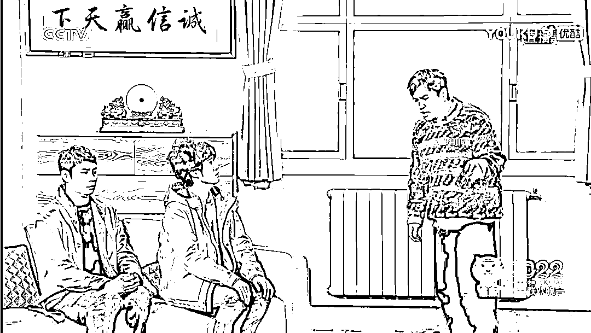
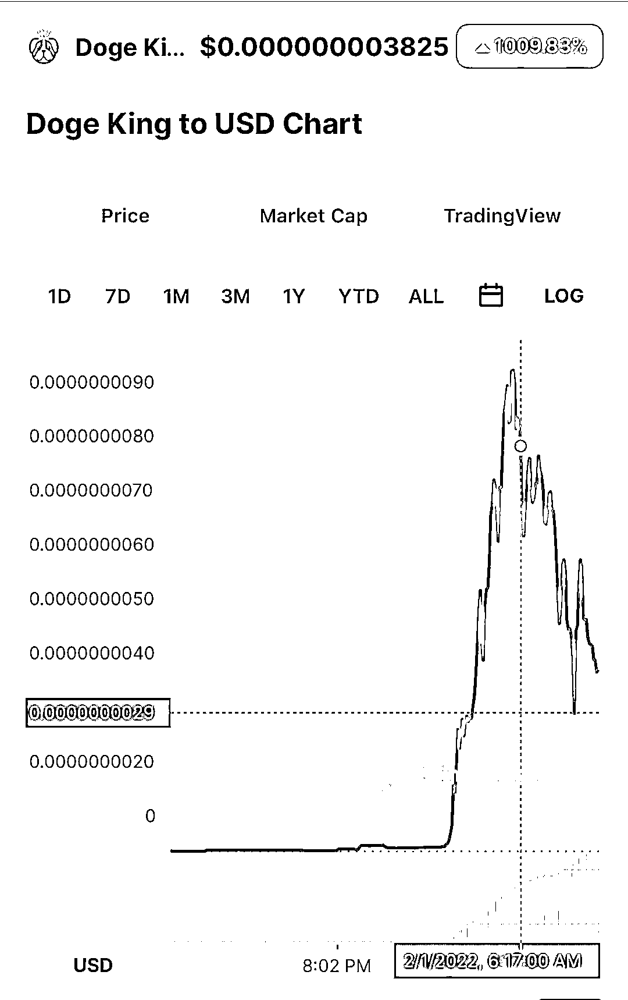
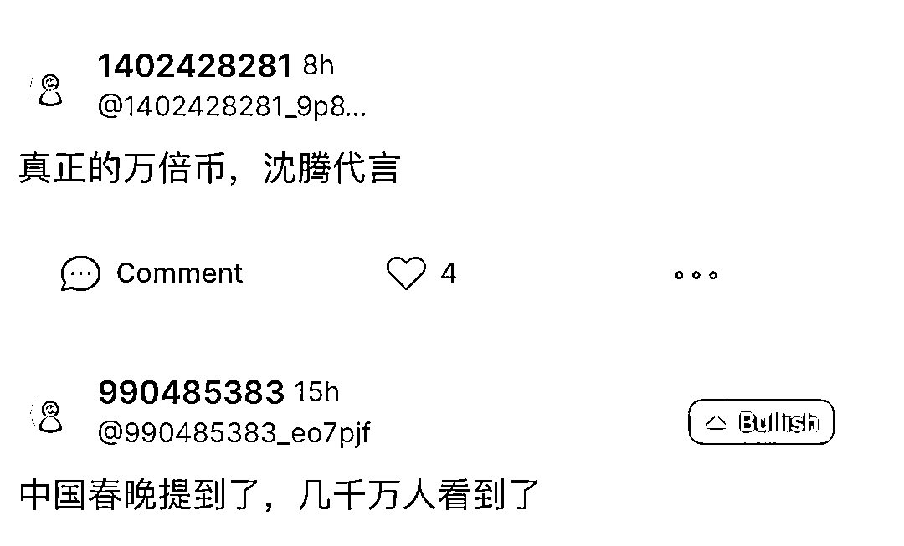
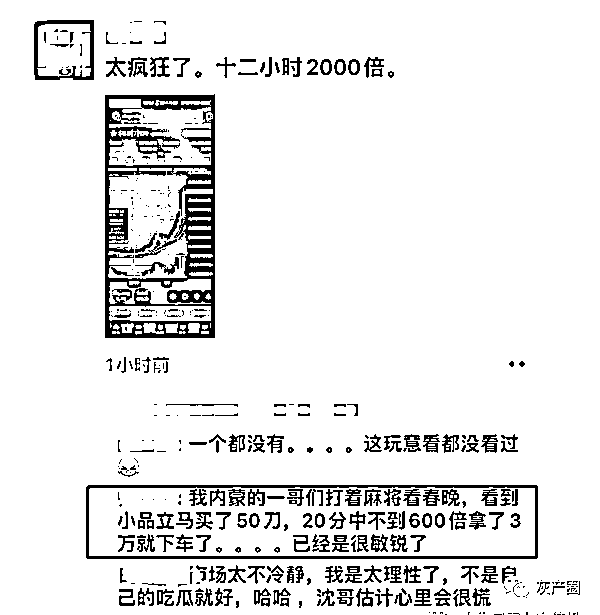
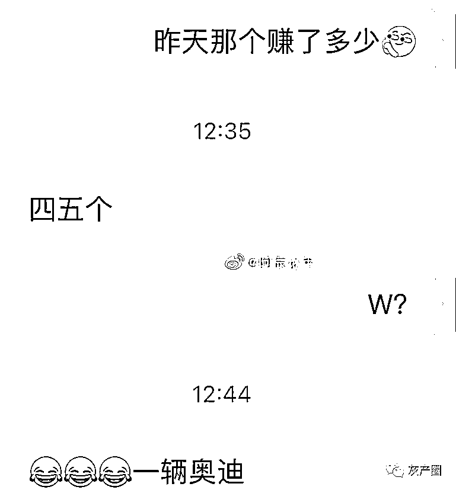
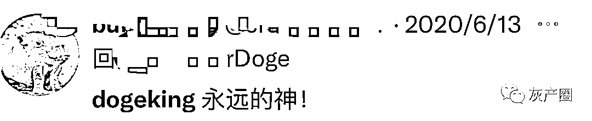
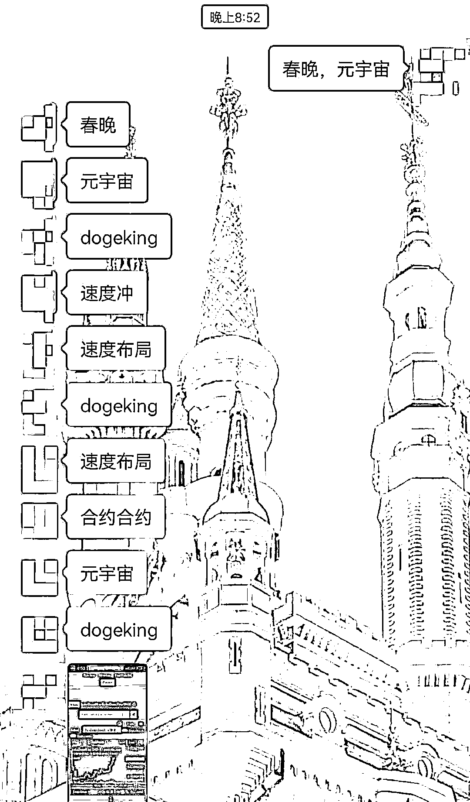

# 虎年第一魔幻！沈腾春晚一句话，随即成交 1558 万元，暴涨 1010%

> 原文：[`mp.weixin.qq.com/s?__biz=MzIyMDYwMTk0Mw==&mid=2247528926&idx=1&sn=0d26d1c5309c777374e0969b9bf02b8d&chksm=97cbbae6a0bc33f00cdae0724aa641dc1190f970f35c21697fe7a5a6ed65add789937e74e500&scene=27#wechat_redirect`](http://mp.weixin.qq.com/s?__biz=MzIyMDYwMTk0Mw==&mid=2247528926&idx=1&sn=0d26d1c5309c777374e0969b9bf02b8d&chksm=97cbbae6a0bc33f00cdae0724aa641dc1190f970f35c21697fe7a5a6ed65add789937e74e500&scene=27#wechat_redirect)

元宇宙的风也刮进了虎年春晚，成了春晚节目中的“致富经”。 

1 月 31 日晚，在央视春晚小品《还不还》中，沈腾的一句话“我在元宇宙倒腾狗”，瞬间点燃了观众的投资热情。

一个同名虚拟币 dogeking 遭爆拉，一度涨超 1000%。美股元宇宙概念股全线大涨，Cloudflare 大涨 14.52%，Roblox 上涨 13.8%，Block 涨超 6%，Meta 涨超 3%。

沈腾自比元宇宙“狗王”

2022 年春晚开心麻花的小品《还不还》，是沈腾马丽第六次在春晚的舞台上合作，这次还拉上了常远、艾伦齐上阵。

作品延续了开心麻花关注社会现实的路线，将目标转向了社会中欠钱不还的行为。沈腾扮演的“老沈”更是将当下流行的元宇宙概念，作为他赖账的借口。

[`mp.weixin.qq.com/mp/readtemplate?t=pages/video_player_tmpl&action=mpvideo&auto=0&vid=wxv_2249856795647246337`](https://mp.weixin.qq.com/mp/readtemplate?t=pages/video_player_tmpl&action=mpvideo&auto=0&vid=wxv_2249856795647246337)

在艾伦和常远扮演的老同学向老沈讨债的时候，老沈抛出了“元宇宙”概念，称自己“正在元宇宙里倒腾狗，现在全世界所有的大佬都在盯着这块肥肉”。老沈还自比是元宇宙里的“dog king”。两位善良的老同学一听到投资的新领域，也马上倾囊相助，表示要分一杯羹。

这些元宇宙相关的段子引发网友热议，有网友表示“财富密码还得在春晚”，还有不少股民表示将跟投元宇宙概念股。

**爆火的元宇宙** 

从元宇宙概念第一股 Roblox 上市到 Facebook 更名“Meta”高调进军元宇宙，从红杉中国、经纬中国、南山资本、真格基金等纷纷下注该赛道，到 A 股市场爆炒元宇宙概念，要说 2021 年以来最火的风口，无疑就是元宇宙了。

天眼查数据显示，我国现有 651 家名称含“元宇宙”的企业，其中超 94%的企业成立于 1 年内。2021 年系元宇宙爆发元年，全年共新增 552 家名称含“元宇宙”的企业（全部企业状态）。2022 年 1 月 1 日至今，已有 61 家相关企业成立，平均每天成立 2 家。

中国移动通信联合会元宇宙产业委员会执行主任于佳宁提醒投资者，目前元宇宙的应用处于极为早期的阶段，将经历一个漫长、逐步迭代、扩展的过程。目前很多号称“元宇宙概念”的公司都不一定能跑完全程，相关概念股票或相关资产风险极大，不适合散户盲目投资。

元宇宙世界有没有倒腾狗的不知道，倒腾房和土地倒是不少。

2021 年 11 月，元宇宙的房产交易曾迎来一次爆发。据 Dapp（Dappradar.com）统计，在 2021 年 11 月 22 日到 28 日的一周内，4 个最主要的元宇宙房地产交易平台的总交易额接近 1.06 亿美元（约合 6.7 亿元人民币）。

**同名代币 Dogeking 坐上火箭** 

更魔幻的事，由于沈腾在小品中自比元宇宙世界的“狗王”（dog king），随后，同名虚拟币 Dogeking 也遭到热捧。

1 月 31 日晚间，Dogeking 短时一根超级大阳线，日内涨幅达 1009.83%，登上各大交易所涨幅榜前十位，24 小时成交量达 245 万美元（约合人民币 1558 万元）。

图片来源：CoinMarketCap

虚拟币 Dogeking 相关话题甚至一度登上热搜。国内网友瞬间炸了锅，有投资者熬夜加仓，只为赶上暴富行情；有投资者喊出“下一个万倍币，沈腾代言”。

图片来源：网络

公开信息显示，该币为币安智能链上代币，为狗狗币的衍生币种，于 2021 年 11 月推出。该币流动性锁定一年，项目完全去中心化和社区驱动，官网并未给出项目背后团队的名称和信息，也并未提供白皮书。

虚拟币 Dogeking 此轮涨势凶猛，业内人士提醒投资者：“虚拟币 Dogeking 的暴涨，可以看作一种粉丝经济效应。但是，该币种实际应用价值较小，筹码过于集中，很容易出现市场操纵风险。目前的价格暴涨更多来自于营销炒作，后期不排除持币大户抛售离场的可能，因此风险较大。”

来源：观察者网

← 向右滑动与灰产圈互动交流 →

