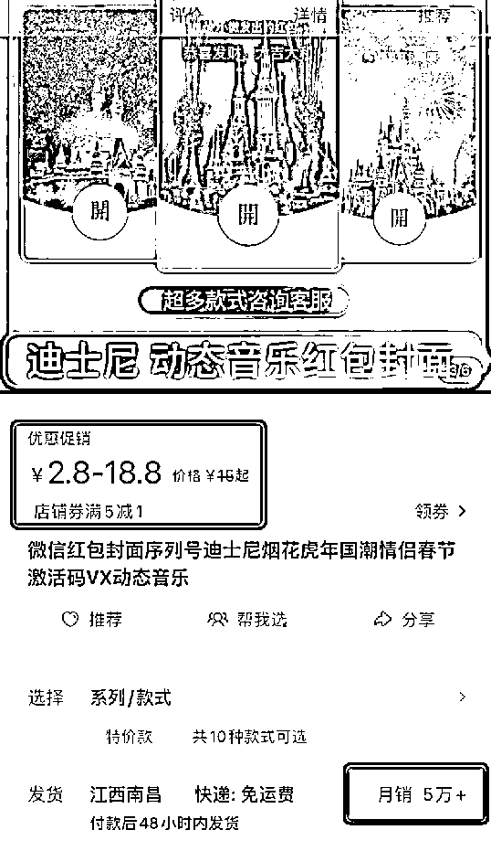
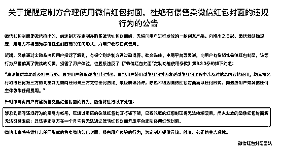

# 微信红包封面滋生灰色生意：有商家月入百万

> 原文：[`mp.weixin.qq.com/s?__biz=MzIyMDYwMTk0Mw==&mid=2247528926&idx=3&sn=34e6dcfed74277bbaa2df6471f9d8bd9&chksm=97cbbae6a0bc33f0150c3981920ed03401c3c04242bbe79da2e3c8c410b38ac1355e1b0b396b&scene=27#wechat_redirect`](http://mp.weixin.qq.com/s?__biz=MzIyMDYwMTk0Mw==&mid=2247528926&idx=3&sn=34e6dcfed74277bbaa2df6471f9d8bd9&chksm=97cbbae6a0bc33f0150c3981920ed03401c3c04242bbe79da2e3c8c410b38ac1355e1b0b396b&scene=27#wechat_redirect)

春节到，又到大家抢红包的时候啦！

 随着年关渐行渐近，微信红包封面在近日意外走红，不少人提前准备好了各式各样的红包封面，希望可以在新年之际为祝福添彩。有人直呼：“微信红包封面竟然比红包还难抢！”同时，也有不少有商家抓住商机，靠卖微信红包封面月入百万！

 **靠卖微信红包封面月入百万**

**更有单个封面 400 元**

在某网站显示，销量首位的微信红包封面月销超 5 万单，红包封面的售价最高为 18.8 元。这也就意味着，这家店铺光靠卖微信红包封面便可以月入近百万。

此外，还有众多商家销量破万，不少插画师、内容设计师等创作的红包封面也非常受欢迎，销售数量十分可观。

更有甚者，还以 400 元高价出售奢饰品牌及汽车品牌的红包封面。

 值得一提的是，微信还出了一款“红包封面闹钟”的小程序，集合了大品牌的红包封面，方便用户抢红包封面。

 **商家打起“擦边球”**

**“买表情包送红包封面”**

不过，这类商品链接的详情页中却打起了“擦边球”，有店家表示：“买表情包送红包封面。”详情页中，大大的字体写着购买表情包赠送微信红包封面，本店不售出任何封面。但展示的是上百种红包封面的样式，包括贺岁款、烟花款、精选款、情侣款等。同时这类商品的评论也都是关于红包封面的评价。

 值得注意的是，微信红包封面还衍生出了一条产业链，在某电商平台搜索“微信红包封面权限”的字样，便可以获得海量的商品，价格从 40 元至 100 元不等，付费后店家可以快速帮助创作者开通权限，“无资料可开通，不成功不收费。”

**微信官方：** 

**不得以任何形式向用户收费**

据了解，微信红包封面开放平台，是微信红包面向品牌主开放的封面付费定制平台。 在这里，经过认证的定制方可自主设计封面样式、创建封面故事，付费定制专属的红包封面并通过自有渠道发放给微信用户。用户领取后，可在微信发红包时使用。

 通过审核的红包封面，需购买下单后才能正式上线。红包封面按个数收费，1 元/个。若购买 N 个红包封面，则 N 个微信用户可领取并使用。

 目前，微信红包还可以展示封面故事，用户在红包详情页下拉时会看到图片、视频及故事描述，讲述品牌、团队、封面创作背后的故事，让品牌文化更好地传递。

 微信官方此前也发布提示公告称，微信红包封面是微信推出的，供定制方在定制并购买微信红包封面后，无偿向用户进行发放的一款创意产品。**自推出之日起，微信就明确规定，定制方不得因为微信红包封面而以任何形式，向用户收取任何费用。**

 **针对该等向用户有偿销售微信红包封面的行为，微信将进行以下处理：**

 **涉及到该等违规行为的定制方账号，已通过审核的微信红包封面将被下架，已被领取的红包封面将无法继续使用，尚未发放的微信红包封面将无法继续发放；且该等定制方在一个月内将无法通过微信红包封面开放平台定制任何红包封面。**

****

**确实，目前在各个平台搜索“微信红包封面”，都会有各式各样新潮的红包封面扑面而来，同时也因此滋生了大量的灰色生意地带。不少工作室聘请画手创作大量的微信红包进行售卖，突击两个月收益颇丰。也有不法分子以 2-20 元不等的价格售卖红包封面，以先付款后给码的形式骗取消费者钱财。**

**在此提醒大家，要警惕有偿出售的微信红包封面，谨防上当受骗。**

**来源：中国基金报，澎湃新闻**

********

**← 向右滑动与灰产圈互动交流 →**

****