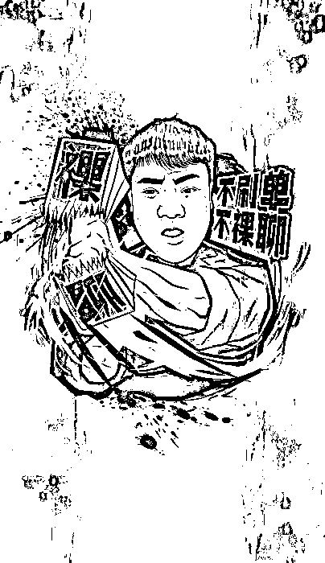
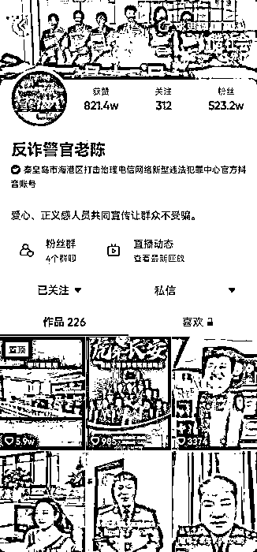

# 不！刷！单！ 不！裸！聊！

> 原文：[`mp.weixin.qq.com/s?__biz=MzIyMDYwMTk0Mw==&mid=2247528926&idx=4&sn=6378991079dd288f35990069ad0ab09a&chksm=97cbbae6a0bc33f08a07b333296ef771677387fa866b199f577778293d58369f178a1baaf7f2&scene=27#wechat_redirect`](http://mp.weixin.qq.com/s?__biz=MzIyMDYwMTk0Mw==&mid=2247528926&idx=4&sn=6378991079dd288f35990069ad0ab09a&chksm=97cbbae6a0bc33f08a07b333296ef771677387fa866b199f577778293d58369f178a1baaf7f2&scene=27#wechat_redirect)

老陈做的反诈宣传图。受访者供图。

“一切违背常规的都是有问题的”

作者：彭宁铃

岁末年关，核酸检测、返程回乡、置办年货，兑积分、发红包、集五福……人们需求多多，活动多多，也成为网络诈骗分子见缝插针的高发时期。

春节期间要警惕哪些诈骗？哪些行为导致风险最大？中新网邀请网红反诈警官“老陈”，讲讲春节防诈的事。

****过年，要警惕哪些诈骗？****

一年一度的团圆节日，返乡离乡，票都抢到了吗？

当心，骗子也盯住了心急的你。

一些山寨购票网站悄然出现，不仅会套取你的个人信息，即使付了钱，也买不到票。

另外，**如果有人自称票务公司客服发来链接，以退票、改签等为由，要求输入身份信息、银行卡号、密码及验证码……一定要打住**，先拨打官方电话核实。

否则，银行卡就可能被洗劫一空。

过年在家，你都有哪些娱乐活动？注意活动中也可能有骗子的阴谋。

拿每年都要参加的“上亿项目”集五福来说，不论是低价售卖福卡的链接，还是邀请扫码加好友、入微信群交换福卡的二维码，都要万分慎重。

老陈提醒，**不明链接中常藏有病毒，一旦点击，便可能被对方获取信息，骗走钱财**。

红包满天飞的春节，还要当心 666 元、888 元等高额红包陷阱。

要知道，微信红包限额是 200 元。能点开高额红包，通常不是植入病毒，就是跳转木马链接。

此外，小心要转发才能领取的伪红包。骗子常会借发红包，进行恶意传播，借此达到引流推广的目的。

　　

资料图：上海市公安局黄浦公安分局破获特大电信网络诈骗案，抓获犯罪嫌疑人 72 名。中新社记者 殷立勤 摄

如今，骗子们也紧跟时事，研发出了新剧本。

就拿近两年来的疫情来说，**有骗子就伪装成疾控中心工作人员，添加用户微信，或拉人入“疫苗接种群”“防疫流调群”，随后在群中发布兼职刷单等诈骗信息**，进而行骗。

还有骗子冒充防疫工作人员，谎称可以快速检测核酸。

判断是真是假，一定要先找官方核实，不能草率。

****这些操作，****

****或让我们陷入最大危险****

那么，当不断变化的诈骗袭来，哪些操作会让我们陷入最大危险？

老陈首先提到，**如果手机和银行卡绑定，点击陌生人发来的链接、据其提示下载 APP，“风险极大”**。

他说，一些链接会直接发送过来，一些链接则会上演大量“前戏”。其由头或是网上交友，或是朋友邀请投资，加入股票群、小电影群，不知不觉麻痹入群者，才放出链接点击。

其次，**对于手机收到的验证码、二维码，都不能轻易透露给他人。**“二维码是一种确认码，扫码等于将确认权交给了别人，因此绝不能乱扫。”

老陈特别提到，屏幕共享也是常见的诈骗手法。

在其处理过的案件中，有人被自称某平台客服的骗子发起屏幕分享，导致手机呼叫转移，被骗走 60 余万元。

老陈提醒：**骗子可以通过屏幕共享，看到我们手机里的一切操作，一旦有人让操作屏幕共享、电话呼叫转移，对方一定是骗子**。

作为一名办案经验丰富的反诈警官，老陈表示，在手段上，上述操作并无特别的风险大小之分，一旦陷入，钱就有“飞”出兜里的可能。

图为陈警官抖音账号截图

****有哪些防诈知识？****

老陈说，随着科技进步，生活改变，诈骗方法也千变万化。但无论是老生常谈的冒充公检法、杀猪盘、刷单、网络贷款，还是利用特殊时间节点的各种活动实施诈骗，如利用集五福活动，都只是诈骗呈现的一种形式，最重要的是拥有反诈意识。

“**贪小便宜吃大亏，天上不会掉馅饼，网络交友要慎重，一切链接认准官方平台**。防骗最重要在于第一步。”老陈说。

首先，一定要对自己有清醒认知。“不论是遇到美女邀请裸聊，还是有人称网络赌博可赚钱，都要先问问自己，我什么样？何德何能，让这位美女(帅哥)平白无故来找你？天上会掉馅饼吗？”

老陈提到，诈骗分子会利用各种非法渠道获取公民个人信息并进行“广撒网”，骗子不止是“剧本家”，也是“心理学家”，更紧跟时事，但只要人们树立正确的三观，懂得生活，自然很难被欺骗。

“**安安稳稳过日子，踏踏实实做人，不要总想(侥幸)搞尝试，尝试后满头都是大包。**”

而对于公民个人信息的泄露，老陈提醒，在交出信息的第一步时，就应树立保护信息的意识。“如果必须交出信息，就要用最少的信息达到目的。比如，留地址时，不要详细留下门牌号等。”

当遇到上述需要点击、扫描、发送链接、二维码、验证码等情况时，脑子里更要绷紧弦，“警惕一切不明链接。”

“不管是什么诈骗方法，不管常见还是新鲜，记住一句话：**一切违背常规的都是有问题的**。”老陈说。

来源：中国新闻网，利箭在行动

← 向右滑动与灰产圈互动交流 →

