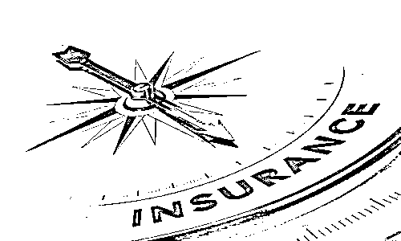
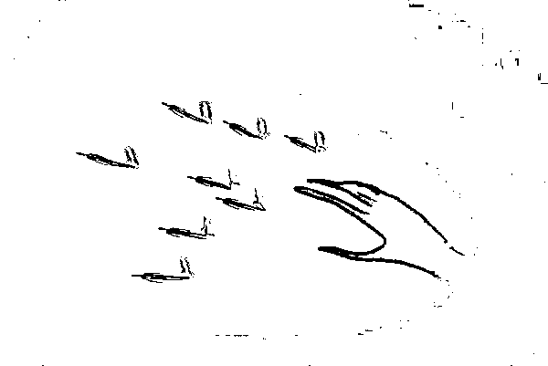
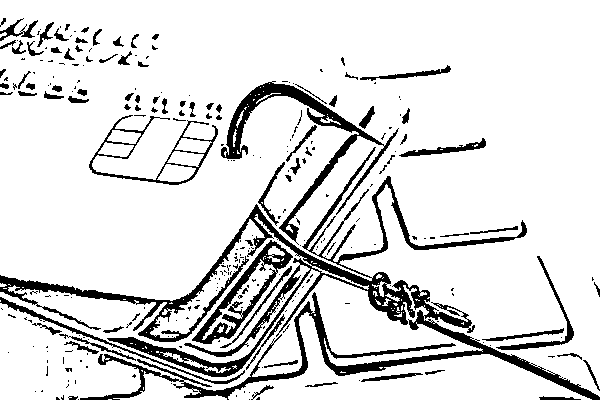
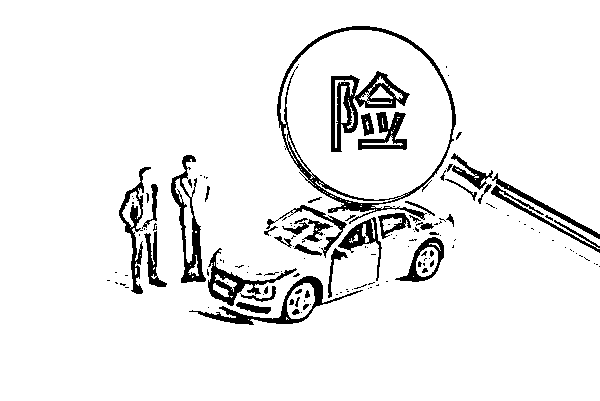

# 骗老人买 240 万保险后业务员代签字……保险业还有多少离谱操作？

> 原文：[`mp.weixin.qq.com/s?__biz=MzIyMDYwMTk0Mw==&mid=2247528926&idx=6&sn=105557a1011186d3c4fa6d4037667a97&chksm=97cbbae6a0bc33f0a81486415fdd221bb5e7acc87e2c3f9cf3d41c0fce3c6efaee26a7312727&scene=27#wechat_redirect`](http://mp.weixin.qq.com/s?__biz=MzIyMDYwMTk0Mw==&mid=2247528926&idx=6&sn=105557a1011186d3c4fa6d4037667a97&chksm=97cbbae6a0bc33f0a81486415fdd221bb5e7acc87e2c3f9cf3d41c0fce3c6efaee26a7312727&scene=27#wechat_redirect)

**照片代替人脸识别、培训课件从源头上误导代理人，交强险从东北到西南地区跨区域承保，招人的保险机构帮着招聘人员学历造假...北京商报梳理发现，2021 年多个“另类”处罚原因颇为吸引眼球。** 

****

**不仅代签字**

**人脸识别也造假**

**2021 年初，有媒体报道，文盲老人买保险花 240 万元，竟是业务员代替签字。一时间引起热议。代理人为了让老人买保险，利用其不识字的弱点，进行欺骗。**

**回顾 2021 年保险业罚单发现，代签仍然“歪风不减”。2 月 9 日，六安银保监分局罚单显示，某保险分支机构代替投保人签订保险合同被警告并罚款 1 万元，三名相关人员分别被罚 10 万元。**

****

**2021 年 12 月 28 日，延边银保监分局对某寿险公司延边朝鲜族自治州分公司保险销售不规范的行为进行了处罚，其中包括未经投保人同意，代替投保人签订保险合同的违规行为。**

**业务员代签的保单是否有效？**

**保险专业律师李滨表示，从法律层面来看，只要保险费是从投保人的账户中进行支付的，就代表投保人有与保险公司订立合同的意思，保险合同是有效的。李滨建议，从消费者的角度来说，要坚持由本人签字。消费者真正了解保险产品之后，再进行签字购买，以保护自己的合法合同权益，避免发生纠纷。**

**2021 年 3 月 17 日，重庆银保监局发布 2021 年第 1 号消费提示：给老年群体的金融消费建议中指出，要求老年人拒绝任何代签行为。**

****

**此外，延边银保监分局罚单显示，某寿险公司延边朝鲜族自治州分公司保险销售不规范的行为还有，保险销售人员协助投保人提供虚假证明材料以及投保人影像识别用照片代替人脸识别。**

**对于规范保险业务员的销售行为，李滨认为，保险公司要设计出平等、公平的保险产品。业务员如果进行夸大，或者不履行对条款的说明义务。由人民法院认定免责条款无效，保险公司承担。赔偿责任公布之后，保险公司向业务员进行追偿，由业务员承担，由其未履行法定义务而带来的损失。如此一来，就会遏制这种违规行为的发生。**

**培训课件藏“猫腻”**

**销售误导再现“朋友圈”**

**2021 年保险业罚单中，因唆使、诱导保险代理人进行违背诚信义务活动的违规行为均发生在人身险业，数量达 12 家之多，从头部险企到中小险企均有该乱象。该类违规行为常见于培训课件，可谓是从源头上“污染”了水质。**

**其中，某大型险企将培训课件虚构、夸大到“极致”。2021 年 4 月 22 日，菏泽银保监分局发布的罚单显示，某险企面向个人保险代理人进行内部培训的课件中，一是使用“第一”“从未被超越”等极限词汇对保险公司经营状况作虚假或夸大宣传。二是使用“全面保障 360°无死角”等表述对保险产品作虚假或夸大表述。三是将正常销售保险产品宣传为限售产品。四是以银行理财产品、存款等其他金融产品的名义宣传销售保险产品。五是宣称“守护百的优势交多少领多少”，隐瞒提前解除人身保险合同可能产生的损失等。**

****

**《保险公司管理规定》第五十三条明确，保险机构应当建立保险代理人的登记管理制度，加强对保险代理人的培训和管理，不得唆使、诱导保险代理人进行违背诚信义务的活动。**

**培训课件存在“猫腻”直接导致了销售误导，而销售误导历来是人身险行业的顽疾，也是消费者投诉的主因。2021 年，数家保险分支机构利用微信朋友圈进行虚假宣传被罚。**

**拒保本地单**

**不惜跨省承保异地**

**2021 年下半年，厦门、辽宁等多地出现拒保交强险的情况引起广泛关注。**

**山东银保监局罚单显示，2021 年 4 月 20 日，客户在某财险公司平阴支公司职场就自卸货车投保机动车交通事故责任强制保险时，某财险公司平阴支公司员工称自卸货车无法购买车险，造成客户未能办理车险（含交强险）业务。**

****

**拒保交强险对营运车车主带来一些影响。上海对外经贸大学保险学专家朱少杰表示，一是交强险到期未续保，不能办理车辆年审、过户等业务。二是脱保交强险的车辆不允许驾驶上路，被交警查处到会予以罚款。三是交强险过期车辆发生交通事故，肇事车主承担全责。**

**险企任性地对交强险“说拒就拒”是不符合有关规定的。《机动车交通事故责任强制保险条例》明确规定，投保人在投保时应当选择从事机动车交通事故责任强制保险业务的保险公司，被选择的保险公司不得拒绝或者拖延承保。**

**“拒保”的另一面，有的险企“热衷”瞄向隔壁省份，也有某保险公司中心支公司承保机动车辆保险业务竟从东北跨到了西南地区。**

**难道是本地承保“不香”，不惜跨省承保？朱少杰表示，车险综改后，交强险开始实施浮动费率，交强险无赔款优待系数的上浮上限全国统一为 30%，下浮下限存在区域差异，最低为-50%。全国共划分为 A、B、C、D、E 五个地区，其中，A 区（内蒙古、海南、青海、西藏）的车主最近三年零事故，可以享受到最低的费率折扣-50%。这是促发很多车险异地投保交强险到 A 区的主要原因。此外，本地险企拒保风险高的运营车，促使其异地投保。**

****

**此外，今年以来，有 6 家保险机构分别因保险销售从业人员入职材料中存在虚假学历证明、未严格审核销售人员学历证书、提供虚假学历证明被罚。除基层营销员学历造假之外，近年来险企高管也屡屡曝出学历造假。在首都经贸大学保险系副主任李文中看来，虽然高学历不等于高能力，但是相关统计分析得出的结论是学历较高的人能力更强的概率会更大。因此很多单位在招聘人员时根据岗位需要设置学历条件。**

**来源：北京商报，巴蜀反诈**

********

**← 向右滑动与灰产圈互动交流 →**

****