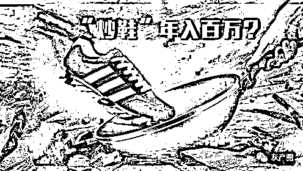
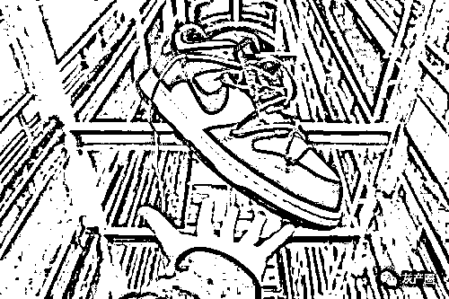

# 央视点名批评：又一行被定义“传销”？不少大学生亏得负债累累

> 原文：[`mp.weixin.qq.com/s?__biz=MzIyMDYwMTk0Mw==&mid=2247528926&idx=7&sn=3c8317f919a181f41010af5842e2344e&chksm=97cbbae6a0bc33f04daa559f46ee960b7ad96ff32d168ed82bc992cc657a423ac6908b735580&scene=27#wechat_redirect`](http://mp.weixin.qq.com/s?__biz=MzIyMDYwMTk0Mw==&mid=2247528926&idx=7&sn=3c8317f919a181f41010af5842e2344e&chksm=97cbbae6a0bc33f04daa559f46ee960b7ad96ff32d168ed82bc992cc657a423ac6908b735580&scene=27#wechat_redirect)

****

各位知道传销吗？说的直白一点这就是一个问人要钱然后教别人如何继续要钱的行业，不管套上了什么样子的外套，本质终归是这样的。传销的危害极大，首先就是会用极端手段控制成员的人生自由，其次会进行洗脑，而且会造成巨大的财产损失。因此国家对于传销的打击是非常严厉的。

不过有人却发现，有一种所谓的商业模式害处堪比传销，而且最重要的是这种所谓的商业模式很多人还意识不到其问题之所在，这就是炒鞋。最终还被央视点名批评，不少大学生亏得负债累累。

炒鞋如何而来，何时兴起？要说炒鞋从哪儿来的，那自然是大洋对面的美国，特别是其国内的两个运动品品牌，在球鞋上搞些什么限量款，联名款，然后发售数量有限，于是很多人最初本着真正对于品牌和球鞋的热爱去排队去摇号，但是随后发现有些有钱人或者爱好者压根不排队，直接等着高价收购，就像是教父一样，给出一个无法拒绝的价格。

这个群体是非常大的，甚至还有人说，十年前错过了炒房的热潮，五年前错过了比特币的热潮，如今不能够错过炒鞋的热潮！

 刘柄酰，一个炒鞋界能够算得上很牛的人，他原本是一个大学生，在大二的时候炒鞋很短时间就赚了上十万元，对于当时的他来说，非常震撼，于是他选择辍学成立了自己的炒鞋工作室，在他看来，这是“创业”。他还在圈内有一个叫做刘饼干的外号，知名度颇广。

诚然工作室刚开始有着相当不错的收益，但是接下来刘饼干就开始有了扩大再生产的想法，他开始不赚一次的钱了，他收了货款，买鞋子，然后卖出去，拿到的货款继续屯鞋，曾经屯款数百万用于买鞋，而不及时发货，但是鞋子并非一直涨价，也会有暴跌的情况出现，暴跌遇到退款，暴涨捏着鼻子发货，这样子他开始逐渐入不敷出，拆东墙补西墙，最后吸引到了上千万资金，被以诈骗罪逮捕。

而这并不是偶发情况，在砸钱到刘饼干的人之中，就有很多和他情况一样，动用了买房的钱，结婚的钱，甚至贷款钱来炒鞋，最后血本无归。

投机行为类似赌博 现在很多鞋贩子还会大量扫货，扫的就是还没有爆红的鞋款，他们觉得外观不错价格也不高，于是大量扫货，把货源从平台，厂家变成自己手中，然后涨价，但是这就是一种赌博，赌自己扫货的鞋子能不能红起来，扫货失败的比原本炒鞋的甚至更多！

虽然现在国内对于这些鞋子的炒作应当会热度有所降低，大多数人对于这些品牌都嗤之以鼻，但依旧有那么些人，想要靠着炒鞋发家致富。当然这一乱象一定会尽快被整治，央视已经发声对这种行为进行了严厉的谴责和批评，鞋子终究是服装的一种，是穿着的需求，不要赋予他们过多的价值，更不要炒鞋，来获取不当的利益，希望各位能够以此为警醒，千万注意不要落入圈套之中。

来源：东郭解读，巴蜀反诈

← 向右滑动与灰产圈互动交流 →

