# 刷屏了！范志毅发声！人民日报：输了不该输也不能输的一场球

> 原文：[`mp.weixin.qq.com/s?__biz=MzIyMDYwMTk0Mw==&mid=2247528993&idx=1&sn=3eab981e0baf82737ec3f7b055bf2ec7&chksm=97cbb919a0bc300f2e3c316455600a2f97fde1fc352540b5fe44acfd5c583c86e77ce29bce4e&scene=27#wechat_redirect`](http://mp.weixin.qq.com/s?__biz=MzIyMDYwMTk0Mw==&mid=2247528993&idx=1&sn=3eab981e0baf82737ec3f7b055bf2ec7&chksm=97cbb919a0bc300f2e3c316455600a2f97fde1fc352540b5fe44acfd5c583c86e77ce29bce4e&scene=27#wechat_redirect)

2 月 1 日晚，农历壬寅虎年第一天，在 2022 年卡塔尔世界杯亚洲区预选赛 12 强赛 B 组第 8 轮中，中国男足 1 比 3 惨败于越南队，彻底无缘 2022 年卡塔尔世界杯。 

国足未能实现赛前“过年期间不给全国球迷添堵”的目标，而面对耻辱性的失败，范志毅又在小编的朋友圈刷屏了。

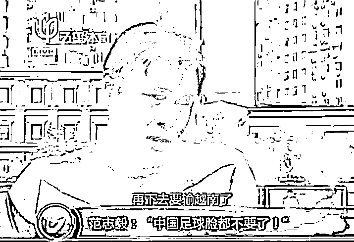

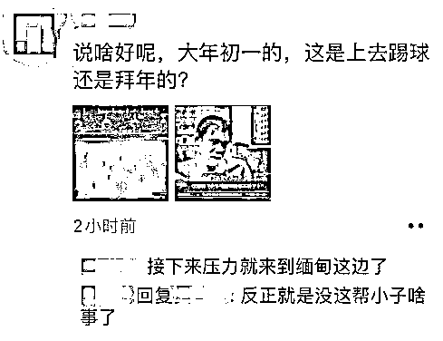

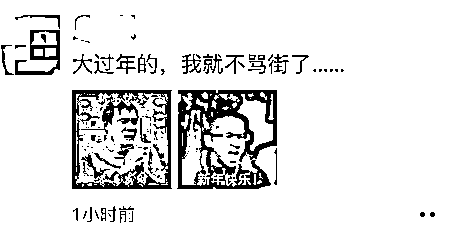

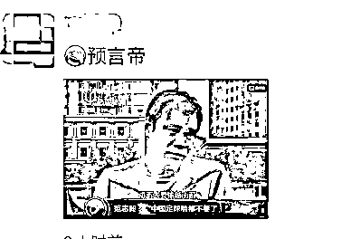

赛后，人民日报体育发表评论指出，“大年初一的世预赛，国足输了不该输也不能输的一场球。”评论称，“我们更愿意看到这是国足知耻后勇的转折点。”

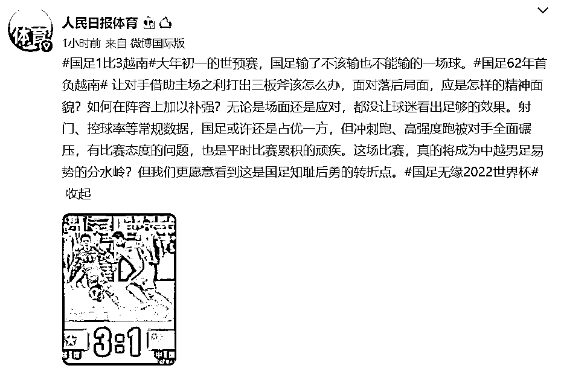

**中国男足 1：3 越南队！** 

## 

**彻底无缘卡塔尔世界杯**

## 

本场比赛，中国队身着白色队服。上一轮停赛的洛国富本场比赛首发，出现在左边锋位置上。

比赛开场前 5 分钟，双方的进攻都显得很沉闷，比赛节奏也略显低沉。坐拥主场优势的越南队，在身体上不占优势，但拼抢积极，多次犯规，侵犯了中国队球员。

比赛第 9 分钟，越南队左路进攻，45 度传中，身材较矮小的越南队员竟然在中国队禁区里头球得分！全场球迷欢呼！中国队 0:1 落后了。

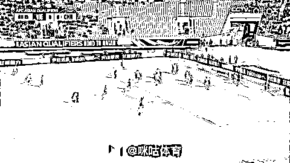

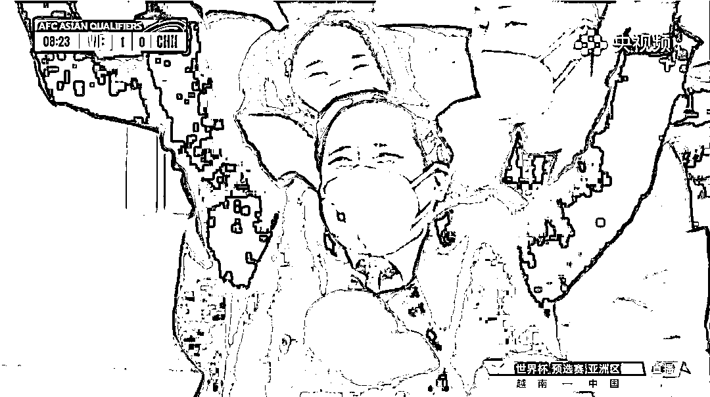

看台上越南总理范明政为越南队进球欢呼

比分落后之后，中国队才开始有一些明显的攻势，但过程显得有些急躁。

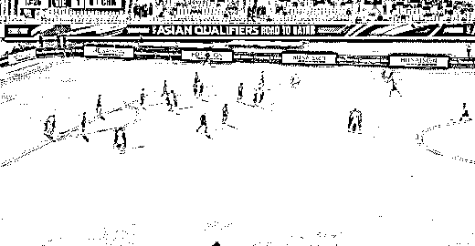

比赛第 15 分钟，越南队在中国队禁区内精妙配合，2:0 领先中国男足。

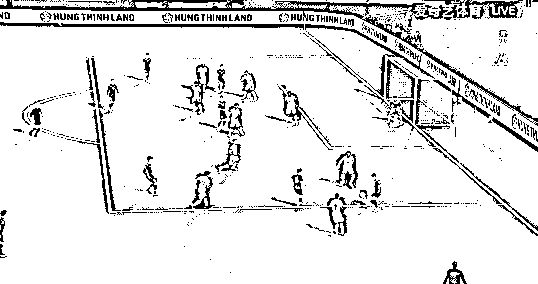

比赛第 22 分钟左右，中国队在反击中形成了一次远射，但没有破门。

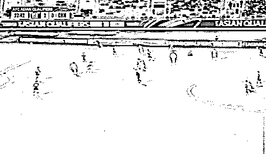

越南队 2:0 领先后，开始回收，以 532 的阵型防守，中国队倒脚很多，机会不多。

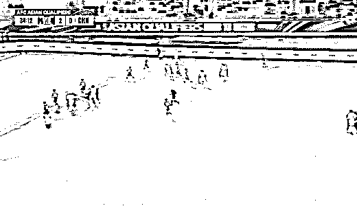

上半场比赛结束，中国队 0:2 落后，微博上球迷已经在提醒：留给中国队的时间不多了。

下半场开始，中国队换上张玉宁、韦世豪意图加强进攻。

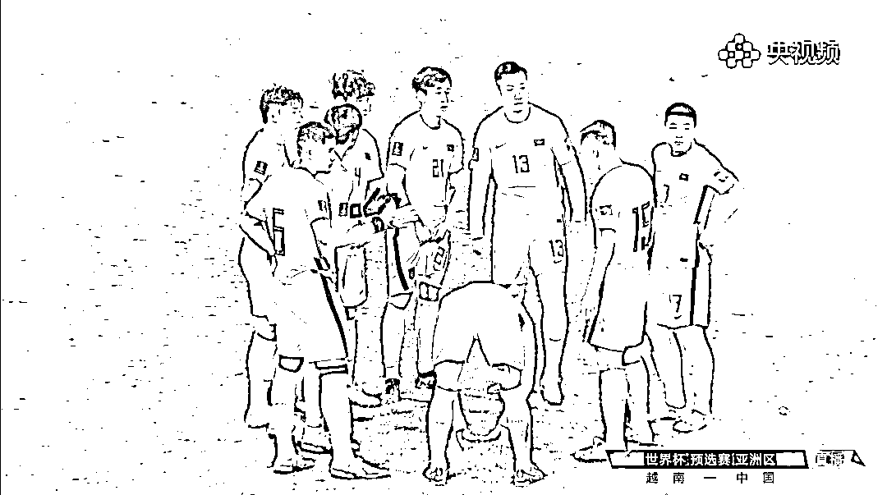

比赛第 48 分钟，中国队前锋张玉宁在禁区内漂亮晃动后攻入一球，但被判罚越位在先。

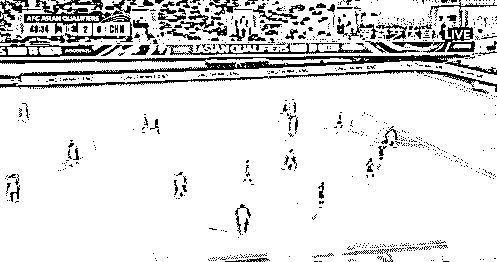

相比于上半场，中国队的进攻明显有了起色，但是始终不能得分。比赛第 67 分钟，中国队又换上于大宝和刘彬彬，试图吹响进攻号角。

比赛第 75 分钟，越南队在反击中一脚远射攻进世界波，3:0 领先中国男足！

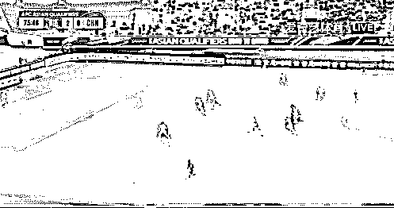

比赛最后阶段，中国队终于攻进一球。

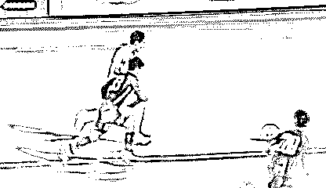

这是 1959 年以来，中国男足第一次输给越南队。

小组 8 场比赛，仅仅拿到 5 分，中国男足已经彻底无缘 2022 年卡塔尔世界杯。

**国足主帅：向所有球迷道歉** 

值得注意的是，比赛期间，中国男足相关话题登上多个微博热搜：

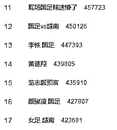

前国足主帅李铁微博甚至成为了球迷们的留言树洞：

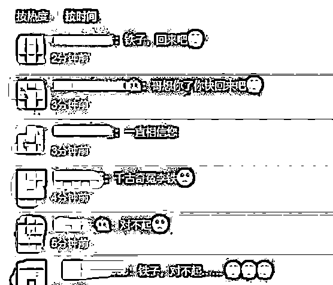

据网易体育，赛后新闻发布会，国足主帅李霄鹏表示，“向所有球迷道歉，输球主要是比赛前设计出了问题。中国足球崛起是迟早的事，但是需要一代一代的努力。”

李霄鹏在总结本场比赛时说：“输球主要是比赛前设计出了问题，后续无法补救，比分无法接受。队员非常尽力，赛前激励过度导致球员情绪非常紧张。”

**范志毅：** 

**中国足球绝对不能再分你、我、他了**

另外，赛后中国足球名宿范志毅在微博发文，称“现在更关键的问题是，我们能不能把足球界的传承重新建立起来，能不能允许别人踩着我们的肩膀走上去。”他还表示：“只有我们率先从小环境入手开始做出改变，中国足球才能重回正轨。最重要的就是，中国足球绝对不能再分你、我、他了。”

范志毅微博全文如下：

足球没有国界，但足球需要仪式感，也需要凝聚力，更需要传承。

现在更关键的问题是，我们能不能把足球界的传承重新建立起来，能不能允许别人踩着我们的肩膀走上去。

要是我们这些人都摆不正自己的位置，那中国足球就真的没戏了；

只有我们率先从小环境入手开始做出改变，中国足球才能重回正轨。

最重要的就是，中国足球绝对不能再分你、我、他了。

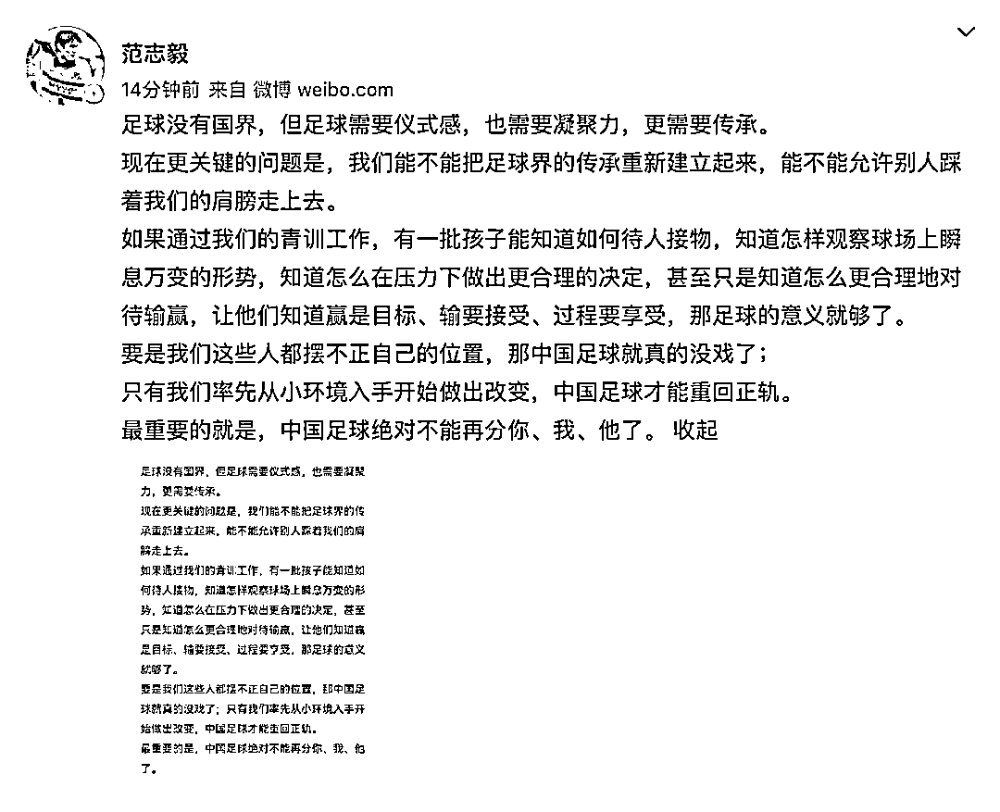

网友想起了经典的国足退钱名场面

[`mp.weixin.qq.com/mp/readtemplate?t=pages/video_player_tmpl&action=mpvideo&auto=0&vid=wxv_2250853916966076417`](https://mp.weixin.qq.com/mp/readtemplate?t=pages/video_player_tmpl&action=mpvideo&auto=0&vid=wxv_2250853916966076417)

来源:每日经济新闻

← 向右滑动与灰产圈互动交流 →

