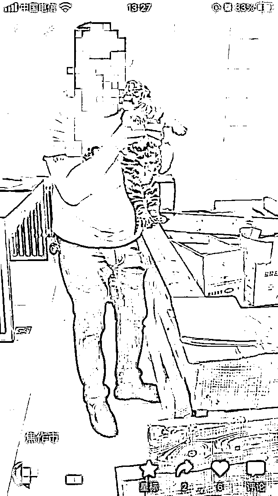
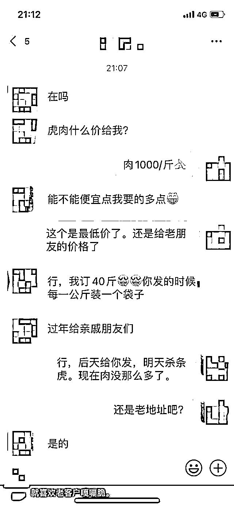
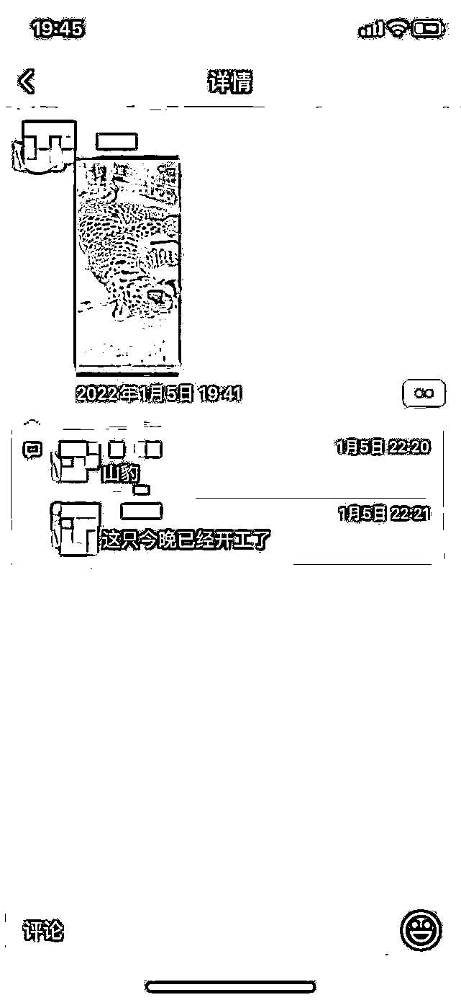
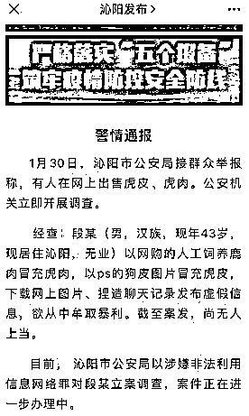

# 虎年卖虎肉？

> 原文：[`mp.weixin.qq.com/s?__biz=MzIyMDYwMTk0Mw==&mid=2247528993&idx=3&sn=bcfad68f3876174fae21985098c11300&chksm=97cbb919a0bc300f3831eeb5ded41a4fd84c85fc65f0a512f0b57dc3ce91c2f6317e4df186e9&scene=27#wechat_redirect`](http://mp.weixin.qq.com/s?__biz=MzIyMDYwMTk0Mw==&mid=2247528993&idx=3&sn=bcfad68f3876174fae21985098c11300&chksm=97cbb919a0bc300f3831eeb5ded41a4fd84c85fc65f0a512f0b57dc3ce91c2f6317e4df186e9&scene=27#wechat_redirect)

近日，网传河南有人售卖虎肉、虎骨、虎皮及金钱豹肉、皮、麝香等制品引发网络热议。河南沁阳市委宣传部 2 月 2 日下午发布消息称，沁阳公安调查发现，涉案男子以网购的人工饲养鹿肉冒充虎肉，以 ps 的狗皮图片冒充虎皮，下载网上图片、捏造聊天记录发布虚假信息，欲从中牟取暴利。案件正在进一步办理中。

近日，有网友爆料称，一位段姓男子疑似在网络上销售虎肉、虎骨、虎皮、及金钱豹肉、皮、麝香等制品。此人在网上展示了疑似虎肉、虎头、虎骨及相关制品的照片，还有虎肉售卖交易聊天截图。在聊天中，买家询问虎肉价格，此人回应称给老朋友的价格是 1000/斤。该买家随后订购了 40 斤，并支付了 40000 元。爆料称，此人的手机号归属地为河南焦作，活动轨迹在焦作、沁阳等地。

“电商无野”志愿者张晓磊告诉北青报记者，近期一位志愿者发现该线索，从段姓男子的朋友圈获取到相关照片及视频后提供给他。张晓磊提供的照片和视频显示，此人在朋友圈中发布了疑似多次处理、交易野生动物相关信息，“给杭州李哥发 3 块虎骨膏，纯度百分之九十九”、“上海夏姐预定虎头两个”、“两个虎心”、“山豹这只今晚已经开工了”。此人还在网络发布了与疑似小老虎玩耍的视频。

“沁阳发布”2 月 2 日下午发布消息称，1 月 30 日，沁阳市公安局接群众举报称，有人在网上出售虎皮、虎肉。公安机关立即开展调查。

经查：段某（男，汉族，现年 43 岁，现居住沁阳，无业）以网购的人工饲养鹿肉冒充虎肉，以 ps 的狗皮图片冒充虎皮，下载网上图片、捏造聊天记录发布虚假信息，欲从中牟取暴利。截至案发，尚无人上当。

目前，沁阳市公安局以涉嫌非法利用信息网络罪对段某立案调查，案件正在进一步办理中。

来源：环球时报、北京青年报、新华社

← 向右滑动与灰产圈互动交流 →

