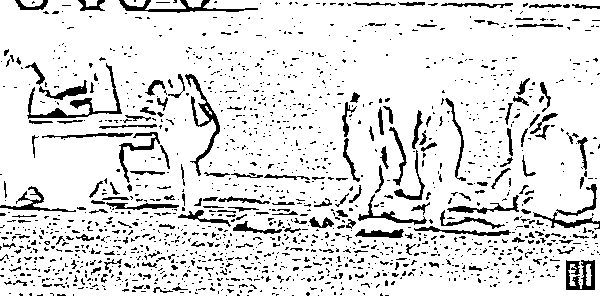
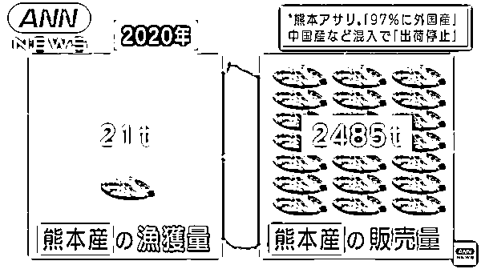
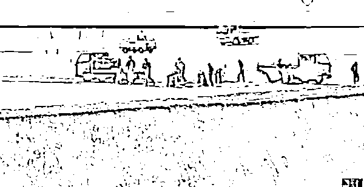
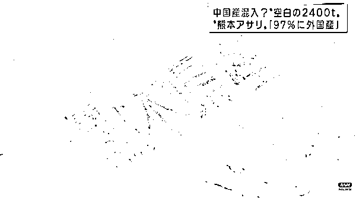
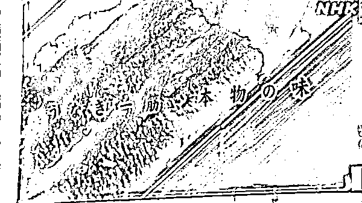

# 中国蛤蜊竟成日本“国产”？伪造方法曝光

> 原文：[`mp.weixin.qq.com/s?__biz=MzIyMDYwMTk0Mw==&mid=2247528993&idx=4&sn=1099580bdadf7daffed1ebd2b90a2244&chksm=97cbb919a0bc300f0ed2df088fe68a12a176a58f84265d9e11d2cb01bb1a8476e7825859adcf&scene=27#wechat_redirect`](http://mp.weixin.qq.com/s?__biz=MzIyMDYwMTk0Mw==&mid=2247528993&idx=4&sn=1099580bdadf7daffed1ebd2b90a2244&chksm=97cbb919a0bc300f0ed2df088fe68a12a176a58f84265d9e11d2cb01bb1a8476e7825859adcf&scene=27#wechat_redirect)

继中国鳗鱼被伪造成日本产，这回又轮到日本蛤蜊产地造假，**将中国、韩国进口的产品伪装成本地产品出售，而这一行为竟然已经延续了十几年！**

据日媒当地时间 1 日报道，2020 年熊本县一共捕获了 21 吨蛤蜊，却在全国卖出了 2485 吨标有“熊本县产”的产品。经过 3 个月的产地确认调查，日本农林水产省发现来自熊本县的蛤蜊产品中有 97%很可能混入了外国蛤蜊，其中中国和韩国产的可能性最高。

至于伪造方法，实在是简单粗暴：**熊本县渔业从业者将从中国进口的蛤蜊扔在熊本的滩涂上再捡****回来，然后中国蛤蜊就变成日本“国产”蛤蜊了……**

截图自日本电视台报道

报道称，日本农林水产省在去年 10—12 月的 3 个月里，以分布在广域地区的 1005 家超市等零售店为对象，通过对未冷冻蛤的销售状况和 50 件产品样品的科学分析进行了产地确认。

调查结果显示，除了北海道和四国的一部分之外，全国的 829 家店铺都在销售国产蛤仔。从地域来看，最多的是熊本县产，占 79.2%，其次是北海道产占 8.5%，爱知县产占 5.9%，有明海产占 5%，外国产仅占 0.9%。

但是奇怪的是，2020 年日本国产蛤仔的推算销售量达到 3111 吨，其中熊本蛤蜊占 2485 吨，这大大超过了这一年该县蛤蜊的年捕获量 21 吨。

截图自日本全日本新闻网报道

多出来的蛤蜊是从哪儿来的？农林水产大臣金子原二郎近日在记者会上表示，在进一步的 DNA 调查分析中，**他们发现 31 件熊本县产商品中有 30 件被判定为“混入外国产的可能性很高”。**

日本电视台在报道中披露，分析结果显示混入的很大可能是中国和韩国产的蛤蜊。此前他们就曾暗访发现，有熊本县渔业从业者将从中国进口的蛤蜊扔在熊本的滩涂上，短期内再将其回收回来，最后标上“熊本县产”出售。

对此，金子原二郎 1 日在记者招待会上表示将与相关部门联手严肃处理此次事件，“食品产地造假会动摇消费者对食品标识的信赖。”

熊本县知事蒲岛郁夫 1 日召开临时记者招待会，要求熊本县渔业协同组合联合会自本月 8 日起，停止熊本县产鲜蛤出货 2 个月，“我认为这（产地造假）是犯罪。已经到了超乎想象的地步。”他强调，如果不立即进行杜绝产地造假的行动，熊本品牌就没有未来。

另一方面，县渔联会长藤森隆美更直言，**其实伪造产地的情况在十几年前就已经存在了，**接下来将全面协助县政府对相关情况进行整改。他表示，这一行动对渔业者来说是生死存亡的问题，“我们将在知事的指导下，团结一致，为消除熊本县产伪造产地而努力奋斗。”

值得一提的是，这不是日本企业或从业者第一次被爆出拿中国产品偷梁换柱当本地产品售卖。

2021 年 12 月，日本岐阜县高山市的批发商“高山水产青果”，**把从中国进口的鳗鱼伪造成日本爱知县生产的鳗鱼在日本出售。**

这家公司在去年 6 月 1 日至 10 月 31 日期间，将中国产与日本爱知县产的鳗鱼、共计 30125 条全部标注为爱知县产，出售给超市、餐饮店等大约 70 家商铺，已查明其中 6640 条为中国产鳗鱼。

事发后，该公司承认，由于本国鳗鱼产量不足，他们至少从 5 年前就开始造假，用中国进口鳗鱼来补货。

仅仅 10 天左右，日本又有一家名为“鳗源”的连锁饮食店被查出将中国产鳗鱼伪装为日本国产。据当地农政局调查，“鳗源”在 2020 年 4 月至 11 月期间，通过多种渠道共贩卖了 16 万份使用了中国鳗鱼的商品，并将产地伪装为国产。

“鳗源”方面对日本农政局解释称，与日本国产相比，中国产鳗鱼更低廉，且鱼身大而柔软，但为了保护店家的形象所以伪装了产地。

来源：观察者网 中央政法委长安剑，巴蜀反诈

← 向右滑动与灰产圈互动交流 →

