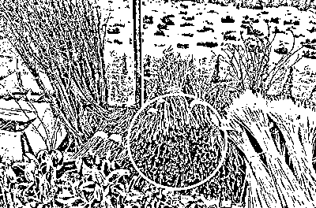
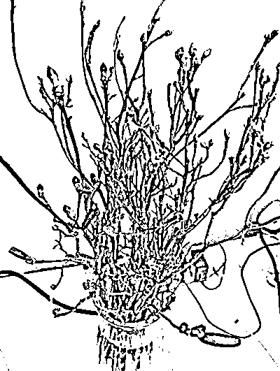

# 又出现了，别再买了！

> 原文：[`mp.weixin.qq.com/s?__biz=MzIyMDYwMTk0Mw==&mid=2247529039&idx=4&sn=e7d98dfe15dd471f563ba61431e4af95&chksm=97cbb977a0bc3061e72a5b6e4a1d6b0d7c0fa2e87bab85ce717ce1382068d536766cb7ab0db1&scene=27#wechat_redirect`](http://mp.weixin.qq.com/s?__biz=MzIyMDYwMTk0Mw==&mid=2247529039&idx=4&sn=e7d98dfe15dd471f563ba61431e4af95&chksm=97cbb977a0bc3061e72a5b6e4a1d6b0d7c0fa2e87bab85ce717ce1382068d536766cb7ab0db1&scene=27#wechat_redirect)

**几根灰暗的枝条** 

**放在水里浸泡一周后**

**花蕾绽放，花朵姹紫嫣红**

**……**

新春佳节，不少人为给家里增添喜庆气氛，可能会购买一些鲜花或干枝进行装饰。殊不知，部分网络平台上售卖的所谓干枝桃、干枝梅，**其实是来自东北地区的兴安干枝杜鹃——国家二级重点保护植物。**而网上的售价最低只要 8 毛钱。 

国家有关部门出于遏制越来越多的疯狂盗采，于 2021 年 9 月开始，将野生兴安杜鹃列为国家二级重点保护植物。科普作家和植物保护专家呼吁消费者睁大眼睛，不要误购网店所售的干枝杜鹃。律师表示，违法采集、售卖者，情节严重可被追究刑事责任。网络平台同样需要负起管理之责。

**三名商家所售卖“干枝花”均为干枝杜鹃**

“网上卖的干枝杜鹃全是山上砍的，千万不要买。近几年的盗采已经让野生兴安杜鹃资源极度减少，没有买卖就没有盗采。”植物保护人士强调。

翟萌萌是一个科普博主，他不断通过网络自媒体平台，传播相关植物保护知识。根据他的提示，记者在多个电商平台搜索“干枝杜鹃”关键词，并没有直接查找到相关结果。但搜索“干枝梅花”“干枝花”等词时，便能看到部分挂着假花名卖真杜鹃的现象。

随后，记者分别从三家平台各选择了一家店铺询问情况，所标价格均为每枝 1 元左右。在得知要批量进货时，商家表示可以优惠，其中最低降至 8 毛一枝。对于花朵开放的时间长短，店方均表示在 10 至 15 天。

在被询问是否能够提供花朵实物图时，三家店铺均不愿意直接提供。在记者再次索要时，其中两个商家提供了“实拍图”，另一商家直接称“没拍”。

听到询问干枝花的来源，三家店铺均表示是由自己培育，却无一家商家愿意提供基地图片。

戏剧性的是，记者直接咨询商家所售是否为干枝杜鹃，称想要批发大量干枝花摆放在店内，但又担心人多嘴杂引起麻烦，三家店铺的态度却截然不同。

**第一个商家立即表示：“别下单，你不需要”。面对追问，该商家直接回复“别联系了”并拉黑了记者。**

第二家店铺则在了解买家提出的担忧后回复“有红梅”“有干枝梅”，在记者询问当前想拍的“雪柳鲜枝”是否为杜鹃时，商家承认是杜鹃，但声称“我们自己培育的”，并向记者保证不会违法。下方的评论中，已购买顾客大多对商品十分满意，并未意识到自己买的就是干枝杜鹃，评论区最常见字样是“物美价廉”“漂亮”“真的开花了”。

另一商家则明确向记者表示出售的是干枝红梅，但商品评论区却有多名顾客反馈表示“收到的和图片不一样，发的是干枝杜鹃不是红梅”。在记者询问是否可以放在店铺内时，店家保证“安全。不会被举报，不会违法”。

经过懂行者辨认，三名商家所售卖的均为干枝杜鹃。

**非法采集售卖野生兴安杜鹃涉嫌违法**

每年冬天临近春节之时，一种号称能枯木逢春、见证奇迹的干枝花就会偷偷摸摸现身于各大网络销售平台。商家给它起了很多个名字，干枝杜鹃、干枝花、干枝鲜花、干枝梅花、干枝桃花……却独独不敢用它真正的名字——兴安杜鹃。即使是在商品详情页，你也看不到它本来的样子。直到翻至买家评论区，你才能看到它本来的样子。

科普博主翟萌萌在接受记者采访前，已经就干枝杜鹃进行过相关知识的介绍。翟萌萌说，商家这么做的目的十分明显，**因为他们十分清楚，非法采集售卖野生兴安杜鹃是违法的。**

在经过了十多年的滥采滥伐、掠夺式破坏后，大兴安岭地区原本资源丰富的野生兴安杜鹃，终于超出了物种所能承受的极限，资源急剧锐减。**2021 年 9 月 7 日，新版《国家重点保护野生植物名录》中，野生兴安杜鹃被列为国家二级重点保护植物。**

翟萌萌说，兴安杜鹃主要分布在黑龙江、吉林、内蒙古等高纬度寒冷地带，每年的生长期仅有三个多月。五六月份开花，七月份结果，期间新枝条萌发生长。到九月，花芽分化结束，开始进入休眠状态。

“兴安杜鹃从种子发芽到植株开花，在人工管理良好的条件下，也要等上 4 至 5 年。”翟萌萌告诉记者，从 2017 年开始，媒体关注到兴安杜鹃遭人盗采一事，网络平台随之进行调整，将相关关键词屏蔽，但一些卖家打着其他干枝的旗号仍在悄悄售卖。“如果真的是人工繁育的植株，卖的时候就没必要躲躲藏藏。”

几天前，翟萌萌在一家花卉市场看到有人售卖两种干枝，一种为干枝雪柳，另一种一眼就被认出是干枝杜鹃。“摊位的卖家也不一定了解干枝杜鹃，对外就说是干枝梅花之类的名字，经我举报后，市场监管部门介入调查，货物被下架。”

翟萌萌说，目前还没有发现国内其他地方的杜鹃花被做成干枝向外出售的，人工繁育成本较高，不可能以极为低廉的价格出售。

****

**野生兴安杜鹃已被列为二级保护植物**

北京骅之韬律师事务所金剑南律师认为：根据《刑法》第三百四十四条以及行政法规《中华人民共和国野生植物保护条例》，前者的条文如下：“违反国家规定，非法采伐、毁坏珍贵树木或者国家重点保护的其他植物的，或者非法收购、运输、加工、出售珍贵树木或者国家重点保护的其他植物及其制品的，处三年以下有期徒刑、拘役或者管制，并处罚金；情节严重的，处三年以上七年以下有期徒刑，并处罚金。”

规定中的“国家重点保护的其他植物”，指的就是列入《国家重点保护野生植物名录》的物种。并且，《电子商务法》明确，电子商务经营者不得销售或者提供法律、行政法规禁止交易的商品或者服务。

根据上述规定，野生兴安杜鹃被《国家重点保护野生植物名录》收入列为二级保护植物，商家非法采集售卖野生兴安杜鹃是违法的，情节严重者要承担刑事责任；电子商务平台经营者有责任对平台内经营者是否有主体资格，销售商品是否合法进行审核。对于一些国家明令禁止销售的商品，平台若不屏蔽、断开链接，就要承担相应的民事责任和行政责任。

最后，金律师提醒，不要购买野生干枝杜鹃，没有买卖，就没有伤害。

****

**过度采集兴安杜鹃导致种群快速衰减**

首都师范大学副教授、植物学博士顾垒接受采访时介绍，兴安杜鹃在国内主要分布于黑龙江、吉林、内蒙古等部分地区，境外在日本、朝鲜、俄罗斯、蒙古也有，是比较常见的物种。

兴安杜鹃为半常绿灌木，就是冬天会落一部分叶子，但可能不会落完，有些叶子会一直留着，早春的时候花蕾绽放。由于花蕾在前一年秋天落叶之前就已经孕育，所以会有干枝采回来泡水就能开花的现象。

顾垒介绍，近些年一些人希望依靠兴安杜鹃发财，由于花色鲜艳受人欢迎，市场上销量巨大，但是缺少人工培育，所以对这种植物的野外种群造成了严重威胁。

“我们判断一个物种是不是濒危，是不是需要保护的时候，不只是看它现存种群大小，还要看它种群变化的趋势。”顾垒说，兴安杜鹃明显是因为过度采集导致种群快速衰减，“为了遏制这种现象，大家建议把它列入了《国家重点保护野生植物名录》。新名录出来之后，应该对采集和交易加强管理。”

对于有商家自称人工繁育一说，顾垒认为，人工繁育就算有，规模也非常小，没法达到大规模供应市场的程度。要是野生兴安杜鹃能卖，谁还会花费金钱和精力去人工培育呢？木本花卉的繁育都会需要很长时间，短期内不会有回报，所以成本会很高。网络平台或者市场上动辄一二十元买到一大束，肯定都是来自没有成本的野外。电商平台一般会进行关键词屏蔽，其实很难杜绝那些眼里只盯着钱的商家，换一个关键词还会卖，“也呼吁有关部门加强打击力度，让不良商家不敢采不敢卖。”

来源 ：北京青年报

← 向右滑动与灰产圈互动交流 →

