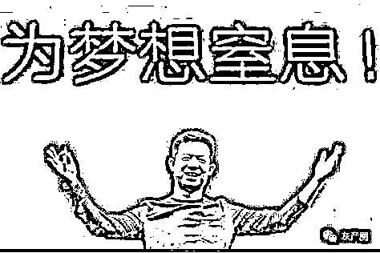
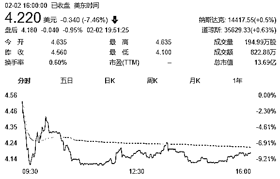

# 贾跃亭在美国也被“打假”！号称 1.4 万辆订单，实际付款仅几百人 ！

> 原文：[`mp.weixin.qq.com/s?__biz=MzIyMDYwMTk0Mw==&mid=2247529086&idx=1&sn=49ff6896ffb945f1470929f8a738d7d9&chksm=97cbb946a0bc30504d6dd3c0ecf40999c881bff21fe15f5ba3896293933330366b49e16f0be4&scene=27#wechat_redirect`](http://mp.weixin.qq.com/s?__biz=MzIyMDYwMTk0Mw==&mid=2247529086&idx=1&sn=49ff6896ffb945f1470929f8a738d7d9&chksm=97cbb946a0bc30504d6dd3c0ecf40999c881bff21fe15f5ba3896293933330366b49e16f0be4&scene=27#wechat_redirect)

美国时间 2 月 1 日，Faraday Future（简称 FF）宣布，公司独立董事特别委员会已完成先前宣布的对不准确披露指控的调查，调查发现，公司投资者声明中存在某些不一致之处以及公司控制和文化方面存在某些弱点，除此之外，对于其他的指控，包括卖空报告中的指控，均没有得到审查证据的支持。

不过，调查发现**FF 在业务合并前的声明中称，它已收到超过 14000 份 FF91 车辆的预订，这可能具有误导性，因为其中只有数百份预订已支付，而其他（总计 14000 份）是未支付的**。

FF 表示，因为公司在控制和文化方面存在某些不足，**前任 FF 董事长 Brian Krolicki 已卸任**，由 Susan Swenson 接任执行董事长。FF 全球 CEO 毕福康，FF 公司创始人、首席产品和用户生态官贾跃亭将直接向 Susan Swenson 汇报，**并且两人底薪均将下调 25%**。

贾跃亭 图片来源：视觉中国（资料图）

与此同时，FF 还将聘请一名首席合规官（CCO），以虚线报告提交给审计委员会主席，并将提高公司合规政策和程序。

**FF91 预订数据虚假**

**董事会大改组，贾跃亭减薪 25%**

2021 年 11 月 15 日，FF 成立独立董事特别委员会，以调查包括 2021 年 10 月 7 日针对 FF 发布的卖空报告在内的有关指控。需要指出的是，因为这些调查，在美股企业第四季度财报纷纷出炉之时，**FF 至今尚未发布 2021 年第三季度财报**。 

如今，特别委员会经过审查，最终得出以下结论： 

1、关于 FF 与 PSAC 于 2021 年 7 月进行的业务合并，某些公司员工向某些投资者描述贾跃亭在公司内的角色的陈述是不准确的，**贾跃亭在企业合并后对公司管理的参与比某些投资者所代表的更为重要**。 

2、**FF 在业务合并前的声明中称，它已收到超过 14000 份 FF91 车辆的预订，这可能具有误导性，因为其中只有数百份预订已支付，而其他（总计 14000 份）是未支付的**。 

3、与 FF 此前就其内部控制中发现的重大缺陷的公开披露一致，FF 对财务会计和报告的内部控制需要对人员和系统进行升级。 

4、FF 的企业文化未能充分重视合规。 

而这些，也并非最终调查结果，FF 表示，公司将在执行主席的指导下，继续进行调查和补救工作，包括是否对公司住房安排及关联方披露进行了不准确的披露。 

针对现有的调查结果，特别委员会提出了多项整改措施建议，并已于 2022 年 1 月 31 日得到 FF 董事会的批准。具体如下： 

1、任命董事会独董 Susan Swenson 为董事会执行主席。鉴于 Susan Swenson 担任执行主席一职，她将退出董事会审计及薪酬委员会。 

2、公司首席执行官 Carsten Breitfield 和创始人兼首席产品和用户生态系统官贾跃亭将直接向 Susan Swenson 汇报，**且两人的年度基本工资均将削减 25%**。 

3、任命 Jordan Vogel 为首席独立董事。 

4、根据新的领导结构，Brian Krolicki 将卸任董事会主席和公司治理及提名委员会主席的职务，成为董事会审计和薪酬委员会的成员，Jordan Vogel 将卸任公司治理及提名委员会的职务。 

5、Scott Vogel 将成为董事会审计委员会、公司治理及提名委员会的主席。 

6、FF 全球资本市场副总裁王佳伟被停职。 

据悉，除了实施上述用于加强监督和公司治理的补救措施外，FF 还将采取如下措施： 

将升级对财务会计和报告的内部控制； 

将根据审计委员会的指示，评估和改进其有关财务会计和报告的政策和程序，并聘请额外的财务报告和会计支持；

将评估其公司住房安排及其关联方披露；将加强对合同和关联方交易的控制，包括定期认证； 

将聘请首席合规官，以虚线方式向审计委员会主席报告，并评估和加强公司的合规政策和程序； 

将为所有董事和高级职员实施全面的培训计划，其中包括公司内部政策； 

副总裁、总法律顾问兼秘书 Jarret Johnson 将从公司离职； 

公司可能会对其他员工采取某些其他纪律处分。 

FF 表示，公司已开始实施上述补救措施，并将根据特别委员会的调查结果，继续评估和实施额外的补救措施。 

同时，2022 年 2 月 1 日，FF 也向纳斯达克市场提交了合规计划，总结了上述调查结果和补救措施，并表示鉴于特别委员会的审查已完成，**公司正努力尽快提交 2021 年 Q3 财报以及修订后的投资者声明**。 

根据 FF 此前披露的数据，其预计 2021 年 Q3 的净亏损为 2.8 亿美元，2020 年同期为净亏损 3300 万美元。截至 2021 年 9 月 30 日，FF 的总资产约为 11 亿美元，其中包括约 6.67 亿美元现金和现金等价物。

**遭遇机构做空，股价半年跌了 70%**

****或还面临集体诉讼****

**据《每日经济新闻》此前报道，2021 年 10 月 7 日，美国投资机构 J Capital Research 发布了一份长达 28 页的做空报告。对 FF 的研发投入情况、投产能力、资本运作表现以及创始人贾跃亭本身进行了多项质疑。**

**做空报告显示，FF 此前承诺在中国和美国五个地点建立 6 所工厂，但是至今这份计划并没有落实。而且 FF 承诺在 7 个月内重新启动并开始生产的美国汉福德工厂也没有什么实质性的进展。对此，**J Capital Research 得出了一项重要结论，认为 FF 公司一辆车都卖不出**。**

**对于美国投资机构 J Capital Research 发布的做空报告，法拉第未来创始人贾跃亭在朋友圈表示，该做空机构言论是冷饭热炒，无稽之谈，并表示该机构已经不是第一次被打脸了。**

**随后，法拉第未来相关人员也特别表示，自上市之后，FF 在产品力提升、产品测试、供应链、生产制造、销售、业务拓展等领域已取得了重大进展，公司有信心在 2022 年 7 月按时交付 FF91。与此同时，针对 J Capital Research 的做空，FF 还专门成立了一个由独立董事组成的特别委员会，以调查相关指控。**

**不过，尽管法拉第未来方面对 JCapital Research 的做空极力反对，但市场似乎已经相信了该机构的调查结果。**

**2021 年 7 月 22 日，FF 通过特殊目的收购公司（SPAC）的途径在美国纳斯达克上市交易，发行价为 13.78 美元/ADS，上市首周即破发。**

**截至当地时间 2 月 2 日收盘，FF 股价报收 4.22 美元，大跌 7.46%，**总市值仅剩 13.69 亿美元，较上市之初的约 45 亿美元市值已蒸发了近 70%，超 31 亿美元（约合人民币约 200 亿元）**，**而乐视网目前市值为 21.14 亿元，也就是说 FF 近一年来已跌去约 9.5 个乐视网**。**

****

**图片来源：东方财富** 

**此前有市场消息称，目前已有律师事务所开始面向投资者征集对法拉第未来的集体诉讼。该律师事务所表示，在此阶段买入其股票，且受到较大损失的，均可通过参与集体诉讼维护自身的权益。**

**来源：澎湃新闻、21 世纪经济报道、每经网、证券时报、每日经济新闻 ，利箭在行动**

********

**← 向右滑动与灰产圈互动交流 →**

****