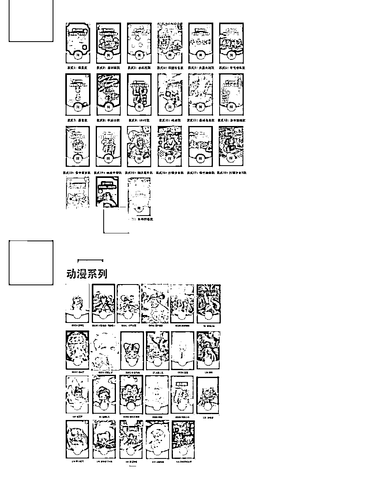
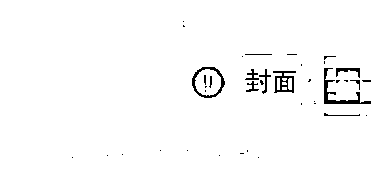
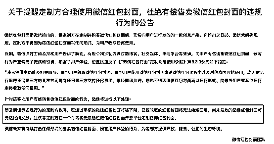
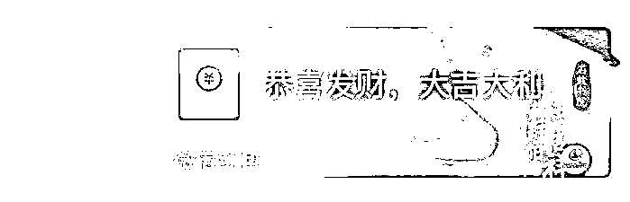
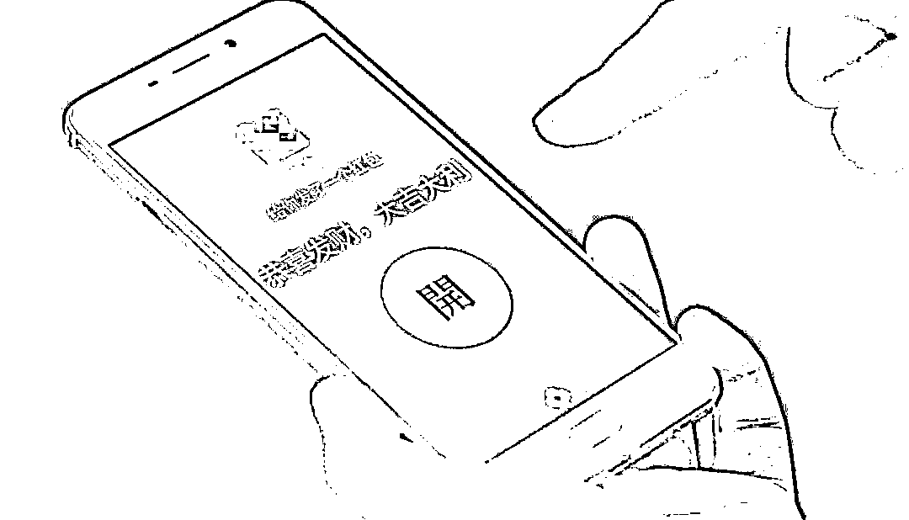

# 假的！假的！

> 原文：[`mp.weixin.qq.com/s?__biz=MzIyMDYwMTk0Mw==&mid=2247529086&idx=2&sn=ef8289b81bb9a373171da6ac4e869345&chksm=97cbb946a0bc30501dedc4fc8ad87a781804886bfc33e55a0dd0db25553504827f86a6ea68b6&scene=27#wechat_redirect`](http://mp.weixin.qq.com/s?__biz=MzIyMDYwMTk0Mw==&mid=2247529086&idx=2&sn=ef8289b81bb9a373171da6ac4e869345&chksm=97cbb946a0bc30501dedc4fc8ad87a781804886bfc33e55a0dd0db25553504827f86a6ea68b6&scene=27#wechat_redirect)

春节期间， 

抢红包是大家最爱的活动之一，

但其中的一些“套路”你了解吗？ 

近日，

警方发布提醒，

警惕这些**“红包”陷阱**！

**这些“红包”都是假的！**

**千万别再点了**

↓↓↓

**-01-**

**小心！**

**微信红包封面骗局**

每逢春节，为了一份特别的红包封面，很多人定好闹钟“蹲点”抢却屡屡落空。这时，不少人想到花钱购买，然而！**有的网友购买“微信红包封面”的时候就被骗了！**

**套路解析**

骗子谎称自己有大量红包封面序列号出售，这时有人来询问，骗子便以几元到数十元不等的价格售卖，交易时骗子又会避开平台，称序列号是虚拟商品，买家必须先款后货。而一旦收到钱骗子便会发去虚假序列号，或者干脆拉黑删人。

**防骗指南**

微信红包封面自推出之日起，微信就有过明确规定，**定制方不得因为微信红包封面而以任何形式向用户收取任何费用。**

**02**

**小心！**

**你收到的可能是假红包**

“假红包”骗局已在网上流传多年，但它却依然是我们日常生活中最容易接触和最容易上当的骗局形式之一。

一方面是因为这些假红包链接差不多都是自己的好友转发，大家心里觉得既然是朋友发的，应该没问题；另一方面是因为骗子还会把假红包链接包装成各种你意想不到的样子，防不胜防。

**假红包套路**

**需要个人信息的红包。**要求输入收款人的个人信息，姓名、手机号、银行卡号的红包，绝对是假的。

**分享链接抢红包。**看到朋友圈分享的红包，比如送话费、送礼品、送优惠券等，点开链接要求先关注，还得分享给朋友的红包。

**与好友共抢的红包。**朋友圈有不少跟好友合作抢红包的活动，要求达到一定金额，比如 100 块，才能提现。

**拆红包输密码。**如果有商家或者朋友发来一个微信红包，点开时却要输密码，那就要警惕了，因为这可能是假红包。

**分享假红包有什么影响？**

很多假红包链接分享到朋友圈以后，会变成垃圾营销广告，点开来看都是一些不堪入目的黄色小说和引导关注付费的二维码。

还有一些假红包链接的页面包含着欺诈陷阱，利用优惠充值话费、付运费送手表、送礼物等借口进行骗钱。

假红包链接中还可能捆绑恶意软件、木马病毒，点击后会跳转至钓鱼网站，除了窃取个人信息，甚至可能会直接盗取我们的个人资金。

有一些假红包在提现时要求必须填写个人信息：姓名，电话号码，家庭住址，身份证号码，甚至是银行卡号；根据用户的分享，还可以获得用户关系网络等信息。而这些隐私信息的泄露，很可能会带来安全隐患。

**03**

**小心！**

**红包神器、红包外挂有风险**

现在有一些渠道会售卖所谓的“抢红包外挂”“秒抢红包软件”，这些所谓“神器”存在很大安全隐患。

**1、隐私泄露**

抢红包外挂软件属于官方明令禁止的软件，是难以获得安全认证的灰色软件。在帮助用户抢红包的同时，不少红包外挂软件还会植入恶意代码，试图获取用户的银行卡账号、手机联系人等机密信息。一旦用户允许软件获取这些权限，后果不堪设想。

**2、电信诈骗**

郑女士上网搜索“红包外挂软件”，随手加了页面上一个微信号。对方同意后，询问对方有没有抢红包软件，对方告诉她有，只要打开软件运行，不费力气就能抢到最高金额，不过需要收取 750 元费用。

郑女士十分心动，当即扫描对方发来的二维码，付了 200 元订金，然后根据对方指示又付了 550 元。随后对方又以保证金、服务费、开通费为借口，要求她继续汇款。“我已经付了这么多，如果不按照他们要求汇款的话，这 750 元就打了水漂”，郑女士不甘心“半途而废”，前后加起来共汇了 6 次款，总计 3210 元后才发现被骗。

**3、法律风险**

目前在法律层面，具有抢红包功能的外挂软件，其行为触犯《刑法》第二百八十五条第三款，涉嫌提供侵入、非法控制计算机信息系统程序、工具罪之规定。

再次提醒大家，

****真红包拆开后****

****资金会自动进入零钱账户，****

****没有自动进入零钱账户的****

****都是假的!****

****需要你输入信息和密码的****

****更要提高警惕！****

**来源：芒果都市、青岛日报、青岛网警巡查执法、科普中国、长沙晚报** 

********

**← 向右滑动与灰产圈互动交流 →**

****