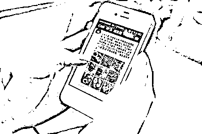
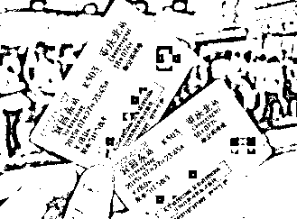
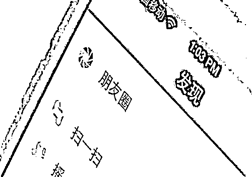
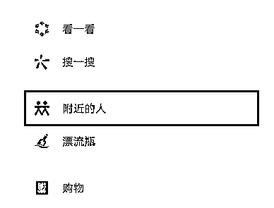

# 春节期间，千万别把这些东西发到朋友圈！

> 原文：[`mp.weixin.qq.com/s?__biz=MzIyMDYwMTk0Mw==&mid=2247529086&idx=3&sn=0e09a872e0e1bd141c550b65185be7fb&chksm=97cbb946a0bc3050d0086dc69823db2a701cd94bc9b9c629a9e67eeceef3af9a87bd8e13fae9&scene=27#wechat_redirect`](http://mp.weixin.qq.com/s?__biz=MzIyMDYwMTk0Mw==&mid=2247529086&idx=3&sn=0e09a872e0e1bd141c550b65185be7fb&chksm=97cbb946a0bc3050d0086dc69823db2a701cd94bc9b9c629a9e67eeceef3af9a87bd8e13fae9&scene=27#wechat_redirect)

也是朋友圈里

各种“秀、炫、晒”的高峰期

但你知道吗？

有些看似无意的举动

可能会

**泄露个人的相关信息**

**如果被别有用心的人看到、利用**

**将造成家中或个人财物损失**

**甚至危害自己和家人的人身安全**

****

**那么**

**玩手机、晒照片究竟有哪些禁忌？**

****01**********不留神泄露隐私惹灾祸******

********◆ 不要晒火车票、飞机票、登机牌********

******很多人出差、旅游都喜欢拍下火车票、登机牌等，发到朋友圈里晒一晒。一些自我保护意识强的人会将姓名进行模糊处理，但票面上的内容却未曾留心。******

******需要特别提醒的是，机票和火车票的**条形码或者二维码含有乘客的个人信息**，包括身份证号等，有被人利用高科技窃取个人信息的可能。******

********

****所以，为了安全，登机牌既不能晒，也不能随意丢，最妥当的处理方法就是撕！****

******◆ 不要晒护照、家门钥匙、车牌******

******含有这些信息的照片会透露你特定时间所处的特定位置，也会透露你的生活圈范围。******

********◆ 不要晒位置********

******春节期间大部分人会回老家。******

******如果在朋友圈里发布了带有位置信息的图片，将会暴露非常真实的个人信息，使坏人的作案成功率直线飙升。******

********◆ 不要晒孩子照片及姓名********

******在现实中，很多骗子与被害人素不相识，如何能将孩子和妈妈的名字叫出来？还能有两人的照片呢？原因就在于微信中“附近的人”这个设置。******

******爱晒孩子照片的父母们，不妨限制一个分享的范围，以分组的形式分享给亲人看。******

********◆ 不要晒家中老人照片********

******晒家中老人的照片，会让坏人有更高的几率把他们认出来。如果有人突然对老人说出他孙子的姓名，再附加任何一条谎言，都能轻易让老人掏出半辈子积蓄。******

************

********02****************日常行为习惯需警惕********

********◆ 对于平常外出********

******尽量不要泄露日程、行踪等信息，以防盗贼借家中无人时行窃。******

********◆ 对于节假日旅游********

******如遇人群拥挤、道路堵塞、发生交通事故等问题，在没掌握真实情况前不要盲目散布、转发。******

********◆ 对于女性********

******贵重饰品、名牌包等少“晒”为宜，以防他人心生歹意。******

********◆ 对于情感问题********

******有关情感上的牢骚类信息也应少发，既容易引起不怀好意的人注意，也有损人际关系。******

********03****************手机使用窍门请掌握********

********◆ “附近的人”请关了********

******微信上“附近的人”的功能，可定位你的位置。可依次点击**“设置-通用-发现页管理-附近的人”**选择“关闭发现页的入口”。******

********

******◆ “允许搜索”请关了******

******在微信“隐私”中，关闭“通过 QQ 号搜索到我”和“可通过手机号搜索到我”。******

********◆ “允许查看”请关了********

******在微信“隐私”选项中**关闭“允许陌生人查看十条朋友圈”**。******

******◆ 手机丢了莫慌乱******

********致电运营商（中国电信 10000、中国移动 10086、中国联通 10010）挂失手机号；致电银行冻结手机网银；解除支付宝 95188；解除微信 110.qq.com。********

****来源：黑龙江交通广播、贵州教育发布、潇湘晨报  ****

********

****← 向右滑动与灰产圈互动交流 →****

********