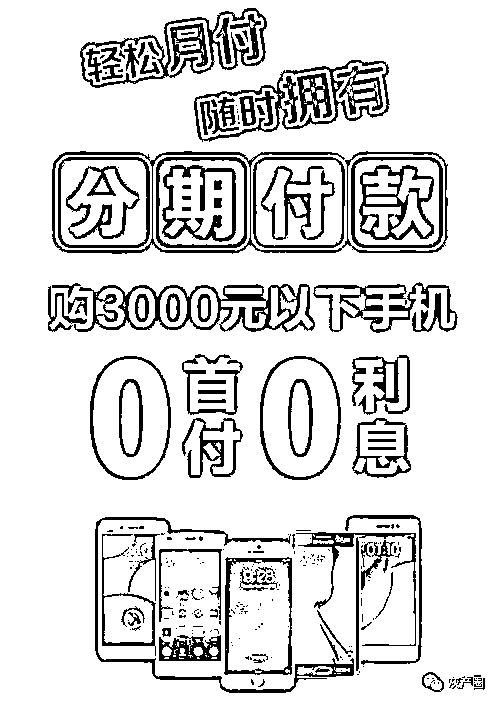

# “零首付用新机”，却因无力偿还租金被起诉

> 原文：[`mp.weixin.qq.com/s?__biz=MzIyMDYwMTk0Mw==&mid=2247529086&idx=4&sn=f0134afb54abf27f8da8162b4d492640&chksm=97cbb946a0bc30509776567fa4ab659c00d3ceeda918664c5a07f21526b07a77a23efef1f0d9&scene=27#wechat_redirect`](http://mp.weixin.qq.com/s?__biz=MzIyMDYwMTk0Mw==&mid=2247529086&idx=4&sn=f0134afb54abf27f8da8162b4d492640&chksm=97cbb946a0bc30509776567fa4ab659c00d3ceeda918664c5a07f21526b07a77a23efef1f0d9&scene=27#wechat_redirect)

****

## 

● 有消费者投诉称，在线下店铺或线上平台购买手机时被商家诱导办理以租代购业务，陷入消费陷阱。投诉者中，不少是未成年人

● 在购买或者换新黄金首饰过程时，存在诱导购买一口价黄金的情况。对一口价黄金，一些商家不仅没有告知兑换规则，也没有明确标记首饰克重等

● 近年来，美容领域一直是套路消费者消费的重灾区，主要包括以免费体验为噱头将女性骗入美容院强买强卖、虚假宣传、洗脑办卡、花钱无效果等

 回想起去年“买”手机的一次经历，来自贵州贵阳的学生李欣（化名）直言就是一场噩梦。去年 4 月份，她去当地一手机经销店购买一款价格为 3000 元的手机，店员一通忽悠，让她落入了以租代购的陷阱。

她告诉记者《法治日报》记者，店员鼓动她在某电商平台上下单“买”这部手机，称可分 12 期付款、享受低息优惠。她匆匆签了购买协议，当天支付了 1140 元，以为今后每个月只需要支付不到 200 元，没想到今后每个月都要支付 490 元。

“后来我才知道，这手机是以租代购，当时我付的 1140 元，其中 650 元是押金，490 元是租金，以后每月都要支付 490 元租金，满 12 个月手机才归我。这么算下来，这手机的价格远远超过 3000 元。”李欣说，在又交了 5 个月租金共计 3590 元后，她还不上钱了，被电商平台催账，称要致电她通讯录里的人进行催收，这让李欣压力倍增。

这并非个例。在黑猫投诉平台上，近期有一批消费者投诉称，在线下店铺或线上平台购买手机时被商家诱导办理以租代购业务，陷入消费陷阱，其中针对上述电商平台的相关投诉就达 643 件。投诉者中，不少是未成年人。

实际上，生活中类似的消费套路还有很多，消费者一不小心就可能陷入其中，损失财产、影响平静的生活。那么，常见的消费套路有哪些？消费者又该如何预防和维权呢？近日，记者进行了调查采访。

零首付购买新手机

无力偿还租金被诉

记者调查发现，像李欣一样在该电商平台租手机的未成年人还有不少。他们中的一些人在投诉中称，自己根本不知道什么是以租代购，还以为是在分期付款买手机。其中，部分未成年人由于无能力偿还租金，还被该电商平台起诉。

2020 年 11 月 21 日，刚满 16 周岁的李龙（化名）就被手机店店员诱导在该电商平台租了一部手机。刚来到广东东莞时，李龙的手机不小心摔坏了，正好看见一手机门店上贴着“零首付分期付款买手机”的宣传海报，于是就上门咨询。

当天，李龙挑选的手机售价不到 3000 元。按照店员的介绍，他以为是 3000 元分 12 个月还，于是就爽快地签订了合同。殊不知，一个月要还 520 元租金。反应过来后，他认为自己被骗了，于是还了一个月之后就没有再还了。

目前，加上违约金等，他一共欠该电商平台 10571.08 元。

直到收到法院开庭通知书后，李龙才明白了什么是以租代购。

记者登录该电商平台公众号，发现一个“随心租”的价格表，有的需要首付，有的则不需要首付。月租金价格在 301 元至 515 元之间，主要根据手机型号和内存而异。例如，一款官方售价 2600 元的某品牌手机，8+256G，手机首付金额为 0 元，月租 500 元。

之后，记者下载了该电商平台手机 App 发现，若需申请租手机，需要先进行实名认证，并上传手持身份证的照片。申请审核通过后，需要在 24 小时内进行合同签约，合同签约后可在门店按申请机型进行取货；如果选择物流发货的话，平台将会在两个工作日后发货。

为进一步了解情况，记者打电话咨询了该电商平台的客服。客服告诉记者：“产品在租赁期间只有使用权，可以选择租 12 个月或者 9 个月，所有租期的租金全部付完后。我们将手机的所用权赠予用户，手机就是你的了。”

其间，客服多次确认记者是否第一次租机，称如果是的话，需要提供姓名、住址以及工作单位。客服还表示，如果没有稳定工作，现在不予办理租赁业务，避免出现无法付租的情况。

那么，相关电商平台到底能否向未成年人提供以租代购服务呢？

对此，北京云嘉律师事务所副主任赵占领认为，以租代购这种模式并不违法，主要看其在操作过程中是否存在违法行为，比如，是否存在虚假宣传，或者违约金过高的情况。假如违约金过高，消费者与之发生纠纷后可以要求法院调整违约金数额。

在中国人民大学法学院教授、中国法学会消费者权益保护法研究会副会长兼秘书长刘俊海认为，以租代购平台有义务准确完整地告知消费者这个商业模式的详细信息，比如什么是以租代购，究竟是租赁还是购买，还是租赁转成购买等。

“如果受到欺诈，未成年人、家长或者其他监护人都可以依法维护权益，要求解除合同，商家必须退回已收取的费用，并承担相应的赔偿责任。”刘俊海说。

“以租代购平台将业务瞄准 16 到 18 周岁之间的未成年人，这不单是一个消费者权益保护的问题，实际上还是未成年人权益保护的问题。”中国政法大学传播法研究中心副主任朱巍认为，以租代购不适合面向未成年人开展业务，如果非要向未成年人开展业务，也应该得到监护人的书面同意才可以。同时，相关部门应该对以租代购平台的租金进行审核监督，以免平台设定的租金远超过产品本身的价值。

销售全程拒绝称重

一口价黄金被质疑

 今年春节返乡前，陈明（化名）去深圳某商场一家黄金饰品店购物，店员推荐了一款一口价黄金手镯，价格为 9672 元。在购买过程中，店员拒绝称重。购买以后，陈明觉得手镯的重量很轻，于是去门店申请复称，仍被拒绝。最后他去附近的金店称重后得知，这个手镯才 9.07 克，相当于 1 克黄金售价 1000 多元。

“就算有加工费，也不至于这么高吧！”陈明直言后悔。

无独有偶，2022 年 1 月 1 日，深圳市民林湘（化名）看到深圳某商场的一家门店正好搞活动，于是打算去买一对金戒指。最后，林湘花 8000 多元买了一对原价为 9000 多元的一口价黄金戒指，回家一称仅有 10 克，每克价格几乎是市场金价的一倍多。

一开始，林湘原本想购买按克计价的足金，但在这家门店里，按克计价的黄金戒指的款式仅有四款，而剩余的都是一口价黄金戒指。“按克计价的黄金戒指款式太少了，一口价黄金戒指款式新颖，不自觉被吸引过去，哪料到是这么大的‘坑’。”林湘说。

林湘回忆称，当天该门店的店员一直在引导她买一口价黄金，说“这些一口价黄金款式新，硬度和色泽都好且不容易变形，买首饰戴起来好看最重要。现在市场金价不稳定，买按克计价的足金也不保值。如果真的想用来做投资，你去银行买金条好了”。

当林湘看中购买的那款一口价黄金戒指后，询问了克重和加工工艺，但店员拒绝告知，表示一口价黄金是按定价出售的，购买时不可以称重，也没有告知使用了什么工艺。

在店员的言语引导下，林湘最终还是购买了这对戒指。

“作为消费者，我应该有权知道产品的具体信息，包括克重和加工工艺，但在购买的过程中，店员对商品信息却有所隐瞒，还把戒指的价格吊牌回收了，也没有相关的产品质量报告证书，我觉得很不正规，可是只能自认倒霉了。”林湘说。

“后来我看了一些知名品牌的金店，一口价黄金都标明了克重以及具体工艺费，可以在了解详细信息之后再购买，我觉着只有这样才能保证消费者的自主选择权。”林湘说。

除了林湘，还有很多消费者在第三方投诉平台上反馈在购买或者换新黄金首饰过程时，存在被诱导购买一口价黄金的情况。在购买兑换一口价黄金的过程中，不仅没有告知一口价黄金兑换规则，也没有明确标记首饰克重等。

在购买黄金等贵重饰品的过程中，店员能否拒绝告知商品的详细信息呢？

朱巍告诉记者，消费者在购买商品时具有知情权。按照产品质量法和消费者权益保护法，在购买贵重金属时，克重以及质量保证书是必须要有的。如果缺少这两样东西，让消费者以盲盒的方式购买商品，就是一种典型的欺诈行为。

“消费者在购买贵重金属时享有知情权，包括了解克重、工艺、兑换规则等。如果店员拒绝告知相关信息，则侵犯了消费者的知情权、选择权和公平交易权。”刘俊海提醒道，消费者应该学会明明白白看广告、认认真真签合同，淡定从容存证据、依法理性去维权。

以免费体验为噱头

诱导客户办卡消费

近年来，美容领域也一直是套路消费者消费的重灾区。

记者在某社交平台输入“美容院骗局”，立刻就能检索到很多网友分享的被美容院套路的帖子，在帖子下方的评论区能找到很多有相同经历的受害者，他们被骗的金额在几百元至几万元不等。

在黑猫投诉平台上，输入“美容院”，相关的投诉记录多达 912 条，具体投诉理由包括但不限于以免费体验为噱头将女性骗入美容院强买强卖、虚假宣传、洗脑办卡、花钱无效果等。

记者调查发现，不少爱美人士是这样落入美容院的套路的：在地铁口、商城被推销人员拦下来，领一张免费的体验券或是到店领礼品，帮他们完成一个任务，年轻的女孩多数出于善良伸出援手，没想到却落入了消费陷阱之中。

2021 年 12 月 14 日，UP 主“给我一个镜头 V”发布了一条暗访广州岗顶一所美容院的视频，记录了进店之后服务人员是如何诱导其消费的。

一开始，UP 主在街边收到免费领礼品的礼品券后，走进了该美容院。其在路上还多次询问推销人员是否免费，进店后服务员要求其登记姓名、电话，然后对其进行皮肤检测，再根据皮肤状态赠送相关产品。

当 UP 主进入一个房间之后，服务员说“我们这边是有消费的”，随后在他脸上涂上一种很油的精华液，表示如果几分钟后皮肤吸收了就证明皮肤状态好。然后又用一个所谓的皮肤透析仪在他脸上涂了一圈，说“如果皮肤变黑，就表示皮肤垃圾毒素多，要深度清洁”。涂完之后，UP 主的脸变得暗黑。

一位店员进来说道：“这个透析原价 898 元，现在特价 198 元，要求其签字下单。”技师这时又拿出一个原液说：“涂在脸上，几分钟后黑色变浅就不用精华液了。”其间，技师和店员不断地推销，要求其购买产品。

随后，他带着被涂黑的脸直接出去，在附近某快餐店里用洗面奶洗掉了。

UP 主表示自己之所以不购买产品，就是想知道导致脸变黑的到底是什么，清水是否能洗掉。后来他咨询业内的朋友才得知，技师在其脸上涂的是竹炭类的物质，用普通湿巾和洗面奶都可以洗掉。而很多消费者真以为变黑是脸上的毒素，于是被美容院进一步诱导消费。

对此，刘俊海认为：“美容院的强买强卖等行为，侵犯了消费者的选择权和公平交易权。”

朱巍表示，美容院的强制消费侵犯了消费者的知情权、公平交易权和自由选择权，有时甚至还可能侵犯人身自由权，因为他在你脸上涂上产品后，你要不付钱的话根本无法离开。

“如果美容院未经消费者允许直接使用产品，消费者可以事后主张退费，或者主张合同无效，市场监督管理部门也应该对这种强买强卖行为进行严厉查处。”朱巍说。

“希望消费者树立理性消费、科学消费、文明消费的理念，不要被一些美容院的办卡优惠活动所迷惑。”刘俊海提醒，如果美容院强买强卖，可以让法院进行确认并请求撤销合同，把卡内的余额退还给消费者；如果存在欺诈，商家还要承担三倍的赔偿。

来源：新华网财经，巴蜀反诈

← 向右滑动与灰产圈互动交流 →

