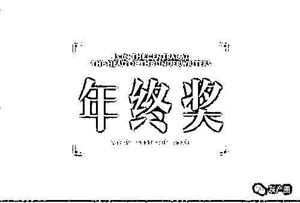

# 看好你的年终奖！荐股电话骗局大曝光：拉"猪"进群奖 160 元/人，引诱客户装上假 APP，然后截走炒股资金…

> 原文：[`mp.weixin.qq.com/s?__biz=MzIyMDYwMTk0Mw==&mid=2247529086&idx=5&sn=0f46c048b358eaa9f4ab94fabd354932&chksm=97cbb946a0bc30500b6b689ef03c481b59429b3b1088f0b1e5f46d918e5e96ffff3108f9dc9e&scene=27#wechat_redirect`](http://mp.weixin.qq.com/s?__biz=MzIyMDYwMTk0Mw==&mid=2247529086&idx=5&sn=0f46c048b358eaa9f4ab94fabd354932&chksm=97cbb946a0bc30500b6b689ef03c481b59429b3b1088f0b1e5f46d918e5e96ffff3108f9dc9e&scene=27#wechat_redirect)

**看好你的年终奖，别被荐股电话骗了。**

“**喂，您好，我们是 XX 证券的，这边有几只牛股想推荐给您！”类似的电话是不是经常接到？免费送牛股，竟有这等好事**。近日，湖北省黄梅县人民法院的一份刑事判决书，详细揭开了这一套路背后的骗局。

**几个 95 后年轻人，临时组成一个小团队，在临时的办公场所开始行骗。他们从“上线”处，以 1.5 元每条的价格拿到“料”（客户个人信息），然后开始打电话诱骗“猪”（客户）入“猪群”（微信荐股群）。每成功拉 1 个客户进群，他们就能从“上线”处获得 160 元的提成。同时，他们也发展自己的“下线”，“下线”每成功拉一人进群，得到的提成是 90 元。**他们赚了中间的差价。

荐股群的人数也有讲究。**他们会按 30%的比例来安排“托”，也就是“水军”。“因为如果一个微信群里真的客户多了，容易出事。”客户进群后，群里的“老师”会以牛股、涨停股等方式，诱骗客户下载虚假的炒股 APP，从而骗取钱财**。

他们拉客户十分具有针对性，会根据“上线”给的“料”来冒充某证券公司的客服。比如客户是 A 证券公司的客户，他们就打电话冒充是 A 证券公司的客服。他们已从“上线”处获得 38 万余条客户，通过拨打电话成功诱骗他人进入事先设计好的虚假微信群 5.8 万余人。至于“料”最终从哪来，判决书里没提及。

拉“猪”进“猪群”，每个提成 160 元

2021 年 3 月至 5 月期间，犯罪嫌疑人倪某（刑拘在逃）分别邀约、雇请被告人徐某等 5 人与其共同从事电信网络诈骗活动，**并以 1.5 元/条的价格向被告徐某等 5 人出售“料”（公民个人基本信息资料，包括公民的姓名、电话号码以及证券公司）**。以某酒店房间为电信网络诈骗工作场所。

**被告人以冒充证券公司客服人员的虚假身份，通过逐个拨打电话的方式，使用专业诈骗话术，将客户拉入由倪某提供的虚假证券投资类股票微信群内，俗称****“猪群”****。再由事先安排好的，冒充的金牌讲师对被拉入微信群的人员进行诱骗投资诈骗，俗称“****杀猪盘”。**

为获得更多非法利益，扩大业务量，被告除自己拨打诈骗电话外，还通过 QQ、微信招募人员帮助其拨打电话，诱骗他人加入微信群。期间，被告人招募大量人员及“水军”诱骗他人进入微信群。每诱骗一人入群，他们就可从“上线”倪某处获 160 元的提成。如果客户是由招募来的人员拉入群的，被告会按 90 元每人的价格支付给招募人员，赚取中间的差价。

案发期间，被告招募兼职人员接受“上线”提供的电话号码（“料”）38 万余条，通过拨打电话成功诱骗他人进入事先设计好的虚假微信群 5.8 万余人。已查明的诈骗金额超 500 万元。

**被诱骗装上假 APP 炒股******

****为更好还原事实过程，选取了受害者以及被告的陈述。以下是两名被害者的陈述（均为第一人称的方式）。****

****被害人张某 1 的陈述：**2021 年 4 月初，我接到一个陌生电话，对方称是****“东方财富”****的客服人员并让我添加一个微信群，随后群里的客服助理就将我拉到了另一个企业微信群“富达学院内部 VIP888”，**我就联系了里面的老师。****

****5 月 14 日，群里的老师徐长川就给我推荐了一只次新股，并称该股票未来会有五六个涨停板，我当时就心动了，但对方老师徐长川称想要购买该新股必须通过他们提供的平台***才能购买。随后我就按照群里老师徐长川的要求下载了一个叫“信诚”***，注册了一个账号。按照群里助理“筠筠”的指导，**我在“信诚”***内购买了一只次新股（大中矿业 SZ.001203）分两次给对方转款 80 万元。******

****5 月 15 日下午我联系对方助理“筠筠”，对方就不理我了，我感觉被骗了，今天就来报警了。**我被骗 80 万元。******

****被害人张某 3 的陈述：**2021 年 4 月 21 日，我不知道被谁拉进了一个企业微信群，群名：“富达学院 308811”**。群里面有个徐长川的老师**每晚都会直播讲股票投资的课程，**一开始我就是根据他推荐的股票来买，的确有获利，所以我就比较相信他。****

****2021 年 5 月 13 日，徐老师就说他们有一个绿色通道交易平台，可以供我们免费试用一段时间，在该绿色通道中买卖股票可以优先买卖，而且涨停的股票也可以买进。****

****于是群助理“宋婉筠”通过微信把下载的链接发了给我，然后我下载了一款叫“信诚”的***。接下来，徐老师每天推荐一些股给我们，我就按照他推荐的股票买入，基本上都是涨停板，半个月的时间我的账号里面就有 700 多万了。****

****5 月 27 日，“宋婉筠”在群中说**绿色通道试用时间到了，这个群要解散了，重新组建新的学习群，要继续参加的话需要报名并且交 2 万元**。我于 6 月 1 日缴纳了 2 万元，但是一直没有人拉我进新的学习群，我找“宋婉筠”，她也开始不回了。我于 6 月 3 日早上就在“信诚”***把所有的股票都抛售完，然后把账上的钱提现。刚操作完没多久，我就发现“信诚”***上不了，**我提现的钱也一直没到账，被骗 2890000 元**。****

****荐股群要安排 30%的“水军”************

****以下是被告人徐某的供述。****

****2020 年年底，我在武汉找工作的时候，看到一家公司招聘电话业务员，我就到这家公司应聘话务员。被录用之后，面试人员介绍说公司的业务是做股票引流的。我的工作主要是：每天负责给由公司提供的客户资料上的客户打电话，邀请客户进股票微信群。****

****客户进了微信群之后，只要客户在微信群里待了 24 小时以上，就算我们的业绩。至于客户进群之后的事我们话务员就不用管了。****

****我在这家公司做了两个多月，公司的老板觉得风险太大，就把公司解散了。**公司解散后，老板就问我愿不愿意跟他做事，只要我每拉一个“猪”（客户）进微信群（指“杀猪盘”）可以赚****160 元钱****。他给我提供“料”（客户个人信息），****每条“料”要扣除 1.5 元的成本。******

****而且他还给一些人由我管理，并说那些人每拉一个“猪”进群的价格在 90 元钱左右，但他仍然给我 160 元钱一个。后来我算了一下账，除了自己“拉猪”赚钱，其他人每拉一个人我也可以赚钱，利润很大，当时我就答应了。****

****老板还在帮我规划未来，也就是说如果我跟着他做，他能每个月给我保底 3 万至 5 万元的收入。听了他的劝说，我就动心了。所以在明知是搞网络诈骗的情况下，还是在帮老板做事“拉猪”进群。****

****在 3 月 10 号的时候，老板给了我二十多个人的 QQ 号和微信号，说这些人由我来管理，然后我就联系了这些人。联系好之后，在 3 月 15 日左右就开始带着这二十多个人一起“拉猪”进群。后来我又陆续招募了几十个人，直到被现场查获时，我招募并由我主管的业务员有 81 个人。****

******这期间我一共拉了 300 多个人进群，另外招募的那些人总共拉了大约八千多个人进群。**具体数目我记不大清楚，但我的电脑里有汇总表格，另外老板也会记录，并且通过微信发给我的，因为他要和我结算报酬。****

****在我的聊天记录中，所说的**“上水”也是行话****，是指我们在拉人进群的时候，掺杂一些假的人员微信进群，这些假的微信号我们叫“水军”。我们安排“水军”有两个原因：一是为了节约成本。因为每拉一个真的客户进群，业务员报酬是 90 元/人，但如果用假的客户“水军”，业务员报酬是 70 元/人；二是为了较少风险，确保安全。因为如果一个微信群里真的客户多了，容易出事，所以李老板就要求按 30%的比率来安排“水军”。******

****“杀猪盘”的微信群是由我们合作方提供的，老板每天都会把合作方提供的“杀猪盘”的微信群二维码发给我，然后由我再转发给自己主管的业务员，每天李老板给我提供的微信群数量不等，有的时候多，有的时候少，最多的时候有八个群。每个群的容纳人数也是 50 人、70 人、80 人或 100 人不等。****

****我买了多少“料”具体数目我不记得，每天李老板都要卖给我 1 万多条，这些我的手机和电脑里有记录。我从李老板手上以 1.5 元/条的价格买来后，就下发给自己招募主管的 81 个业务员，安排他们按照“料”上的客户信息来打电话拉客户进“杀猪盘”微信群。****

****老板应该支付我的报酬大约有十几万元钱，这些钱是我的个人纯获利，这些钱包括我个人拉客户进群的报酬以及我招募管理的 80 多个业务员所每拉一个人我可以得到的提成。我的提成是其他业务员每拉一个人进群我按照真正的客户 90 元/人，“水军”70 元/人的价格支付业务员报酬，但李老板同意按照 160 元/人的价格和我结算，在每天他支付业务员工资的时候，中间的差价他都会给我。****

******疑问：“料”从哪里来？******************

******根据判决书的信息，**他们从“上线”处获得的“料”，即客户的个人详细还比较详细，包括：公民的姓名、电话号码以及证券公司等。********

****正因为有了详细的信息，他们可以比较有针对性的诱骗客户，增加客户上当的几率。案发期间，他们一共获得过 38 万余条的客户信息。****

****这些信息最终从哪来的，判决书没提及。不过，从源头上拥有这类客户信息的机构并不多。这些信息具有一定的商业价值，起码被告从“上线”处拿到的价格是 1.5 元一条。也可能，“上线”从其他地方获得的价格是 1 元一条。****

****客户信息的泄露和倒卖，是个值得关注的问题。****

****来源：洛阳市反诈骗中心，利箭在行动****

****************

****← 向右滑动与灰产圈互动交流 →****

********