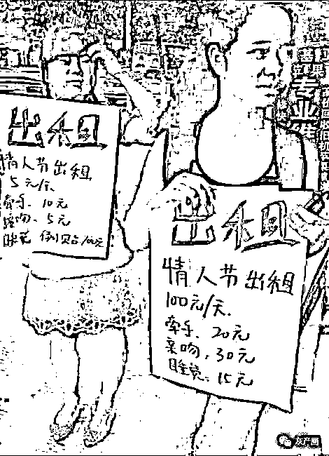

# 租女友过年的要小心了！且看北京法院发布婚恋交友诈骗八案例

> 原文：[`mp.weixin.qq.com/s?__biz=MzIyMDYwMTk0Mw==&mid=2247529086&idx=6&sn=1bf43d1fa1b2bfa8af01685cd3d6f6cc&chksm=97cbb946a0bc3050f2b19c005e00013c547177666e581aa42a5f3c1a21076622908058935758&scene=27#wechat_redirect`](http://mp.weixin.qq.com/s?__biz=MzIyMDYwMTk0Mw==&mid=2247529086&idx=6&sn=1bf43d1fa1b2bfa8af01685cd3d6f6cc&chksm=97cbb946a0bc3050f2b19c005e00013c547177666e581aa42a5f3c1a21076622908058935758&scene=27#wechat_redirect)

导读

春节，婚恋交友电信网络诈骗也进入了案发小高峰期。过年了，有些人可能会想着找个对象，别人介绍或者自己注册婚恋网站，和对方聊熟悉后，可能就会开始介绍‘项目’、‘平台’等。对于这类诈骗，警方提醒，只要涉及钱财，就一定要留个心眼。

如果你在婚恋网站上遇上一个人，Ta 翩若惊鸿，Ta 英俊潇洒，朋友圈里开着劳斯莱斯，在伦敦广场喂着鸽子，在高档会所数着票子。Ta 向你展开攻势，你以为遇到了一生挚爱，殊不知人家惦记的是钱袋子。为博君一笑，你连忙转账，Ta 转头把你拉黑逃之夭夭。

近年来，婚恋诈骗类案件数量持续增加，本公号刊登北京海淀法院审理的六起婚恋交友诈骗典型案例来警示提醒。（Jlls）

****案例一：网络游戏结识 “网恋”诈骗获刑****

****案情简介：****

**2017 年 8 月至 2018 年 12 月间，被告人吴某某在天津市宝坻区、本市海淀区等地，通过网络游戏结识被害人赵先生，后在网络聊天过程中使用虚假的身份信息，隐瞒自己的真实婚姻状况与被害人赵先生建立“恋爱”关系。期间，吴某某利用二人的“恋人关系”让赵先生主动支付钱款或者虚构生病需要买药、送货开车时刮伤他人要赔偿等各种理由，骗使赵先生向其汇款共计人民币 16 万余元，后将上述钱款挥霍。2019 年 7 月 10 日，被告人吴某某被公安机关抓获归案，其到案后如实供述了上述作案过程，涉案钱款未退赔。**

****风险提示：****

**当前，随着互联网的普及以及网络游戏热度的增加，许多年轻人通过玩网络游戏、网络聊天等方式结识、以至成为线下情侣的情形很常见，但这种背景下，也给不少犯罪分子以可乘之机，对此应注意如下几点：**

**第一，网络具有一定的虚拟性，结识时间长不代表“熟悉”。据被告人吴某某供述，其与被害人赵先生自 2015 年左右便在网络游戏上相识，期间二人还互相加了微信，吴某某自称是单身状态，双方还交换了照片。随后，双方又了解到对方的工作、姓名、籍贯等信息，在 2016 年年底建立了“恋爱”关系。但长达一年多的时间里，赵先生并不知道吴某某所提供的姓名是虚构的，照片也是在网上找来他人的，以及吴某某婚姻尚在存续期间的事实。赵先生在素未谋面的情况下，仅通过网络的信息，便陷入情网，为后续被骗取财物埋下了隐患。**

**第二，在网络交往过程中，涉及经济往来时，应提高警惕，多加防备。该案中，被告人吴某某骗取赵先生 16 万余元有一个过程。吴某某首先是试探性地称家中有事向赵先生借款几千元，没想到赵先生还真就通过微信进行转账。之后在一年多的时间里，吴某某便陆续编造需要上保险、还贷款、家人生病、哥哥打架需要赔钱等理由，逐步骗取了赵先生的上述钱款，待赵先生发现吴某某不回微信、拒接电话失去联系后，为时已晚。**

**以上情况说明，考虑到网络的虚拟性，在投入感情时，务必要增强防范意识，要通过线上与线下了解相结合的方式，在充分获取对方身份信息的基础上，再与对方开展进一步的交往，否则有可能陷入情感骗局；另一方面，面对网友提出的借款、转账要求时，更要提高警觉性，避免财产损失。**

**该公众号已被封禁**

******案例二：设置“温柔陷阱” 诈骗四百余万获刑******

******案情简介：******

****被告人姜某某于 2016 年 7 月至 2018 年 9 月间，通过与康女士建立恋爱关系，以谈婚论嫁骗取作为康女士父母的被害人刘女士、康先生夫妻信任。期间，被告人姜某某利用被害人家庭对其的信任，在本市海淀区假借帮被害人还房贷、自己公司资金周转需用钱等事由，骗取被害人刘女士、康先生房屋抵押款人民币 300 万元，并骗取被害人刘女士、康先生南京银行、包商银行、建设银行、光大银行信用卡资金等钱款人民币 102 万元。****

****被告人姜某某于 2018 年 8、9 月间，以收回其 200 余万元债权需要资金为由，骗取被害人赵女士人民币 55000 元。****

****被告人姜某某于 2018 年 11 月间虚构其可以帮助被害人祝先生投资获得高额利息，骗取被害人祝先生人民币 151000 元。****

******风险提示：******

****近年来，通过婚恋交友实施诈骗的犯罪屡见不鲜。很多人利用婚恋关系假意交往，设置“温柔陷阱”，骗得被害人信任，进而编造各种理由达到骗取钱款的目的。****

****在此类案件中，由于双方是在婚恋关系中发生的诈骗行为，在交往中存在一般经济往来的情况，被告人也会给被害人一部分钱款，这些钱款的性质应该综合全案情况进行判定，如果被告人给予被害人的钱款与其诈骗所得钱款数额差距过大，例如本案中的姜某某给被害人一方的小部分还款，其实是掩盖犯罪行为的一种表现，小部分的还款行为不能否认整体诈骗事实的存在，在认定案件性质和犯罪数额时应该审慎判断。****

****还需特别提醒的是，在婚恋交友关系中，对于一方提出各种名义的钱款需求，应提高警惕。首先，应该核实对方提出的钱款需求是否真实存在、需求数额与实际数额是否相当等;其次，对于借款的具体条件应当加以明确，例如，借款的数额、归还期限、约定利息等内容；再次，对于交往短时间内即提出大额钱款需求的，应该更加谨慎，只有把每一步都核实清楚，才能防患于未然。****

******案例三：主播在线交友 骗取“打赏金”获刑******

******案情简介：******

****2019 年间，被告人王某某、刘某某、熊某某共同出资，以熊某某担任法定代表人的河南熊猫快跑网络科技有限公司的名义经营，后与“蜂鸟直播”平台合作，由被告人曹某某担任“主管”、被告人徐某作为主播，另招聘多人进行辅助，通过互联网假借交友、谈恋爱的方式，诱使被害人进入直播平台观看主播在线，从而诈取被害人的“打赏”金。****

****第一步“主播”身份“包装”。“主播”要介绍自己 22 岁，大专学历文化程度，主要从事文职类工作。出身于小康家庭不缺钱。父亲做小生意，母亲是护士或者教师。她的感情经历为曾有一个男友，因对方酗酒、赌博、出轨自己的闺蜜而导致分手。又因为她分手后长期宅在家里不想出去。母亲担心，让她多交朋友，母亲与闺蜜两人推荐她做直播。她自己对直播的认识是调理情伤和一种寄托。以上编造的信息将“主播”身份定位于家庭条件良好、因遭到感情背叛受挫、令人心生怜悯易激发保护欲的弱小女性，同时声明自己做直播是为了心灵寄托而非赚钱。****

****第二步获取“客户”（即被害人）。通过一些交友软件主动添加好友，也通过婚恋网站、婚恋 APP、贴吧、车友会等方式猎取个人信息。****

****第三步对获取的“客户”进行筛选。“客户”年龄要在 22-28 岁之间，年龄太小没有经济基础，年龄太大没有开发希望。职业选择身边长期没有女伴的客户群体。****

****第四步通过四天与“客户”来加深感情和关系。第一天熟识。加好友后互相介绍，找共同话题聊天。第二天提升密度。相约见面，互相起爱称，发展暧昧关系。前两天尽量不提直播。第三天感情升温。互换私密经历，让对方主动接近自己。第四天将“客户”引入直播间。****

****第五步刺激消费。方法有：编造陪妈妈拜佛给“客户”求平安福，要求对方赠送 8 千元至 1 万元的礼物；透露自己今天过生日，要对方出钱送礼物等等。****

****自 2019 年 7 月 2 日至 8 月 8 日，被告人利用上述方式骗取各被害人钱款从几千元到几万元不等，诈骗数额共计人民币 31 万余元。****

******风险提示：******

****本案中，罪犯选取刚满成年的徐某做“主播”当“门面”，再由其他辅助人员通过网络假扮“主播” 用社交软件与被害人聊天、接触，借交友、谈恋爱的方式进一步交往，诱使被害人进入直播间观看徐某的主播在线直播，从而诈取被害人的“打赏”金。被害人不明就里，在罪犯一步步的诱骗下付出感情，又为了巩固“恋爱关系”，博得徐某欢心，不断的出资“打赏”。最终被害人不仅遭受经济上的损失，个人情感方面也受到欺骗，影响了正常的生活。****

****互联网重构了人际关系的网络，人们在网上更容易找到自己欣赏的人。但这是一个虚拟的世界，会带来幻觉。本案中，“主播”身份是“包装”的。与被害人密切互动的多个键盘手，按照统一的步骤、统一的“话术”，诱使被害人跌入破财的陷阱。当被害人在直播间消费过小或不再消费之后，即被拉黑。本案还有一些被害人没有报案，可能他们对此诈骗伎俩还茫然不知。****

****当前，网络直播平台在监管方面存在着盲区，这样的利用互联网直播间的诈骗犯罪也可能还会发生，激流汹涌。作为法律工作者，我们希望网友在上网冲浪时，擦亮双眼，分辨内容低劣的直播并坚决抵制，对于打赏保持理性的态度，也不要基于虚荣心、攀比心理进行激情打赏，避免做出令自己懊悔的事情。如不幸遇到犯罪行为时，请及时向公安机关报案，通过法律途径维护自己的正当权益。****

********案例四：虚构军人身份 诈骗八人获刑********

********案情简介：********

****2018 年 3 月 19 日至 2019 年 4 月 13 日间，被告人李某虚构自己有军人身份或背景，并虚构工作单位及职业、收入水平，取得多名被害人信任并与之交往，骗取各被害人向其转账人民币共计 524521 元。****

******风险提示：******

****本案中，被告人李某先后对多名被害人虚构自己的工作单位、职业、收入水平，在与被害人婚恋交往过程中，虚构各项事由，骗取被害人及被害人家人的钱款，最终案发，并被判处刑罚。根据法律规定，诈骗公私财物人民币 50 万元以上为数额特别巨大，对应的法定刑为十年以上有期徒刑或者无期徒刑，并处罚金或者没收财产。该案涉案金额为人民币 524521 元，属于诈骗数额特别巨大，法院综合考虑犯罪数额、情节及被告人认罪悔罪态度，最终作出上述判决。****

****婚恋诈骗，对被害人带来的不仅是金钱上的损失，还有心理上的创伤。近年来，随着信息网络的发展，婚恋交往的途径逐渐多样化，婚恋诈骗犯罪的数量也逐年递增。一方面，我们需要运用法律武器惩治犯罪分子，另一方面，也需要了解此类犯罪的特点，防范于未然。****

****该案中，被告人与多名被害人均是在网络交友软件上结识，通过网络聊天增进了解，并最终确立恋爱关系，在此过程中，被告人虚构自己有军人身份，高薪稳定的职业，通过交往逐渐取得被害人及被害人家属的接纳和信任，后在交往过程中虚构各项事由和金钱花销，陆续骗取被害人巨额钱款。通过该案，告诫我们在信息网络中和陌生人交往，应该保持警惕心，尤其在涉及婚恋交往和金钱交往的过程中，更不能盲目信任，应保持警惕，保护好自己的人身财产安全。****

********案例五：使用女友微信号 网络交友诈骗获刑********

********案情简介：********

****被告人张某于 2019 年 1 月至 2020 年 7 月，在本市海淀区等地，使用其女友马某的微信号，冒充马某与被害人吴先生联系，谎称可以与吴某相处男女朋友，虚构家人生病等事由骗取吴某共计人民币 160 万余元。现涉案钱款尚未起获。被告人张某于 2020 年 8 月 5 日被公安机关抓获归案，后如实供述了上述犯罪事实。****

******风险提示：******

****近年来，通过网络实施的犯罪行为层出不穷，手段不断翻新。其中，冒充女性身份，以恋爱名义骗取被害人财物的犯罪屡有发生。该案即为典型的冒充女性身份与男性被害人假借谈恋爱的名义先培养感情，后续利用双方的关系或感情，不断虚构家人生病、家里人出事等事由，从而达到骗取被害人钱款的目的。****

****该案中被告人张某使用其女友的微信号，冒充其女友的身份与被害人以谈恋爱名义相处，并不断虚构家人生病等事由，骗取被害人的钱款。被告人张某的主观目的为非法占有被害人的钱款，其客观实施的犯罪行为为虚构事由，骗取他人财物。根据我国刑法的规定，其诈骗数额高达一百六十万余元，数额特别巨大，应判处十年以上有期徒刑或无期徒刑，并处罚金或者没收财产。****

****鉴于网络虚拟身份难以核实，尤其是在双方素未谋面，亦未经核实对方身份的情况下，应提高防诈骗意识，擦亮双眼，捂紧钱包，不可盲目听信对方言语，便向对方大额转账，在发现对方有推脱见面、搪塞理由、失去联系等情况时，应主动报警，及时挽回相关损失。****

******案例六：顺风车拼车相识 虚构身份诈骗获刑******

******案情简介：******

****被告人葛某与被害人林女士通过顺风车相识并发展为男女朋友关系。2017 年 1 月至 2018 年 6 月间，被告人葛某以做生意、给亲属看病等事由，多次通过微信、支付宝转账的方式骗取被害人林女士共计人民币 131.91 万元。****

****该公众号已被封禁****

******风险提示：******

****这个案件中被害人林女士学历高、收入高、经济条件好、心智成熟，属于人们眼中的高级白领，为何会被骗子骗走百万余元？****

****第一，轻信外在表现。林女士和葛某因为顺风车拼车而结缘，葛某注重外表，谈吐不凡，很快和林女士熟稔起来。当他得知林女士的工作情况后，很快估量出女方的经济状况。他当时正在为高利贷焦头烂额，经济条件较好的林女士很快成为他的目标，他表现的无微不至，加上他为自己虚构的成功商人身份，很快就俘获了林女士的芳心。林女士在缺乏对他个人背景和财务状况深入了解的状态下，轻信他优雅的表现，很快确立男女朋友关系。****

****第二，对于借款疏于警惕。葛某多次借款，理由五花八门，林女士却基于信任未予深究，直到金额过大，讨要无门才如梦初醒。****

****这个案子有如下几点启示：****

****第一，交友要慎重。无论是网络交友还是拼车结缘等方式，这些社交方式认识的朋友，因为没有真实个人信息的背书，所以极易伪造身份且不被发觉。像该案中，即使葛某是以真实身份与林女士交往，林某却依然无法查清楚其真实的财务状况。所以，交友除了观察外在，更要了解内在，这是自我保护的第一步。****

****第二，谈钱不伤感情。在恋爱中，如果对方向你借钱，热恋中的人往往会放松警惕，本着信任给予帮助，但是法官再次提醒，借款、赠与都可以，如一再索取就要警惕是否是诈骗。恋爱和婚姻需要双方的共同付出，而不是单方的给予，如果对方一再索取，那么就要警惕了，好好谈一谈为什么借钱，什么时候还钱，是一种理智且负责的态度。否则沦为诈骗犯的摇钱树，才是真的伤心又伤财。****

****来源:北京海淀法院,景来律师****

****************

****← 向右滑动与灰产圈互动交流 →****

********