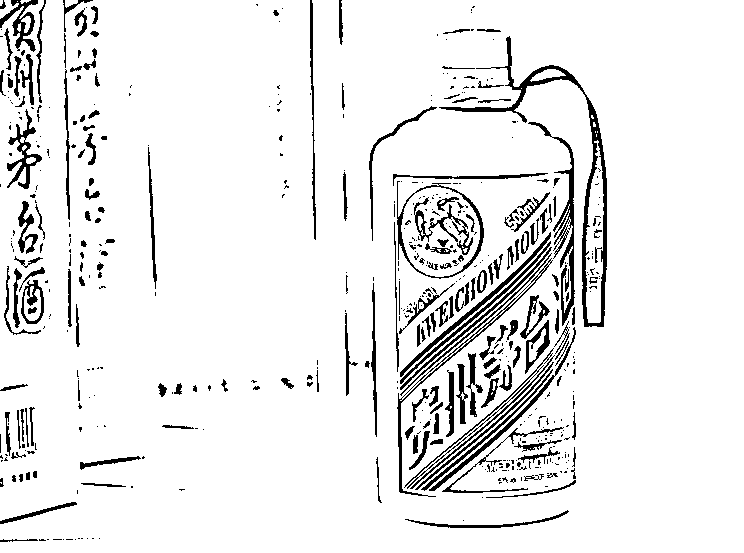
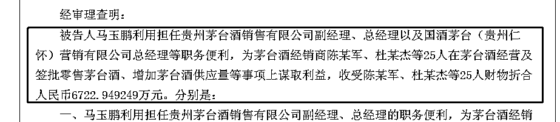
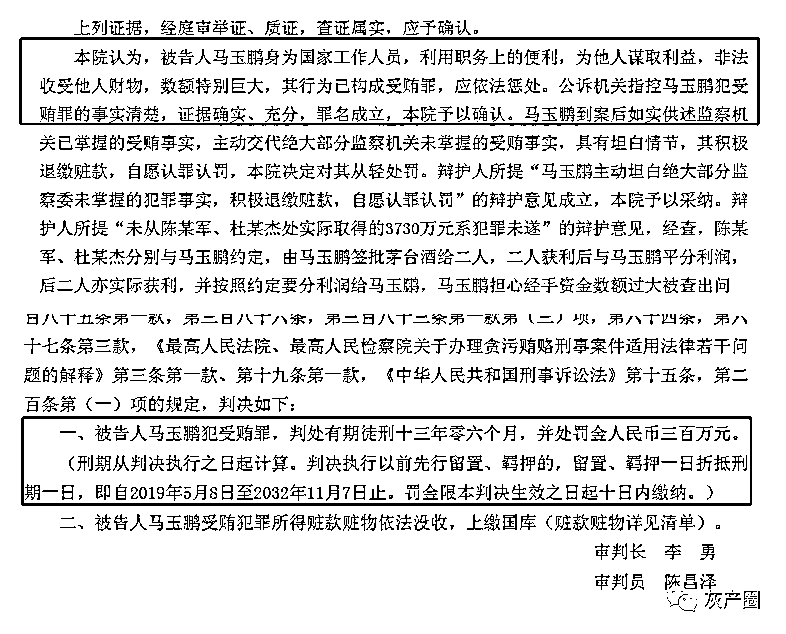

# 茅台酒销售公司原总经理受贿细节曝光：单笔超 2700 万，与经销商平分利润

> 原文：[`mp.weixin.qq.com/s?__biz=MzIyMDYwMTk0Mw==&mid=2247529151&idx=2&sn=f561a346d6d8fa1b7d91e3e6e71f2b2a&chksm=97cbb987a0bc30913ee7608b47268bc05062dff26f967fbe92ad3cabd1454a261fe250989813&scene=27#wechat_redirect`](http://mp.weixin.qq.com/s?__biz=MzIyMDYwMTk0Mw==&mid=2247529151&idx=2&sn=f561a346d6d8fa1b7d91e3e6e71f2b2a&chksm=97cbb987a0bc30913ee7608b47268bc05062dff26f967fbe92ad3cabd1454a261fe250989813&scene=27#wechat_redirect)

2 月 4 日，红星资本局注意到，中国裁判文书网披露了贵州茅台（600519.SH）原总经理助理，贵州茅台酒销售有限公司原党委副书记、总经理马玉鹏受贿案细节。

裁判文书显示，**马玉鹏收受他人财物折合人民币超 6700 万元，全部为茅台酒经销商所送**，利益往来主要涉及茅台酒经营及签批零售茅台酒、增加茅台酒供应量等事项，其中单笔受贿金额最高超 2700 万元。

最终，**马玉鹏因非法收受他人财物数额特别巨大，在一审中获刑 13 年 6 个月，并处罚金人民币 300 万元**。

**毕业后加入茅台**

****从事销售近 10 年****

****1966 年 6 月 22 日，马玉鹏生于贵州省仁怀市，在职研究生学历，中共党员。****

****1987 年 7 月 7 日，他从贵州第二轻工业学校毕业后一直在茅台酒厂做财务工作，先后任茅台酒厂 800 吨改扩建指挥部会计、茅台酒厂财务处出纳员、贵州茅台酒厂财务处基建财务科副科长、贵州茅台酒厂（集团）有限责任公司规划建设部财务预决算科副科长等职务。****

****2005 年，在干了 18 年财务工作之后，他开始转战建设口子。2005 年 5 月 10 日，任贵州茅台酒股份有限公司发展规划建设部副主任、贵州茅台酒厂有限责任公司发展规划建设处副主任；后转正为主任和处长。****

****2010 年，他进入茅台销售公司，从销售公司副经理一路升迁至茅台酒股份公司总经理助理，负责销售公司经营管理工作。****

******在干了近 10 年的销售之后，他于 2019 年 5 月 8 日被留置，同年 11 月 2 日被刑事拘留，同年 11 月 8 日被逮捕，现羁押于兴义市看守所**。****

******让行贿人代管贿金******

********与经销商平分利润********

******经过调查发现，马玉鹏利用担任贵州茅台酒销售有限公司副经理、总经理以及国酒茅台（贵州仁怀）营销有限公司总经理的职务便利，为茅台酒经销商陈某军、杜某杰等 25 人在茅台酒经营及签批零售茅台酒、增加茅台酒供应量等事项上谋取利益，**收受陈某军、杜某杰等 25 人财物共计人民币 6722.95 万元**。******

********

****为此，贵州省黔西南布依族苗族自治州人民检察院于 2020 年 3 月 5 日，向贵州省黔西南布依族苗族自治州中级人民法院提起公诉。****

****红星资本局梳理发现，**马玉鹏在受贿时有意识地规避风险。他担心经手资金数额过大被查出问题，就让行贿人代为保管。**经销商陈某军曾向其行贿 2314 万元，其中 64 万元为现金、250 万元为银行转账，另外 2000 万元由陈某军代为保管。**马玉鹏称，根据双方约定，由他签字批茅台零售酒给陈某军，陈某军销售获利后和其平分利润**。2016 年 11 月左右，马玉鹏觉得陈某军拿现金或通过银行打款等方式都不太好，他和陈某军说，以后经其签字批的酒，销售获利之后该拿给他的钱先由陈某军保管，要用钱的时候再说。****

****此外，2018 年 5 月前后，马玉鹏的二儿子马某鸣在深圳某公司上班，主要从事基金理财产品的销售业务。为帮助提升其工作业绩，2018 年 6、7 月，马玉鹏介绍陈某军和另一名茅台酒经销商王某德购买基金产品。陈、王二人一起到马某鸣所在公司考察，之后陈某军出资 2000 万元购买基金产品，其中 1000 万元为陈某军自行出资，另 1000 万元为征得马玉鹏同意后代为保管的部分贿款。王某德也出资 1000 万元购买该基金产品。****

****另外，2017 年 6 月份，**经销商杜某杰及妻子蔡某，和马玉鹏约定，请马玉鹏签一些批条销售，赚得的利润其和马玉鹏对半分**。从 2017 年 8 月开始，蔡某找马玉鹏签字，每月会签 10 多张批条。直到 2018 年年初，茅台酒销售公司逐步限制了零售批条的签批，从 2018 年 1 月起，马玉鹏基本没有签批条。在 2017 年 8 月至 2018 年之间，杜某杰和蔡某共获利 5460 万，分给马玉鹏 2730 万。马玉鹏也让其先保管，等需要用钱再告知。****

******非法收受他人财物数额特别巨大******

********判处有期徒刑 13 年零 6 个月********

******经过审理，法院认为，马玉鹏身为国家工作人员，利用职务上的便利，为他人谋取利益，非法收受他人财物，数额特别巨大，其行为已构成受贿罪，应依法惩处。不过，马玉鹏到案后如实供述监察机关已掌握的受贿事实，主动交代绝大部分监察机关未掌握的受贿事实，具有坦白情节，其积极退缴赃款，自愿认罪认罚，法院决定对其从轻处罚。******

********法院一审判决，马玉鹏犯受贿罪，判处有期徒刑十三年零六个月，并处罚金人民币三百万元。********

************

************

************

******← 向右滑动与灰产圈互动交流 →******

************