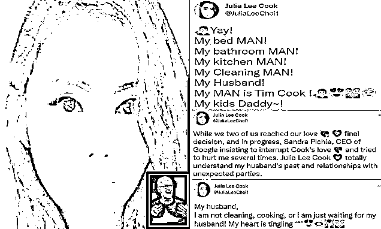

# 苹果 CEO 库克“喜当爹”，被女子索赔 31.6 亿分手费！

> 原文：[`mp.weixin.qq.com/s?__biz=MzIyMDYwMTk0Mw==&mid=2247529151&idx=3&sn=47ada4eeb882e89908f045751d02897a&chksm=97cbb987a0bc3091ddf1528aca6918e679671740b8eece8a49359c0afe9c7f2e38da1a248e98&scene=27#wechat_redirect`](http://mp.weixin.qq.com/s?__biz=MzIyMDYwMTk0Mw==&mid=2247529151&idx=3&sn=47ada4eeb882e89908f045751d02897a&chksm=97cbb987a0bc3091ddf1528aca6918e679671740b8eece8a49359c0afe9c7f2e38da1a248e98&scene=27#wechat_redirect)

谁也没想到，新的一年刚过去一个月，竟然就吃到了苹果老大的“大瓜”。 

据 CNN 1 月 25 日晚间报道，库克受到了来自一位 45 岁女性的威胁，后者自称库克的妻子，且还为库克孕育了双胞胎。

苹果公司则表示，在 1 月 25 日已向法庭申请针对该女子的限制令，并已获得批准。 

根据苹果公司向圣克拉拉县高等法院提交的法庭文件显示，该女性名为 Julia Lee Choi，来自弗吉尼亚州，声称是库克的妻子，而库克是她双胞胎孩子的父亲。

该女性举行十分古怪，曾威胁、骚扰和跟踪库克一年多。她被指控对库克做出过多种包括将上了膛的手枪的照片通过电邮发给库克、闯进其居住房屋等威胁行为。

苹果还表示，该女子自 2020 年 10 月开始骚扰库克后，便在推特上称自己已与库克结婚。

然而众所周知，库克早已在 2014 年就官宣出柜了。

但她还是会在推特上频繁向库克示爱，称自己“活不下去了”“耐心已经快要结束了”……

该女子的推特首页就是库克的大头照，推特中更新的内容也都几乎是隔空喊话秀恩爱。

她还声称，自己和库克的感情被谷歌 CEO 桑达·皮采破坏。对于库克的出柜她不以为然：“完全理解库克的过去，他的做法都是不得已”。

法庭文件还显示，该女子在 2020 年 10 月至 11 月中旬期间曾向库克发送了近 200 封电子邮件，语气也变得越来越激烈。

甚至到后来，她要求与库克进行交谈，但被保安拒之门外。

在 2021 年 10 月，她驾驶着一辆驾照过期的保时捷闯进了库克家里。闯入库克的私人住宅后，她也被当地警方拘留。

拘留过程中，她还告诉当地警察，自己可能会采取暴力行径。但警方对车辆进行了搜查，却并没有没有发现任何武器。

此外，该女子还曾试图以库克的名义开设诈骗公司。

据法院文件显示，该女子在 2021 年试图在包括加利福尼亚、纽约和弗吉尼亚在内的各个州开设诈骗公司。

并且，该女子在尝试注册数十家诈骗公司时，使用的都是库克的姓名、个人地址以及苹果公司的公司地址。

2021 年 12 月 18 日，她的“追求”再次升级。

她给库克发送了一封骚扰邮件，要求其给自己 5 亿美元（约 31.6 亿人民币）的赔偿， 还向库克索要 5 亿美元的谅解费。

该女子的种种行为，终于让苹果公司忍无可忍，这才向法院提交了限制令申请。

同时苹果还在申请中表示，该女子“可能携带武器，目前仍在南湾地区，打算在不久将来回到库克的住所”。

法庭立即颁布了限制令：禁止这名女子持有枪支，不得接近包括库克在内的任何苹果员工，不得进入苹果属下的任何公司和库克的住所。

据了解，针对此事的听证会定将于今年的 3 月 29 日举行。

对于库克遭该女子威胁这件事，网友们都感到不可置信。

或许，对于这样奇葩的勒索事件，作为当今第一大科技公司的掌门人的库克自己也完全想象不到。

有资料显示，现如今，尽管库克的安保费用已超过 60 万美元。

来源：扩展迷 EXTFANS，程序员小灰

← 向右滑动与灰产圈互动交流 →

