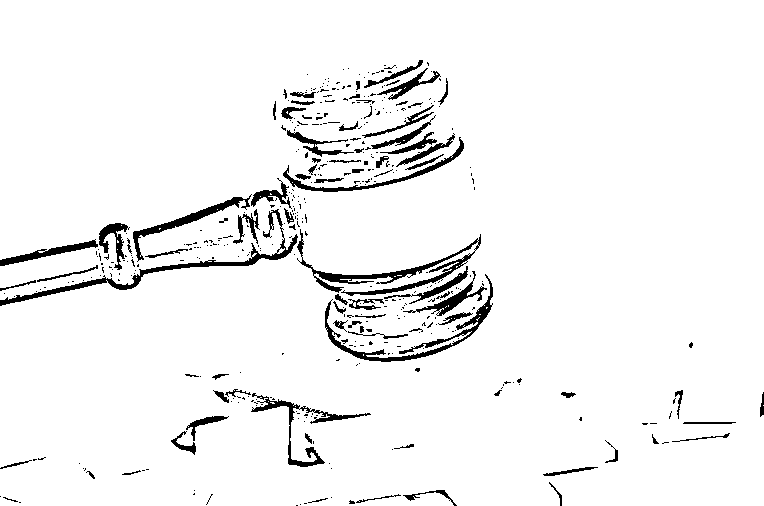
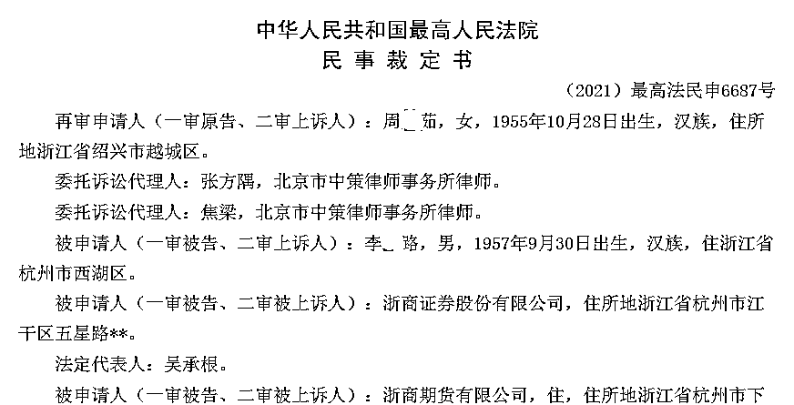
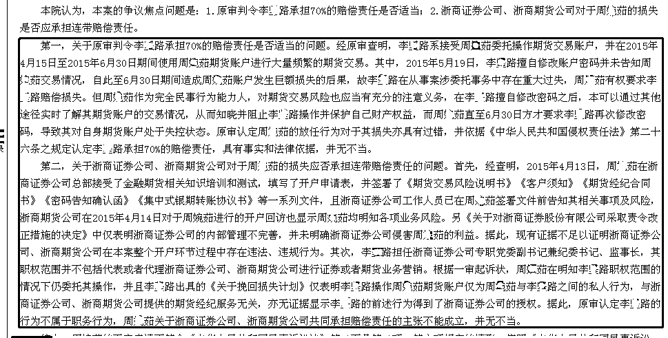

# 浙商证券纪委书记替 65 岁老太投资，3000 万剩 45 万元！

> 原文：[`mp.weixin.qq.com/s?__biz=MzIyMDYwMTk0Mw==&mid=2247529151&idx=5&sn=a1570bc3c3254acd7352c30e297f5f3c&chksm=97cbb987a0bc3091f26e9cabf56b6c6a895542207ea27b3446a3bcef10103532a42a7486f50d&scene=27#wechat_redirect`](http://mp.weixin.qq.com/s?__biz=MzIyMDYwMTk0Mw==&mid=2247529151&idx=5&sn=a1570bc3c3254acd7352c30e297f5f3c&chksm=97cbb987a0bc3091f26e9cabf56b6c6a895542207ea27b3446a3bcef10103532a42a7486f50d&scene=27#wechat_redirect)

2015 年的 A 股牛市中，浙商证券（601878.SH）纪委书记劝人炒期货，结果 3000 万仅剩 45 万。

2 月 4 日，红星资本局从中国裁判文书网获悉，2015 年 4 月，浙商证券时任纪委书记、监事长李某路，推荐 65 岁老太周某茹开户投资 3000 万元炒期货。两个多月后血亏了 98%，只剩下 45 万。为此，周某茹将李某路及浙商证券、浙商期货告上了法院。

该案件经过一审、二审及最高人民法院民事裁定，李某路承担 70%的损失。

**血亏 98%！**

****3000 万爆仓只剩 45 万****

****2015 年，李某路担任浙商证券公司专职党委副书记兼纪委书记、监事长，有一般证券业务执业资格。****

****周某茹与李某路相识多年，**2015 年 4 月，李某路向周某茹描述证券市场投资前景，让其开户投资，并承诺提供股票信息并参与浙商证券发行认购。同时告知周某茹，开设期货账户只是帮助其拉拢资金做对冲业务，不会亏损。******

******周某茹在李某路的陪同下，来到浙商证券公司总部办了相关手续并相继开通了证券账号、期货账号，周某茹向其证券账号、期货账号共同绑定的银行账户汇入了 3000 万元。******

******随后，浙商期货公司人员为其开通了期货账户。**4 月 15 日，李某路更改了周婉茹期货账户的交易密码，周婉茹对此知情并予以认可；5 月 19 日，在周某茹不知情的情况下，李某路再次更改周某茹期货账户的交易密码；6 月 30 日，李某路在周某茹的要求下，将周某茹期货账户的交易密码重新更改。********

******周某茹打印交易账单时发现，账户被人私自大肆操作，致使账户资金严重损失。自 2015 年 4 月 15 日至 6 月 30 日，李某路在周某茹的期货账户内频繁操作交易。**5 月 19 日，周某茹期货账户期末权益为 2215.68 万元，6 月 29 日的期末权益为 45.04 万元。这意味着，周某茹 2 个多月内血亏 98%。********

******周某茹认为，浙商证券和浙商期货违背证券法等法律规定，疏于管理，缺乏监管，开户后出现周某茹账户密码被篡改等情形，指使李某路以浙商证券名义进行营销，缺乏从业底线，欺诈并诱导周某茹开户；李某路违背证券从业人员不得代客操作的规定，擅自修改客户密码恶意操作账户，致使自己蒙受巨大损失。******

******随后，周某茹将浙商证券、浙商期货、李某路告至浙江省杭州市中级人民法院。******

********法院判决：********

********券商纪委书记承担 70%赔偿责任********

******2020 年 4 月 9 日，杭州市中级人民法院对该案进行了公开审理。******

******法院认为，**上述事实表明周某茹对李某路操作其期货账户进行交易是明知且认可的**，故周某茹诉称其未委托他人进行任何证券买卖行为与查明事实不符。******

****法院同时指出，因李某路未经周某茹同意，在 5 月 19 日再次修改交易密码，客观上阻碍了周某茹及时了解和控制其期货账户的交易情况，且李某路修改密码后擅自进行交易的行为造成了周某茹期货账户的巨额亏损，侵害了周某茹的财产权益，依法应承担相应的民事责任。周某茹在李某路擅自修改密码后未及时加以制止，也存在一定过错，应自行承担部分后果。**法院酌情确定李某路承担该损失 70%的赔偿责任，即 1927.66 万元。对于相关贷款利息的诉请，法院也予以支持。******

******法院同时认为，**周某茹要求浙商证券、浙商期货对其财产损失承担共同赔偿责任，缺乏事实和法律依据**。李某路时任浙商证券专职党委副书记兼纪委书记、监事长，并不负责证券或期货业务，也无进行证券或期货业务营销的职权，法律法规和监管规定不禁止其从事期货交易，浙商证券、浙商期货并无权对李某路操作期货账户进行监管。******

****不过，周某茹不服一审判决结果，向浙江省高级人民法院提起上诉，二审法院维持了原判。周某茹又向最高人民法院申请再审，认为李某路对损失负有主要过错，自己过错责任畸重。****

********

****对此，最高人民法院认为，经原审查明，李某路在从事案涉委托事务中存在重大过失，原审认定周某茹的放任行为对于其损失亦具有过错，并依据法律相关规定认定李某路承担 70%的赔偿责任，具有事实和法律依据，并无不当。同时，周某茹在浙商证券公司总部接受了金融期货相关知识培训和测试、签署了相关文件、被告知了相关风险，浙商期货公司也告知了相关风险，故对周某茹的损失不应承担连带赔偿责任。****

********

****综上，最高法裁定，驳回周某茹的再审申请。****

****************

****← 向右滑动与灰产圈互动交流 →****

********