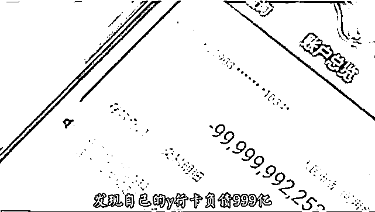
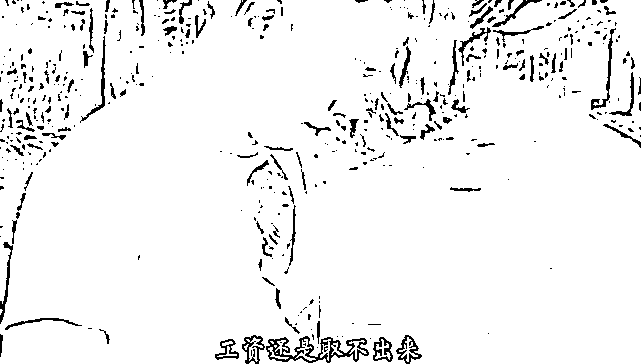
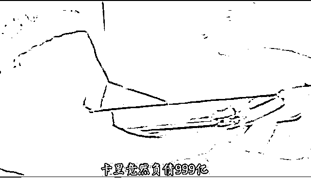

# 银行卡里突然多出 999 亿元负债

> 原文：[`mp.weixin.qq.com/s?__biz=MzIyMDYwMTk0Mw==&mid=2247529151&idx=6&sn=66cbbb769f92777652eeabd40a8ff236&chksm=97cbb987a0bc30918c752162d4bb0aad3f3fc7a44e8bb036c01594ac5b9b2807c81aa530021c&scene=27#wechat_redirect`](http://mp.weixin.qq.com/s?__biz=MzIyMDYwMTk0Mw==&mid=2247529151&idx=6&sn=66cbbb769f92777652eeabd40a8ff236&chksm=97cbb987a0bc30918c752162d4bb0aad3f3fc7a44e8bb036c01594ac5b9b2807c81aa530021c&scene=27#wechat_redirect)

一觉醒来，发现自己的银行卡负债 999 亿，杨先生被这一突然变故吓得不轻

杨先生到深圳某公司打工，按照公司规定杨先生办理了公司统一用于发工资的银行卡。第一个月发工资的时候，杨先生发现自己工资卡里的钱取不出来。杨先生以为是银行卡没有激活，所以没有在意。

等到第二个月发工资的时候，杨先生发现，银行卡里的钱还是取不出来，于是，杨先生便下载了银行 APP，注册登录以后，查看工资取不出来的原因，结果发现自己的银行卡余额为：-999 亿！

<amp-img src="https://inews.gtimg.com/newsapp_bt/0/14486605221/641" layout="responsive" width="641" height="363" i-amphtml-layout="responsive" i-amphtml-auto-lightbox-visited="" style="outline: 0px;background-color: rgb(249, 249, 249);display: block;color: rgba(0, 0, 0, 0.85);font-family: &quot;Microsoft YaHei&quot;;font-size: medium;text-align: start;overflow-wrap: break-word !important;overflow: hidden !important;"></amp-img>

这一发现将杨先生吓得不轻，负 999 亿，快赶上马云了！这么一大笔负债，别说他一个打工仔，换杨元庆、宗庆后都会头疼！如果靠打工来还这笔债，估计自己 100 辈子都还不清！

被这笔飞来的巨额债务吓晕了的杨先生连忙与当初办卡的银行工作人员联系，经过一番调查后发现，问题出在杨先生的另一张银行卡上。

<amp-img src="https://inews.gtimg.com/newsapp_bt/0/14486605659/641" layout="responsive" width="641" height="359" i-amphtml-layout="responsive" i-amphtml-auto-lightbox-visited="" style="outline: 0px;background-color: rgb(249, 249, 249);display: block;color: rgba(0, 0, 0, 0.85);font-family: &quot;Microsoft YaHei&quot;;font-size: medium;text-align: start;overflow-wrap: break-word !important;overflow: hidden !important;"></amp-img>

原来，在几个月之前，杨先生在农行办了一张卡，并将这张农行卡借给了自己的一个朋友使用，而这张农行卡被银行系统标记存在电讯 ZP 行为！因为涉嫌电讯 ZP，所以，杨先生名下所有的银行卡都需要承担连带责任，换句话说就是杨先生名下所有的银行卡，都会被银行系统监控，进出杨先生名下所有账号的资金都会被冻结。所以，他工资卡里的 7000 元工资，取不出来。

不仅如此，而且，杨先生被纳入征信黑名单，限制高消费，连乘坐飞机、高铁的权利都受到限制！

杨先生表示自己很无辜，他根本不知道他朋友借他的农行卡做了什么，自己也没有参与电讯 ZP，而且即便是他朋友用他的农行卡干了违法犯罪的勾当，也不应该影响自己其他的银行卡的使用的。

<amp-img src="https://inews.gtimg.com/newsapp_bt/0/14486606045/641" layout="responsive" width="641" height="364" i-amphtml-layout="responsive" i-amphtml-auto-lightbox-visited="" style="outline: 0px;background-color: rgb(249, 249, 249);display: block;color: rgba(0, 0, 0, 0.85);font-family: &quot;Microsoft YaHei&quot;;font-size: medium;text-align: start;overflow-wrap: break-word !important;overflow: hidden !important;"></amp-img>

为此，杨先生报了警，警方在了解了相关情况之后，认为银行的做法是合理合法的，杨先生需要等到他借给朋友的那张农行卡涉嫌 ZP 的案件办结之后，才能申请银行卡恢复正常。

为了能够向警方证明自己是无辜的，杨先生联系了借卡的朋友，但朋友的电话却打不通了。

警方和银行方面都表示，这种情况下，他们也帮不了杨先生，只能寄希望于他借出的那张农行卡涉嫌的电讯 ZP 案件快点办结了。

<amp-img src="https://inews.gtimg.com/newsapp_bt/0/14486606711/641" layout="responsive" width="641" height="372" i-amphtml-layout="responsive" i-amphtml-auto-lightbox-visited="" style="outline: 0px;background-color: rgb(249, 249, 249);display: block;color: rgba(0, 0, 0, 0.85);font-family: &quot;Microsoft YaHei&quot;;font-size: medium;text-align: start;overflow-wrap: break-word !important;overflow: hidden !important;"></amp-img>

因为一时疏忽将银行卡借给朋友使用，一番好心却给自己惹出了这么大的一个麻烦，杨先生追悔莫及。

**银行卡和身份证切莫随便外借！**

大数据时代，身份证中包含着一个人的全部信息，将身份证出借或者将身份证信息透露给他人，相当于将自己的身份信息毫无保留地透露了出去，比如出生情况、家庭背景、住址、联系方式、资产、资源等信息，都会泄露。身份信息一旦被别有用心者获取并利用，轻者给自己惹一身麻烦，重者可以致人家破人亡！

<amp-img src="https://inews.gtimg.com/newsapp_bt/0/14486607089/641" layout="responsive" width="641" height="367" i-amphtml-layout="responsive" i-amphtml-auto-lightbox-visited="" style="outline: 0px;background-color: rgb(249, 249, 249);display: block;color: rgba(0, 0, 0, 0.85);font-family: &quot;Microsoft YaHei&quot;;font-size: medium;text-align: start;overflow-wrap: break-word !important;overflow: hidden !important;"></amp-img>

现在的银行卡都是实名制的，银行卡绑定了持卡人的身份信息和联系电话，将银行卡借给朋友，相当于授权朋友以自己的名义使用银行卡。正常情况下，朋友以自己的银行卡进、出账，这没什么问题，但如果涉及到违法犯罪，那么，持卡人是会受到牵连的，比如“洗黑钱”、“电讯 ZP”、“冒名顶替”等等。骗子骗人的手法花样繁多，常常在不知不觉间就可以将人骗了，等到自己反应过来的时候，往往后果已经发生，就得为自己的出借行为买单！

杨先生的行为就是很好的例子。因为出借农行卡给朋友，朋友以他的农行卡实施电讯 ZP，案发后，警方首先要查的就是银行卡绑定的身份信息，即使有证据证明杨先生与电讯 ZP 案无关，但他的资料也要等到案件被侦破以后，警方确认他与案件无关，才能对其资料进行修改。而在资料被修正之前，杨先生必须承担征信黑名单和随时接受调查的后果！

所以，一般情况下，银行卡和身份证不要借给他人使用。

来源：支付界

← 向右滑动与灰产圈互动交流 →

