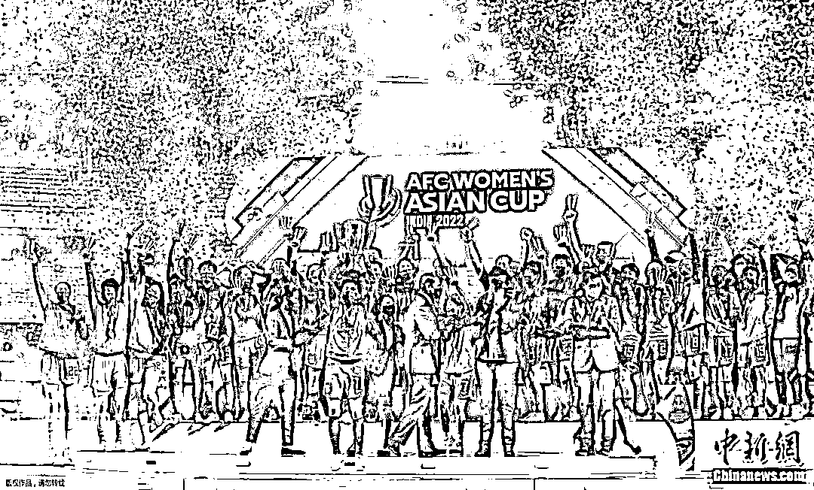
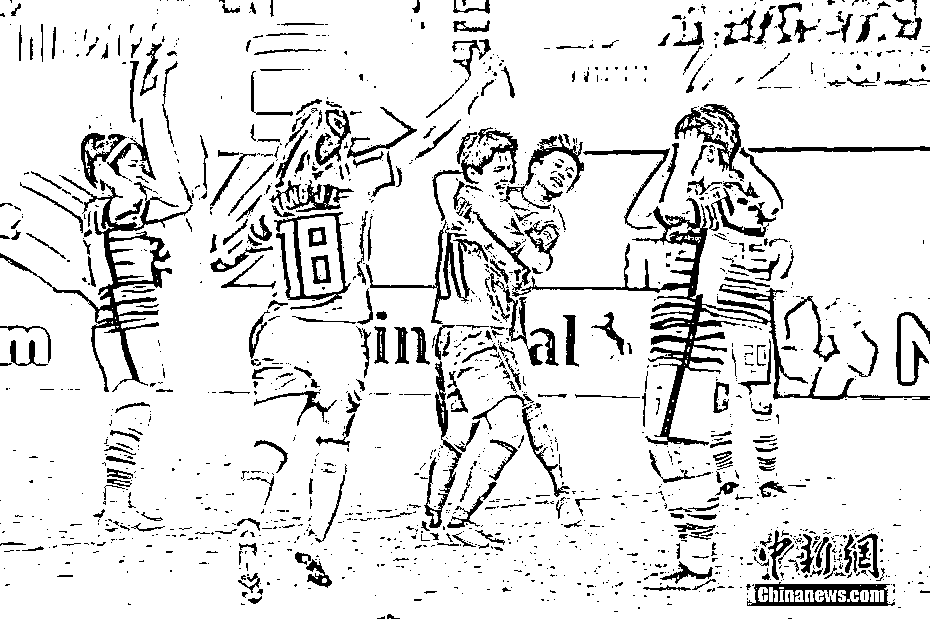
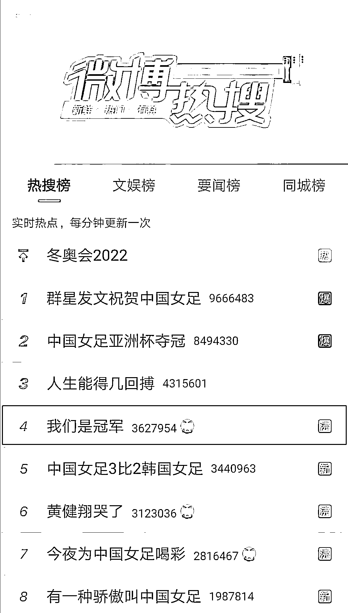
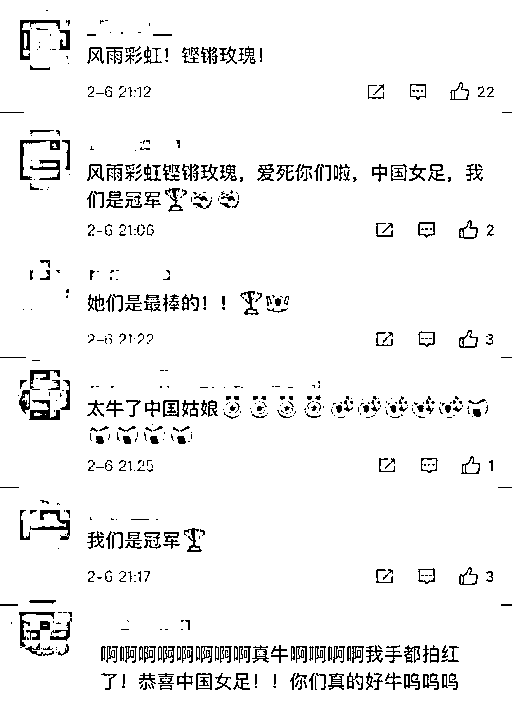
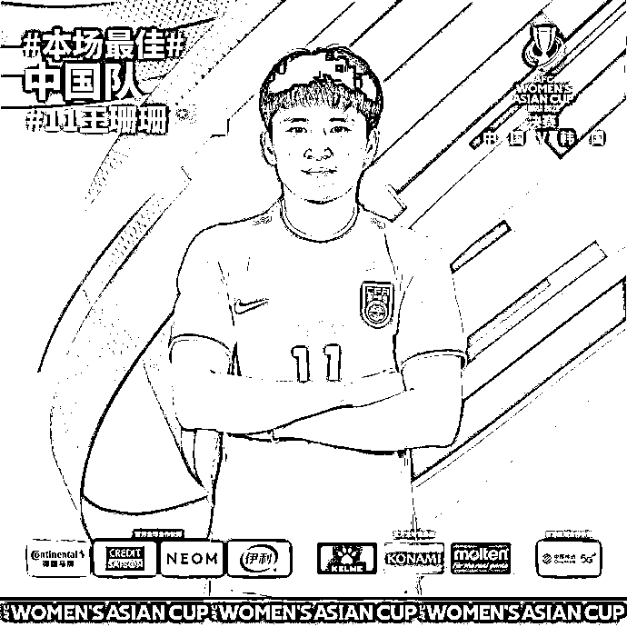
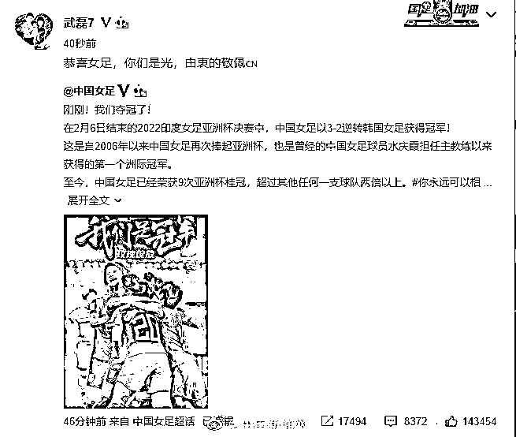
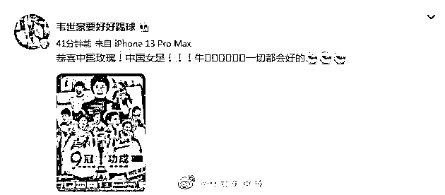
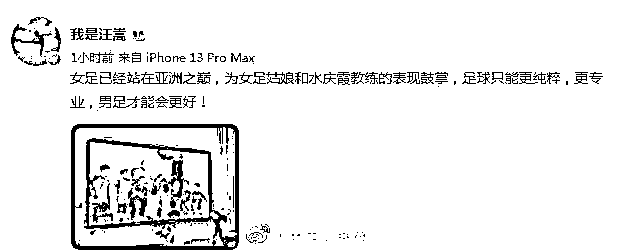
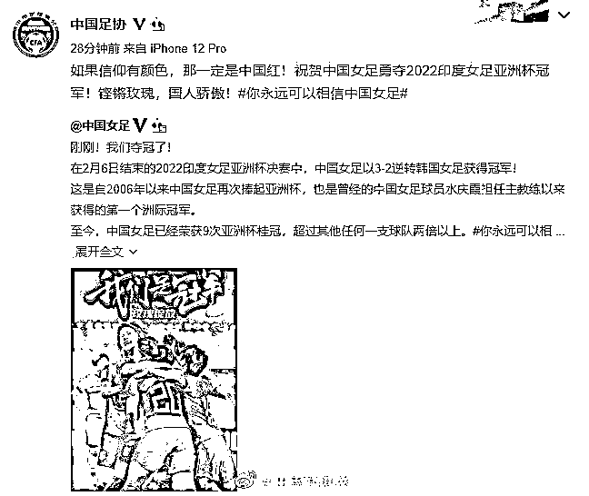
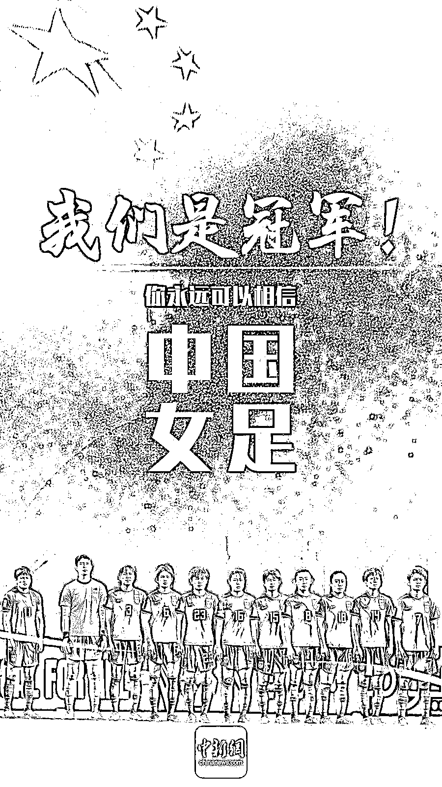

# 男足祝贺女足！

> 原文：[`mp.weixin.qq.com/s?__biz=MzIyMDYwMTk0Mw==&mid=2247529226&idx=1&sn=0da4089f2dfbcf060eaade64ed9f7884&chksm=97cbb832a0bc31246fae148a13611f609ea69f5d2bf807dca83ae5edef6e61100046441d8679&scene=27#wechat_redirect`](http://mp.weixin.qq.com/s?__biz=MzIyMDYwMTk0Mw==&mid=2247529226&idx=1&sn=0da4089f2dfbcf060eaade64ed9f7884&chksm=97cbb832a0bc31246fae148a13611f609ea69f5d2bf807dca83ae5edef6e61100046441d8679&scene=27#wechat_redirect)

你永远可以相信中国女足！

2 月 6 日晚，

中国女足 3:2 逆转战胜韩国女足

夺得亚洲杯冠军！

这是中国女足，

第 9 次夺得亚洲杯冠军！

图为中国女足队员进球后庆祝。图片来源：视觉中国

中国女足

瞬间霸屏微博热搜！

网友纷纷留言，

为中国女足姑娘们点赞：

**“铿锵玫瑰，中国女足！”**

**“中国姑娘好样的！”**

此场比赛

中国女足队长王珊珊当选亚洲杯最佳球员

中国队逆转夺冠后

关注比赛的王珊珊父亲面对镜头大喊：

女儿最棒！

赛后，

多位中国男足国脚

发文祝贺女足夺冠：

**“你们是光”**

**“女足已站在亚洲之巅”！**

中国足协也发文祝贺女足姑娘：

**如果信仰有颜色，**

**那一定是中国红！**

**铿锵玫瑰，**

**国人骄傲！**

**你永远可以相信中国女足！**

**我们是冠军！**

来源： 中国新闻网，潇湘晨报

← 向右滑动与灰产圈互动交流 →

