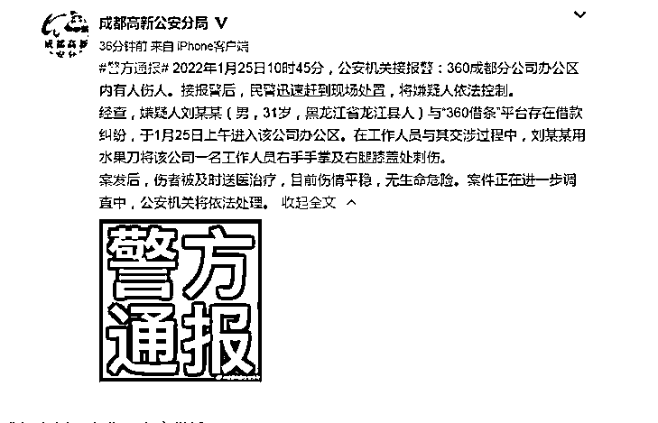
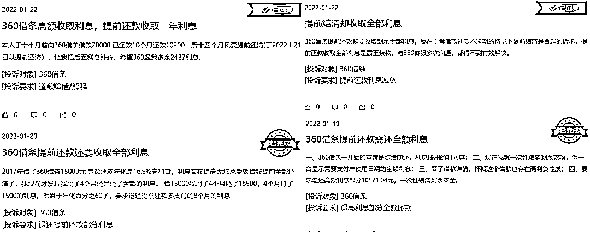
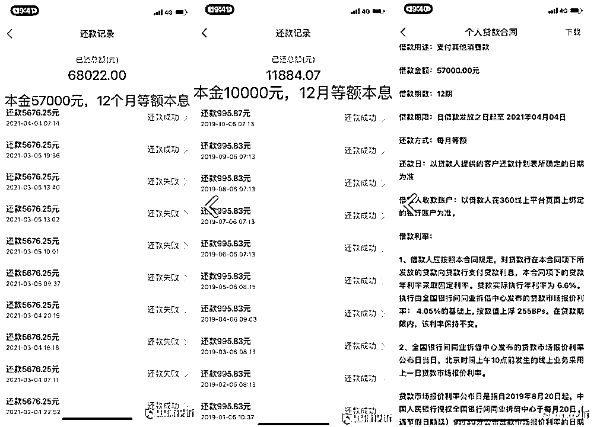

# 捅伤事件背后，“人民”苦 360 借条久矣？

> 原文：[`mp.weixin.qq.com/s?__biz=MzIyMDYwMTk0Mw==&mid=2247529226&idx=2&sn=576e7b02724eb67563097dd45df02e5b&chksm=97cbb832a0bc31245226cb27deca9e7bdbbe63163c6d5874dbd22ca7017be01c1e91f8245282&scene=27#wechat_redirect`](http://mp.weixin.qq.com/s?__biz=MzIyMDYwMTk0Mw==&mid=2247529226&idx=2&sn=576e7b02724eb67563097dd45df02e5b&chksm=97cbb832a0bc31245226cb27deca9e7bdbbe63163c6d5874dbd22ca7017be01c1e91f8245282&scene=27#wechat_redirect)

近日，一起办公室持刀伤人事件再次将 360 以借条为主的金融业务推到了聚光灯下。

相关消息的评论区显示，“人民”苦 360 借条已久。

“现在似乎全中国的互联网公司都在做金融，我看不明白。”余额宝和微信支付刚刚上线时，周鸿祎面对媒体采访所说的这句话广为流传。结果不到两年，周鸿祎就携 360 进军互联网金融行业，并将这块业务作为公司重要的战略方向之一。至 2020 年，主业金融的 360 数科在营收和净利润等方面已经全面完成了对 360 的超越。然而金融业务总是与风险常伴。近日，一起办公室持刀伤人事件再次将 360 以借条为主的金融业务推到了聚光灯下。相关消息的评论区显示，“人民”苦 360 借条已久。而在黑猫投诉平台中，360 借条有着超过 2.2 万条投诉，其暴力催收、费率畸高的问题屡屡被提及。目前，360 借条所属的 360 数科，业绩已超母公司 360。有分析认为，如果借条业务受到影响，将对 360 整体发展造成冲击。 **男子因借款纠纷捅伤工作人员，360 借条被指套路多** “360 这是出什么事了？”1 月 25 日上午，一男子从 360 公司被警方带走的照片在网络中流传，引发舆论热议。后据成都警方通报，该事件系嫌疑人刘某与 360 借条平台存在借款纠纷所致。当日，该男子进入 360 成都分公司办公区，在与现场人员交涉不成后，旋即持水果刀将 360 一名工作人员的右手手掌及右腿膝盖处刺伤。案发后，伤者被及时送医治疗，刘某也迅速被特警控制并带走。雷达财经注意到，虽然在此次事件中 360 员工是受伤一方，但大部分网友在警方通报案情后却将主要矛头对准了 360 的借贷生意。“国家也该管管借贷乱象了”、“年利率三十多都没人管，这哪是互联网金融就是高利贷”、“现在 360 已经没有口碑了”……众多网友在微博评论区留言称。雷达财经注意到，360 借条已多次被质疑。在黑猫投诉平台中，有关 360 借条的累计投诉量达到了 22133 条，雷达财经梳理发现，投诉问题包括虚假宣传、高利率、提前还款依旧收取利息、暴力催贷及泄露个人隐私等。一位投诉者表示，自己于 10 个月前向 360 借条借款 20000，分 24 期还。目前已还了 10900，想提前结清，但 360 却仍以 24 个月的时间计算利息总额。据了解，信贷机构不希望客户提前还款的原因在于，此举不仅会降低机构的利息收入，还会扰乱机构的资金计划，降低资金的使用效率。所以对于提前还款的问题，一般借贷平台会收取一定的违约金，或按实际借款天数收取利息。然而，依照投诉者们的说法，360 借条在此方面是收取约定借款期限的全部利息额，就算借一天也要还一年的利息。行业人士认为，360 借条此规定存在疑似“霸王条款”的争议。此外，有借款者晒出了 360 借条的还款截图，称自己借的两笔款项，一笔 57000 元，分 12 期还，每期还款额达到 5676.25 元；另一笔 10000 元，分 12 期还，每期还款 995.83 元。据此计算，两笔借款年化综合息费率均为 34.24%。“仔细查看签署合同，银行放款合同中写明同期拆借利率，也写明实际利率 6.6%，那么多的钱去哪里了？”该借款者质疑。至于泄露个人隐私，更是多次被媒体曝光。2020 年，人民网的一篇调查稿件，揭露了 360 借条登记的信息在网上被人公开售卖的事实。一位卖家自称，每天可以保证 3 万条左右的数据出货量（含“360 借条”数据），每条最低售价为 3 分钱。具体而言，360 借条数据包含实时、隔夜、隔周和历史数据四类，实时数据价格 2 元一条，隔夜数据 5 毛一条，周数据 500 元一万条，历史数据 300 元一万条。其还表示：“360 借条数据纯度高、质量好，很受客户喜爱”，并再三保证，这些对外售卖的数据是由 360 借条内部工作人员流出。2021 年 5 月，360 借条还曾因违法违规收集使用个人信息被国家网信办通报，同时遭各大应用商店下架，但目前经整改后，360 借条 App 已重新上架。**借贷年利率畸高，受法律保护吗？** 雷达财经体验发现，在 360 借条注册登录并上传相关身份信息后，很快通过了申请并得到了 21000 元的借款额度。进一步点击借款，平台显示可分 12 期还款，每月还款金额为 1985.2 元，据此计算，其年化综合息费率为 23.95%。对比之下，在招商银行的闪电贷中借款，年利率为 8.46%；而在支付宝借呗中借款，年利率为 9.20%。通常意义上，借款年利率高于 24%即为高利。而且，360 借条在广告上宣称的年化综合息费率低至 7.2%。雷达财经注意到，2020 年 8 月，最高法新修订的《最高人民法院关于审理民间借贷案件适用法律若干问题的规定》中提到，将以中国人民银行授权全国银行间同业拆借中心每月 20 日发布的一年期贷款市场报价利率（LPR）的 4 倍为标准确定民间借贷利率的司法保护上限。以 2022 年 1 月 20 日发布的一年期贷款市场报价利率 3.7%的 4 倍计算，目前民间借贷利率的司法保护上限为 14.8%，远低于上述 360 借条平台的年化综合息费率。那么，360 难道一直在扮演“法外狂徒”的角色吗？雷达财经据此咨询 360 借条客服，对方称，“我们的合作模式是助贷模式，主要为客户提供与相关金融机构的连接撮合服务，即通过我司运营的平台向金融机构申请贷款，金融机构发放的贷款不是民间借贷。360 借条产品始终坚持借款人综合借贷成本不高于司法部门规定的利率上限。”不过，尽管从理论上来讲，金融机构贷款业务不受借贷新规约束，但在多起法院判决的持牌金融机构借贷纠纷案件中，都曾明确表示“金融机构的贷款收益不应高于民间借贷”。如 2018 年 9 月 29 日，云南省高级人民法院对涉及平安银行昆明分行与尹某的一起贷款纠纷案时，终审裁定书中称：“虽然中国人民银行已全面放开金融机构贷款利率管制，交由金融机构自主确定，但改革的目的是让金融机构更好地为实体经济服务，绝非放任其牟取高利。相较于民间借贷，金融机构的贷款利率应受到更为严格的限制。”“平安银行昆明分行按合同约定主张的逾期利息和复利超过了法律保护范围，一审判决酌情调整为按中国人民银行同期贷款利率的四倍予以支持并无不当，二审判决予以维持是正确的。”据北京中闻律师事务所律师李亚介绍，目前，许多金融机构依然采用 24%、36%的标准。也即，贷款年利率低于 24%，属于法院保护的范围之内；在 24%-36%之间属于自然债务区，法院保持中立；36%以上才视为违法。不过李亚认为，这个标准是很不合理的。“民间借贷的利率都已经掉到百分之十几了，金融机构作为更专业的组织，完全可以调低利率标准。但可能由于一些特殊情况，他们现在还是适用 24 和 36 的标准。”“其实我觉得它应当参考适用民间借贷的标准，而且民间借贷的标准在以前的最高院司法解释、司法裁判中都是适用的，但是现在基本上是不太适用民间借贷这个标准。”整体上来看，行业人士认为，目前相关司法界定仍较为模糊，想要全面压降金融机构的贷款收益，中间的过程并不会轻松。**"变卦"的周鸿祎** 2011 年，奇虎 360 正式在美股上市，那正是周鸿祎脚踢百度、拳打腾讯、鄙视阿里、顺手搅局雷军的时代，血气方刚的周鸿祎将“颠覆式创新”看得很重。“你能把原来收费的东西变得免费，这件事就能产生巨大的颠覆。实际上它就是通过让东西更好用，让东西更便宜，使得更多低端用户最后也能进入这个市场，最后让市场获得一个 5 倍或者是 10 倍基数的扩大。”周鸿祎曾表示。此后不久，互联网嗅到了颠覆金融行业的气息，相关产品开始密集上线，余额宝、收益宝、活期宝、现金宝、易付宝等不一而足。但周鸿祎却在 2013 年 10 月的一场公益讲堂演讲中称，“有些基金公司和银行找上门来要跟我们合作，我都没答应。一来我看不懂，二来我内心还是有很大的疑惑：为什么全中国的互联网公司，现在都奔着金融去呢？为什么不能各自干点有意思的事情？美国的互联网公司是各自有各自的地盘，不会一股脑都做网络银行、做支付，但现在似乎全中国的互联网公司都在做金融，我看不明白。”在他看来，中国的很多商业巨头没有创新：“马云的支付宝做了多少年了，人家就是往这个目标走，走到互联网金融，还是顺理成章，但其他互联网巨头也觉得这是块大肥肉，冲进来，让人感觉不过是追随和抄袭。要想做好事情，必须要做到极致，要做到极致，就必须要聚焦和专注。”然而，当各大银行、平安这类保险公司都频繁找上门的时候，周鸿祎还是动摇了。仅过了不到两年，周鸿祎就下决心要进军互联网金融。据时任 360 金融的 CEO 吴海生所述，一次 360 在和平安的高管沟通时，对方认为 360 的数据优于淘宝或腾讯的数据，因为 360 是横跨社交、搜索、电商的平台，所以潜力很大。这个观点让周鸿祎“破防”了。要做就做大的。吴海生回忆称，周鸿祎下定决心后，360 总裁齐向东、CFO 姚珏为金融业务开了各种绿色支持通道，几乎所有事情都破例获得快速支持。此后的几年，360 通过成立或并购的方式获得了多张金融牌照。360 金融也在 2018 年从集团分拆出来后在美股上市。2020 年，360 进一步成为天津金城银行第一大股东，这也意味着，360 成为继腾讯、阿里、百度、小米、美团之后，又一家拥有银行牌照的互联网巨头。资料显示，金城银行是银监会获准筹备的全国首批五家民营银行试点之一，也是天津首家民营银行。几乎是与此同时，360 还通过鲁大师收购了香港的万隆证券，至此，周鸿祎的金融版图已囊括消费金融、基金销售、网络小贷、保险经纪、金交所、银行及证券公司。发展至今，360 数科已经形成了三条业务线——面向个人消费者的信贷业务、小微企业贷和 2B 业务，旗下主要产品包括 360 借条、360 小微贷、360 分期等。2018-2020 年，360 数科营收分别为 41.33 亿元、90.58 亿元、133.80 亿元；净利润则为 11.93 亿元、25.01 亿元、34.96 亿元；已迅速增长为与 360 集团同等量级的公司。2020 年，360 的营收、净利润分别为 116.15 亿元、28.38 亿元，甚至落后于同期的 360 数科。2020 年 3 月开始的 15 个月，360 数科股价涨幅近 5.5 倍，直至互联网中概股股价遭到重击。截至 2020 年底，通过 360 数科平台发放的贷款总额已达到人民币 5732 亿元。与金融业务相比，360 的主业反倒是日渐式微。早在 360 金融上市前，360 就已经从美股退市。回到 A 股后，360 的营收连年走低，净利润也在上升后回落；2021 年前三季度，360 在营收同比增加 7.09%的情况下，归母净利润同比减少 41.20%，为 10.04 亿元，还不足 2019 年同期的五分之一。1 月 28 日，360 发布业绩预告。预计 2021 年度实现归属于上市公司股东的净利润约为 8.23 亿元至 9.91 亿元，较去年同期减少约 19.22 亿元至 20.90 亿元，同比降低约 65.98%至 71.75%。               自 2018 年 3 月至今，360 市值已蒸发八成有余，目前公司最新市值仅 746 亿，与周鸿祎曾经“叫板”过的腾讯（4.4 万亿港元）、阿里（2.4 万亿港元）、百度（3295.6 亿元）相去甚远。 在这种情况下，2021 年 5 月，周鸿祎却宣布将正式联合造车新势力哪吒汽车造车，并打出“为人民造车”的口号，致力于以 10 万元左右的智能汽车定位，满足大众化的用户需求。有分析认为，360 赚钱能力下降，若想为哪吒造车输血，360 金融的盈利能力将成为重要一环。

未来的 360 汽车上，会不会能看到 360 借条的广告呢？

← 向右滑动与灰产圈互动交流 →

