# 女足秀腹肌，男足漏肚腩，从此国足是女足

> 原文：[`mp.weixin.qq.com/s?__biz=MzIyMDYwMTk0Mw==&mid=2247529305&idx=1&sn=351e86066255930b22c9821d36255515&chksm=97cbb861a0bc31770422df187deb8f98890a1be15604dcf905372187f702fb3fa42e8efe41dc&scene=27#wechat_redirect`](http://mp.weixin.qq.com/s?__biz=MzIyMDYwMTk0Mw==&mid=2247529305&idx=1&sn=351e86066255930b22c9821d36255515&chksm=97cbb861a0bc31770422df187deb8f98890a1be15604dcf905372187f702fb3fa42e8efe41dc&scene=27#wechat_redirect)

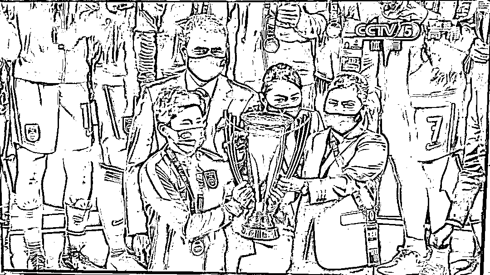

**01** 

在男足灰头土脸的时候，中国女足逆袭韩国队夺得冠亚洲杯冠军，兴奋之余，更是狠狠打了男足的脸，女足每胜一场比赛，男足都要被拉出来鞭一次尸。

申明一下，这不是挑拨女足与男足的关系。

谁能想到中国足球的门面前，居然是靠一群姑娘给撑起来的！

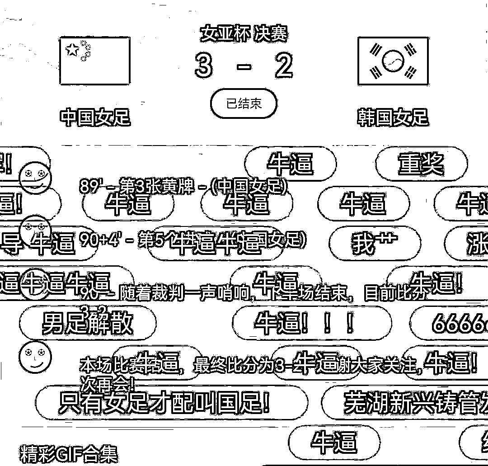

**中国男足谁也赢不了！**

**中国女足谁也赢不了！**

女足很好，但大家对女足的态度，很像重男轻女的家长对女儿的态度。

只有成绩好的时候，才能得到夸奖，成绩不好的那些年，或者表现平凡的日常年份，全社会几乎没人关注，仿佛这个女儿不存在一样。

这逼得女儿只有拼老命考 100 分，才能得到家长的关注，而且常常被用来做责骂儿子的工具人，你看你姐姐都考 100 分，你这个废物怎么才考 40 分……

男足就不一样了，这种关注是时时刻刻都在，成绩好的时候，自然是举国欢庆，成绩不好的时候，则是恨铁不成钢的臭骂，骂完之后，一有大赛，还是舍不得不看，看完又骂，骂完又看，就是放不下。

**中国女足和中国男足，像极了一个家里，占尽家财却一事无成的儿子和受尽屈辱却很争气的女儿。**

**按这个标准，中国观众对儿子的爱才是真爱，对女儿则不是。**

女足真正需要的是关注，是记住。

借用现场观众的一句赞美：

**“感谢女足姑娘给我们带来这种无可挑剔的祖国荣誉感。”**

**02**

**不知道中国男足在看女足姑娘们比赛的时候是什么心情，这群拿着高薪享受着高福利的大老爷们儿看来真的是海参吃过头了。** 

**大年初一的国足 12 强赛上，中国队 1:3 败于越南队，无缘卡塔尔世界杯，气得我连发几条朋友圈吐槽。**

**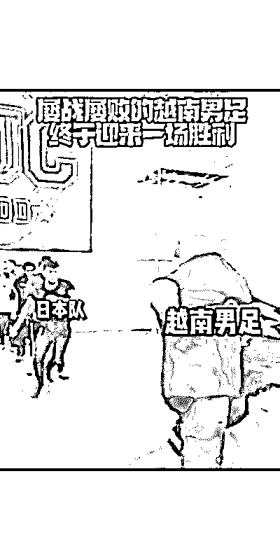**

**中国足球不行，这是全世界公认的，要说咱们中国现在是什么都强，唯独足球这一项，在全世界面前丢了一次又一次脸。**

****

**赛后，国足主帅李霄鹏道歉：**向所有球迷道歉，输球主要是比赛前设计出现了问题，后续无法补救，比分无法接受。****

**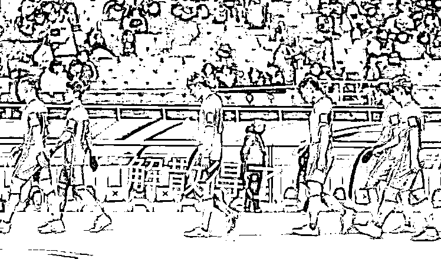**

**要说有钱那还是中国男足有钱，十年来光是广州恒大在足球上面的投入就将近 200 亿，引进归化球员花了 8.7 个亿，这些钱，到底去了哪里？**

****可能都在那一筐筐海参上，毕竟中国男足都是吃海参补身体的，中国女足只能一天三顿都吃面食。****

**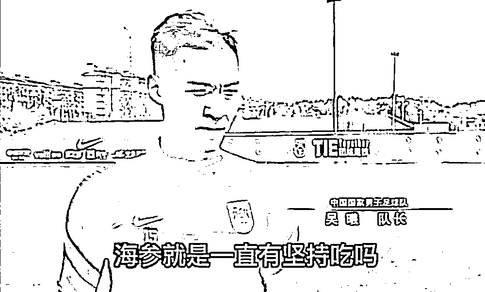**

**吃面食的苦孩子们为国争光了，吃海参的少爷兵们都为国丢脸了，公平？**

**中国男足吃了海参补足的元气，到底是用在踢足球还是其他方面并不可知，不过早年间中国男足也是有赢过的。**

**足坛反腐反赌风暴正紧的时候，国足就曾经 3:0 血洗韩国；天上人间会所刚被查封的时候，国足也 1:0 击败过法国队。** 

**巧合吗？我不知道。**

**不过我想中国男足的球员应该不会去逛天上人间，万一碰到熟人或者是足协的领导该怎么办？** 

****男足踢球是为钱，女足踢球是为国！****

**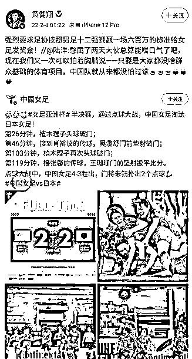**

**中国足球高薪低能是事实，球迷们再怎么谩骂又如何，该赚的都要赚。**

****你笑国足踢球菜，国足笑你还房贷！****

**根据调查机构 Sporting Intelligence 公布了 2018 年全球体育俱乐部球员薪资情况显示，**中超球员平均年薪高达 105 万美元（约 724 万人民币），在世界足球联赛中仅次于英超、西甲、意甲、德甲和法甲这五大联赛。****

****

**日本的足球队员平均年薪只有 31.5 万美元，韩国的足球队员只有 13.3 万美元，澳超的是 13.2 万美元。**

**2020 年中国足球周薪排名前十位的球员分别是：**

**第 1 名：武磊 西班牙人足球俱乐部 周薪 3.6 万欧元**

**第 2 名：埃克森 广州恒大足球俱乐部 周薪 3.3 万欧元**

**第 3 名：阿兰 广州恒大 周薪 3 万欧元**

**第 4 名：曹赟定 上海申花 周薪 1.3 万欧元**

**第 5 名：蒿俊闵 山东鲁能 周薪 1.3 万欧元**

**第 6 位：李学鹏 广州恒大  周薪 1.2 万欧元**

**第 7 位：张琳梵  广州恒大 周薪 1.2 万欧元**

**第 8 位：颜骏凌  上海上港  周薪 1.1 万欧元**

**第 9 位：张稀哲  北京国安  周薪 1.1 万欧元**

**第 10 位：池忠国  北京国安  周薪 0.9 万欧元**

**这样一算，每个人都是年入数百万甚至上千万的富豪，当然这还只是台面上的收入，还有很多是额外收入。**

**所以，月薪三千的你在那边骂人家踢球垃圾，丝毫不影响人家开着保时捷、兰博基尼和大 G，玩着嫩模女明星。**

**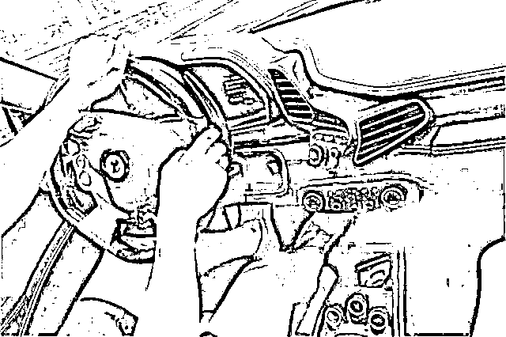**

**2015 年的调查，中国女足的平均月薪只有 3000，甚至不如一个大学生一个月的工资。**

****很多优秀球员二十六七岁的黄金年龄，就选择退役了。****

****没有收入，拿什么支撑梦想。****

**网上有人呼吁说，请降低男足的年薪，他们不配！**

**那中国男足有拿出相应的成绩吗？大家心里都有数。**

**他们有拿出相应的态度吗？**

****这个不好说，反正从他们狂扫奢侈品，出国比赛还租几辆车运行李来看，不说是心无旁骛，至少也是狂嫖乱赌。****

**里皮当年卸任教练时骂骂咧咧，弄得人家一把年纪，来中国上班都不敢拿钱了。**

**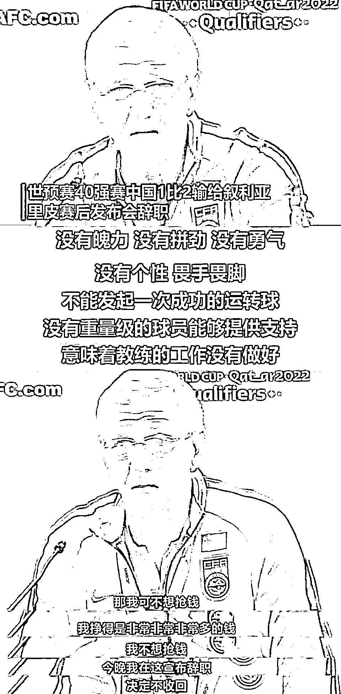**

****男足用自己的没下线，给人家廉耻心都弄出来了，钱都不要就跑了。****

**中国男足配吗？**

****他们只会一边干着丢人现眼的勾当，一边努力问别人讨要尊严。****

**中国男足能干嘛？连叙利亚都打不过。** 

**当年，世界杯预选赛亚洲区 40 强赛抽签都还没开始，相声演员岳云鹏居然真的未卜先知，调侃中国足球要是跟叙利亚分一组，可能都没法赢。**

**叙利亚多难啊，又是战乱国家，可能连双球鞋都没有。**

****

**结果，坑爹是真的被岳云鹏给说中了，男足真的踢不过叙利亚，后面的大家也知道了。**

**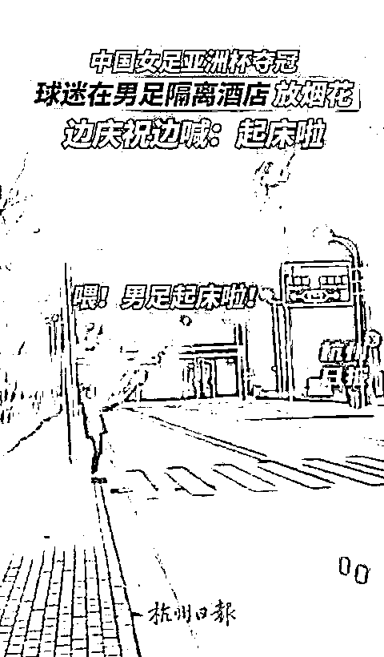**

****03****

****为什么中国女足没有诋毁，只有鼓励，就算是亚洲杯跟韩国的大战中，前期落后于韩国队，得到的也是鼓励和加油？****

****为什么我们的女排、我们的乒乓球、还有张伟丽，他们比赛失利的时候，收到的是大家的激励和安慰？****

******因为中国男足正用着最顶配的资源，占据最高的曝光度，却干着最恬不知耻的事。******

****就在决赛之前，我刷到女足的姑娘们上直播间，有一个有意思的动作，就是晒腹肌。****

 ****[`v.qq.com/iframe/preview.html?width=500&height=375&auto=0&vid=c3321optna1`](https://v.qq.com/iframe/preview.html?width=500&height=375&auto=0&vid=c3321optna1)**** 

****请看女足队员的腹肌：****

********

****再看男足的白斩鸡：****

****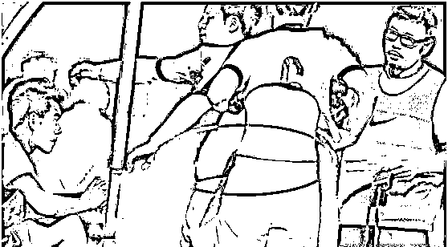****

****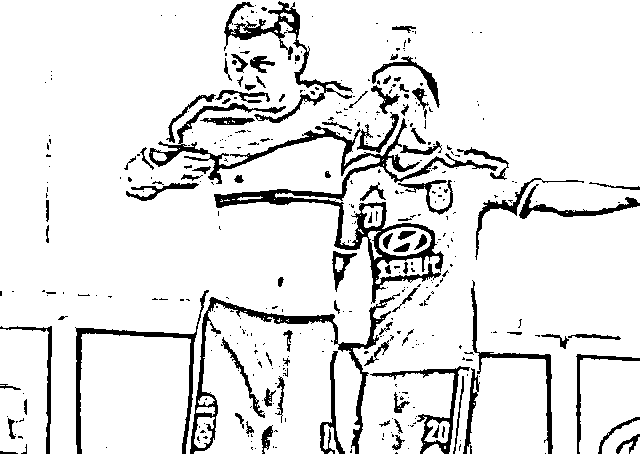****

****再看看 2002 年时国家队球员的身材，腹肌、胸肌都是在的，虽然当时也不是亚洲一流，但至少是个亚洲二流。****

****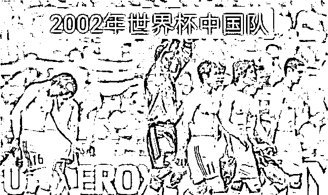****

****现在已经沦落到输越南了，就像范志毅所说下一个就要输缅甸了！****

****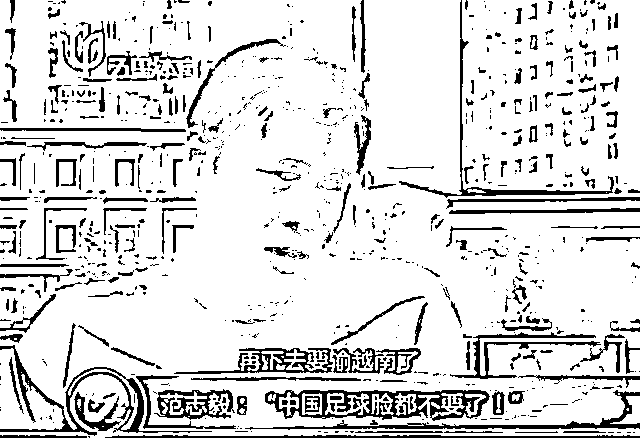****

****虽然那时的国足成绩也不太拿得出手，但是精气神还在，身材也还能看得过去，起码还有日常训练和锻炼的痕迹。****

****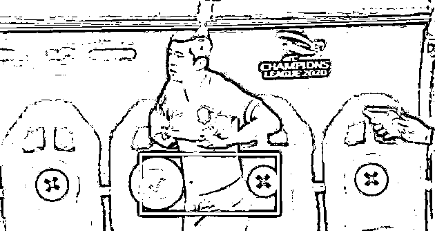****

****再看看如今男足，技术可以烂，身材也懒得装了，反正都是输球，谁不会啊，不耽误赚钱拿工资就行。****

********

****最后，懒得再说男足那些丧气玩意儿。**** 

****随着中国女足 2022 亚洲杯夺冠，我们更应该认识到——女足不是男足的影子，她们是国足、是中国的骄傲，值得更多尊重、更多掌声、更多关注。****

****至于中国男足，兜兜转转这么多年，依旧在泥潭里扑腾。****

****很多人以为亚洲杯亚军是中国男足的起点，没想到最后却变成了再难逾越的高峰。****

****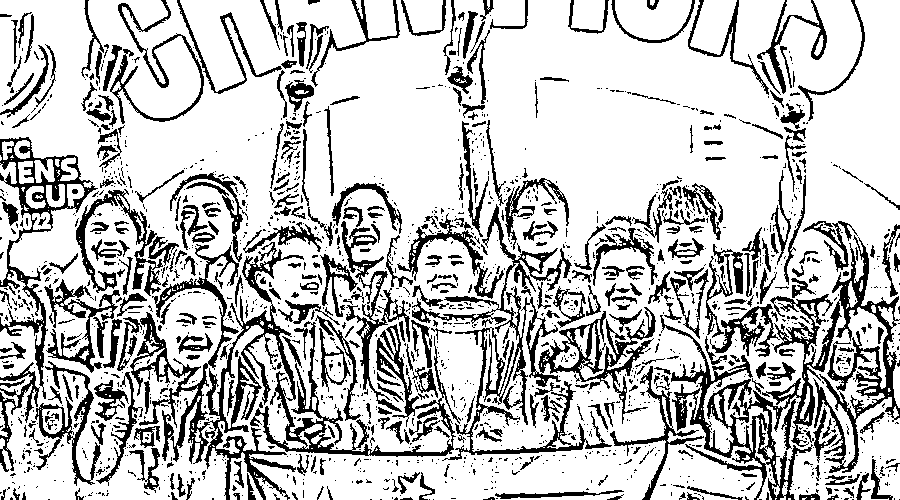****

****来源：昌南大队长****

****************

****← 向右滑动与灰产圈互动交流 →****

********