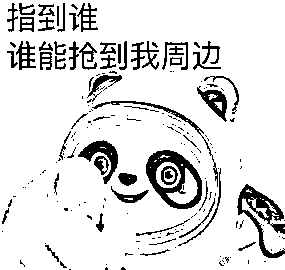

# 抓住“冰墩墩”超话里的骗子！

> 原文：[`mp.weixin.qq.com/s?__biz=MzIyMDYwMTk0Mw==&mid=2247529305&idx=2&sn=f8ad30f5fa712212b255f68393f32d05&chksm=97cbb861a0bc3177310c23e85bd7801e01cde83c2a1751cab7a759dc1d771998107cc41d0c20&scene=27#wechat_redirect`](http://mp.weixin.qq.com/s?__biz=MzIyMDYwMTk0Mw==&mid=2247529305&idx=2&sn=f8ad30f5fa712212b255f68393f32d05&chksm=97cbb861a0bc3177310c23e85bd7801e01cde83c2a1751cab7a759dc1d771998107cc41d0c20&scene=27#wechat_redirect)

开工第一天，不知道大家困吗？ 

我挺困的。

但是有一群人可能比咱们更困。

那就是半夜还在排队购买冰墩墩的朋友们。

↑图片来源：新京报

** 1 **

** 虎年第一个顶流，来了 ** 

冰墩墩，这个新年长假里的绝对顶流。 

作为 2022 北京冬奥会的吉祥物，它以浑圆的体型和灵动的形象俘获了所有人的心。

首先就是它的头号粉头，日本记者辻岗义堂。

2 月 2 日，辻岗义堂正在和日本电视台连线，他说虽然没有日本运动员到达北京的消息，但是有冰墩墩的最新情报。

随后掀开衣服，露出了挂在胸前的六个冰墩墩胸章。

他还在奥运村里疯狂购买冰墩墩周边，然后寄回了日本。 

在与日本电视台演播室连线时，主持人现场开箱直播。

看着主持人兴奋地从中国邮政的纸箱里拿出冰墩墩，真的是太好笑了。

他现在有个新名字——义墩墩。 

捷克运动员抱着睡觉、摩纳哥亲王问能不能再给一个、众人希望羽生结弦和冰墩墩合影……

**这些名人的加持，都给冰墩墩的走红拱了好几把火。**

开幕式当晚，冰墩墩的热搜话题直接冲到了第 10 位，冰墩墩相关品牌的联名款也相继断货。

仅昨天一天，**和冰墩墩相关的热搜更是多达 19 个**。

奥林匹克官方旗舰店线上店铺里，最受欢迎的“冰墩墩”挂饰、摆件已经售罄下架。

当天预售的 5000 个冰墩墩手办，上线**15 分钟后就显示下架售空**。

有网友总结了冰墩墩的线上购买渠道，全部售罄。

不仅是国内，在日本二手网站 mercari(煤炉)上，不少高价出售的冰墩墩相关周边被抢购一空。

而在ヤフオク(雅虎拍卖)上，一对冰墩墩和雪容融的玩偶最高已经竞拍到了**22000 円(折合人民币约 1210 元)**。

作为冬奥特许商品零售店中面积最大、品种最全的“网红打卡地”，北京王府井工美大厦每天都是人满为患。

据新京报报道，晚上九点，店已经关门了，保安拉起了警戒线，劝返还在陆续赶来的顾客。

但是人群依然没有散去—— 

因为他们在等着明天早上第一批进店的名额。 

工作人员贴出一张告示：“今日冰墩墩毛绒玩具到货 100 只，每人限购 1 只”。 

就算只能买一个，也不能浇灭大家对墩墩的热情。

劝不动，只能帮大家解决解决困难。

工作人员开始给排队的人发放暖宝宝，要知道现在北京的天气还是零下呀！ 

**凌晨 1 点，气温越来越低，排队的人越来越多。**

****↑图片来源：新京报

**9 点 20 分，旗舰店工作人员陆续上岗，货架摆上了“冰墩墩”毛绒玩偶，十分钟后，店铺正式开门营业。**

**工作人员给进门的消费者发放号码纸——这相当于“冰墩墩”毛绒玩偶的“购买券”。**

****

**↑图片来源：新京报**

**如果你是在想拥有一个冰墩墩，倒是还有个不排队的方法。** 

****在冬****奥比赛中获得前三，就能得到一只冰墩墩！****

**还是定制版！有金穗穗的那种！**

**（开玩笑的）**

****

****

**** 2 ****

**** 注意，有人被骗了！****

**盲盒、保温杯、玻璃杯、毛绒玩具匙扣、徽章.....**

**冰墩墩的周边，绝对不输任何一个顶流 IP。**

****

**黄牛党当然不会错过这个敛财的好机会。**

**在开幕式之后，冰墩墩的各种周边被炒上了天，在二手交易平台，一个原价 80 块钱的毛绒公仔被炒到了 500 块。**

****

**一份“代购”发来的报价显示，一枚冬奥会铜章已经被炒到了上千元。**

****

**但是，由于管控有力，现在各个二手平台上，“冰墩墩”相关的链接都已经被掐断。**

****然而还是没能阻止利欲熏心的人。**** 

**据一位网友所说，她在冰墩墩超话里（没错，咱们顶流墩已经有超话了）联系到一位卖家。**

**对方承诺可以帮她代购一套盲盒。**

****

**比原价**高出 400 块钱**，承诺包含隐藏款。** 

**对方提供了一个银行卡号，称转账后即可发货。**

****

****

**结果，就在买家转账之后，立刻被对方拉黑。**

**1100 块钱就这样打了水漂。**

****

**据网友曝光，这位骗子还是个惯犯，在“冰墩墩”超话里到处骗钱。**

**犹记得去年玲娜贝儿爆火的那段时间，也是山寨、炒作、骗局，乱象横生。**

**一定要防范这样的情况再出现在冰墩墩身上啊！**

**** 

**** 3 ****

****“冬奥”骗局，唠叨两句 ****

**如何落实“一户一墩”，网友们纷纷在热搜上请愿。**

****

**2 月 5 日晚，冬奥旗舰店通过微信公众号发布温馨提示，总结一句话就是：** 

****正在尽全力积极协调备货，不要相信价格炒作！****

**就连王府井工美大厦的保安都在喊话：十五以后都有货，全年售卖！**

****

**之前发售的冬奥纪念币，就有骗子声称能帮忙代购大肆敛财。**

**关于“冬奥”的骗局，小呸还得在这里唠叨两句。** 

****1、虚假中奖信息诈骗****

**在浏览网页或者网络聊天时，会“幸运”地收到“中奖”信息。**

**信息显示，你在冬奥会回馈抽奖活动中获得大奖，并编造吸引眼球的奖品。当信以为真的市民与兑奖方联系，对方都会以需要保证金、支付邮寄费用等各种借口，要求市民先汇钱。**

**当汇去第一笔款后，骗子还会以手续费、税款等其他名目，继续欺骗市民汇款，直到“吃干榨尽”为止。**

****

****2、假冒冬奥****会官方网诈骗****

**不法分子通过搭建虚假的冬奥会官方网站，在网站上进行所谓的“幸运抽奖”“冬奥纪念品赠与”“冬奥限量版纪念邮票限时抢购”“冬奥纪念币抢购”等活动，诱骗进行在线注册。**

**而诈骗分子早已在网站中植入盗号木马或病毒程序，一旦市民按照网站设定的路径操作，就会落入诈骗分子的圈套，导致个人信息泄露，甚至银行卡中的钱财被转走。**

****

****

**警方提示** 

**一、对各种有关冬奥会的抽奖活动，最好登录冬奥会官方网站或向权威机构核实。**

**二、遇到需要提前支付“预付款”、“定金”、“手续费”等，诈骗的可能性极大，千万不要轻信。**

**三、不要轻易点击来历不明的链接和网页，不要轻易在网上泄露自己的身份信息、存款信息、银行卡信息等。**

**朋友们，一户一墩的梦想会实现的。**

**耐心等待，千万别上骗子的当了！** 

****

********

**← 向右滑动与灰产圈互动交流 →**

****