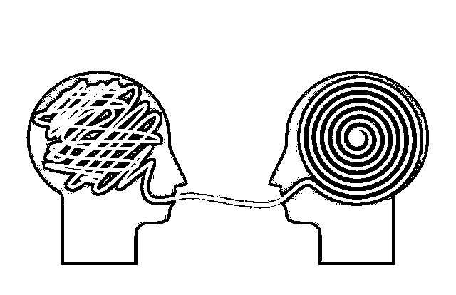
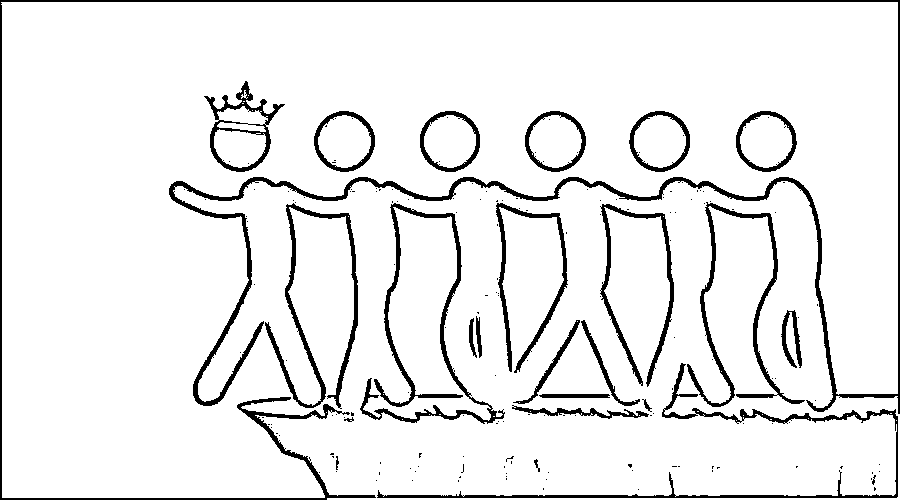
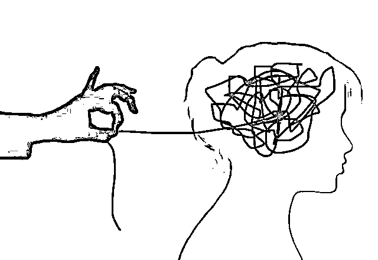

# 今天你被“理财大师”忽悠了么？

> 原文：[`mp.weixin.qq.com/s?__biz=MzIyMDYwMTk0Mw==&mid=2247529305&idx=3&sn=7aa804b66170c96af5281d084c54781c&chksm=97cbb861a0bc317703c9b6491fa54ac051fed2b337d6106f199e41910defd93df5b72cdeeb63&scene=27#wechat_redirect`](http://mp.weixin.qq.com/s?__biz=MzIyMDYwMTk0Mw==&mid=2247529305&idx=3&sn=7aa804b66170c96af5281d084c54781c&chksm=97cbb861a0bc317703c9b6491fa54ac051fed2b337d6106f199e41910defd93df5b72cdeeb63&scene=27#wechat_redirect)

为什么永远叫不醒

那些被诈骗平台洗脑的人？

为什么那些明摆着忽悠人的项目

却让许多人中招？

这些“理财大师”

是如何让人心甘情愿上当的？

今天，我们就来深扒一下

骗子是如何利用心理学忽悠人的

01

模糊话术，心理误导

“我的工资只有 2500，别人问我收入，我说没到 2 万，我说得没错。”

这种模糊的说辞和心理误导，是“理财大师”常用的套路。

他们把精心设计好的说辞烂熟于心，在适当的时候，偷换思维对象、模糊概念，通过似是而非的话术，误导你付诸错误或者不理智的行动。

如果你关心收益，就把 N 年收益，偷换成“N 次”；如果你关心风险，就把合作意向说成实际项目；如果你关心项目前景，就把一般业务往来夸大成战略合作......理性思维不强的人，很容易就会被带偏。

提醒：生活也好，工作也罢，但凡涉及金钱的事情上，我们务必要多一份心眼，多一份理性的思考。

02

顾盼自雄，权威效应

“人微则言轻，人贵则言重”，即“权威效应”。人们总认为权威人物的思想，行为和语言往往是正确的，服从他们的引导会使自己得到“安全感”。

“理财大师”深谙其中精髓，所以都喜欢往自己身上套各种“高大上”的头衔，然后以一种超然的姿态告诉你该怎么去投资理财。

面对投资者，他们言谈毫无顾忌，观点犀利，努力营造出一种运筹帷幄的气势，为的就是争夺心理上的强势位置，让你不敢质疑他们。面对“权威”，普通人很容易就会失去质疑能力，而失去质疑能力则意味着失去求证真相的机会。

提醒：世事无绝对，“理财大师”那些稳赚不赔、微投入超高回报的说辞，99%都是谎言。

03

煽动情绪，激发欲望

心理学研究表明，一个人情绪上头的时候，是没有理智可言的。于是乎“理财大师”都想方设法地煽动情绪，试图使你作出错误的选择。

常见的套路是通过持续性聊天或理财培训引发你对贫穷的焦虑和恐慌，继而激发暴富的欲望，再把这种欲望放得很大，最后告诉你只有参与某个理财项目才可以快速实现财富自由和逆袭人生。

他们把项目描绘的天花乱坠，让人产生谁放弃这个项目谁就是愚蠢的念头，仿佛这就是唯一的机会，错过了就有可能穷一辈子，所以不管用什么方式你都要先把本钱凑出来。对自己的情感掌控能力不强的人，很容易就会被骗子煽动，活在骗子编制的梦里。

提醒：但凡吹嘘几千上万的本金便可通过理财实现财富自由，年入百万千万的，一定是诈骗！

04

群体施压，从众心理

“幼儿园里有一个小朋友哭，很快全班的小朋友也跟着哭，除了第一个小朋友，大家都不知道哭的理由。”

人们都有一种与生俱来的从众心理，这种心理很容易演变成盲从，而盲从则往往会陷入骗局。

许多投资理财的受骗者，都是先被拉进某个“炒股群”，然后群里的“投资小白”提出问题、咨询经验，“理财大师”侃侃而谈，热情解答，最后大家都往群里晒各种收益截图，发表投资心得。

如果你看完这些“表演”还无动于衷，骗子就会换种方式对你进行心理上的群体施压，让你感觉自己“不合群”，迫于压力，缺乏自主能力的人很容易向多数人妥协，随波逐流！

提醒：不加入全是陌生人的“投资群”，别轻信群内“朋友”晒出来的收益截图。一夜暴富是骗局，两夜暴富也别信。

来源：十堰人民路派出所

← 向右滑动与灰产圈互动交流 →

