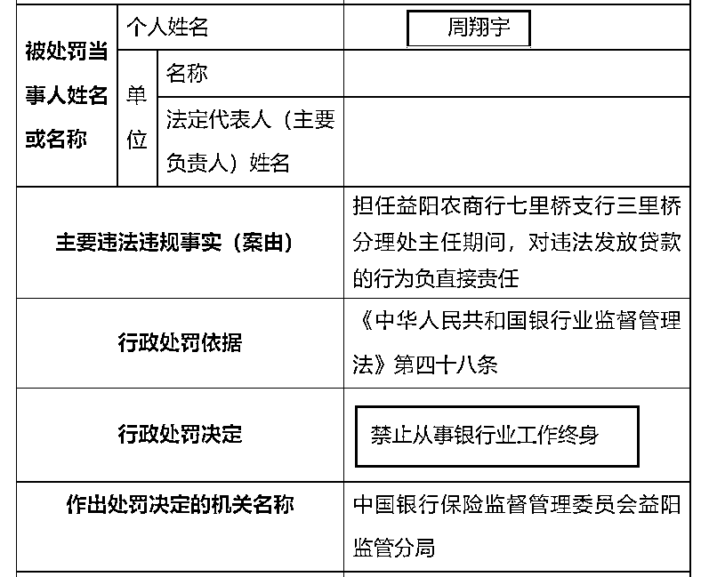
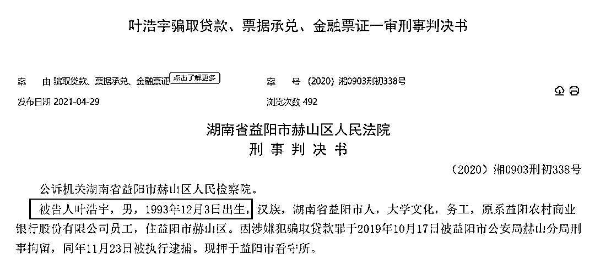
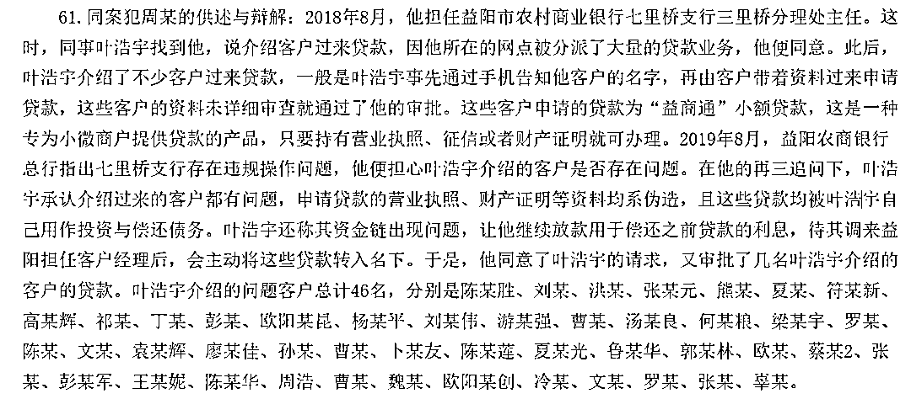
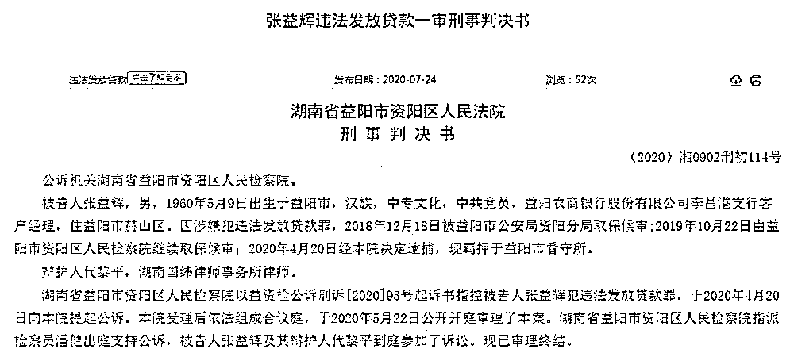
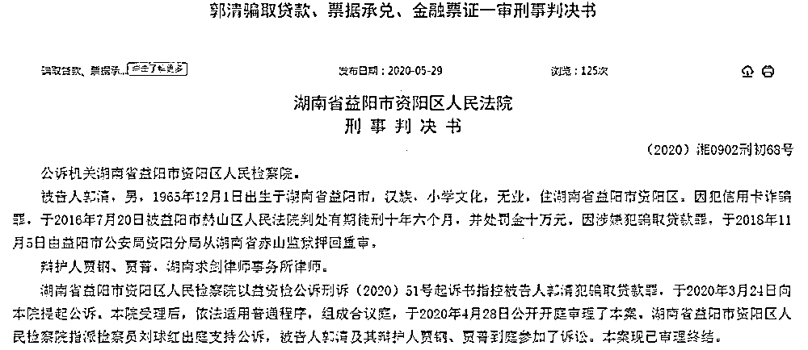
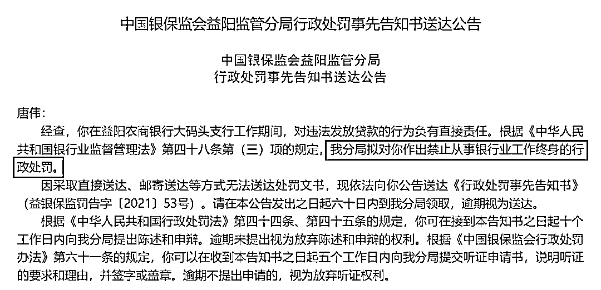
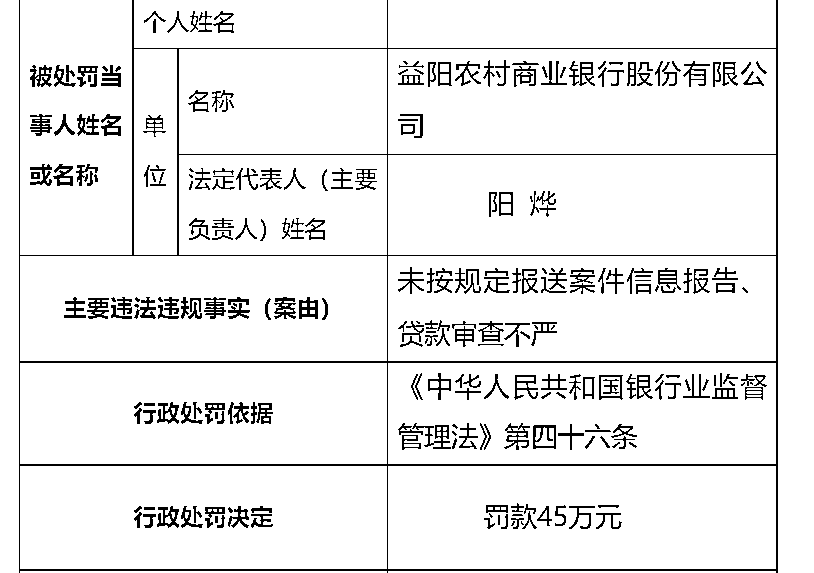

# 惊呆！90 后银行小伙，骗贷超 370 万，投向酒吧、会所等，结果还升职了

> 原文：[`mp.weixin.qq.com/s?__biz=MzIyMDYwMTk0Mw==&mid=2247529305&idx=5&sn=da9bcd51215afaa2f3dad57220eca154&chksm=97cbb861a0bc3177b44082537a8763b590f5e988b1b88bc07769ec6762997fb204b3bb686211&scene=27#wechat_redirect`](http://mp.weixin.qq.com/s?__biz=MzIyMDYwMTk0Mw==&mid=2247529305&idx=5&sn=da9bcd51215afaa2f3dad57220eca154&chksm=97cbb861a0bc3177b44082537a8763b590f5e988b1b88bc07769ec6762997fb204b3bb686211&scene=27#wechat_redirect)

2020 年，一场 1714 万元的巨额骗贷案被披露之后，益阳农商行屡屡再爆违法放贷案件。

前不久，银保监会益阳监管分局一日之内对益阳农商行开出 13 张罚单，主要披露了该行 4 家支行的行长、客户经理等人在任职期间存在的违法违规行为。

其中，益阳农商行七里桥支行客户经理叶浩宇，因对违法发放贷款、挪用信贷资金的行为负直接责任，被处以终身禁止从事银行业工作。

原益阳农商行七里桥支行三里桥分理处主任周翔宇，对违法发放贷款的行为负直接责任，被处以终身禁止从事银行业工作。

据裁判文书网披露的《叶浩宇骗取贷款、票据承兑、金融票证一审刑事判决书》显示，其为缓解资金紧张，制作虚假贷款的相关资料，并伙同益阳市农商银行七里桥支行三里桥分理处主任周翔宇等人，在益阳农商银行三里桥分理处骗取贷款 46 次，共骗得银行贷款 373 万元。

**90 后小伙年入 7 万元**

**骗贷近 400 万**

**花上百万投资酒吧等生意**

裁判文书显示，叶浩宇，1993 年 12 月 3 日出生，原来是益阳农商银行千家洲支行员工。

为满足其日常开支和挥霍，叶浩宇自 2018 年 9 月至 2019 年 9 月邀集李响、吴某等多人为其寻找名义贷款人，制作虚假贷款的相关资料，并伙同益阳市农商银行七里桥支行三里桥分理处信贷员周某（另案处理）等人，利用陈伟胜、曹某、张余等 46 名贷款人的名义，伪造名义贷款人的户口本、营业执照、房产证等相关贷款资质材料，在益阳××三里桥分理处骗取贷款 46 次，共骗得银行贷款 373 万元。

据叶浩宇的供述，他是益阳农商银行千家洲支行的综合柜员，一年的薪酬大概在 7 万元左右。2018 年 6 月，他与梁懿在酒吧相识。梁懿得知他是益阳农商银行的工作人员，便称只要银行工作人员在办理贷款的时候不实地调查，其可以提供名义贷款人和虚假资料将贷款弄出来。

2018 年 9 月，因叶浩宇做生意亏了，需要大量的资金填补亏空，他见梁懿的方法来钱比较快，就联系农商银行七里桥支行三里桥分理处主任周某办理贷款，周某同意了。

**那么骗来的 300 多万去哪里了呢？** 

据叶浩宇交代，这些从益阳农商银行骗取的贷款，其中 30 万元偿还给他姐姐李芳，20 万元偿还给他岳父李某，10 万用于偿还建设银行、招商银行、民生银行等银行的信用卡借款，在奥斯卡酒吧投资 48 万元，在怀化投资土石方工程 60 万元左右，被樊晶借走 60 万元，还有部分贷款用于偿还这 30 多笔贷款的利息。

**纵容骗贷**

**还升任 90 后小伙为客户经理**

在整个案件中，更夸张的是，原益阳市农村商业银行七里桥支行三里桥分理处主任周翔宇，在明明知道叶浩宇骗贷的情况下，为了能够补上漏洞，还继续放贷给叶浩宇用于偿还之前的贷款，并把叶浩宇调到其所在的七里桥支行升任客户经理。 

根据裁判文书显示，另据同案犯周翔宇的供述与辩解，2018 年 8 月，其担任益阳市农村商业银行七里桥支行三里桥分理处主任，叶浩宇找到他并提出介绍客户过来贷款，因为其所在的网点被分派了大量的贷款业务，于是便同意了这个计划。

此后，叶浩宇介绍了许多客户前来贷款，一般是叶浩宇事先通过手机告知周翔宇客户的名字，再由客户带着资料过来申请贷款，周翔宇未详细审查资料就通过了审批。据了解，这些客户申请的贷款为“益商通”小额贷款，是一种专为小微商户提供贷款的产品，只要持有营业执照、征信或者财产证明就可办理。

2019 年 8 月，益阳农商银行总行指出七里桥支行存在违规操作问题，周翔宇担心叶浩宇介绍的客户是否存在问题。在他的再三追问下，叶浩宇承认介绍过来的客户都有问题，申请贷款的营业执照、财产证明等资料均系伪造，且这些贷款均被叶浩宇自己用作投资与偿还债务。

同时，叶浩宇还称其资金链出现问题，让周翔宇继续放款用于偿还之前贷款的利息，并表示待其调来益阳担任客户经理后，会主动将这些贷款转入名下。

于是，周翔宇同意了叶浩宇的请求，再度审批了几名叶浩宇介绍的客户的贷款。叶浩宇也成为了七里桥支行的客户经理。

事实上，直到案发，叶浩宇仍然有 206 万元的贷款无法偿还。最终被判有期徒刑二年六个月，并处罚金五万元。除此之外，还要偿还益阳农商行 206 万元的损失。

**多名支行员工同时被罚**

**均涉及违法发放贷款**

除了叶浩宇、周翔宇之外，在上述提到的 13 张罚单中，涉及益阳农商行总行及 4 家支行，均指向其员工违法发放贷款行为。

行政处罚信息显示，益阳农商行大码头支行、七里桥支行、李昌港支行因贷款调查和审查不严，导致贷款被违法发放，分别被罚款 20 万元。同时，益阳农商行七里桥支行客户经理叶浩宇及三里桥分理处主任周翔宇、益阳农商行李昌港支行客户经理张益辉分别被处以禁止从事银行业终身，益阳农商行李昌港支行行长刘东方被取消高管任职资格 2 年，益阳农商行大码头支行行长夏美新、迎风桥支行行长郭韬均被给予警告。

上述被罚终身禁业的张益辉早在 2020 年 7 月，就因犯违法发放贷款罪被判刑。 

据益阳市资阳区人民法院在裁判文书网公布的刑事判决书显示，益阳农商银行李昌港支行客户经理张益辉，违反国家规定发放 15 笔抵押担保贷款，为贷款使用人郭某办理贷款累计 1089 万元。至案发，尚有 305 万元贷款逾期未能归还。一审判处有期徒刑 3 年。

该案是当年轰动全国的益阳 1714 万元巨额骗贷案中的一部分。

据此前报道，2008 年，郭某因其经营的青春砖厂、苗圃需要资金周转，便开始以郭某 9、匡某 4、陈某、周某某等人名义，伪造相关贷款资料，在益阳农商银行迎丰桥、李昌港、新桥河、大码头等支行累计骗取贷款 1714 万元，其所得款项用于偿还银行贷款本息及个人所欠债务等。

至案发，郭某在上述 4 个支行骗取的贷款共有 480 万元逾期未归还，其中就包括李昌港支行的 305 万元。2020 年 4 月，资阳区人民法院对郭某决定执行有期徒刑 12 年 8 个月。

此外，1 月 18 日，银保监会益阳监管分局再次披露一则行政处罚事先告知书，益阳农商银行大码头支行原副行长唐伟，因对违法发放贷款的行为负有直接责任，被处以禁止从事银行业工作终身的行政处罚。

据裁判文书网 2019 年 3 月 21 日披露的信息显示，原益阳农商银行大码头支行副行长唐伟因违法发放贷款罪被判刑。

据判决书显示，自 2010 年以来，唐伟在担任益阳农商银行大码头支行副行长期间，利用自身职务便利，以他人的名义在大码头支行进行贷款 459 万元，所得款项用于唐某本人偿还银行利息、归还自己所欠债务及补贴家用等。

直至案发，尚有 146 万元贷款逾期未能归还。资阳区人民法院认为唐某已经构成违法发放贷款罪，判处唐伟有期徒刑 1 年 10 个月，并处罚金 2 万元。

多家支行出现员工违法发放贷款的情况，益阳农商行总行难逃其责，因未按规定报送案件信息报告、贷款审查不严，被罚款 45 万元，监事长陈建福、副行长蔡范均因对上述行为负有直接管理责任被予以警告。

来源：中国基金报，利箭在行动

← 向右滑动与灰产圈互动交流 →

