# 丰县「8 孩妈妈」事件：魔幻的三份官方通报下，老公居然接广告了！

> 原文：[`mp.weixin.qq.com/s?__biz=MzIyMDYwMTk0Mw==&mid=2247529393&idx=1&sn=371dac1988768a59735d05724cd7ead0&chksm=97cbb889a0bc319fc72f7a4d0f4778d5acf44b63a0902014d0af584d259a291899bdf5769362&scene=27#wechat_redirect`](http://mp.weixin.qq.com/s?__biz=MzIyMDYwMTk0Mw==&mid=2247529393&idx=1&sn=371dac1988768a59735d05724cd7ead0&chksm=97cbb889a0bc319fc72f7a4d0f4778d5acf44b63a0902014d0af584d259a291899bdf5769362&scene=27#wechat_redirect)

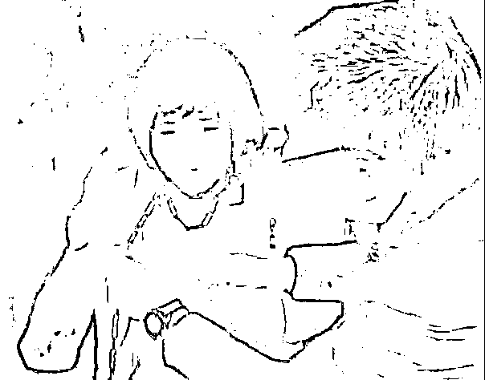

**“把女人像狗一样栓着，再让她生下 8 个孩子，十九世纪的俄国小说里也找不到这样的故事。”**

让人目瞪口呆的现实，远比小说来得更真实更残酷。

江苏省徐州市丰县欢口镇，0℃的低温下，一位八个孩子的母亲被其丈夫用铁链拴住脖子，睡破屋吃冷饭，网友纷纷怀疑其是被拐人员。

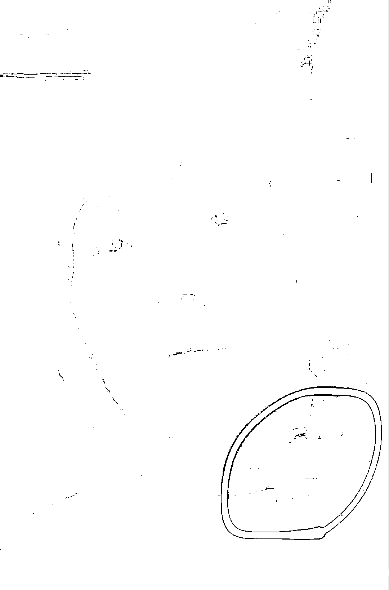

后面的连番大戏开始上演了。

**01** 

1 月 28 日，“丰县发布”第一次发布官方通告。

> 经初步调查核实，网民反映的女子为杨某侠，1998 年 8 月与丰县欢口镇董某民领证结婚，**不存在拐卖行为。**
> 
> 经医疗机构诊断，杨某侠患有精神疾病，目前，已对其进行救治，并对其家庭开展进一步救助，确保过上温暖的春节。
> 
> 具体情况正在进一步调查核实中。

1 月 30 日，“丰县发布”第二次发布官方通告。

> 杨某侠流浪乞讨时，被董某民父亲收留，此后与董某民生活在一起。生活中发现，杨某侠有智障表现，但生活尚能自理。 
> 
> 在办理结婚登记时，镇民政办工作人员未对其身份信息进行严格核实。 
> 
> **调查中未发现有拐卖行为**，但董某民用铁链捆绑杨某侠的行为涉嫌违法，公安机关已对其开展调查。 
> 
> 联合调查组将对相关情况深入调查，对失职、渎职的工作人员依法依规处理。公安机关已成立专案组对违法行为开展调查，涉嫌犯罪的将依法处理。

2 月 7 日晚间，“丰县发布”第三次发布官方通告。

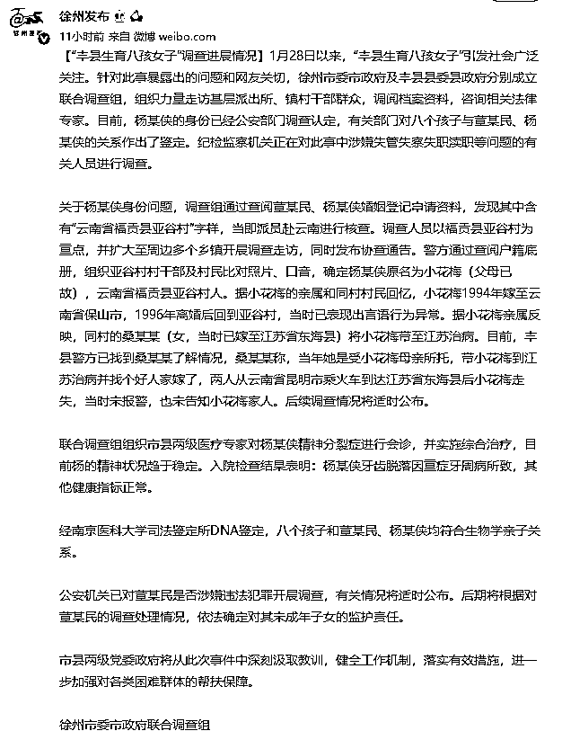

**已确认杨某侠的身份，系治病途中走失，但未明确认定其是被拐人员；公安机关已对董某民是否涉嫌违法犯罪开展调查，有关情况将适时公布。**

此次通报跟之前两次的有几个特点： 

**一是调查级别上升了。**徐州市委市政府及丰县县委县政府分别成立联合调查组。

**二是杨某侠身份确定了。**不是网上流程的是四川被拐卖女孩，而是云南省福贡县亚谷村人。

**三是孩子身份确定了。**经南京医科大学司法鉴定所 DNA 鉴定，八个孩子和董某民、杨某侠均符合生物学亲子关系。

**四是牙齿脱落因重症找到了。**杨某侠牙齿脱落因重症牙周病所致，其他健康指标正常。

**丰县前两次的通告，都称“未发现拐卖行为”。**

这非但没有压下舆情，却给人以遐想，好似添了一把火，浇了一桶油，让舆情不断发酵。

反观徐州市级调查组的通告就高级多了，**并未提及“未发现拐卖行为”，却称“找个好人嫁了……走失……后续调查情况将适时公布。”**

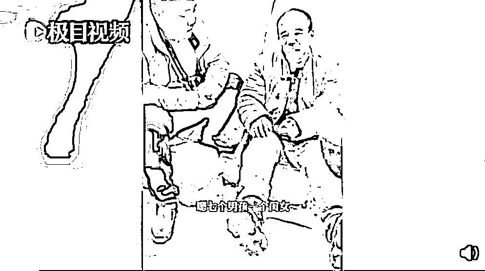

**我看懂了，桑某某是“好人”啊！**

带人千里看病，还要替她找个好人家嫁了，可惜她不小心火车站走丢了，事后桑某某又忘记报警又忘记通知她家人……

**结论：桑某某是“热心人”！**

你们看懂了吧！

这难道不是暗指存在拐卖行为吗？

**02** 

最让人火大的是，一名涉嫌违法的人居然能作为“流量名人”，一下子翻身成了网红？

请他代言的有装修公司，还有婚庆公司。 

[`mp.weixin.qq.com/mp/readtemplate?t=pages/video_player_tmpl&action=mpvideo&auto=0&vid=wxv_2254096215929864194`](https://mp.weixin.qq.com/mp/readtemplate?t=pages/video_player_tmpl&action=mpvideo&auto=0&vid=wxv_2254096215929864194)

**这个离谱的男人居然帮婚庆公司打起了广告！**

**真是离谱他妈妈给离谱开门——离谱到家了！**

理由是：她就是特别善良，热心实在。 

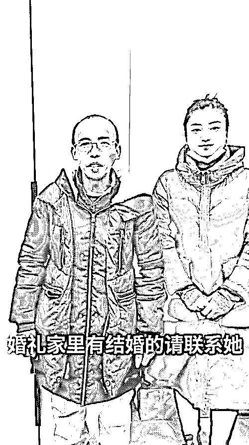

婚庆公司？请一个把妻子当成狗一样拴着，把女人当性奴和生育工具的人渣来代言见证美好幸福生活的婚庆，这到底是婚庆公司，还是混蛋公司？

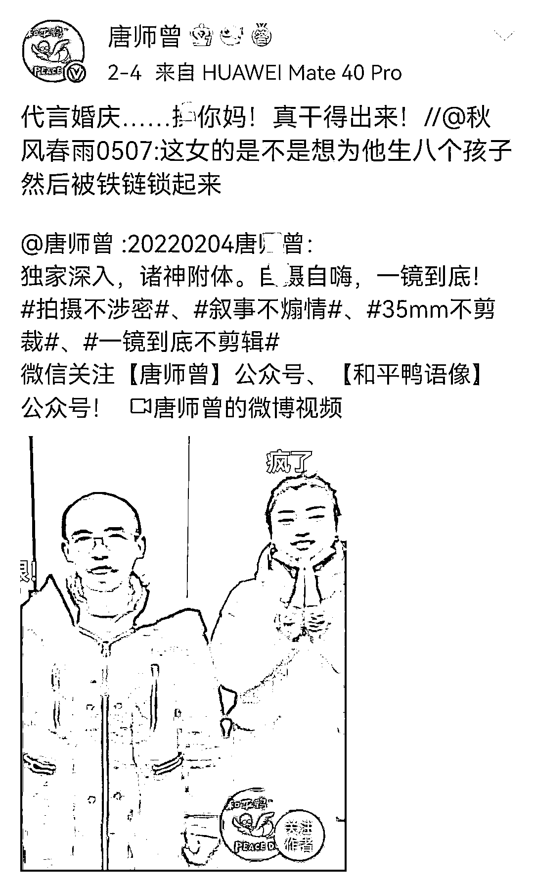

气得唐师曾老师都坐不住了！

最骚的是，看上去没有文化的董某民，还跟人谈起了经济学，他说别人生孩子都是赔本的，而他生孩子是赚钱的。**他这么多娃，一个长大之后赚 4000 元，八个娃就可以赚 32000 元，比很多人都强了。** 

而且他们家是注册的贫困户，所以一直可以领救济金，连房子都是政府帮忙盖的，养娃基本不花钱。

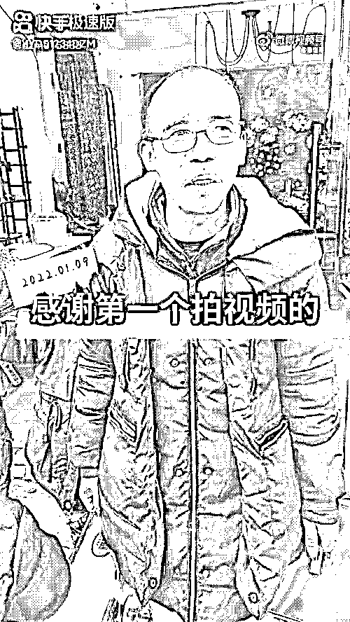

反观这次的通报，让我更加疑惑重重，为什么在这里“捡”到一个大活人就可以领回家“收留”？

**一、杨某侠是否真是被“捡”来的？**

不报警不送救助而是直接带回家，这简单的“收留”二字很难解释清不报警的原因，反而让人怀疑收留只是掩盖非法行为的借口。

**二、在杨某侠患有精神疾病且证件不全的状况下，登记结婚是否具有法律效力？** 在没有身份证和户口本的情况下便登记结婚，明显反常，那么用“合法登记”来否认涉嫌人口拐卖的说法便无法成立。

**三、董某民的行为是否涉嫌强奸？**

通报说杨某侠 1996 年离婚后回到亚谷村，当时已表现出言语行为异常，按照现行有效的《中华人民共和国残疾人保障法》规定“奸淫因智力残疾或精神残疾不能辨认自己行为的残疾人的，以强奸论，依照刑法第一百三十九条的规定追究刑事责任”。

那么与言语行为异常的杨某侠发生性关系的董某民已涉嫌强奸。

**四、超生问题如此明显是怎么过关并获得补助的？**

之前通报给出的解释是“镇计生部门均为其落实节育措施，但因身体原因失效”。

是谁的身体原因？什么身体原因能让节育措施失效，使其连生 8 个孩子？官方只字未提。

8 个孩子，7 人办低保，莫非办理手续的相关部门都是知情人？

**五、户籍册上她的年龄是多大？1994 年嫁至云南省保山市，1996 年离婚，那时候她多大？1998 年与八孩爸爸结婚时是否已是成年人？**

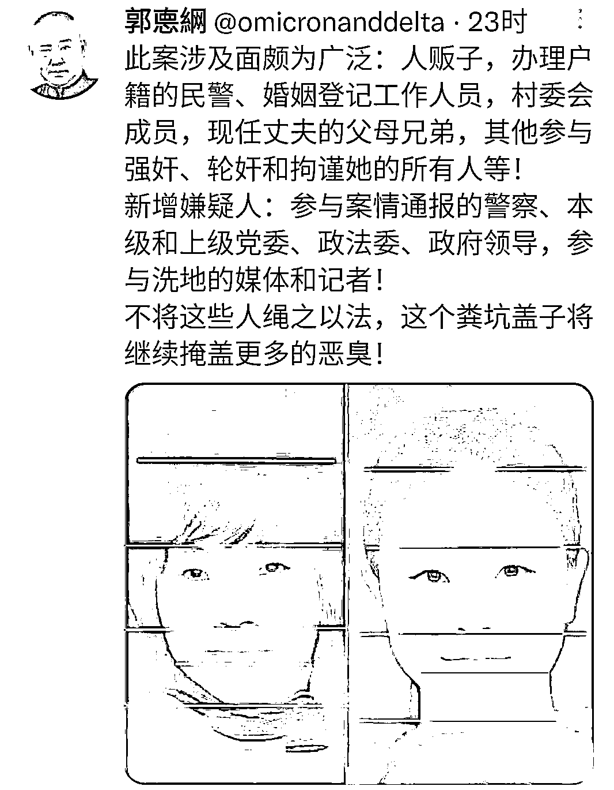

这事，真不能再由丰县和徐州市自己来查了。

应该提级，或者异地。

**自己来查自己，自己监督自己，这结果你真能信服吗？**

**03**

在农村经常能听到某某光棍“捡”了一个“傻子”，有些女子生了孩子，精神也不正常。

**众人都是习以为常的，在村里人的观念里，这是在做好事。**

所有“习以为常”的人在铁链面前都有罪，沉默就是帮凶。

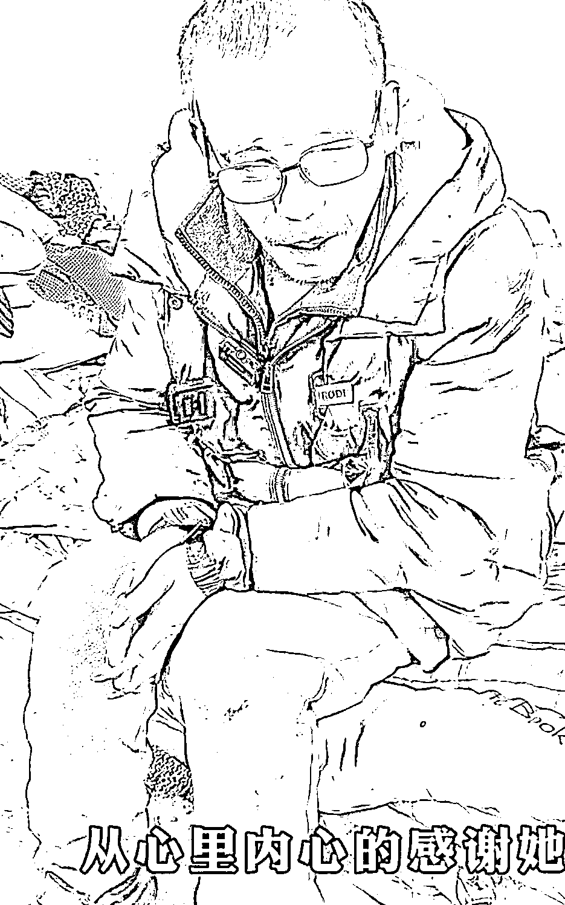

**坏人之所以肆无忌惮，正是因为“好人”的沉默，法律的失职！**

每当出现类似事件时，“对人贩子到底要不要处以死刑”，在众多的讨论中，支持者居多。

**人贩子一日不除，下一个遭殃的都可能是自己！**

但也有相当数量的反对意见，理由是对人贩子死刑会使现有的人贩子变本加厉，大不了鱼死网破，不利于解救被拐的妇女儿童。

**但在人贩子这里，没有人权，没有道理，没有规则，甚至没有法律。**

拐卖妇女的事情绝对不是孤立事件，以前发生很多，历史上就在徐州地区拐卖事件也十分猖獗。

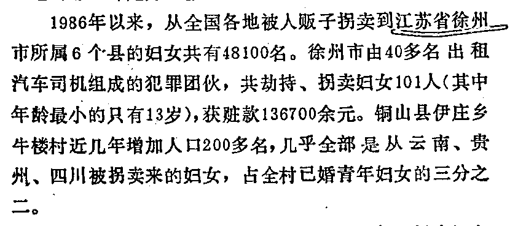

随着社会治安的改善，拐卖妇女儿童的案件逐渐减少，但放到全国，依然触目惊心。

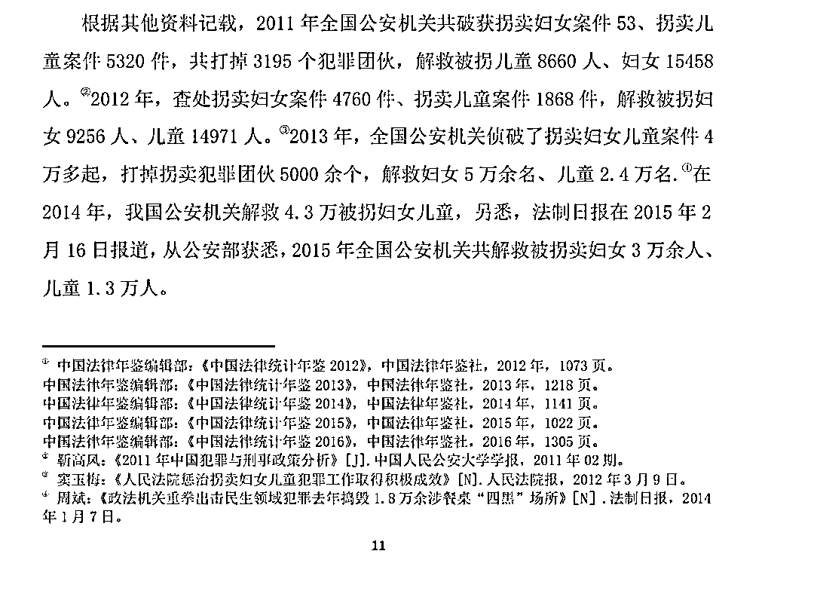

《大清律例‬》：“凡诱拐‬妇人子女，‬或‬典卖‬，或‬为妻妾‬子孙者，不分良人奴婢‬‬，已卖未卖，但诱取‬者，被诱之人‬‬若不知情，**为‬首者‬，‬拟‬绞监候**，被诱之人不坐。‬若‬以药饼及一切‬邪术迷拐幼小子‬女‬，**为首者立绞‬。**‬”

我国现行《刑法》，援引第二百四十一条“收买被拐卖的妇女、儿童罪”第一款之规定：“**收买被拐卖的妇女、儿童的，处三年以下有期徒刑、拘役或者管制。**”

**而该法条第六款还规定“收买被拐卖的妇女、儿童，对受拐儿童没有虐待行为，不阻碍对其进行解救的，可以从轻处罚。”**

**说白了，如果你买个媳妇或买个儿子，最高判三年，如果你不虐待被拐者，事发后不阻拦解救，还可以判得更轻。**

就像罗翔老师在课上警告女生们：“买你的量刑相当于买 20 只癞蛤蟆，你连鹦鹉都比不上。”

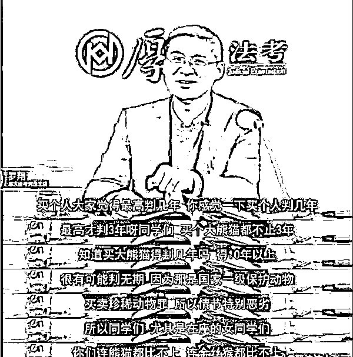

杨某侠是捡来的，就算是买个人才判三年，而且还有追诉期的问题。

**而且还是董某民的父亲捡来的，董某民能不能受到惩罚还不一定。**

这就是现实。

**之前大学生掏鸟蛋都被判 10 年，人不如鸟。**

不管是从法律上、人文上、伦理上，拐卖妇女儿童的人贩子都应该从严对待，因为只有这样，才能避免更多的人间悲剧发生。

愤怒的情绪无助于问题的解决，每个人都需要被尊重，每一次这样的事件出现，都是一次反省和进步的机会。

庆幸的是，我们应该看到，调查组处置舆情的态度始终是积极的，解决问题的决心始终是坚决的。

至少，现在杨某侠已经送医了，已经得到救助了，其身份信息，公安机关也深入调查了；董某民涉嫌违法，公安机关已经介入调查，董某民将会被绳之以法；当地政府那些失职、渎职公职人员也将会被依法依规处理。

**我始终坚信，光明前进一寸，黑暗就退却一点。**

**希望“合情合理”的发布后续能真正地解决问题，知错改过，人民才会觉得社会更美好更强大。**

**此前报道：**

[江苏生育八孩女子事件后，盲山女主角辟谣“被村民买”，反被围攻](http://mp.weixin.qq.com/s?__biz=MzIyMDYwMTk0Mw==&mid=2247528872&idx=1&sn=5aef3166e0fbb28331a1ddbebcd419f5&chksm=97cbba90a0bc338654d8cc198d7216aaed57f3fb727f32cf84774fa8844ade7213c0206e4b14&scene=21#wechat_redirect)

来源：昌南大队长

← 向右滑动与灰产圈互动交流 →

