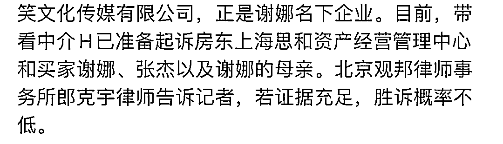

# 传谢娜夫妇上海买房跳单将被起诉？有钱买 6000 万豪宅，没钱付中介费…

> 原文：[`mp.weixin.qq.com/s?__biz=MzIyMDYwMTk0Mw==&mid=2247529393&idx=2&sn=1cda09393d52e5469c71eae6854113c4&chksm=97cbb889a0bc319fbb37c6fd7d553c0a6362cec7a914084532fac0c6b54fc175192ae89513b5&scene=27#wechat_redirect`](http://mp.weixin.qq.com/s?__biz=MzIyMDYwMTk0Mw==&mid=2247529393&idx=2&sn=1cda09393d52e5469c71eae6854113c4&chksm=97cbb889a0bc319fbb37c6fd7d553c0a6362cec7a914084532fac0c6b54fc175192ae89513b5&scene=27#wechat_redirect)

滴滴滴滴....吃瓜

这两天网上冲浪，一则关于张杰、谢娜购买上海思南公馆房子却跳单的文章火了。**明星+豪宅+跳单**，这几个词叠在一起是蛮吸引人了… 

之前我们就看到过八卦，说谢娜张杰为了孩子选择定居在上海。之前上节目采访，谢娜还说自己住在黄浦江边上，不过是租房子。

两个人说不会在上海买房的通稿，也是遍地飘。

**谢娜张杰上海买豪宅跳单？** 

而这两天，一位博主@上海房地产观察发文称，张杰谢娜买房跳单，看了两次说不喜欢不买，后面直接找房东签约。 

一名化名 H 的经纪人表示，张杰、谢娜曾于 2019 年 6 月 21 日和 22 日两次在其带领下看房，而后以不喜欢这套房子为由不再购买，但后期 H 发现，二人其实是私下联系房东购买了该房源，避开了 100 多万大额的中介费。

他们看中的思南公馆东苑，面积 341.77 平方米，竣工时间 2010 年，售价 6200 万元，折合单价约 18.14 万元。

思南公馆房子价格么，大家也心里有数额，租房子价格就比很多人工资高哈哈哈。

事后谢娜张杰的两位律师还找到这位中介的地址去威胁，还找到了公司去，**如果敢泄露他们的信息，就把他送进去。**

H 想告谢娜张杰却又害怕，于是去国外读研究生，这样也可以在国内正常起诉他们。

结果在国外感染了新冠，他怕自己时日无多，无法用法律手段让谢娜张杰得到惩罚，就让朋友曝光了。

不过他自己发的聊天记录，也算是锤了自己在对方说别拍照后，还是在看房过程中偷拍了好几张…

**网友热议，谢娜张杰发律师声明** 

跳单这件事怎么说呢，虽然中介赚的多，但是人家跑前跑后也付出了，这也是骗了别人的劳动成果吧。

不过，也有网友说，这也没啥惩罚吧。2019 年跳单也不违法，只能算人品差一点。

注*跳单违法是 2021 年明令禁止的。

但是如果觉得贵当时可以不找或者还价，而不是这种骚操作呀，买过房子都知道，中介一般会说抽成多少。现实中买房子也不是一看就行，说不定是看了许多家最后选定一套。

推荐的房源也是中介从更多参差不齐的房子中找出来的几套符合要求的。如果觉得不值，当时中途反悔都好一点，而不是利用别人选好一切后放鸽子…

当然，也有网友认为中介费太贵了，而且变相推高了房价，中介费本来就不应该以成交价来计费。

这个评论…是在自锤吗？证明谢娜他们找到房东直接交易？然后房东找了自己一个公司的中介开单，就逻辑很诡异啊。

粉丝们呢是这个说辞↓

谢娜张杰也在今天下午发出了**律师声明，称严重违背客观事实。**

**两夫妻口碑蛮差…**

不过这件事爆出来之后，更多网友就是一句，“像是那两个人能干的出来的事”…评论里大家都在说他俩抠门哈哈哈哈哈哈。

之前张杰解约时的钱，还是粉丝集资来的，这事在当时也闹得挺大的。

张杰答应开免费演唱会，然后就没有然后了，很多大粉脱粉。还是事情发酵之后，张杰才开了那场免费演唱会…

还有传闻说，谢娜拿酒店洗衣袋之类的… 

而对于这件事，有律师表示，如果证据充分，胜诉概率不低，而到那时候，除了丢人现眼，这俩人估计损失的不仅仅是中介费一百多万了…

明星的声誉永远高于一切。没有好的声誉，钱从哪来啊，怎么出道这么多年还没弄懂这个道理呢…

来源：上海全知道（ID：iknow-021） 分享：吃瓜不吐葡萄皮(ID:xbzavi)

← 向右滑动与灰产圈互动交流 →

