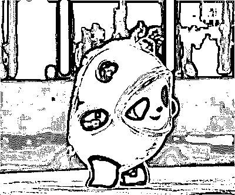
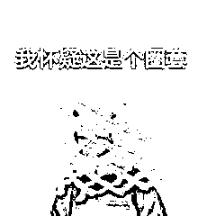

# 刚刚通报！倒卖“冰墩墩” ，警方已查获 3 人！

> 原文：[`mp.weixin.qq.com/s?__biz=MzIyMDYwMTk0Mw==&mid=2247529393&idx=3&sn=05d4f1cb12794eb8e03d1ace7d5aa5a6&chksm=97cbb889a0bc319fabe6faa1823cd31c58a19afa3720004fb4a2d05ac02e2c5bcaebcf999bc9&scene=27#wechat_redirect`](http://mp.weixin.qq.com/s?__biz=MzIyMDYwMTk0Mw==&mid=2247529393&idx=3&sn=05d4f1cb12794eb8e03d1ace7d5aa5a6&chksm=97cbb889a0bc319fabe6faa1823cd31c58a19afa3720004fb4a2d05ac02e2c5bcaebcf999bc9&scene=27#wechat_redirect)

北京冬奥会开幕以来

吉祥物冰墩墩迅速走红网络

一众网友喊话“羡慕”“想要”

奈何“一墩难求”

如果这时有人告诉你

他手里有冰墩墩的“存货”

还有不少“纪念周边”

你会心动吗？

hold 住！

当心进了骗子的“圈套”

有些“心动”会让人“心痛”💢

3 人高价倒卖“冰墩墩”被查获

刚刚，北京市东城公安分局通报，警方已查获 3 名高价倒卖“冰墩墩”的不法人员，均已作出行政处罚。 

在此，警方提示广大市民群众：相关部门已公布，北京冬奥会特许商品将至少持续销售到今年 6 月底，目前已协调采取积极措施推进生产，会有源源不断的“冰墩墩”供应到市场。请大家理性消费，切勿从“黄牛”手中高价购买，以免受到经济损失。

浙江、江苏有人被骗

2 月 7 日下午，家住宁波鄞州区福明街道的的小杨向鄞州公安分局福明派出所报警称，因为太喜欢冰墩墩了，做梦都想拥有一只。经同学推荐添加了一位**自称拥有许多冰墩墩**的男子微信，后经讨价还价以 230 元的价格成交、款到发货，**没想到转账之后就被对方拉黑了**。

无独有偶，近日，江苏的刘先生结识了一名自称某艺术品公司员工的网友，对方推荐了**奥运纪念徽章等三套冬奥会纪念品**，并称极具收藏价值。

刘先生转账 3.8 万元购买，收到纪念品后**发现质地不佳**，发票也不正规，几次要求退货未果，**后发现该公司已经被注销。**

此类诈骗蹭了冬奥会的热度

多有两种套路：

> **一是“以次充好”，**用不具收藏价值的纪念品冒充，骗取高额收购款；
> 
> **二是“空手套白狼”，**仅仅以“冬奥纪念品”为幌子，收到转账之后就拉黑消失。

还有这些骗局也要当心

**假冒冬奥会官方网站诈骗** 

不法分子通过搭建虚假的冬奥会官方网站，在网站上进行所谓的“幸运抽奖”“冬奥纪念品赠与”“冬奥限量版纪念邮票限时抢购”“冬奥纪念币抢购”等活动，诱骗进行在线注册。

而诈骗分子早已在网站中植入盗号木马或病毒程序，一旦市民按照网站设定的路径操作，就会落入诈骗分子的圈套，导致个人信息泄露，甚至银行卡中的钱财被转走。

**以企业名义发起虚假中奖信息** 

“恭喜您，在公司举办的迎冬奥回馈抽奖活动中中得一等奖，您将获得 18800 元奖金，以及价值 1 万元的笔记本电脑一台。”如果您收到这样的“中奖”信息，可别轻信。当信以为真的市民与兑奖方联系，对方都会以需要保证金、支付邮寄费用等各种借口，要求市民先汇钱。当汇去第一笔款后，骗子还会以手续费、税款等其他名目，继续欺骗市民汇款，直到“吃干榨尽”为止。

**虚假奥运募捐诈骗** 

犯罪分子利用群众对冬奥会的特殊情结，通过编造虚假感人故事或某运动员家庭贫困背景需要资助等，骗取市民同情，并以“网络募捐”形式骗取钱财。实际上，诈骗分子早已在这些网站中种植盗号木马或病毒程序。一旦按照网站设定的路径操作，就会落入诈骗分子的圈套。

**庆功“红包”** 

不法分子假借为运动健儿庆功名义分发红包，可点开后却提示要将红包链接分享到多个不同的微信群即可领取，在这个链接中还包含不少广告内容，按照该提示操作，红包中的钱依然没有到账。所谓的“需要分享才能领取的红包”通常是一些伪造成微信红包进行恶意推广营销的手段，发布者利用送“红包”的方式吸引用户转发，实际上除了骗子增加了传播量之外，用户并不会得到任何好处，还极易造成个人信息泄露，甚至财产会受到损失。

防骗提示

对各种有关冬奥会的抽奖活动，最好登录冬奥会官方网站或向权威机构核实。

遇到需要提前支付“预付款”“定金”“手续费”等，诈骗的可能性极大，千万不要轻信。

不要轻易点击来历不明的链接和网页，不要轻易在网上泄露自己的身份信息、存款信息、银行卡信息等。

一旦被骗，一定要在第一时间拨打 110 或者到就近派出所报警。

来源：红网综合平安北京、宁波公安、苏州公安

← 向右滑动与灰产圈互动交流 →

