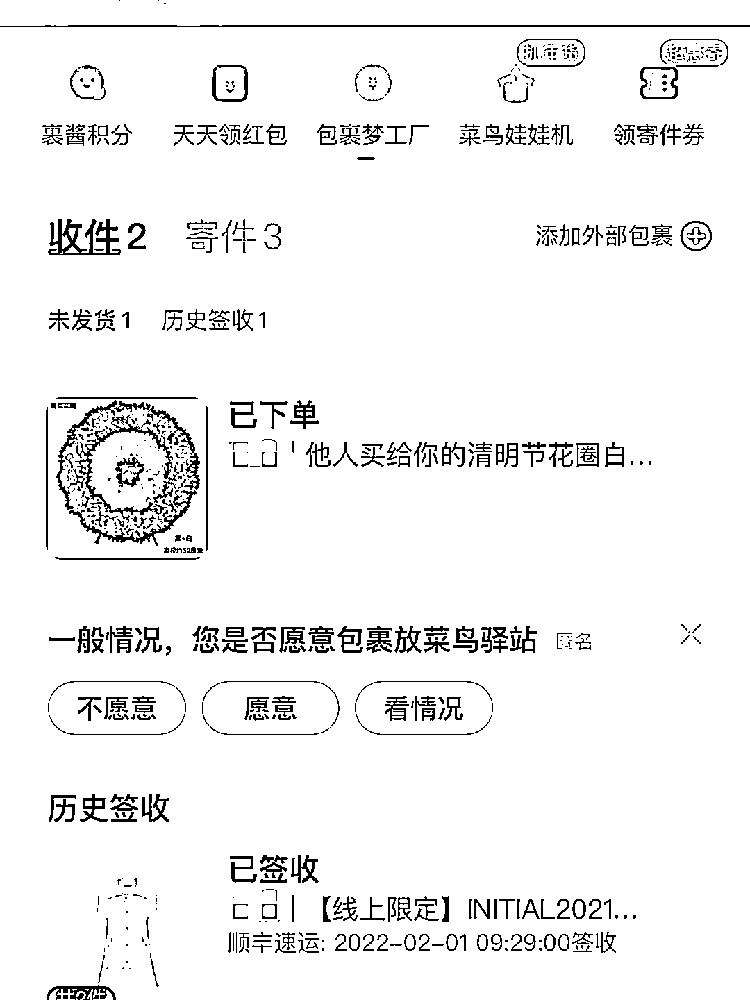

# 春节客服给顾客送花圈！

> 原文：[`mp.weixin.qq.com/s?__biz=MzIyMDYwMTk0Mw==&mid=2247529393&idx=5&sn=52abc2ba364b92be1e5e54302167c4bf&chksm=97cbb889a0bc319fbbe235d359f669bc97a8463791330901177c9da0ba79c4db343e411212df&scene=27#wechat_redirect`](http://mp.weixin.qq.com/s?__biz=MzIyMDYwMTk0Mw==&mid=2247529393&idx=5&sn=52abc2ba364b92be1e5e54302167c4bf&chksm=97cbb889a0bc319fbbe235d359f669bc97a8463791330901177c9da0ba79c4db343e411212df&scene=27#wechat_redirect)

春节期间因为一个小误会就被送花圈，2 月 6 日，有消费者在社交平台称，自己被 initial 官方旗舰店客服送了花圈，目前，initial 品牌官方已道歉。

**一言不合就送花圈**

2 月 6 日，该消费者在社交平台发帖称，2 月 5 日，她接到一通电话，对方自称是客服，由于自己的疏忽多寄了一件衣服，要求将衣服退回，邮费到付，并且在描述时准确叫出了该消费者的收件名字和一个顺丰快递的物品。该消费者表示，由于这个快递没有多寄衣服给她，所以她第一反应是接到了诈骗电话并挂断。

随后，该消费者收到这位致电客服的短信，对方称如不退还衣服，就只能报警了。该消费者随即去查询自己的快递信息，赫然发现在挂掉那通电话不久便多一个花圈的物流信息。随后，消费者去与客服沟通，表示自己确实没有收到多余的衣服，并帮助客服查询了物流信息，发现对方确实多寄了一件衣服，但因为收件人信息填错所以她并未收到取件通知，该消费者按客服要求将衣服拒收并退回。

该消费者和客服把误会解开后，客服也承认，由于消费者之前不配合，比较生气，订购了花圈，事后也觉得这么做确实不妥，取消了花圈订单，并向该消费者道歉。

该消费者对此并不接受，消费者表示，自己已向平台和店铺投诉，“我作为消费者，我不愿意为店家自己的错误买单，我接受不了店家这样的行为。”

**涉事店铺暂时被封**

2 月 7 日，该消费再度发声，她表示，目前事件已基本解决，平台方面，处理人员表示会员今年会进行地址加密处理，对店铺扣除 12 分并回收店铺经营权 7 天，涉事店员花圈下单的账号永久停封。initial 旗舰店方面也将对涉事的员工做开除处理并公开道歉信。

initial 旗舰店在致歉声明中表示，涉事的员工已经第一时间停职，将做开除处理，这虽是员工的行为，但品牌也有责任，后续将会深刻反思，引以为戒，认真市视内部管理问题，目前已召集相关部门积极制定管理改善方案，加强内部管控，增强员工素质培训，提升客户服务能力。

目前，initial 官方旗舰店已闭店下架。该品牌的官网和公众号的在线商城仍显示正常运营。

消费者网购被寄花圈并非孤例，记者此前就曾接到投诉称，有消费者在京东网购，结果被卖家寄寿衣和花圈，目前此事仍未得到妥善解决。

律师表示，《消费者权益保护法》规定，消费者在购买、使用商品和接受服务时享有人身、财产安全不受损害的权利。商家向消费者邮寄骚扰物品、骚扰电话等方式“泄愤”明显不妥。根据《治安管理处罚法》第四十二条规定，有下列行为之一的，处五日以下拘留或者五百元以下罚款；情节较重的，处五日以上十日以下拘留，可以并处五百元以下罚款：（一） 写恐吓信或者以其他方法威胁他人人身安全的；可以视情节对商家进行罚款或者拘留。

来源 ： 潇湘晨报

← 向右滑动与灰产圈互动交流 →

