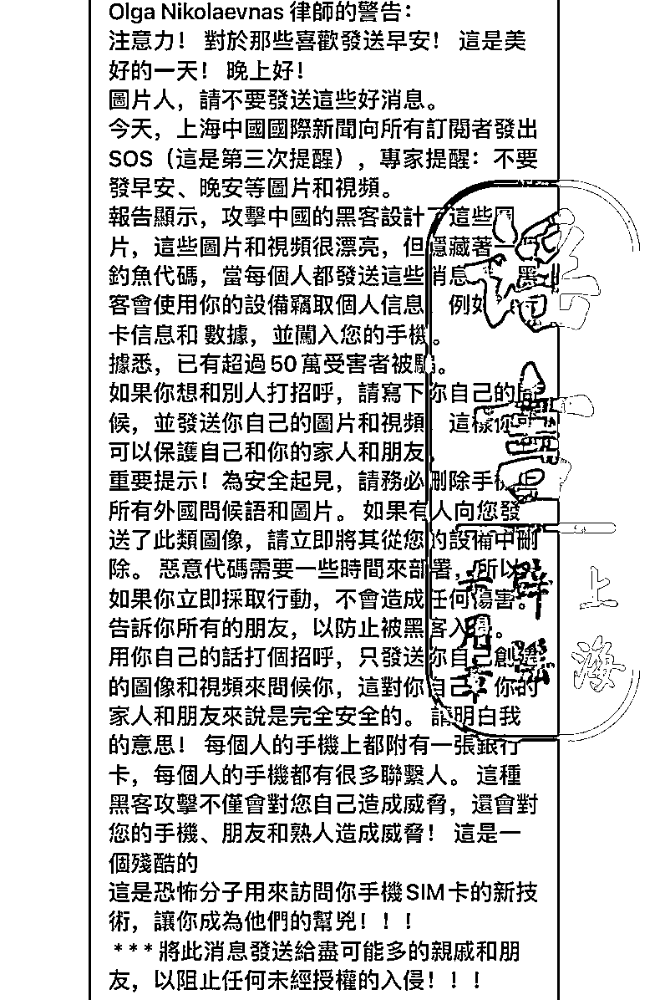
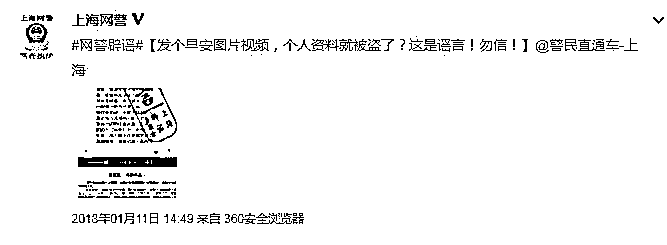

# 发个新年祝福，个人信息就被盗了？

> 原文：[`mp.weixin.qq.com/s?__biz=MzIyMDYwMTk0Mw==&mid=2247529393&idx=6&sn=ca3cbd6e5bf1645b2c7509a97f1623e0&chksm=97cbb889a0bc319f8547bccbc579131a5777f85d9653a4a3977d627899447f9c641293161dad&scene=27#wechat_redirect`](http://mp.weixin.qq.com/s?__biz=MzIyMDYwMTk0Mw==&mid=2247529393&idx=6&sn=ca3cbd6e5bf1645b2c7509a97f1623e0&chksm=97cbb889a0bc319f8547bccbc579131a5777f85d9653a4a3977d627899447f9c641293161dad&scene=27#wechat_redirect)

春节假期 

大家收到或发出的

祝福图片、视频都不少

此时，如果有人“提醒”你

发送“早安”“晚安”“祝福”等图片、视频

**会导致手机遭到黑客攻击**

**进而被窃取个人信息**

是不是有一丝慌张

网传该“提醒”

来自“上海中国国际新闻”

并称因为这类图片或视频

已有 50 万人被骗？

**  假  的 ！**

图为网传谣言截图

其实

这已经是陈年谣言了

多个权威机构都曾辟过谣

从该谣言的传播规律来看，在节日期间，发送祝福图片、视频等需求较旺的时候，谣言就容易被传播。

而“转发图片手机会中毒、个人信息会被窃取”信息内所称的发布方**“上海中国国际新闻”根本就是子虚乌有。**事实上，并没有这一新闻机构，也没有其他新闻机构发布过类似消息。

对用户而言，如果是直接显示的图片、视频、表情包等，并不会藏有攻击程序，可以放心浏览、转发，手机不会中毒。 

但是，**如果看到只显示文件或“浮层”的提醒，那要留个心眼。**

尤其是通过微信等即时聊天工具，各种网络社交平台或者邮箱发送的不明来源链接，其背后不排除为钓鱼程序，诱导用户输入个人信息或通过点击链接开始执行木马病毒等。

所以，**用户若收到不明文件、链接，务必提高警惕，**不要轻易点击打开，更不要随意填写个人信息。

** 中木马病毒详解过程 **

1.点击链接后手机看上去没有任何反应，但是后台已经开始下载木马程序并已自动安装，在这个过程中，用户可能会误认为链接无效，继而不会去注意它。

2\. 木马病毒装上以后，卸载比较困难，有些安装的路径隐藏比较深，有些甚至无法卸载，除非重新刷机。

3\. 木马安装好以后，会盗用户手机的 root 权限并将用户的收取短信功能屏蔽，也就是说用户的手机收不到银行发来的短信，木马病毒会自动将用户收到的短信发到嫌疑人的手机上。

4\. 木马程序会探测用户的银行账户信息和密码，并将这些重要信息发到嫌疑人手机上。

5\. 嫌疑人拿到这些账户和密码以后，登陆对应的平台进行转账或者消费，通过银行卡快捷支付的方式进行转账消费，而银行快捷支付是会发送一条验证码到用户手机的，但这个时候用户的手机短信收取功能已经被屏蔽掉了，用户是察觉不到的，短信自动转发到嫌疑人的手机上，于是嫌疑人就成功的完成了支付。

** 不慎点击链接怎么办？**

1\. 一旦点击链接后，立即关机，手机重装系统，恢复出厂设置或用杀毒软件查杀病毒。 

2\. 在第一时间向通讯录内亲朋好友告知，及时删除短信，不要点击链接。

3\. 通过其他途径及时修改银行账号信息。最好先解绑原手机号，转出卡内余额。

**防范三部曲**

**不点击——**切记陌生链接不点击，更不要随意输入银行卡号、密码、验证码等信息。

**不轻信——**若收到含有链接的官方短信，请第一时间拨打官方客服电话咨询或联系就近的银行网点，核实查询相关信息，确认真伪。

**速报警——**切记陌生链接不点击，更不要随意输入银行卡号、密码、验证码等信息。

来源：法制网，拒绝跨境赌博 

← 向右滑动与灰产圈互动交流 →

