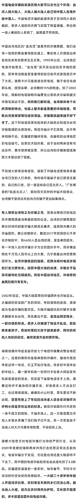

# 诈骗发展简史：30 万骗子藏身东南亚，已进化到 3.0 阶段！

> 原文：[`mp.weixin.qq.com/s?__biz=MzIyMDYwMTk0Mw==&mid=2247529457&idx=2&sn=776b29d4adc94f4f7f2444b1b632afe5&chksm=97cbb8c9a0bc31dfe2ce1e7755a51f3afdac762e73c13fd0b36ae77af11684bd78c29e8ef6c3&scene=27#wechat_redirect`](http://mp.weixin.qq.com/s?__biz=MzIyMDYwMTk0Mw==&mid=2247529457&idx=2&sn=776b29d4adc94f4f7f2444b1b632afe5&chksm=97cbb8c9a0bc31dfe2ce1e7755a51f3afdac762e73c13fd0b36ae77af11684bd78c29e8ef6c3&scene=27#wechat_redirect)

## 

**最近看到一个很有共鸣的说法，现在的人很少打电话了。阿牛想了想，好像确实如此，自己很少主动给别人打电话，他给自己打电话的人大概只有三种：**外卖小哥、电话推销以及****电信诈骗**。** 

**说到电信诈骗，阿牛的一个朋友曾经讲述了一段很神奇的经历，首先是一个诈骗电话打进来，骗子自称是公安局的，说你的账户因涉及洗钱被冻结，阿牛的朋友机智的识破了骗局，并挂断电话。过了一会儿，他发现手机有十几个未接来电都是真的警察叔叔打来的，提醒他疑似接到诈骗，千万不要给对方转账。**

**现在请弹幕回答一下，你接到过电信诈骗的电话吗？对方是用什么样的话术骗你的呢？关于电信诈骗，我们每个人可能都多少知道一些，但是并不是每个人都真的了解电信诈骗以及他背后故事。**

****

****

****

****

****

****那么面对进化了最终版本的电信诈骗，我们真的束手无策吗？****

**回顾历史，我们这个国家能用三年时间进爵危害百年的烟土，能保持十年一次严打，那中国黑社会的寿命不超过七年。今天我们同样能够打击并最终消灭电信诈骗这个危害人民群众财产安全的新刑事犯罪。**

**你可能不知道奋战在一线的警察叔叔，为了反诈骗到底有多努力。2016 年，中国公安部门曾经发起一个代号为“长城”的秘密行动，目标是打击位于西班蓝牙的曝出公检法诈骗窝点。如果这个窝点在国内可能不出一周就能断掉了。但来自全国各地的反诈精英，再加上外交部、民航总局等各部门支持，最终历时三年，才将所有犯罪嫌疑人民主回国。**

**涉案的 225 名犯罪嫌疑人来自台湾地区的这个 218 名给长城行动带来很大的敏感性和复杂性。但更难的是，西班牙等欧洲国家司法程序与中国有很大差别。办案侦查的每一个步骤，都要请当地法官批准之后才能开展抓捕行动，甚至人员的羁押也存在极大的困难和挑战。**

****再然后要把这些嫌疑人，尤其是台湾籍嫌疑人引渡到国内，西班牙方面坚持****必须对每名嫌疑人举行听证****，而不差钱的骗子聘请了最专业的律师，制造种种理由阻止引渡。****

**在这个艰苦漫长的过程中，中国警方付出了极大的努力，克服了语言、气候、执法、环境等方面的困难。**有的民警为办案在当地待了 11 个月，有的人回家时，孩子都不认识他了。**最终，在 2019 年 6 月 7 日，随着一架中国民航包机降落在北京机场，225 名犯罪嫌疑人全部分批次从西班牙押解回国。这是我国首次从欧洲大规模押回电信网络诈骗犯罪嫌疑人，也狠狠的震慑了从事电信诈骗的不法分子。**

**据参与行动的民警介绍，这次行动过后，西班牙至今再没有一个针对中国人的诈骗窝点，甚至整个西欧地区的电信诈骗窝点也基本绝迹。**

****

**而电信诈骗分子扎堆的东南亚，更是中国警方打击的重点。如果你看过电影，湄公河行动一定会被中国缉毒警察深入金三角抓捕毒枭的英雄主义行为所感染，而真实的抓捕过程更加艰辛。毕竟在境外抓捕针对本国公民犯罪的外籍犯罪嫌疑人，之前在全世界只有美国人干过，这些年来东南地区的一个显著变化，就是中国对当地越来越难以忽视的影响力。**

****

**2019 年 1 月，柬埔寨首相洪森访华，双方确定将 2019 年确定为中柬执法合作年。在这一框架下，中国公安部与柬埔寨方面达成一系列协议，包括中方派出警务专家和技术人员赴柬，与柬埔寨警方联合办公，联合抓捕。很短的时间内就在柬埔寨抓获中国籍犯罪嫌疑人近千人。**

****2019 年 8 月 18 日，柬埔寨首相洪森下令停止颁发网络赌博执照，禁止在柬埔寨从事线上博彩活动**。这一禁令对于在柬埔寨从事电信诈骗的不法分子来说，同样是致命一击。视频开头提到了西哈努克港从事洗钱网赌电信诈骗的人员望风而逃。据当地媒体报道，**禁令颁布后的七天内就逃走了 9 万人之多，街道上也明显引起了很多这一事件，被知情的人们称为**“**西港 818 大逃亡**”。**

**对于那些拒不回国的顽固分子，中国警方依然有的是办法，比如公开喊话，规定时间内拒不回国将直接注销户籍。有的地方拒不回国，诈骗分子亲属也会受到影响，小孩儿一律回原籍就近入学，直系亲属在入团、入党、参军、考公务员一律从严把关。当然，对于主动投案的归国人员，可以依法减轻或者免除处罚。**

****

**小编要说电信诈骗作为需要被害人配合才能完成的犯罪，打击电信诈骗的其实并不在境外，而是在国内。"大清的心头之患不在外边"。今天我们很多人的手机里可能都安装了一个名叫国家反诈中心的 APP。而国家反诈中心是公安部为数不多与国家冠名的机构，也是全世界绝无仅有的。针对电信诈骗而成立的国家级中心。**

**来源：网络，巴蜀反诈** 

********

**← 向右滑动与灰产圈互动交流 →**

****