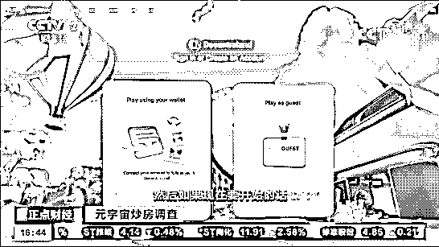
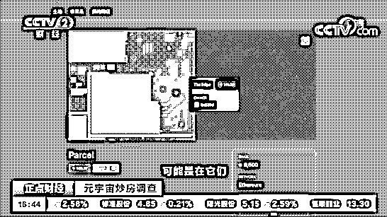
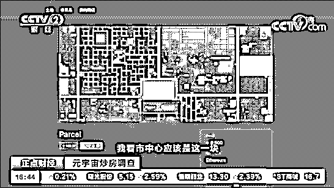
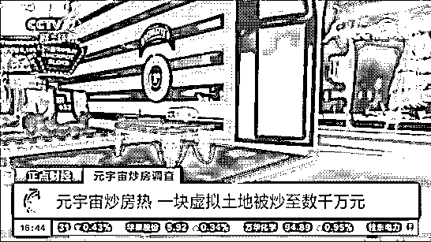
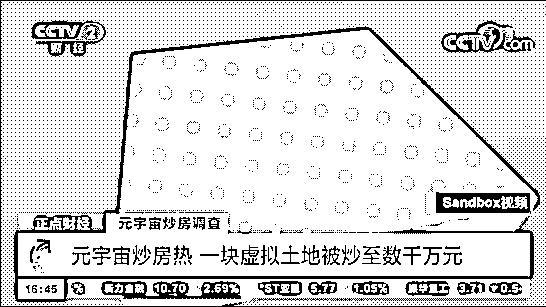
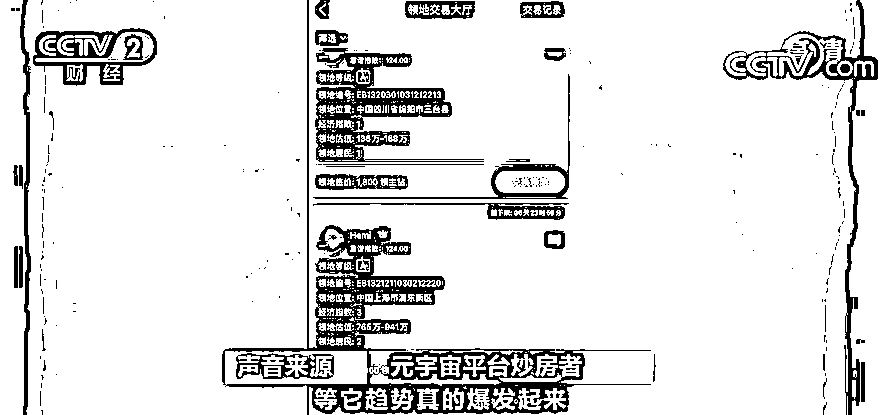
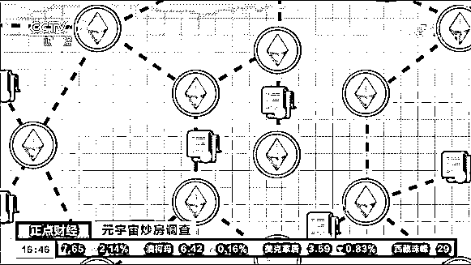
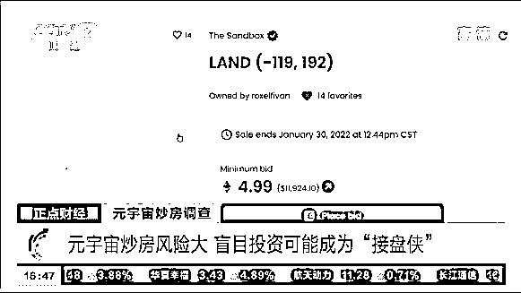
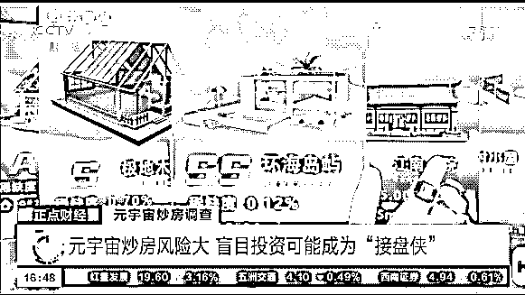
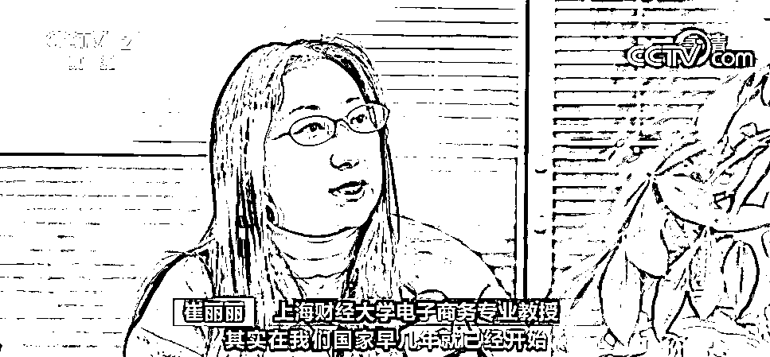

# 一块虚拟土地，拍出 3200 万元“天价”！元宇宙也“炒房”？！是风口还是虎口→

> 原文：[`mp.weixin.qq.com/s?__biz=MzIyMDYwMTk0Mw==&mid=2247529457&idx=3&sn=83c28b895d639537fbd902db086ebc90&chksm=97cbb8c9a0bc31df278ceb355381c07ac893dbbdb6d9809819883a4c37b9daa0c984257207ae&scene=27#wechat_redirect`](http://mp.weixin.qq.com/s?__biz=MzIyMDYwMTk0Mw==&mid=2247529457&idx=3&sn=83c28b895d639537fbd902db086ebc90&chksm=97cbb8c9a0bc31df278ceb355381c07ac893dbbdb6d9809819883a4c37b9daa0c984257207ae&scene=27#wechat_redirect)

元宇宙概念的兴起，带火了相关概念的周边行业，而最令人震撼的可能是元宇宙“炒房热”。**在一些元宇宙平台里，一块虚拟土地拍卖出了数千万元人民币的天价**。那么这些所谓的元宇宙平台究竟是什么呢？

**元宇宙炒房热**

**一块虚拟土地被炒至数千万元** 

[`mp.weixin.qq.com/mp/readtemplate?t=pages/video_player_tmpl&action=mpvideo&auto=0&vid=wxv_2261707185238016001`](https://mp.weixin.qq.com/mp/readtemplate?t=pages/video_player_tmpl&action=mpvideo&auto=0&vid=wxv_2261707185238016001)

### △央视财经《正点财经》栏目视频

在上海宝山区，记者见到了从事游戏自媒体工作的区健儒。出于工作的需要，目前市面上常见的几款元宇宙平台他都体验过。

住在很边上的，可能相当于我们城郊郊区的房子，卖 9500MANA 币（约 20.1 万元）。 

市中心应该是这一块，这个小的就是要 60 万 MANA 币（1273 万元）。

区健儒告诉记者，所谓元宇宙本意是基于互联网，通过新科技实现的一个与现实世界相连接的虚拟空间。但目前国外流行的元宇宙平台都还远达不到这一标准，**更像是一款社交性的网游**，可以操作游玩的项目很少。核心内容是玩家交易土地后，可以在自己土地上搭建各种类型的建筑，当作虚拟世界的家或者公司、博物馆。然而**不少玩家购买土地的原因都仅仅是为了等待虚拟土地升值**。

事实上，投资交易是目前几款元宇宙平台给人留下的最深刻印象。**2021 年 12 月，元宇宙平台 Sandbox 上的一块虚拟土地以约人民币 3200 万元的价格售出，创下元宇宙房地产交易价格的新纪录**。低价抢到虚拟土地，等待行情好时高价卖出成了很多人的共识。 

**国金证券互联网传媒首席分析师 杨晓峰：**目前整个海外市场里，相对而言交易量最高的排名，就是从所有的 NFT（非同质化代币）资产里面排名，Decentraland 能排到第三名，Sandbox 大概能排到第六名。Decentraland 能卖到交易量有 23 万以太币（46 亿元），Sandbox 大概是 13 万以太币（26 亿元）的规模。 

**元宇宙平台炒房者：**元宇宙毕竟是大趋势，前期红利最少也要好几年的，前期都是进去先囤点房、囤点地。等它真的爆发起来，后面又要开始炒的。

**元宇宙炒房风险**

** 盲目投资可能成为“接盘侠”** 

[`mp.weixin.qq.com/mp/readtemplate?t=pages/video_player_tmpl&action=mpvideo&auto=0&vid=wxv_2261707806078894087`](https://mp.weixin.qq.com/mp/readtemplate?t=pages/video_player_tmpl&action=mpvideo&auto=0&vid=wxv_2261707806078894087)

### △央视财经《正点财经》栏目视频

随着元宇宙概念走热，元宇宙“房产”交易越发火爆，近期频频刷出价格新高，**许多虚拟地产价格，甚至超过了现实世界里很多大城市的住房价格**。然而元宇宙“房产”毕竟不是实物，人们拥有它需要付出真金白银，这其中有着怎样的风险呢？ 

业内人士告诉记者，所谓的元宇宙平台上的虚拟房产，本质上是 NFT。NFT 是基于区块链技术发行的数字资产，由于其产权归属、交易流转都被记录并且不可以被篡改，因此**每块地产都具有独一无二的特性**。

此外，和现实中的“炒房”类似，**虚拟世界中的“炒房”很大程度上基于房产供应的“稀缺性”**。在 Decentraland 中，平台共设计了 9 万个地块，并且未来不会再新增，从而确保土地的“稀缺性”。

虽然元宇宙“房产”的独一无二和“稀缺性”听起来起来很诱人，但业内人士指出，这一切都是建立在元宇宙平台不断壮大的理想情况上的。这意味着，**如果一个元宇宙平台失去流量和关注度，没有了新玩家的入场。那么投资者手中虚拟房产的价值，就可能变得分文不值**。

**国金证券互联网传媒首席分析师 杨晓峰：**因为这种 NFT（非同质化代币）资产要让更多的人知道，必然是有一个宣传渠道，所以还是有很多人在持续买入，或者有一些知名的机构买入才会引起大家关注，才会让大家觉得这个东西会越来越值钱。 

业内人士认为，目前元宇宙平台还未成熟，虚拟房产和普通网络游戏中的道具实质区别不大。**在元宇宙“炒房”，和炒作虚拟货币类似，**参与其中可能只是击鼓传花。此外，市面上有着大量元宇宙平台，部分平台的虚拟地产发行受平台方控制，用户也无法真正确保其“稀缺性”。

2021 年 10 月，国内上市公司天下秀开发的元宇宙 App“虹宇宙”开始内测，用户预约后可以抢购虚拟房产，部分房产在第三方网站被炒到了几十万元。然而近期，二手交易网站已经屏蔽了“元宇宙”“虹宇宙”等关键词。**玩家间的虚拟房产交易量大减，“房产”价格也大幅下跌**。

**上海财经大学电子商务专业教授 崔丽丽：**虚拟币类的交易，其实在我们国家早几年就明令禁止，不可以在国内去交易。NFT（非同质化代币）虽然不是虚拟币，但是它背后也是同样的一套技术系统，而且这是一个很新的现象，还没有形成行业标准，从这个角度上来说，如果进入这样的市场当中，碰到任何的风险，可能都要消费者自己去承担和解决。

来源：央视财经（ID：cctvyscj）

← 向右滑动与灰产圈互动交流 →

