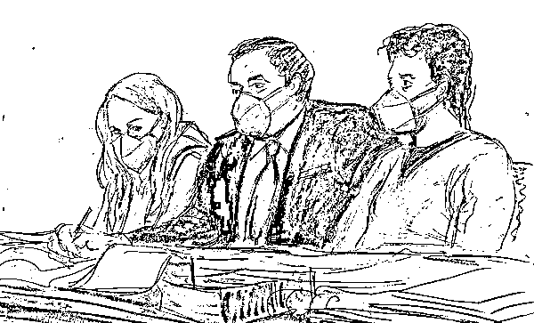
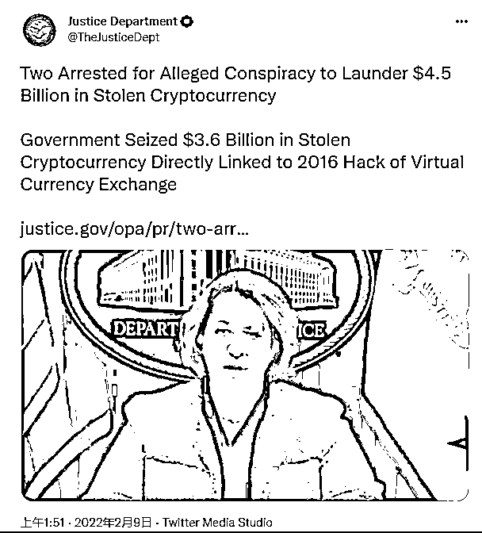
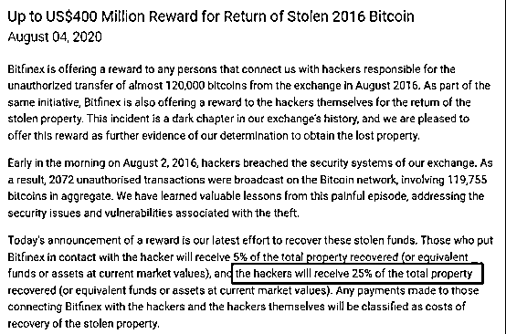

# 史上第二大比特币盗窃案告破！“雌雄大盗”落网，冻结 36 亿美元“赃款”

> 原文：[`mp.weixin.qq.com/s?__biz=MzIyMDYwMTk0Mw==&mid=2247529457&idx=4&sn=fc0dd97715ba4e93a02cb90a68e3a837&chksm=97cbb8c9a0bc31df37a91198b6a01a66dda168010c4a7deb2445166f2413dd9d04c45f39a346&scene=27#wechat_redirect`](http://mp.weixin.qq.com/s?__biz=MzIyMDYwMTk0Mw==&mid=2247529457&idx=4&sn=fc0dd97715ba4e93a02cb90a68e3a837&chksm=97cbb8c9a0bc31df37a91198b6a01a66dda168010c4a7deb2445166f2413dd9d04c45f39a346&scene=27#wechat_redirect)

**编者按：**据彭博财经消息，伊利亚·利希滕斯坦 (Ilya Lichtenstein) 和希瑟·摩根 (Heather Morgan) 于美国当地时间周二早 7 点在纽约被捕，罪名是涉嫌串谋洗钱加密货币，其后后出现在曼哈顿的联邦法庭。美国政府表示，从其夫妻二人手中没收了价值约 36 亿美元的加密货币，是有史以来最大的金融扣押。据称，两人合谋清洗了 119,754 个比特币（来自 2016 年，虚拟货币交易所 Bitfinex 受黑客攻击中被盗），目前价值约 45 亿美元。

一张法庭草图显示，Heather Morgan（左）和丈夫 Ilya “Dutch” Lichtenstein（右）于 2 月 8 日在纽约联邦法院与他们的律师坐在一起。资料来源：Elizabeth Williams/AP

2016 年 8 月，在一个月黑风高的夜晚，数字货币交易所 Bitfinex 像往日一样平静。

突然“雌雄大盗”从天而降，对交易所一通大肆洗劫，带着 119754 个比特币扬长而去。

这宗案件成为仅次于日本“Mr Gox 交易所被盗案”之后的史上第二大比特币盗窃案。受此影响，当天比特币直接暴跌 23%。

美国当局忍无可忍，随即全网通缉。

之后经过近 2000 个日日夜夜，在被盗比特币的价值已经从 7100 万美元暴涨至 45 亿美元之后，在 2022 年 2 月 9 日这个郑重的日子里，美国司法部终于激动地宣布：

> 雌雄大盗落网啦！

据美国司法部公共事务办公室官网 2 月 8 日公布，Ilya Lichtenstein 和他的妻子 Heather Morgan 于当日早上在美国曼哈顿被捕。

Ilya Lichtenstein，34 岁，生于俄罗斯，6 岁移居美国（据彭博社报导其拥有美国和俄罗斯双重国籍），是著名硅谷加速器计划 Y Combinator 创始人的校友。曾与他人共同创办 MixRank 数据和广告技术初创公司，并获得了美国最知名投资人 Mark Cuban 的融资。

此外，他个人的小爱好是在推特上面警告人们要注意黑客袭击。

Heather Morgan，31 岁，履历相当丰富。她是一名年轻企业营销家、说唱歌手和杂志专栏作家。

和她丈夫的爱好有所呼应的是，她最新一篇文章的部分标题是：如何保护您的企业免受黑客的侵害，文章还包括数字货币交易所创始人讲述如何防止欺诈的采访。

怎么说呢，真是太巧了。

## **01** **45 亿被“复杂技术”洗掉 9 亿，**

## **但用法相当朴实** 

除了两人被当场逮捕之外，从 Bitfinex 交易所盗取的，还未被转移的 36 亿美元比特币也同时被查获。

所以从金额来看，此次行动可被称为美国司法部有史以来最大的金融查获。

现在人赃并获，案件即刻进入司法程序。

根据法庭文件显示，当时“雌雄大盗”先是对 Bitfinex 交易所发起了 2000 多项未经授权的交易，随后成功盗取比特币，并将它们从交易所平台发送至 Lichtenstein 名下的数字钱包。

在接下来的五年中，大约有 25000 个被盗比特币从数字钱包中被转出，其中一些被存入了夫妇二人名下的金融账户之中。

司法部对此表示，这个过程涉及到“复杂的洗钱技术”，包括使用虚构身份建立在线账户、利用计算机程序使交易自动化、将比特币转换为其他数字货币等等。

总之，在这对“技术流”夫妇的努力钻研之下，有 25000 个比特币被成功“洗出”，在被查获时数字钱包里还有超过 94000 个比特币未被转移。

但他们对这笔资金的处置其实相当朴实了。

除了购买一些黄金和数字货币之外，一部分资金被用来买沃尔玛的礼品卡、支付优步（Uber）和在 PlayStation 上买游戏。

## **02
司法部扬眉吐气 交易所喜上眉梢** 

**虽然 45 亿美元只剩下 36 亿美元，**但是美国司法部也终于能够扬眉吐气一番。

副司法部长 Lisa Monaco 发表声明：

> 虽然被告通过眼花缭乱的技术来清洗被盗资金，但事实证明是徒劳无功的。此次成功逮捕表明，数字货币领域不是犯罪分子的避风港。

美国副司法部长 Lisa Monaco（凤凰网财经截图自 Twitter） 

司法部刑事司司长的助理律师 Kenneth Polite 表示： 

> 执法部门再次证明，我们可以通过区块链追踪资金，数字货币不会成为金融系统内的法外之地。

除了扬眉吐气的司法部门之外，最高兴的自然是 Bitfinex 交易所。

Bitfinex 在声明中表示：

> 我们很高兴美国司法部今天宣布，成功追回了 2016 年 8 月安全漏洞期间被盗的大部分比特币。自司法部启动调查以来，我们双方一直在广泛合作，今后也将持续下去。

## **03
“雌雄大盗”黯然神伤 或面临数十年指控**

然而相比之下，这两位的前途命运就比较悲惨了。二人一着不慎，满盘皆输，等待他们的可能是长达数十年的监禁。

目前夫妇二人面临“共谋洗钱”和“共谋欺诈”两项指控，分别最高可判处 20 年监禁和 5 年监禁。

现在网上已经有人调侃，相比于已经被洗掉的资金，**如果“雌雄大盗”能够早点归还被盗资金，说不定赚得更多。**

因为在 Bitfinex 曾在 2020 年表示，如果黑客能够归还被盗资产，那么他们能够获得被盗总资产的 25%。

但其实，他们（很奇怪地）未被指控黑客攻击。

“调查还在进行中。”司法部官员如是说。

来源：华尔街见闻、金色财经区块链、凤凰网财经、利箭在行动

← 向右滑动与灰产圈互动交流 →

