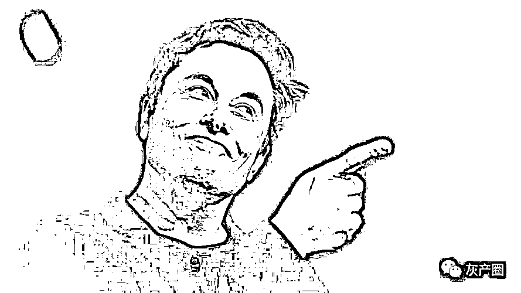

# 玩砸了！马斯克炒币亏了 6 个亿，还收到美国证监会传票！到底怎么回事？

> 原文：[`mp.weixin.qq.com/s?__biz=MzIyMDYwMTk0Mw==&mid=2247529457&idx=5&sn=2fe347a42aee2d11de1b79c6d8f2dbc5&chksm=97cbb8c9a0bc31dfead9db564ee82355c7b88078c55942fe1feb4e6bda6b422a75eef7e4cbaa&scene=27#wechat_redirect`](http://mp.weixin.qq.com/s?__biz=MzIyMDYwMTk0Mw==&mid=2247529457&idx=5&sn=2fe347a42aee2d11de1b79c6d8f2dbc5&chksm=97cbb8c9a0bc31dfead9db564ee82355c7b88078c55942fe1feb4e6bda6b422a75eef7e4cbaa&scene=27#wechat_redirect)

## 

2 月 7 日，特斯拉向美国证券交易委员会（SEC）递交的 10-K 年报文件显示，2021 年特斯拉在中国市场收入达 138.44 亿美元，同比大增 107.8%。 

值得注意的是，2021 年，由于公司比特币的账面价值变化，计提了约 1.01 亿美元（约合 6.42 亿元人民币）的减值损失。

文件还披露，2021 年 11 月 16 日，美国证监会向特斯拉发出传票，要求特斯拉提供有关履行 2018 和解案涉及的管理流程。

**炒比特币“翻车”**

在最新 10-K 文件中，特斯拉披露，**截至 2021 年 12 月 31 日的一年中，由于公司比特币的账面价值变化，计提了约 1.01 亿美元（约合 6.42 亿元人民币）的减值损失。**

据特斯拉年报文件显示，截至 2021 年 12 月 31 日，特斯拉持有的比特币公允市场价值为 19.9 亿美元。

**截至北京时间 2 月 8 日凌晨，比特币单日上涨 3％，至 42956 美元。**

公开资料显示，特斯拉于 2021 年年初买入 15 亿美元比特币，价格约为 3.5 万美元/枚。2021 年 2 月，特斯拉购买比特币一度浮盈超过 71%，浮盈金额超 10.69 亿美元。

特斯拉 CEO 埃隆•马斯克（Elon Musk）曾公开表示，决定以比特币形式持有部分公司现金，因为这种资产比现金更好。**“法定货币的利息是负数，只有傻子才会盯着法定货币。”**马斯克说。

马斯克不仅积极持有比特币，更着力推广其流通使用。2021 年 2 月 8 日，特斯拉在提交给美国证券交易委员会的文件中表示，将在法律允许的条件下，开始在有限的范围内接受比特币作为支付形式。

2021 年 3 月，特斯拉美国官网显示，用户在购买车辆时可以选择用比特币付款。但特斯拉仅使用内部开源软件直接运营比特币节点，即支付给特斯拉的比特币将被作为比特币保留，不会转换为法定货币。

2021 年 5 月 13 日，由于担心加密货币对环境产生影响，比特币购买特斯拉也被终止。马斯克表示，一旦比特币挖矿过程中的可再生能源占比提高 50% ，公司就会再次接受比特币付款。

马斯克曾被称为比特币“操纵者”，每次其关于比特币的言论发布后，比特币价格都会出现大幅波动。如，2021 年 2 月 8 日后，比特币价格暴涨 1 万美元；2021 年 5 月 13 日，比特币价格狂跌 1 万美元。

**美国证监会再次盯上马斯克**

此次披露的 K10 文件，特斯拉还披露了公司因为马斯克而被美国证监会关注。文件显示，2021 年 11 月 16 日，**美国证监会向公司发出了传票，要求特斯拉提供有关此前和解案中涉及的管理流程。**

虽然特斯拉在年报中没有详细说明这张传票到底要调查什么，但就在美国证监会开出传票的 10 天前，马斯克在推特上发布了调查，询问网友们他是否应该抛售 10%的特斯拉持仓。受此消息影响，公司股价在随后的两天内累计大跌 16%。而马斯克开始减持持有的特斯拉股票，累计减持金额超过 100 亿美元。此次收到美国证监会的传票极有可能与此相关。

**除了美国证监会的调查，部分特斯拉股东上诉至法庭要求查看公司的内部文件，并调查该投票是否违反了与美国证券交易委员会此前达成的相关协议。**

2018 年，马斯克曾在社交媒体上表示试图将公司私有化，随后遭到美国证监会的证券欺诈指控。2018 年 9 月双方达成协议，特斯拉需要对马斯克的公开表态进行监管。2019 年，马斯克再次发表有关特斯拉产量的言论并引发股价波动，美国证监会也再次对其进行调查。双方在当年四月对这份和解进行调整，明确规定了马斯克在未获得公司律师允许的情况下，不能公开表态的话题。

此外，2019 年 12 月，美国证监会还曾对特斯拉财务数据和合同进行调查，但该调查已于 2021 年 12 月结束。

**特斯拉“幽灵刹车”投诉激增**

**美国监管机构对此展开调查**

值得注意的是，最近一段时期，美国国家公路交通安全管理局（NHTSA）收到的关于特斯拉汽车意外和不必要的制动事件投诉越来越多，监管机构表示正在调查。

这种现象通常被称为**“幽灵刹车”。是指配备了先进驾驶辅助系统的车辆出现一个令消费者不安且具有潜在危险性的故障。这个故障对车后跟随行驶的其他车辆来说是一种潜在危险。**

遇到过这种情况的司机们一直称这些幽灵刹车事件是“令人毛骨悚然的”，而且有可能是“灾难性的”。

据《华盛顿邮报》报道，在过去的三个月里，关于无故刹车的报告已经上升到 107 起，而在之前的 22 个月里只有 34 起。

这个时间点与特斯拉决定停止在其车辆上使用雷达传感器，转而使用仅有摄像头的系统相吻合。

卡耐基梅隆大学专注于自动驾驶汽车安全的教授 Phil Koopman 表示：“幽灵刹车是当开发人员没有正确设置决定阈值，以决定什么时候有东西存在与假警报时发生的情况。”其他公司所做的是，他们使用多个不同的传感器，并在它们之间进行交叉检查——不仅是多个摄像头，还有多种类型的传感器。

举例来说，一个漂浮在道路上的袋子，在摄像头看来可能是一辆卡车从而制动，但如果它能被雷达或 LiDAR 交叉验证，就可能避免出现幽灵制动的情况。

**在华收入同比增 107.8%**

在营收方面，**2021 年，特斯拉中国市场表现亮眼，收入达 138.44 亿美元，同比大增 107.8%。**特斯拉 2021 年前三季度在中国市场收入为 90.15 亿美元。以此计算，2021 年第四季特斯拉在华收入为 48.29 亿美元。

中国乘联会数据显示，2021 年特斯拉在中国的交付量达到 484130 辆，占特斯拉全球 93.6 万交付量的 51.7%。除美国之外，中国是特斯拉第二大市场，2021 年营收占公司总营收比例达 25.7%；美国市场的收入达 239.73 亿美元，占公司总营收比例 44.55% 。

特斯拉 CFO 扎克•柯克霍恩（Zach Kirkhorn）表示，在特斯拉利润率改善方面，Model Y 是关键，因为它的利润率比 Model 3 高得多。上海超级工厂的本土化也是一个重要因素，对利润率有很大的帮助。某些市场的价格上涨也有助于提高利润率。

2021 年 12 月 31 日特斯拉中国官网显示，Model 3 后轮驱动版价格调整为 26.5652 万元，与此前售价相比上调 1 万元；Model Y 后轮驱动版价格调整为 30.1840 万元，与此前售价相比上调 2.1088 万元。

特斯拉表示，**供应链是目前发展的主要限制因素，可能持续到 2022 年。公司 2022 年依然面临芯片限制问题，2023 年将会得到缓解。**

柯克霍恩表示，未来特斯拉的软件业务是发展重点，因为软件业务的利润率非常高。当 FSD 和 Robotaxis 最终出现时，优势将会体现出来。

**全球加强比特币监管**

全球的监管层普遍对比特币在内的虚拟货币表示警惕。美国联邦存款保险公司（FDIC）代理主席 Martin Gruenberg 日前公布的优先事项清单指出，监管机构需要就与数字资产管理相关的风险向银行业提供“强有力指引”。银行机构必须考虑加密货币带来的风险，并“确定银行组织可以安全地参与加密资产相关活动的程度”。

据新华社报道，1 月 25 日，国际货币基金组织（IMF）执行董事会敦促中美洲国家萨尔瓦多取消比特币的法定货币地位，警告比特币使用在金融稳定等方面存在很大风险。

IMF 执行董事会在结束对萨尔瓦多的第四条款磋商后发表声明说，执行董事们认为有必要对比特币加强监管，比特币使用在金融稳定、金融诚信、消费者保护以及相关财政和债务方面存在风险，敦促萨尔瓦多当局取消比特币的法定货币地位。一些执董对发行比特币支持的债券存在风险表示担忧。

萨尔瓦多议会去年 6 月通过一项法案，批准将比特币作为该国法定货币。该法案于去年 9 月正式生效，萨尔瓦多成为世界上首个正式承认比特币为法定货币的国家。萨尔瓦多政府还计划 2022 年发行比特币债券。由于比特币币值波动大、现实操作难、金融监管乱等问题，不少萨尔瓦多民众反对将比特币设为法定货币。

当地时间 2 月 4 日，**美国证监会（SEC）主席根斯勒表示，拒绝批准比特币 ETF，理由是比特币容易受到欺诈和操纵。**

来源:中国经营报综合自中国证券报、21 世纪经济报道、证券时报、券商中国等

← 向右滑动与灰产圈互动交流 →

