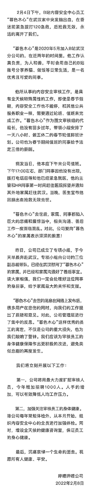
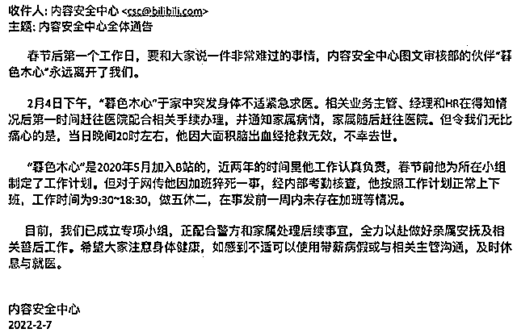

# 员工过年期间猝死，B 站回应：将扩招 1000 名审核人员

> 原文：[`mp.weixin.qq.com/s?__biz=MzIyMDYwMTk0Mw==&mid=2247529457&idx=6&sn=bb40133ed0359c25da8c03af413dc110&chksm=97cbb8c9a0bc31dfa9fdcb1cb1e1aaa59debbdc45572ff36243c66274cfe9d05de84d60ed263&scene=27#wechat_redirect`](http://mp.weixin.qq.com/s?__biz=MzIyMDYwMTk0Mw==&mid=2247529457&idx=6&sn=bb40133ed0359c25da8c03af413dc110&chksm=97cbb8c9a0bc31dfa9fdcb1cb1e1aaa59debbdc45572ff36243c66274cfe9d05de84d60ed263&scene=27#wechat_redirect)

该公众号已被封禁

今天（2 月 9 日），“B 站向猝死员工的家属致歉”话题冲上热搜榜第一位。

有媒体 2 月 7 日报道，B 站内容安全中心发全体通告称，对于网传一员工因加班猝死一事，经内部考勤核查，**该员工按照工作计划正常上下班，工作时间为 9:30 至 18:30，上五休二，在事发前一周内未存在加班等情况**。

昨天（2 月 8 日）深夜，B 站官方微博账号@哔哩哔哩弹幕网发文，正式公开回应此事。

B 站表示，“暮色木心”作为图文审核组的代组长，**在春节期间带领小组值班**。

此外，B 站称，**将用最大力度扩招审核人员，今年增加招聘 1000 人**。人手的增加，可以有效降低人均工作压力。

**B 站承认猝死员工曾春节加班**

通报中称，2 月 4 日下午，B 站内容安全中心员工“暮色木心”在武汉家中突发脑出血，在昏迷前紧急拨打 120 急救电话，其后，因抢救无效离世。

“暮色木心”于 2020 年 5 月加入 B 站武汉分公司，在近两年的时间里，他工作认真负责，为人和善，所从事的内容安全审核工作，是具有全天候特殊属性的工作，**即使是春节假期，内容安全审核工作也不能停，需要通过轮班、值班来完成工作。**

**“暮色木心”作为图文审核组的代组长，他没有回乡过年，带领小组安排了一天八小时、上五休二的春节轮值排班计划。**

**B 站称，公司为春节期间值班的同事给予法定三倍日薪的薪酬。**

通报介绍，员工“暮色木心”病发当日，本应下午来公司值班。下午 17:00 左右，部门同事因他没有出现，拨打电话后得知他已经紧急就医，他的主管和 HR 同事第一时间赶往医院探望，并通知其外地家属赶往武汉。

当晚，医生宣布他因脑出血抢救无效去世。

通报称，“暮色木心”去世后，家属、同事都陷入巨大的悲痛和震惊当中，**相关沟通、善后工作一度陷入混乱。对此，B 站向“暮色木心”的家属表示深深的歉意。**

通报指出，8 日，B 站派专项小组奔赴武汉，慰问“暮色木心”的家属，已经和家属沟通好了善后事宜。

除此之外，B 站今年会扩招 1000 名审核人员，并且增加员工体检次数。

**疑似家属发声：出事后公司连慰问都没有**

有疑似猝死员工的家属 @终于丶失去 称：**我看到有人爆料公司注销了我哥的企业微信账号，试图用各种方式压下这件事情。**

疑似员工家属发声 微博截图

“现在是我哥人已经不在了，你们连派个人前来慰问都没有，更别谈协商了，原来你们的时间都在用来编造谎言吗？” @终于丶失去称。

据职场博主@王落北 发文：B 站武汉 ai 审核组组长，过年期间被要求加班，在 5 日凌晨因脑出血猝死。工作强度据称有 12 小时，晚上 9 点到早上 9 点，中间无休。

**B 站此前称，该员工事发前一周未加班**

7 日，B 站发通告称，春节后第一个工作日，要和大家说一件非常难过的事情，内容安全中心图文审核部的伙伴“暮色木心”永远离开了我们。

通告称：

“2 月 4 日下午，‘暮色木心’于家中突发身体不适紧急求医。相关业务主管、经理和 HR 在得知情况后第一时间赶往医院配合办理相关手续，并通知家属他的病情，家属随后赶往医院。

但令我们无比痛心的是，当日晚间 20 时左右，他因大面积脑出血经抢救无效，不幸去世。”

通告称，“暮色木心”是 2020 年 5 月加入 B 站的，近两年的时间里他工作认真负责，春节前他为所在小组制定了工作计划。

**但对于网传他因加班猝死一事，经内部考勤核查，他按照工作计划正常上下班，工作时间为 9:30 至 18:30，上五休二，在事发前一周内不存在加班等情况。**

B 站还表示，目前已成立专项小组，正配合警方和家属处理后续事宜，全力以赴做好亲属安抚及相关善后工作。希望大家注意身体健康，如感到不适可以使用带薪病假或与相关主管沟通，及时休息与就医。

来源 ：中新网、每日经济新闻、潇湘晨报

← 向右滑动与灰产圈互动交流 →

