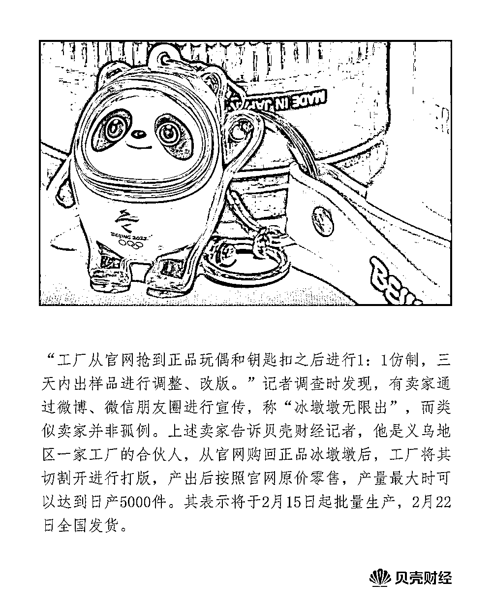
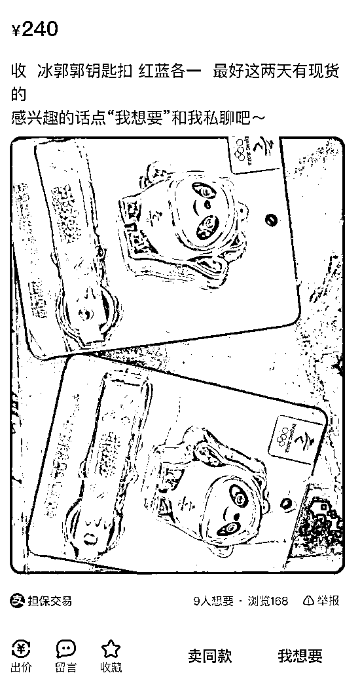
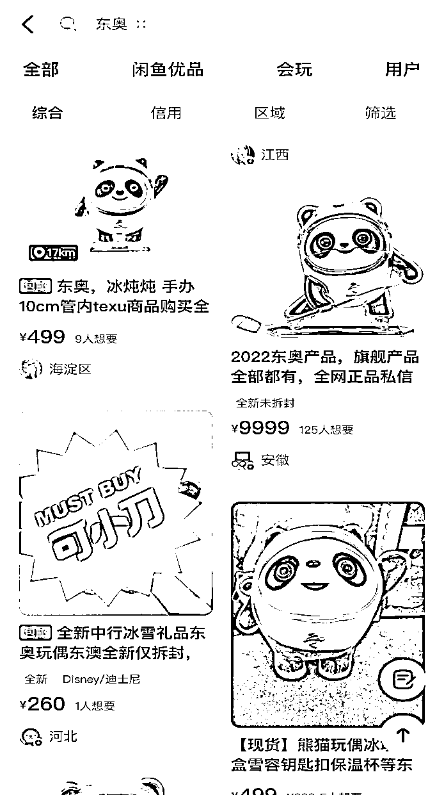
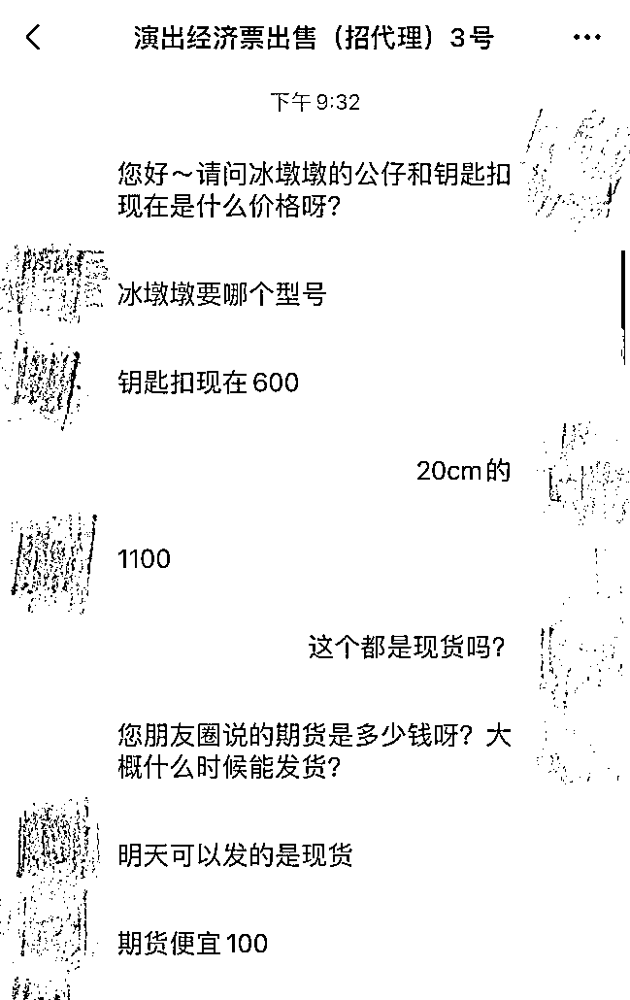
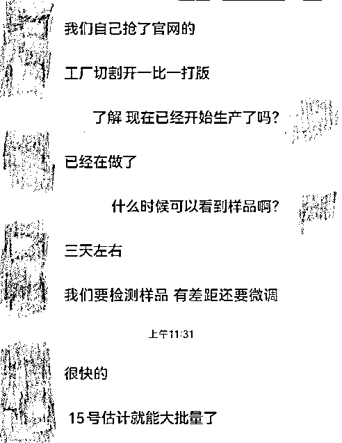
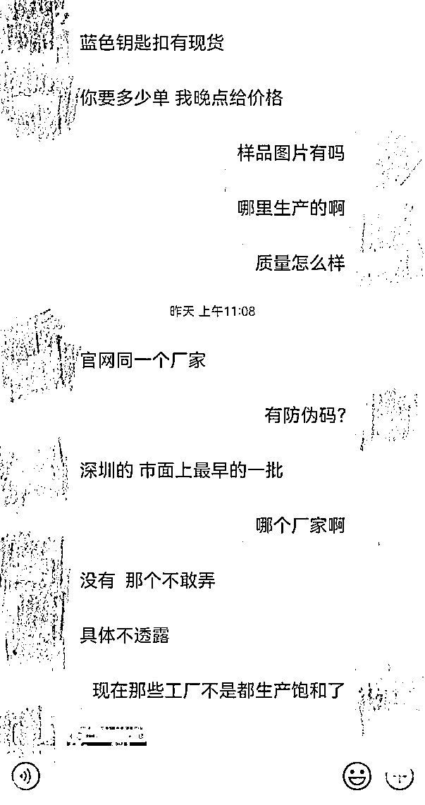
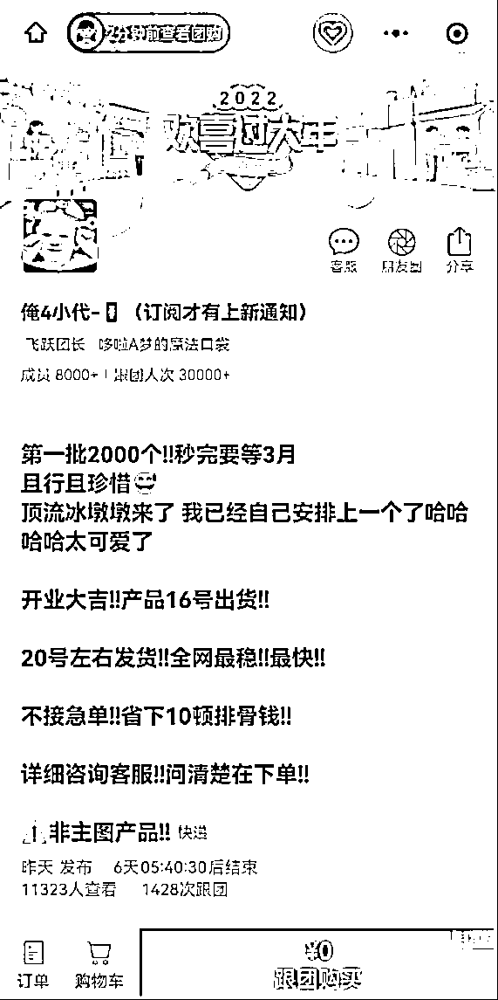
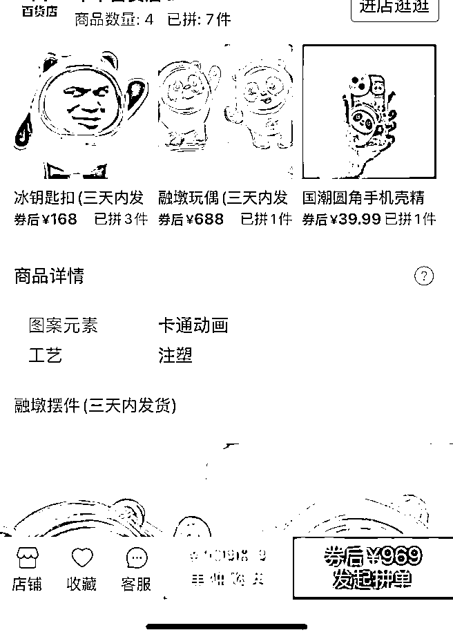
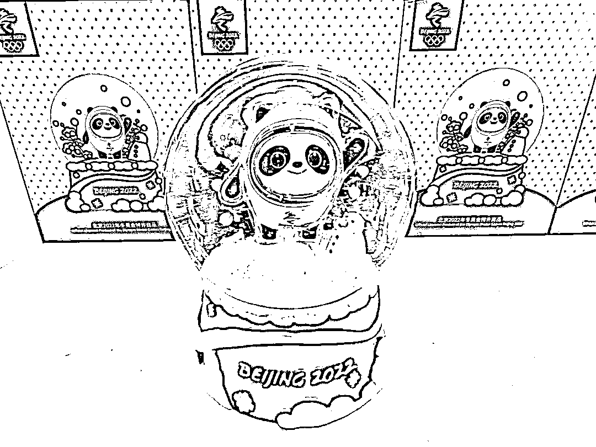

# 日产 5000 件！冰墩墩现制假产业链，官方特许店：正规渠道管够

> 原文：[`mp.weixin.qq.com/s?__biz=MzIyMDYwMTk0Mw==&mid=2247529501&idx=1&sn=9574e40eaa94c8856e549b52b4ec965f&chksm=97cbbf25a0bc36332b1cbf8df06c326be52dfdf7e50c1db53102822bae179aced8de8f097837&scene=27#wechat_redirect`](http://mp.weixin.qq.com/s?__biz=MzIyMDYwMTk0Mw==&mid=2247529501&idx=1&sn=9574e40eaa94c8856e549b52b4ec965f&chksm=97cbbf25a0bc36332b1cbf8df06c326be52dfdf7e50c1db53102822bae179aced8de8f097837&scene=27#wechat_redirect)

“店内商品几乎被横扫一空，只剩几款纪念徽章有货，问及冰墩墩、雪容融何时到货，工作人员表示无法确定。”这是一名消费者在通州区一家冬奥官方特许零售商品店看到的情形，一“墩”难求现象在北京各大线下门店非常普遍。

与之相伴，冰墩墩二手市场黄牛涌现，价格也被“炒上天”，有冰墩墩被炒至原价十倍。新京报贝壳财经记者调查发现，泥沙俱下的二手市场不乏诈骗、批量制假等违法违规乱象。

切割正品冰墩墩后打版仿制，有商家称可以日产 5000 件仿品。亦有商家在网店售卖非正品的冰墩墩形象制作的手机壳、钥匙扣。与此同时，购物骗局频现，有求“墩”心切的消费者向对方银行卡转账后，却被对方拉黑。

“不建议从黄牛的渠道购买，会抬高价格，建议排队购买，有保障。”2 月 10 日，北京 2022 官方特许商品旗舰店工美店的工作人员对贝壳财经表示，冰墩墩并非限量出售，预计卖到六月份，现在工厂正在大批量生产，都可以买到，不用着急。

“近日浙江宁波、嘉兴、温州、绍兴警方相继发布当地接警的代购‘冰墩墩’骗局”，2 月 10 日，中国市场监管报报道称，其中包括转账之后就被对方拉黑，有的下单冰墩墩却收到了一块眼镜布；提醒市民不要相信价格炒作，理性消费。

**01**

**********二手市场火热 **********

************有冰墩墩被炒至原价十倍************

****在奥林匹克官方旗舰店，冰墩墩钥匙扣等产品也需预售抢购，付款后 30 天内发货，目前预售商品也已售空。**** 

****正规渠道冰墩墩售罄的同时，“一户一墩”的需求有增无减，还有消费者在闲鱼等二手平台发帖，愿以官方定价双倍的价格求购冰墩墩，不过，有消费者告诉贝壳财经记者并未求购成功。****

********

****网友求购冰墩墩。二手平台截图****

****求“墩”心切之下，黄牛涌现。“黄牛代抢 180”。一名消费者告诉贝壳财经记者，为抢到冰墩墩，他特意联系了黄牛代抢，官方标价 88 元、加邮费总计 103 元的冰墩墩手办，他花费了 180 元。****

******有的商家也打起了擦边球。******

****官方渠道外，在微博、微信、抖音、闲鱼等社交媒体平台和二手平台，不少用户以个人的名义出售“冰墩墩”及周边产品。在闲鱼，记者检索“冰墩墩”显示无相关结果，但变更关键词为“冰锅锅”“冰郭郭”“东奥”“雪绒绒”等谐音字词，则会出现众多待售冰墩墩。发稿前，再次检索时，上述关键词已无法显示结果。****

********

****二手平台截图****

****贝壳财经记者采访中，二手市场的冰墩墩往往以翻倍或更高的价格出售。有代购将原价 58 元的钥匙扣喊价 600 元，价格涨 10 倍以上。而原价 92 元的冰墩墩毛绒玩具，更是被炒到价格突破 1000 元。当问及是否有防伪码时，有卖家表示“新品都没有”。****

********

****聊天记录截图****

****贝壳财经记者调查发现，当前，众多做票务代购的商家也转行代购冰墩墩。****

****目前，冰墩墩周边包括毛绒玩具、盲盒手办、玩具手办、钥匙扣、保温杯、玻璃杯、水晶球、小挎包、中性笔、徽章、印章等。根据款式、大小差异价格不同，但总体而言官方定价较为实惠。以 25cm 规格的毛绒玩具为例，一对冰墩墩和雪容融套装标价 328 元。****

****社交平台及二手平台上以个人名义出售的冰墩墩价格差异较大，根据发货时间，卖家将商品分为现货和期货两种，现货即当天或次日发货的，通常价格较高。期货则是指需要等待官网再次补货后才能发货，价格较现货略低。****

****江苏法德东恒律师事务所合伙人、律师蓝天彬表示，在法律上，实际购买人和代购人之间存在委托合同关系。如果卖的是假货，消费者可以起诉要求退货并赔偿损失，也可以向工商管理部门反映，或者报警。如果涉案金额较大，卖假货者涉嫌假冒注册商标罪或者销售假冒注册商标的商品罪，可能被追究刑事责任。****

******02******

**************“义乌出品”日产 5000 件？**************

****************卖家称切割正品冰墩墩后打版仿制****************

******“工厂从官网抢到正品玩偶和钥匙扣之后进行 1：1 仿制，三天内出样品进行调整、改版。”记者调查时发现，有卖家通过微博、微信朋友圈进行宣传，称“冰墩墩无限出”，而类似卖家并非孤例。******

******上述卖家告诉贝壳财经记者，他是义乌地区一家工厂的合伙人，从官网购回正品冰墩墩后，工厂将其切割开进行打版，产出后按照官网原价零售，产量最大时可以达到日产 5000 件。其表示将于 2 月 15 日起批量生产，2 月 22 日全国发货。******

************

******聊天记录截图******

******该卖家也表示，在淘宝平台开店难度较大，“版权的东西，上去直接下架”。不过除了在微博、微信宣传引流，其成功在淘宝搭建了一家店铺。贝壳财经记者浏览该店铺看到，共有三款链接售卖“冰 dd 玩偶及钥匙扣”。******

******“一天可走 3000 件”。2 月 9 日，该卖家再次联系记者，表示蓝色钥匙扣款式的冰墩墩有现货，由深圳地区厂家生产，和预售产品一样不能提供防伪码。为打消记者疑虑，其表示，可以“先拍一件入手”，为避免被“撬单”，深圳发来的冰墩墩不能直接邮到记者手上，而是经由卖家中转发货。******

************

******聊天记录截图******

******此外，一些微商也在利用微信小程序兜售仿版冰墩墩。2 月 9 日，有网友称“好特卖商城临期食品”小程序违法售卖冰墩墩挂件，据不完全统计已有一万多件销量，发现存在售假行为后申请退款无人受理。2 月 9 日下午，好特卖 HotMaxx 官方微博发布回应声明，称与该小程序不存任何法律关系，也并非子公司、分级机构或关联公司。******

******2 月 8 日，在小程序“快团团”，贝壳财经记者看到“冰墩墩钥匙扣”团购链接，其中称 20 号左右发货，详情咨询客服，截至 8 日已有万余人查看，1428 次跟团。在发布该链接的微商朋友圈，其表示冰墩墩钥匙扣 39 包邮，“非正，义乌出品，小钥匙扣难不倒义乌”。******

************

******微信小程序截图******

******除了仿制冰墩墩，在淘宝、拼多多等平台，还有商家仿照冰墩墩形象制售手机壳、钥匙扣等物品售卖。贝壳财经记者询问是否是正品时，客服表示商品链接只是普通钥匙扣。这些钥匙扣外观与官方冰墩墩钥匙扣十分接近，但却并非为立体形态，而只是冰墩墩的平面形象。******

******在拼多多，为规避监管，一些商品图片甚至打上马赛克，但外观依然可辨别是冰墩墩。咨询后，客服发来的商品图片正是冰墩墩钥匙扣。******

************

******电商平台截图******

******还有名为“融墩摆件”（三天内发货）的商品，图片以素描版冰墩墩进行暗示，贝壳财经记者私信询问，商品是否为冰墩墩和雪容融套装，客服给予肯定答复后要求添加微信。此后，卖家表示还有多款冰墩墩可以售卖，问及是否为正品时，其称“正的贵”，价格上千。******

******蓝天彬表示，冰墩墩的生产和销售需要经过北京冬奥组委特许，要经过官方授权，否则涉嫌侵犯知识产权。此外，若大规模假冒销售生产冰墩墩、涉案金额较大，卖假货者涉嫌假冒注册商标罪或者销售假冒注册商标的商品罪，可能被追究刑事责任。******

******2019 年，北京冬奥组委《关于北京 2022 年冬奥会吉祥物和冬残奥会吉祥物的公告》明确，北京冬奥组委为吉祥物形象的著作权人，吉祥物形象已在中国版权保护中心进行著作权登记。******

******公告明确，除法律、法规另有规定外，未经北京冬奥组委许可，任何单位或者个人不得擅自使用吉祥物形象和名称。任何单位或者个人不得将吉祥物形象和名称进行歪曲、篡改等使用，也不得将吉祥物形象和名称作为其他图案的组成部分使用。******

********03********

********交易缺第三方监管********

********社交媒体频现购物骗局******** 

******对于急于购得冬奥吉祥物的消费者而言，价格虚高还不是最大的问题。贝壳财经记者调查发现，付款后收不到冰墩墩的案例已发生多起。******

******“他一直在改名字，现在叫什么我也不知道了。”有消费者告诉贝壳财经记者，近日，她在微博向一名冰墩墩卖家转账 1100 元，有意购买冰墩墩盲盒款，这名卖家自称是代理商，从北京发货。不料，向对方银行卡转账后，她却被对方拉黑。还有消费者称，在抖音看到有用户称可以买到冰墩墩，付完钱后被对方删除好友。******

******通过非冬奥官方指定的渠道购买“冰墩墩”，交易情况缺乏监管。在微信、微博、抖音等平台，非官方授权的机构或个人兜售冰墩墩时，买卖双方间不使用平台搭建的正规交易系统，而是直接一对一转账支付，如果卖家收款后拒不发货或者将买家拉黑，买家将难以追讨。******

******贝壳财经记者在热门社交平台浏览发现，可以轻松检索到声称可购买冰墩墩的账号，也有不少账号选择在相关动态评论区留言兜售“冰墩墩”。甚至在奥林匹克官方旗舰店冰墩墩商品链接的评论区，也到处是兜售冰墩墩的留言和联系方式。******

******“建议不要买了，等过段时间，官网买。”上述被骗消费者向贝壳财经记者表示。******

********04********

************工美店员工：工厂正大批量生产，************

**************都可以买到，不用着急**************

********************

**********冰墩墩水晶球 图/IC photo********** 

**********2 月 10 日下午，贝壳财经记者来到北京 2022 官方特许商品旗舰店工美店，得知店内预售冰墩墩的毛绒玩具、钥匙扣、水晶球、手办和盲盒。工作人员称，工美店每天早上 9:30 开始发号，需要拿身份证预约，一人限购一个，到货后通知取货。**********

**********在北京 2022 官方特许商品旗舰店体育馆路店门外，张贴着一张通知，称冬奥吉祥物周边 3 月 10 日以后会补货，不用排队。**********

**********提及黄牛卖货现象，体育馆路店的工作人员告诉记者，目前还没见过黄牛在店外排队，“曾有警方来店内调查过，是否有黄牛来购买吉祥物的情况。”**********

**********“不建议从黄牛的渠道购买，会抬高价格，建议排队购买，有保障。”工美店的工作人员表示，冰墩墩并非限量出售，预计卖到六月份，现在工厂正在大批量生产，都可以买到，不用着急。**********

****************************************

**********← 向右滑动与灰产圈互动交流 →**********

********************